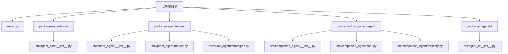
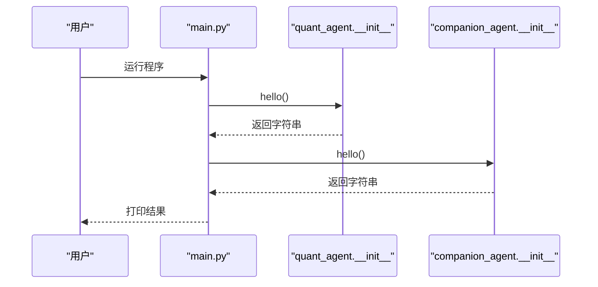
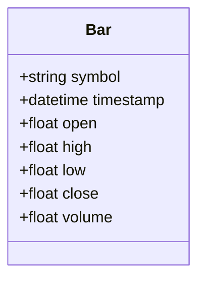
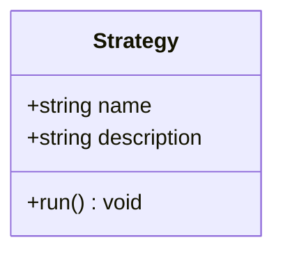
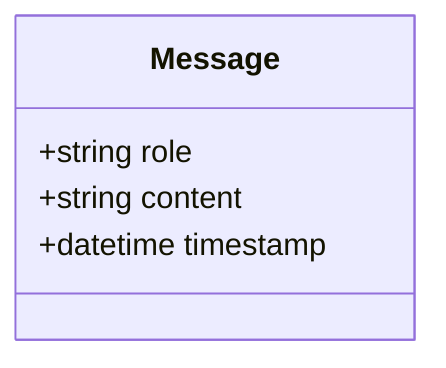
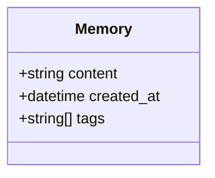
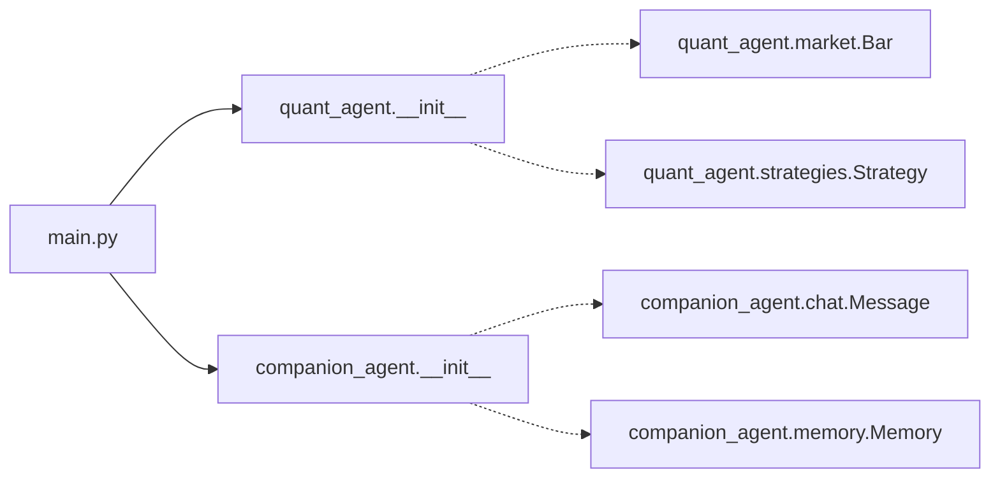

# API 参考文档

<cite>
**本文引用的文件**   
- [main.py](file://main.py)
- [agent-core/__init__.py](file://packages/agent-core/src/agent_core/__init__.py)
- [quant-agent/__init__.py](file://packages/quant-agent/src/quant_agent/__init__.py)
- [quant-agent/market.py](file://packages/quant-agent/src/quant_agent/market.py)
- [quant-agent/strategies.py](file://packages/quant-agent/src/quant_agent/strategies.py)
- [companion-agent/__init__.py](file://packages/companion-agent/src/companion_agent/__init__.py)
- [companion-agent/chat.py](file://packages/companion-agent/src/companion_agent/chat.py)
- [companion-agent/memory.py](file://packages/companion-agent/src/companion_agent/memory.py)
- [agent-rl/__init__.py](file://packages/agent-rl/src/agent_rl/__init__.py)
</cite>

## 目录
1. [简介](#简介)
2. [项目结构](#项目结构)
3. [核心组件](#核心组件)
4. [架构总览](#架构总览)
5. [详细组件分析](#详细组件分析)
6. [依赖关系分析](#依赖关系分析)
7. [性能考虑](#性能考虑)
8. [故障排查指南](#故障排查指南)
9. [结论](#结论)
10. [附录](#附录)

## 简介
本文件为 JanusAgent 框架的完整 API 参考，覆盖以下子包与接口：
- agent-core：核心抽象层（当前提供入口脚本）
- quant-agent：量化交易智能体（市场数据、策略定义等）
- companion-agent：情感陪伴智能体（对话消息、记忆等）
- agent-rl：强化学习智能体（当前提供入口脚本）

目标读者包括初次接触该框架的用户与需要快速查阅接口的开发者。文档以“渐进式复杂度”组织内容，并提供可视化图示帮助理解。

## 项目结构
仓库采用多包（monorepo）组织方式，每个子包独立维护版本与入口脚本。顶层 main.py 聚合了 quant-agent 与 companion-agent 的能力演示。

图表来源
- [main.py:1-13](file://main.py#L1-L13)
- [agent-core/__init__.py:1-3](file://packages/agent-core/src/agent_core/__init__.py#L1-L3)
- [quant-agent/__init__.py:1-15](file://packages/quant-agent/src/quant_agent/__init__.py#L1-L15)
- [quant-agent/market.py:1-16](file://packages/quant-agent/src/quant_agent/market.py#L1-L16)
- [quant-agent/strategies.py:1-13](file://packages/quant-agent/src/quant_agent/strategies.py#L1-L13)
- [companion-agent/__init__.py:1-15](file://packages/companion-agent/src/companion_agent/__init__.py#L1-L15)
- [companion-agent/chat.py:1-12](file://packages/companion-agent/src/companion_agent/chat.py#L1-L12)
- [companion-agent/memory.py:1-12](file://packages/companion-agent/src/companion_agent/memory.py#L1-L12)
- [agent-rl/__init__.py:1-15](file://packages/agent-rl/src/agent_rl/__init__.py#L1-L15)

章节来源
- [main.py:1-13](file://main.py#L1-L13)

## 核心组件
本节概览各包的公共能力与入口点，便于快速定位后续详细 API。

- agent-core
  - 入口函数：main()
  - 用途：打印欢迎信息（占位实现）
  - 参考路径：[agent-core/__init__.py:1-3](file://packages/agent-core/src/agent_core/__init__.py#L1-L3)

- quant-agent
  - 模块级常量：__version__
  - 入口函数：hello() -> str；main() -> None
  - 数据结构：Bar（K线/Bar 数据单元）
  - 策略基类：Strategy（含 run() 抽象方法）
  - 参考路径：
    - [quant-agent/__init__.py:1-15](file://packages/quant-agent/src/quant_agent/__init__.py#L1-L15)
    - [quant-agent/market.py:1-16](file://packages/quant-agent/src/quant_agent/market.py#L1-L16)
    - [quant-agent/strategies.py:1-13](file://packages/quant-agent/src/quant_agent/strategies.py#L1-L13)

- companion-agent
  - 模块级常量：__version__
  - 入口函数：hello() -> str；main() -> None
  - 数据结构：Message（对话消息）、Memory（记忆条目）
  - 参考路径：
    - [companion-agent/__init__.py:1-15](file://packages/companion-agent/src/companion_agent/__init__.py#L1-L15)
    - [companion-agent/chat.py:1-12](file://packages/companion-agent/src/companion_agent/chat.py#L1-L12)
    - [companion-agent/memory.py:1-12](file://packages/companion-agent/src/companion_agent/memory.py#L1-L12)

- agent-rl
  - 模块级常量：__version__
  - 入口函数：hello() -> str；main() -> None
  - 参考路径：[agent-rl/__init__.py:1-15](file://packages/agent-rl/src/agent_rl/__init__.py#L1-L15)

章节来源
- [agent-core/__init__.py:1-3](file://packages/agent-core/src/agent_core/__init__.py#L1-L3)
- [quant-agent/__init__.py:1-15](file://packages/quant-agent/src/quant_agent/__init__.py#L1-L15)
- [quant-agent/market.py:1-16](file://packages/quant-agent/src/quant_agent/market.py#L1-L16)
- [quant-agent/strategies.py:1-13](file://packages/quant-agent/src/quant_agent/strategies.py#L1-L13)
- [companion-agent/__init__.py:1-15](file://packages/companion-agent/src/companion_agent/__init__.py#L1-L15)
- [companion-agent/chat.py:1-12](file://packages/companion-agent/src/companion_agent/chat.py#L1-L12)
- [companion-agent/memory.py:1-12](file://packages/companion-agent/src/companion_agent/memory.py#L1-L12)
- [agent-rl/__init__.py:1-15](file://packages/agent-rl/src/agent_rl/__init__.py#L1-L15)

## 架构总览
顶层 main.py 作为统一入口，调用 quant-agent 与 companion-agent 的 hello() 进行能力展示。

图表来源
- [main.py:1-13](file://main.py#L1-L13)
- [quant-agent/__init__.py:1-15](file://packages/quant-agent/src/quant_agent/__init__.py#L1-L15)
- [companion-agent/__init__.py:1-15](file://packages/companion-agent/src/companion_agent/__init__.py#L1-L15)

## 详细组件分析

### Agent Core（agent-core）
- 主要职责
  - 提供核心抽象层的入口脚本（当前为占位实现）
- 公共接口
  - 函数：main() -> None
    - 参数：无
    - 返回值：无
    - 行为：打印欢迎信息
    - 示例路径：[agent-core/__init__.py:1-3](file://packages/agent-core/src/agent_core/__init__.py#L1-L3)
- 使用建议
  - 通过命令行脚本或 Python 直接导入后调用 main()

章节来源
- [agent-core/__init__.py:1-3](file://packages/agent-core/src/agent_core/__init__.py#L1-L3)

### Quant Agent（quant-agent）

#### 模块入口
- 常量
  - __version__: 字符串版本号
- 函数
  - hello() -> str
    - 参数：无
    - 返回值：欢迎语字符串
    - 示例路径：[quant-agent/__init__.py:1-15](file://packages/quant-agent/src/quant_agent/__init__.py#L1-L15)
  - main() -> None
    - 参数：无
    - 返回值：无
    - 行为：打印 hello() 的结果
    - 示例路径：[quant-agent/__init__.py:1-15](file://packages/quant-agent/src/quant_agent/__init__.py#L1-L15)

#### 市场数据模型 Bar
- 类型：dataclass
- 字段
  - symbol: str — 标的代码
  - timestamp: datetime — 时间戳
  - open: float — 开盘价
  - high: float — 最高价
  - low: float — 最低价
  - close: float — 收盘价
  - volume: float — 成交量
- 示例路径：[quant-agent/market.py:1-16](file://packages/quant-agent/src/quant_agent/market.py#L1-L16)

图表来源
- [quant-agent/market.py:1-16](file://packages/quant-agent/src/quant_agent/market.py#L1-L16)

#### 策略基类 Strategy
- 类型：dataclass
- 字段
  - name: str — 策略名称
  - description: str — 策略描述
- 方法
  - run() -> None
    - 参数：无
    - 返回值：无
    - 行为：抛出未实现异常（子类需重写）
- 示例路径：[quant-agent/strategies.py:1-13](file://packages/quant-agent/src/quant_agent/strategies.py#L1-L13)

图表来源
- [quant-agent/strategies.py:1-13](file://packages/quant-agent/src/quant_agent/strategies.py#L1-L13)

章节来源
- [quant-agent/__init__.py:1-15](file://packages/quant-agent/src/quant_agent/__init__.py#L1-L15)
- [quant-agent/market.py:1-16](file://packages/quant-agent/src/quant_agent/market.py#L1-L16)
- [quant-agent/strategies.py:1-13](file://packages/quant-agent/src/quant_agent/strategies.py#L1-L13)

### Companion Agent（companion-agent）

#### 模块入口
- 常量
  - __version__: 字符串版本号
- 函数
  - hello() -> str
    - 参数：无
    - 返回值：欢迎语字符串
    - 示例路径：[companion-agent/__init__.py:1-15](file://packages/companion-agent/src/companion_agent/__init__.py#L1-L15)
  - main() -> None
    - 参数：无
    - 返回值：无
    - 行为：打印 hello() 的结果
    - 示例路径：[companion-agent/__init__.py:1-15](file://packages/companion-agent/src/companion_agent/__init__.py#L1-L15)

#### 对话消息 Message
- 类型：dataclass
- 字段
  - role: str — 角色（如 "user" | "assistant"）
  - content: str — 消息内容
  - timestamp: datetime — 时间戳
- 示例路径：[companion-agent/chat.py:1-12](file://packages/companion-agent/src/companion_agent/chat.py#L1-L12)

图表来源
- [companion-agent/chat.py:1-12](file://packages/companion-agent/src/companion_agent/chat.py#L1-L12)

#### 记忆条目 Memory
- 类型：dataclass
- 字段
  - content: str — 记忆内容
  - created_at: datetime — 创建时间
  - tags: list[str] — 标签列表
- 示例路径：[companion-agent/memory.py:1-12](file://packages/companion-agent/src/companion_agent/memory.py#L1-L12)

图表来源
- [companion-agent/memory.py:1-12](file://packages/companion-agent/src/companion_agent/memory.py#L1-L12)

章节来源
- [companion-agent/__init__.py:1-15](file://packages/companion-agent/src/companion_agent/__init__.py#L1-L15)
- [companion-agent/chat.py:1-12](file://packages/companion-agent/src/companion_agent/chat.py#L1-L12)
- [companion-agent/memory.py:1-12](file://packages/companion-agent/src/companion_agent/memory.py#L1-L12)

### Agent RL（agent-rl）
- 模块入口
  - 常量：__version__
  - 函数：hello() -> str；main() -> None
  - 示例路径：[agent-rl/__init__.py:1-15](file://packages/agent-rl/src/agent_rl/__init__.py#L1-L15)

章节来源
- [agent-rl/__init__.py:1-15](file://packages/agent-rl/src/agent_rl/__init__.py#L1-L15)

## 依赖关系分析
当前阶段各包均为轻量实现，彼此之间无运行时依赖。顶层 main.py 仅导入并调用子包的 hello()。

图表来源
- [main.py:1-13](file://main.py#L1-L13)
- [quant-agent/__init__.py:1-15](file://packages/quant-agent/src/quant_agent/__init__.py#L1-L15)
- [quant-agent/market.py:1-16](file://packages/quant-agent/src/quant_agent/market.py#L1-L16)
- [quant-agent/strategies.py:1-13](file://packages/quant-agent/src/quant_agent/strategies.py#L1-L13)
- [companion-agent/__init__.py:1-15](file://packages/companion-agent/src/companion_agent/__init__.py#L1-L15)
- [companion-agent/chat.py:1-12](file://packages/companion-agent/src/companion_agent/chat.py#L1-L12)
- [companion-agent/memory.py:1-12](file://packages/companion-agent/src/companion_agent/memory.py#L1-L12)

章节来源
- [main.py:1-13](file://main.py#L1-L13)

## 性能考虑
- 当前实现以数据类与简单函数为主，计算开销极低，适合扩展为更复杂的业务逻辑。
- 建议在后续引入外部数据源或模型推理时，关注 I/O 与序列化成本，必要时增加缓存与批处理机制。

## 故障排查指南
- 常见问题
  - 未实现错误：继承 Strategy 但未重写 run() 将触发未实现异常。请确保在子类中实现具体逻辑。
    - 参考路径：[quant-agent/strategies.py:1-13](file://packages/quant-agent/src/quant_agent/strategies.py#L1-L13)
- 定位建议
  - 检查导入路径是否正确，确认已安装对应包且可被 Python 解释器发现。
  - 若运行 main.py 出现导入失败，优先验证 packages 下各子包是否处于正确的 Python 环境路径中。

章节来源
- [quant-agent/strategies.py:1-13](file://packages/quant-agent/src/quant_agent/strategies.py#L1-L13)

## 结论
JanusAgent 当前提供了清晰的模块化骨架与基础数据模型，涵盖量化交易与情感陪伴两个方向的最小可用能力。随着后续迭代，可在现有 dataclass 与入口函数的基础上逐步扩展更多业务接口与服务编排能力。

## 附录

### 常用 API 速查表
- agent-core
  - main() -> None
    - 参考路径：[agent-core/__init__.py:1-3](file://packages/agent-core/src/agent_core/__init__.py#L1-L3)

- quant-agent
  - __version__: str
  - hello() -> str
  - main() -> None
  - Bar(dataclass): symbol, timestamp, open, high, low, close, volume
  - Strategy(dataclass): name, description; run() -> None（需子类实现）
  - 参考路径：
    - [quant-agent/__init__.py:1-15](file://packages/quant-agent/src/quant_agent/__init__.py#L1-L15)
    - [quant-agent/market.py:1-16](file://packages/quant-agent/src/quant_agent/market.py#L1-L16)
    - [quant-agent/strategies.py:1-13](file://packages/quant-agent/src/quant_agent/strategies.py#L1-L13)

- companion-agent
  - __version__: str
  - hello() -> str
  - main() -> None
  - Message(dataclass): role, content, timestamp
  - Memory(dataclass): content, created_at, tags
  - 参考路径：
    - [companion-agent/__init__.py:1-15](file://packages/companion-agent/src/companion_agent/__init__.py#L1-L15)
    - [companion-agent/chat.py:1-12](file://packages/companion-agent/src/companion_agent/chat.py#L1-L12)
    - [companion-agent/memory.py:1-12](file://packages/companion-agent/src/companion_agent/memory.py#L1-L12)

- agent-rl
  - __version__: str
  - hello() -> str
  - main() -> None
  - 参考路径：[agent-rl/__init__.py:1-15](file://packages/agent-rl/src/agent_rl/__init__.py#L1-L15)

### 典型用法示例（路径引用）
- 运行主程序并输出两个子包的问候语
  - 参考路径：[main.py:1-13](file://main.py#L1-L13)
- 构造一个 Bar 对象（用于表示 K 线/Bar）
  - 参考路径：[quant-agent/market.py:1-16](file://packages/quant-agent/src/quant_agent/market.py#L1-L16)
- 定义一个自定义策略（继承 Strategy 并实现 run）
  - 参考路径：[quant-agent/strategies.py:1-13](file://packages/quant-agent/src/quant_agent/strategies.py#L1-L13)
- 构建一条对话消息
  - 参考路径：[companion-agent/chat.py:1-12](file://packages/companion-agent/src/companion_agent/chat.py#L1-L12)
- 记录一条带标签的记忆
  - 参考路径：[companion-agent/memory.py:1-12](file://packages/companion-agent/src/companion_agent/memory.py#L1-L12)