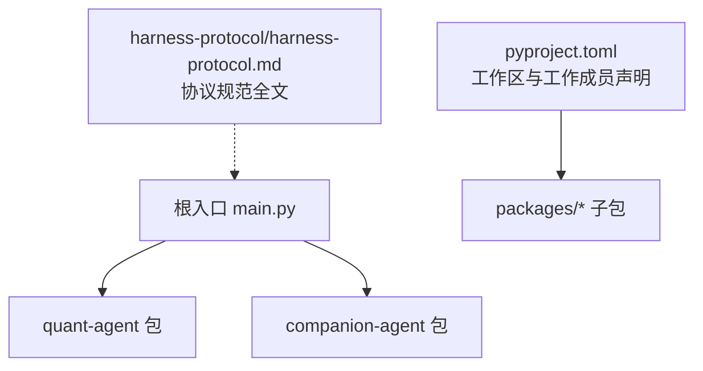
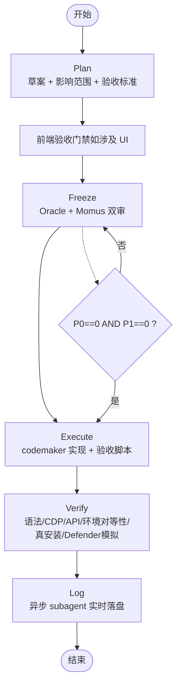
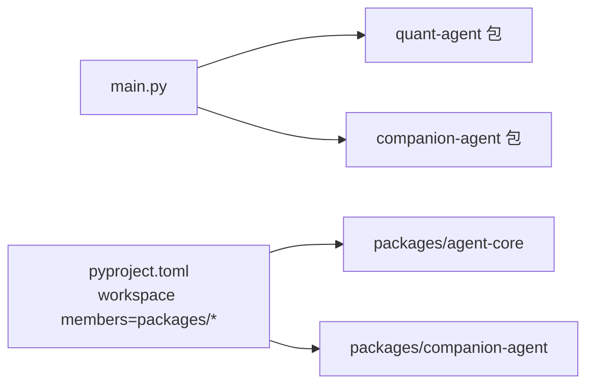

# Harnes协议规范

<cite>
**本文引用的文件**   
- [harness-protocol.md](file://harness-protocol/harness-protocol.md)
- [main.py](file://main.py)
- [pyproject.toml](file://pyproject.toml)
- [agent-core 包配置](file://packages/agent-core/pyproject.toml)
- [companion-agent 包配置](file://packages/companion-agent/pyproject.toml)
</cite>

## 目录
1. [引言](#引言)
2. [项目结构](#项目结构)
3. [核心组件](#核心组件)
4. [架构总览](#架构总览)
5. [详细组件分析](#详细组件分析)
6. [依赖关系分析](#依赖关系分析)
7. [性能与并行特性](#性能与并行特性)
8. [故障排查指南](#故障排查指南)
9. [结论](#结论)
10. [附录](#附录)

## 引言
本规范定义“决策者（晨珺）+ harness（OMO/Sisyphus）+ loop body（codemaker）”三方协作的执行纪律，围绕五阶段流程（Plan、Freeze、Execute、Verify、Log）形成闭环。其目标是将高价值判断集中在决策者，将信息收集与执行操作下沉至 harness 与 codemaker，从而提升质量与效率。

## 项目结构
仓库采用多包工作区组织，根入口仅做模块聚合打印；协议规范集中于独立文档，便于跨会话引用与演进。

图表来源
- [main.py:1-13](file://main.py#L1-L13)
- [pyproject.toml:1-30](file://pyproject.toml#L1-L30)

章节来源
- [main.py:1-13](file://main.py#L1-L13)
- [pyproject.toml:1-30](file://pyproject.toml#L1-L30)

## 核心组件
- 决策者（晨珺）：负责目标定义、优先级裁决、P0 修还是接受、验收拍板与 diff review。
- Harness（OMO/Sisyphus）：提供 Plan 草案、冻结双审（Oracle + Momus）、全量 Verify、自动化 Log。
- Loop Body（codemaker）：在 Execute 阶段实现代码与验收脚本。

关键原则
- 决策带宽只用于“做判断”，不用于“收集信息”和“执行操作”。
- 五阶段不可裁剪，任何跳过均视为违规。

章节来源
- [harness-protocol.md:11-21](file://harness-protocol/harness-protocol.md#L11-L21)

## 架构总览
下图展示五阶段主流程与角色分工，以及关键门禁与审计点。

图表来源
- [harness-protocol.md:23-106](file://harness-protocol/harness-protocol.md#L23-L106)
- [harness-protocol.md:128-163](file://harness-protocol/harness-protocol.md#L128-L163)
- [harness-protocol.md:526-614](file://harness-protocol/harness-protocol.md#L526-L614)

## 详细组件分析

### 一、三方分工与职责边界
- 决策者：只做判断，不写代码、不跑验证。
- Harness：产出草案、组织双审、驱动验证、记录日志。
- Loop Body：按冻结结论落地实现与验收脚本。

章节来源
- [harness-protocol.md:11-21](file://harness-protocol/harness-protocol.md#L11-L21)

### 二、五阶段详解

#### 2.1 Plan（计划）
- 产出：方案、影响文件、验收标准。
- 强制项：若触发条件在开发环境无法复现，草案必须包含模拟方案。
- 并行优化：explore 搜索与读取 experiment-log 末尾可并行启动。
- 决策者动作：审阅草案并裁决方向。

章节来源
- [harness-protocol.md:25-31](file://harness-protocol/harness-protocol.md#L25-L31)

#### 2.1.5 前端验收门禁（涉及前端时触发）
- 触发：新增/修改 UI 组件、交互逻辑或视觉布局。
- 产出：单文件 HTML 验收稿，需具备场景切换器、预览控制条、V7 Token 合规自证、固定视口布局、可交互、生产级 CSS 保真。
- 决策者动作：浏览器打开逐场景验证，通过后方可进入 Freeze/Execute。

章节来源
- [harness-protocol.md:33-50](file://harness-protocol/harness-protocol.md#L33-L50)

#### 2.1.5.1 V7 Design Token 自动化合规门禁（Stylelint）
- 工具：Stylelint，禁止硬编码颜色，强制使用 `--v7-*` Token。
- CI 集成：npx stylelint 阻断合并。
- 新增维度：Momus 第 8 维度“设计系统合规性”。

章节来源
- [harness-protocol.md:52-62](file://harness-protocol/harness-protocol.md#L52-L62)

#### 2.2 Freeze（冻结门）
- 双审轴：决策审计（Oracle）、完整性审计（Momus）、架构审计（Oracle）。
- Momus 完整性 7 维度：覆盖受影响项、可观测验收、环境对等性、回归风险、跨模块影响、文档同步、运行时环境交互。
- 冻结标准：P0==0 AND P1==0 方可冻结；否则继续下一轮。
- 修正者自审：每轮修正前对新引入代码做边界 case 自查清单。
- 审计模型轮换：R2 换 agent 类型以正交视角避免盲区。

章节来源
- [harness-protocol.md:63-106](file://harness-protocol/harness-protocol.md#L63-L106)

#### 2.2.1 问题解决前的行业对标强制（BADR 四步法）
- 步骤：Benchmark → Adapt → Decide → Record。
- 纪律：发现新类型 P0/P1 时，Plan 修订草案必须附 BADR 分析；冻结后的修正方案必须包含行业对标依据。

章节来源
- [harness-protocol.md:108-127](file://harness-protocol/harness-protocol.md#L108-L127)

#### 2.3 Execute（执行）
- 分工规则：小修复/脚本/文档由 codemaker；多文件联动/部署链路文件由决策者。
- 并行约束：同文件编辑串行；无依赖跨文件可并行；不确定则串行。
- 纪律：偏离冻结结论须回 Freeze。

章节来源
- [harness-protocol.md:128-144](file://harness-protocol/harness-protocol.md#L128-L144)

#### 2.4 Verify（全量验证）
- 必做项：语法检查、CDP Playwright（前端/Electron）、API curl（后端）、环境对等性验证。
- 并行约束：前 3 项并行，环境对等性验证最后跑（可能破坏运行环境）。
- 分层验收：单元层/组件层/集成层/端到端层，隔离下游问题。
- 打包验收路径矩阵：根据改动类型选择 deploy_local / 打包.bat / asar 验证 / CDP 验证。
- 多路径验收标准化：normal + 恢复路径（如 restart_failed/cleanup_failed/首次安装/降级路径）。
- 客户端验收超时：禁止无限等待，统一 PassThru + 超时轮询 + 进程树终止。
- 验证环境隔离：端口隔离、冻结窗口、独立 user-data-dir。
- 真安装验证：禁止 win-unpacked 作为唯一验收环境。
- 发布门禁：发布前检查 verification_results.json，不通过即拒绝。
- Defender 模拟验收：优先 Sandbox/VM，其次开发机限制性验收；exit code=-1 不接受模糊结论。
- 待批量验收清单：集中索引延后端到端验收的 GP，避免遗漏。

章节来源
- [harness-protocol.md:145-163](file://harness-protocol/harness-protocol.md#L145-L163)
- [harness-protocol.md:164-182](file://harness-protocol/harness-protocol.md#L164-L182)
- [harness-protocol.md:183-196](file://harness-protocol/harness-protocol.md#L183-L196)
- [harness-protocol.md:197-222](file://harness-protocol/harness-protocol.md#L197-L222)
- [harness-protocol.md:223-238](file://harness-protocol/harness-protocol.md#L223-L238)
- [harness-protocol.md:239-259](file://harness-protocol/harness-protocol.md#L239-L259)
- [harness-protocol.md:260-298](file://harness-protocol/harness-protocol.md#L260-L298)
- [harness-protocol.md:299-310](file://harness-protocol/harness-protocol.md#L299-L310)
- [harness-protocol.md:311-322](file://harness-protocol/harness-protocol.md#L311-L322)
- [harness-protocol.md:323-345](file://harness-protocol/harness-protocol.md#L323-L345)
- [harness-protocol.md:346-480](file://harness-protocol/harness-protocol.md#L346-L480)
- [harness-protocol.md:481-525](file://harness-protocol/harness-protocol.md#L481-L525)

#### 2.5 Log（记录）
- 异步 subagent + 单写者：主 loop 投递事件到内存队列，记录 subagent 异步消费写入。
- 记录时机：Turn 骨架、每个 action 完成后、Phase 切换、P0 上报、Log 阶段汇总。
- 格式：对齐既有结构，含维度表、逐 Action 成本追踪、累计成本汇总、方法论观察。
- 编码注意事项：experiment-log.md 为 GBK，追加用 GBK；其他文档保持 UTF-8。

章节来源
- [harness-protocol.md:526-614](file://harness-protocol/harness-protocol.md#L526-L614)

### 三、纪律条款（不可违反）
- 冻结/验证不可跳过；每个 Turn 记录执行模型与耗时；P0 立即上报并落盘。
- 单轮冻结门不轻信；环境对等性审计不通过 = 不冻结。
- 部署链路文件必走冻结门；验收标准必须可观测。
- 前端验收门禁不可跳过；代码遵守部署手册规则；验收不得绕过用户障碍。
- Regression Test Card 强制；打包验收路径矩阵强制；分层验收强制。
- 网络重试标准 mitigation；文档编码规范；客户端验收超时强制。
- 用户作为纪律守门人；跨模块路径契约必须读代码验证；GP 修复计划归档位置明确。
- 真安装验证强制；发布门禁不可绕过；Defender 模拟验收强制。

章节来源
- [harness-protocol.md:617-657](file://harness-protocol/harness-protocol.md#L617-L657)

### 四、并行策略
- 阶段内并行：Freeze Oracle + Momus 同时发射；Plan explore 多路扇出。
- 任务级并行：Execute 按 DAG 批次 fan-out。
- 跨阶段流水线：Batch N Verify 与 Batch N+1 Execute 重叠。

章节来源
- [harness-protocol.md:661-666](file://harness-protocol/harness-protocol.md#L661-L666)

### 五、模型配置
- 主 Agent（GLM 5.2）：编排 + 决策 + 写作。
- explore/librarian：低成本广度搜索。
- oracle/momus/metis：高质量推理与评审。
- task category：quick/deep/visual-engineering 对应不同复杂度与成本等级。

章节来源
- [harness-protocol.md:669-684](file://harness-protocol/harness-protocol.md#L669-L684)

### 六、实证依据
- 冻结门双审、双层纠正、环境对等性、纪律不可跳过、成本分层、CDP 验收、审计模型轮换、任务时长监控等均有实验日志支撑。

章节来源
- [harness-protocol.md:687-699](file://harness-protocol/harness-protocol.md#L687-L699)

### 七、新会话激活
- 并行读取：协议全文 + experiment-log 末尾 + pending-batch-verification.md。
- 确认五阶段纪律、冻结标准、当前 Turn 编号、最近执行模式与方法论演进、是否有待批量验收的 GP。
- 按本协议五阶段执行，不可裁剪。

章节来源
- [harness-protocol.md:702-718](file://harness-protocol/harness-protocol.md#L702-L718)

## 依赖关系分析
- 根入口 main.py 聚合 quant-agent 与 companion-agent 两个子包，仅做 hello 输出。
- pyproject.toml 声明工作区成员 packages/*，并通过 uv workspace 管理依赖。
- 各子包通过各自 pyproject.toml 暴露命令行入口（如 agent-core、companion-agent）。

图表来源
- [main.py:1-13](file://main.py#L1-L13)
- [pyproject.toml:1-30](file://pyproject.toml#L1-L30)
- [agent-core 包配置:1-18](file://packages/agent-core/pyproject.toml#L1-L18)
- [companion-agent 包配置:1-18](file://packages/companion-agent/pyproject.toml#L1-L18)

章节来源
- [main.py:1-13](file://main.py#L1-L13)
- [pyproject.toml:1-30](file://pyproject.toml#L1-L30)
- [agent-core 包配置:1-18](file://packages/agent-core/pyproject.toml#L1-L18)
- [companion-agent 包配置:1-18](file://packages/companion-agent/pyproject.toml#L1-L18)

## 性能与并行特性
- 阶段内并行：Freeze 双审、Plan explore 扇出。
- 任务级并行：Execute 按 DAG 分批 fan-out。
- 跨阶段流水线：Verify 与后续 Execute 重叠。
- 约束：同文件编辑串行；环境破坏型验证最后跑；不确定依赖则串行。

章节来源
- [harness-protocol.md:661-666](file://harness-protocol/harness-protocol.md#L661-L666)
- [harness-protocol.md:141-144](file://harness-protocol/harness-protocol.md#L141-L144)
- [harness-protocol.md:153-154](file://harness-protocol/harness-protocol.md#L153-L154)

## 故障排查指南
- 客户端启动卡死：遵循 §2.4.6 超时标准，禁止 -Wait，改用 PassThru + 超时轮询 + taskkill /T /F。
- 真安装未生效：遵循 §2.4.8 真安装验证，禁止仅用 win-unpacked。
- 发布逃逸：遵循 §2.4.9 发布门禁，检查 verification_results.json。
- Defender 误报/退出码 -1：遵循 §2.4.10 执行路径与结论标准，优先 Sandbox/VM，不接受“环境不稳定”结论。
- 编码乱码：遵循 §2.5 编码注意事项，experiment-log.md 使用 GBK 追加。

章节来源
- [harness-protocol.md:260-298](file://harness-protocol/harness-protocol.md#L260-L298)
- [harness-protocol.md:311-345](file://harness-protocol/harness-protocol.md#L311-L345)
- [harness-protocol.md:346-480](file://harness-protocol/harness-protocol.md#L346-L480)
- [harness-protocol.md:607-614](file://harness-protocol/harness-protocol.md#L607-L614)

## 结论
Harnes 协议以“决策带宽聚焦 + 五阶段闭环 + 强纪律 + 多层验证”为核心，结合并行策略与模型分层，确保在复杂工程环境中稳定交付。通过严格的冻结门、分层验收、真安装与 Defender 模拟验收，显著降低环境与行为差异带来的逃逸风险。

## 附录
- 变更记录：详见协议文档末尾变更记录表，涵盖冻结标准修订、前端验收门禁、BADR 四步法、打包与发布门禁、Defender 模拟验收、待批量验收清单等演进。

章节来源
- [harness-protocol.md:721-742](file://harness-protocol/harness-protocol.md#L721-L742)