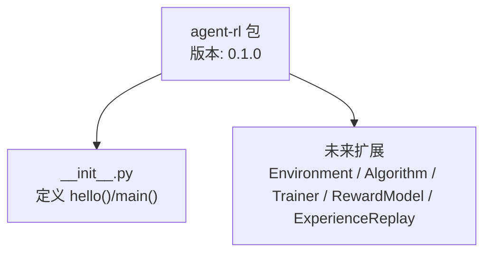
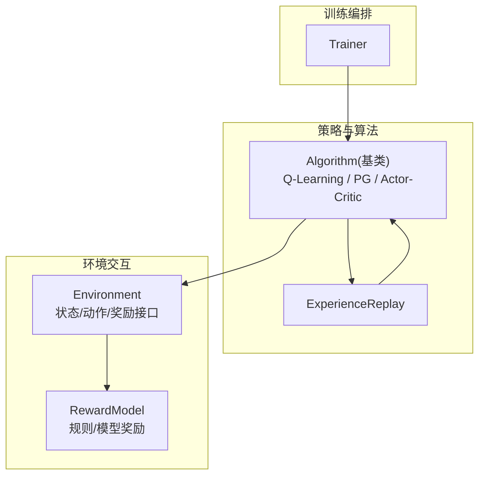
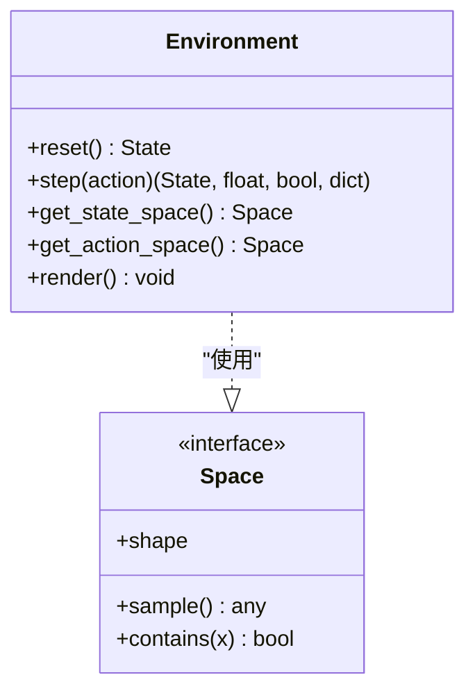
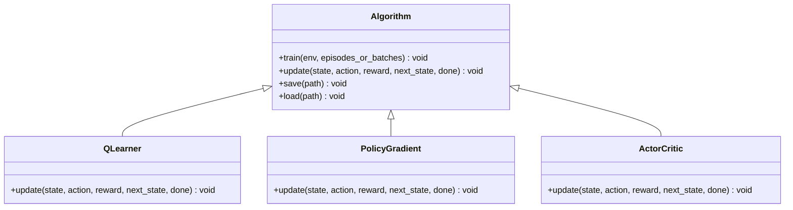
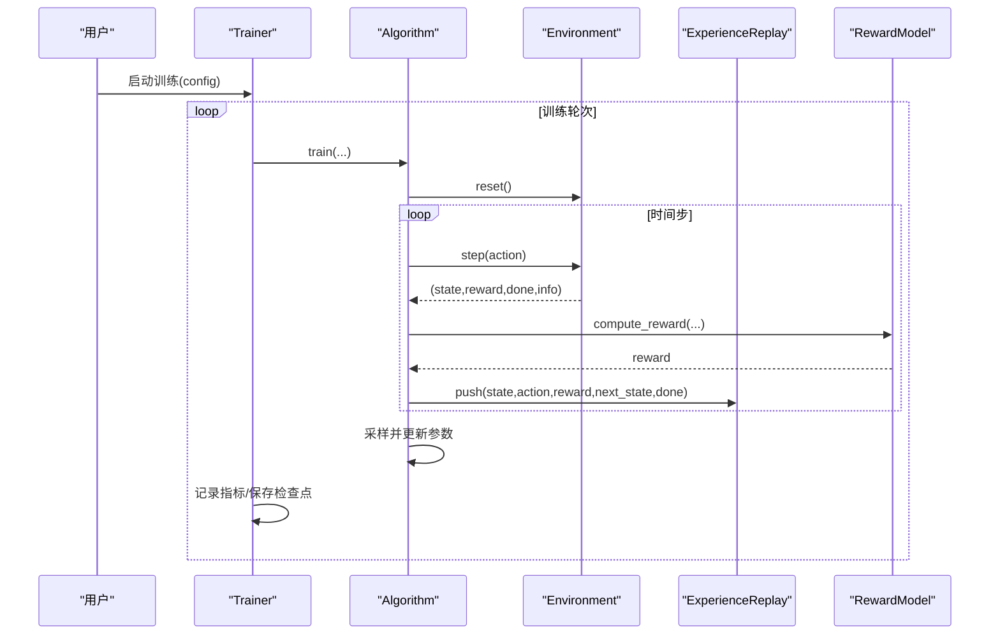
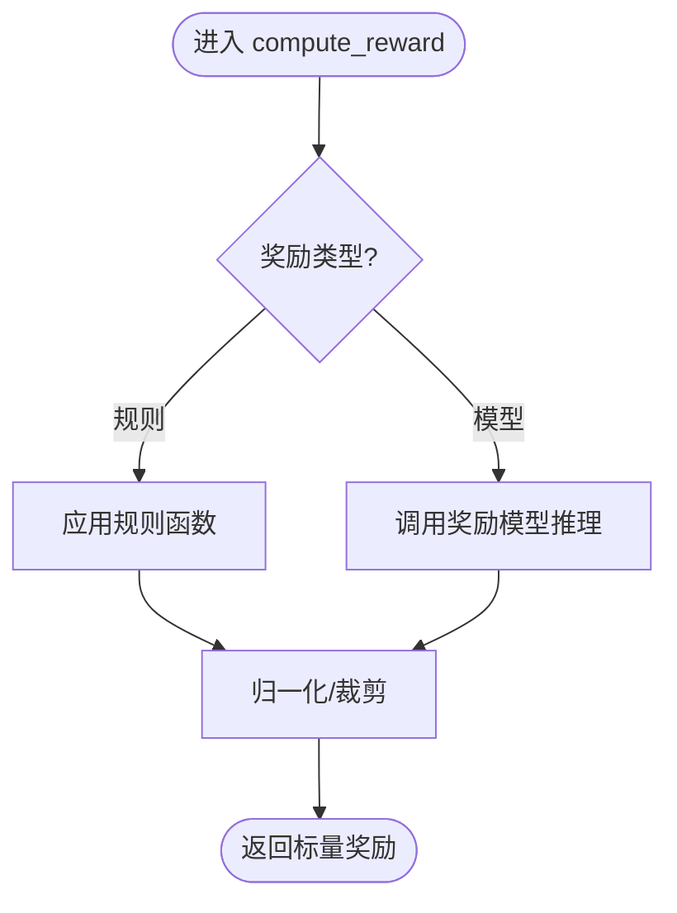
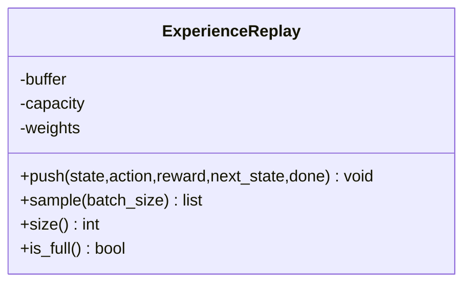
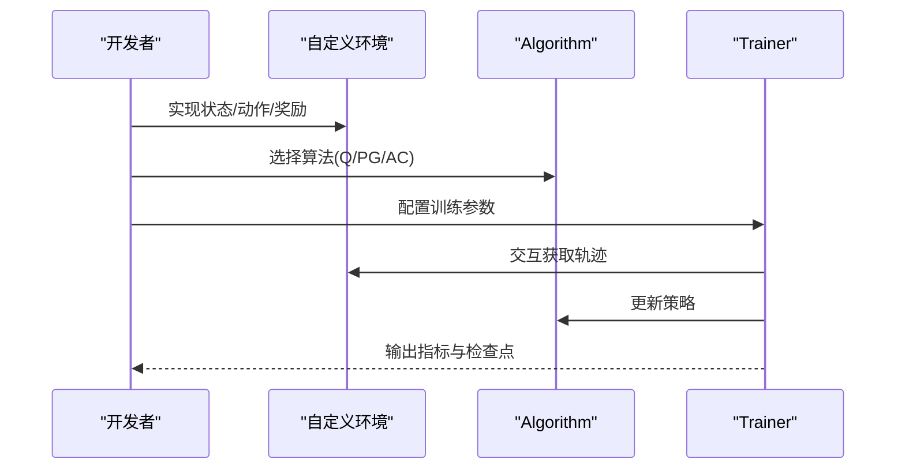
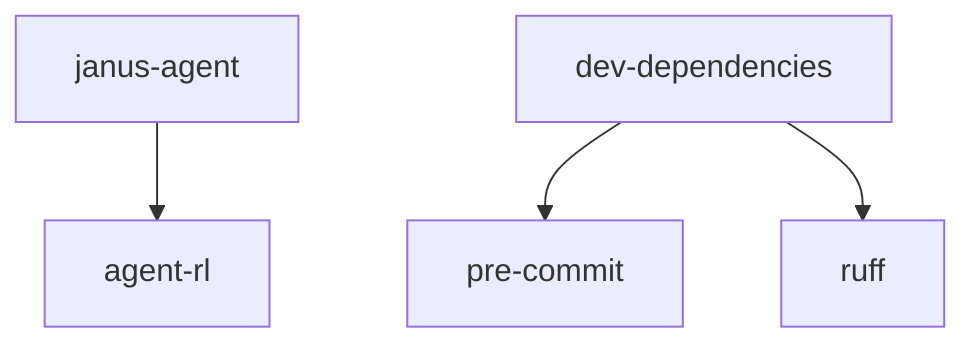

# 强化学习 API

<cite>
**本文引用的文件**   
- [packages/agent-rl/src/agent_rl/__init__.py](file://packages/agent-rl/src/agent_rl/__init__.py)
- [uv.lock](file://uv.lock)
- [verl-learning-plan.md](file://docs/plans/verl-learning-plan.md)
</cite>

## 目录
1. [简介](#简介)
2. [项目结构](#项目结构)
3. [核心组件](#核心组件)
4. [架构总览](#架构总览)
5. [详细组件分析](#详细组件分析)
6. [依赖分析](#依赖分析)
7. [性能考虑](#性能考虑)
8. [故障排查指南](#故障排查指南)
9. [结论](#结论)
10. [附录](#附录)

## 简介
本文件为 agent-rl 强化学习模块的完整 API 文档，面向希望在该包中构建与训练强化学习智能体的开发者。文档覆盖以下关键主题：
- Environment 环境抽象：状态空间、动作空间与奖励函数接口设计
- Algorithm 算法基类：Q-Learning、Policy Gradient、Actor-Critic 等实现要点
- Trainer 训练管理器：训练循环、模型保存与性能监控
- RewardModel 奖励建模系统：奖励函数设计与优化策略
- ExperienceReplay 经验回放缓冲区：状态存储与采样机制
- 实战示例：如何搭建环境与训练算法

说明：当前仓库中 agent-rl 包处于早期阶段，公开入口位于包的初始化文件中；同时结合 verl 学习计划文档中的概念性流程与配置，给出可落地的 API 设计建议与集成路径。

## 项目结构
agent-rl 作为多包工程中的一个子包，提供“自主学习之面”的强化学习能力，包括环境交互、策略优化、奖励建模与模型部署等。从现有可见信息可知：
- 包名：agent-rl
- 版本：0.1.0
- 入口函数：hello()、main()
- 顶层职责：封装 RL 智能体与环境交互、策略优化、奖励建模与部署

图表来源
- [packages/agent-rl/src/agent_rl/__init__.py:1-14](file://packages/agent-rl/src/agent_rl/__init__.py#L1-L14)

章节来源
- [packages/agent-rl/src/agent_rl/__init__.py:1-14](file://packages/agent-rl/src/agent_rl/__init__.py#L1-L14)

## 核心组件
本节给出 agent-rl 的核心 API 抽象与职责划分，便于后续扩展与统一调用。

- Environment（环境抽象）
  - 职责：定义状态空间、动作空间、步进接口与奖励返回
  - 关键接口
    - reset(): 重置环境并返回初始状态
    - step(action): 执行动作，返回新状态、奖励、终止标志与可选诊断信息
    - get_state_space(): 描述状态空间（离散/连续、维度、取值范围）
    - get_action_space(): 描述动作空间（离散/连续、动作集合或范围）
    - render(): 可视化（可选）
  - 设计要点
    - 状态与动作类型需明确，支持向量化与批处理
    - 奖励函数应可插拔，支持规则奖励与模型奖励

- Algorithm（算法基类）
  - 职责：封装不同 RL 算法的训练逻辑与更新步骤
  - 典型实现
    - Q-Learning：基于价值表的离线/在线更新
    - Policy Gradient：直接优化策略梯度
    - Actor-Critic：Actor 与 Critic 协同优化，含 Advantage 估计
  - 关键接口
    - train(env, episodes/batches): 训练主循环
    - update(state, action, reward, next_state, done): 单步更新
    - save(path)/load(path): 模型持久化

- Trainer（训练管理器）
  - 职责：组织训练循环、日志记录、检查点保存与评估
  - 关键接口
    - run(config): 启动训练
    - evaluate(): 周期评估与指标上报
    - checkpoint(save_dir): 保存/恢复训练状态
    - log(metrics): 记录训练指标

- RewardModel（奖励建模系统）
  - 职责：将环境反馈转化为标量奖励，支持规则奖励与模型奖励
  - 关键接口
    - compute_reward(state, action, next_state, info): 计算奖励
    - optimize(data): 奖励模型微调（可选）

- ExperienceReplay（经验回放缓冲区）
  - 职责：存储历史转移样本并提供采样
  - 关键接口
    - push(state, action, reward, next_state, done): 插入样本
    - sample(batch_size): 随机或优先级采样
    - size()/is_full(): 容量管理

章节来源
- [packages/agent-rl/src/agent_rl/__init__.py:1-14](file://packages/agent-rl/src/agent_rl/__init__.py#L1-L14)

## 架构总览
下图展示了 agent-rl 在高层上的组件关系与数据流。Agent 通过 Environment 与环境交互，Algorithm 驱动策略更新，Trainer 负责训练编排，RewardModel 提供奖励信号，ExperienceReplay 用于离策略学习的数据缓冲。

图表来源
- [packages/agent-rl/src/agent_rl/__init__.py:1-14](file://packages/agent-rl/src/agent_rl/__init__.py#L1-L14)

## 详细组件分析

### Environment 环境抽象
- 状态空间定义
  - 离散型：有限集合，适合棋盘、分类任务
  - 连续型：多维实数向量，适合控制任务
  - 混合空间：离散+连续组合
- 动作空间设计
  - 离散动作：枚举或索引映射
  - 连续动作：有界区间，支持归一化
- 奖励函数接口
  - 标准接口：step(action) -> (next_state, reward, done, info)
  - 奖励来源：规则奖励（如目标达成）、模型奖励（如偏好模型评分）
- 复杂度与性能
  - 状态编码应尽量低维且稳定
  - 批量环境支持可降低开销

图表来源
- [packages/agent-rl/src/agent_rl/__init__.py:1-14](file://packages/agent-rl/src/agent_rl/__init__.py#L1-L14)

章节来源
- [packages/agent-rl/src/agent_rl/__init__.py:1-14](file://packages/agent-rl/src/agent_rl/__init__.py#L1-L14)

### Algorithm 算法基类与多种 RL 算法
- 基类职责
  - 统一训练接口：train/update/save/load
  - 通用工具：日志、统计、设备管理
- Q-Learning
  - 适用：离散动作、马尔可夫决策过程
  - 更新：贝尔曼最优迭代，探索策略（ε-greedy）
- Policy Gradient
  - 适用：离散/连续动作
  - 更新：策略梯度上升，基线降低方差
- Actor-Critic
  - 适用：复杂环境，收敛更稳
  - 更新：Actor 优化策略，Critic 估计价值，Advantage 估计（如 GAE）

图表来源
- [packages/agent-rl/src/agent_rl/__init__.py:1-14](file://packages/agent-rl/src/agent_rl/__init__.py#L1-L14)

章节来源
- [packages/agent-rl/src/agent_rl/__init__.py:1-14](file://packages/agent-rl/src/agent_rl/__init__.py#L1-L14)

### Trainer 训练管理器
- 训练循环
  - 按 episode 或 batch 推进
  - 收集轨迹、计算优势、执行参数更新
- 模型保存
  - 定期检查点、最佳模型标记
- 性能监控
  - 指标：平均奖励、损失、KL 散度（若使用参考策略）
  - 日志：控制台、W&B 等

图表来源
- [packages/agent-rl/src/agent_rl/__init__.py:1-14](file://packages/agent-rl/src/agent_rl/__init__.py#L1-L14)

章节来源
- [packages/agent-rl/src/agent_rl/__init__.py:1-14](file://packages/agent-rl/src/agent_rl/__init__.py#L1-L14)

### RewardModel 奖励建模系统
- 奖励函数设计
  - 规则奖励：基于任务完成度、格式正确性等硬约束
  - 模型奖励：基于偏好模型或外部打分器
- 优化策略
  - 对模型奖励进行校准与平滑
  - 与 KL 正则结合防止策略漂移（参考 PPO 实践）

图表来源
- [packages/agent-rl/src/agent_rl/__init__.py:1-14](file://packages/agent-rl/src/agent_rl/__init__.py#L1-L14)

章节来源
- [packages/agent-rl/src/agent_rl/__init__.py:1-14](file://packages/agent-rl/src/agent_rl/__init__.py#L1-L14)

### ExperienceReplay 经验回放缓冲区
- 状态存储
  - 环形缓冲或动态列表
  - 支持优先采样（PER）
- 采样机制
  - 均匀随机采样
  - 按权重或 TD-error 优先级采样
- 容量与清理
  - 满时覆盖最旧样本
  - 周期性压缩或重放

图表来源
- [packages/agent-rl/src/agent_rl/__init__.py:1-14](file://packages/agent-rl/src/agent_rl/__init__.py#L1-L14)

章节来源
- [packages/agent-rl/src/agent_rl/__init__.py:1-14](file://packages/agent-rl/src/agent_rl/__init__.py#L1-L14)

### 实战示例：搭建环境与训练算法
- 环境搭建
  - 继承 Environment，实现状态/动作空间与 step/reset
  - 定义规则奖励或接入 RewardModel
- 算法选择
  - 简单离散任务：Q-Learning
  - 需要稳定收敛：Actor-Critic
- 训练流程
  - 使用 Trainer 组织训练循环
  - 配置日志与检查点保存
- 参考流程（来自 verl 学习计划）
  - 数据预处理 → 启动训练 → 监控指标 → 保存检查点

图表来源
- [packages/agent-rl/src/agent_rl/__init__.py:1-14](file://packages/agent-rl/src/agent_rl/__init__.py#L1-L14)

章节来源
- [packages/agent-rl/src/agent_rl/__init__.py:1-14](file://packages/agent-rl/src/agent_rl/__init__.py#L1-L14)

## 依赖分析
- 包依赖
  - janus-agent 依赖 agent-rl（可编辑安装）
- 开发依赖
  - pre-commit、ruff

图表来源
- [uv.lock:2157-2179](file://uv.lock#L2157-L2179)

章节来源
- [uv.lock:2157-2179](file://uv.lock#L2157-L2179)

## 性能考虑
- 环境侧
  - 向量化环境减少 Python 开销
  - 状态编码降维与缓存
- 算法侧
  - 使用 Advantage 估计（如 GAE）提升稳定性
  - 合理设置学习率与 KL 系数（参考 PPO 实践）
- 训练侧
  - 微批次与并行 rollout 提高吞吐
  - 检查点与断点续训避免长时训练中断损失

[本节为通用指导，不直接分析具体文件]

## 故障排查指南
- 常见错误
  - NaN loss：检查学习率是否过高、KL 系数是否合适
  - GPU 内存不足：降低 micro_batch_size 或使用小模型
- 定位方法
  - 启用详细日志与指标上报
  - 逐步验证环境奖励与状态有效性

章节来源
- [verl-learning-plan.md:505-512](file://docs/plans/verl-learning-plan.md#L505-L512)

## 结论
agent-rl 提供了强化学习智能体的基础框架与可扩展接口。通过统一的 Environment、Algorithm、Trainer、RewardModel 与 ExperienceReplay 抽象，开发者可以快速搭建环境、选择算法并完成训练与部署。结合 verl 的学习计划与实践，可在 LLM 场景下引入高效的 RLHF 训练能力。

[本节为总结性内容，不直接分析具体文件]

## 附录
- 快速上手清单
  - 定义 Environment 的状态/动作/奖励接口
  - 选择 Algorithm（Q/PG/AC）
  - 使用 Trainer 组织训练、保存检查点与监控指标
  - 根据任务需求定制 RewardModel
- 参考资源
  - verl 学习计划文档中的训练流程与配置建议

[本节为补充信息，不直接分析具体文件]