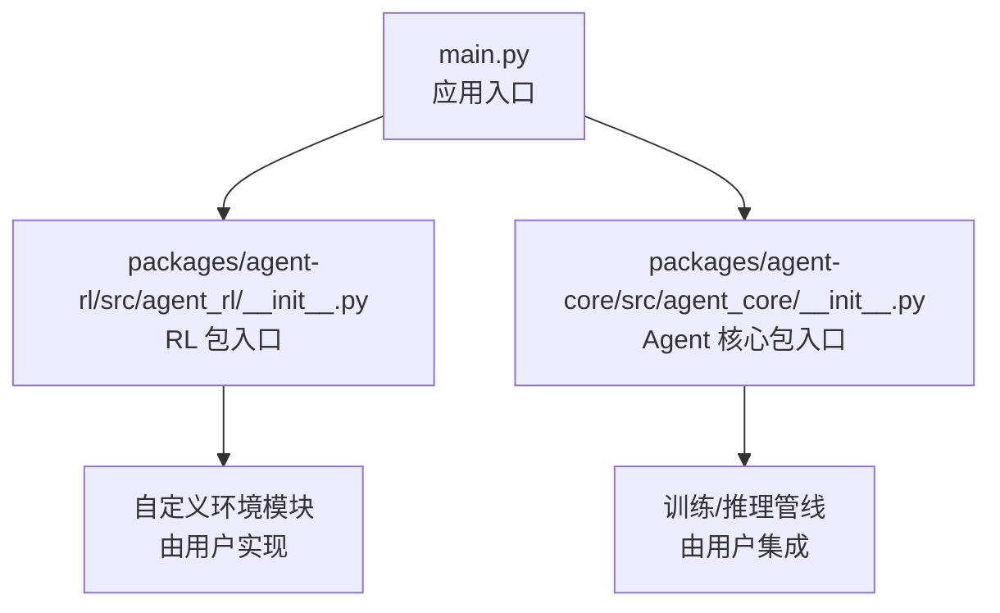
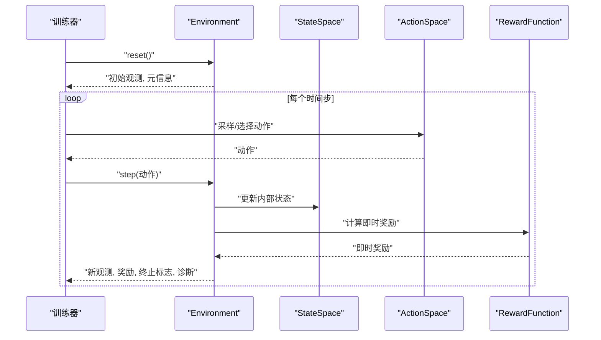
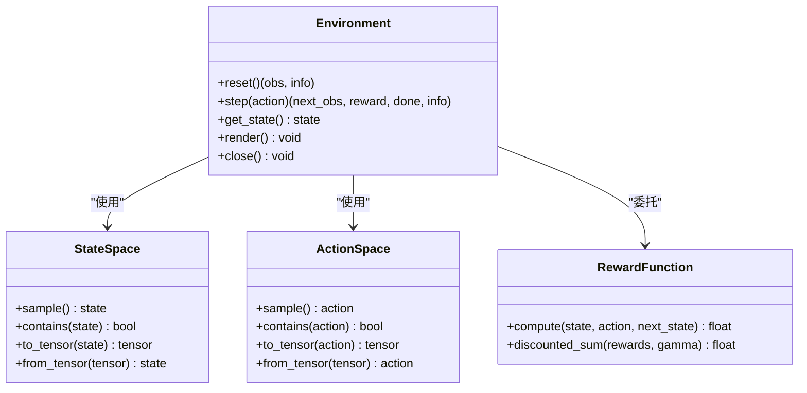
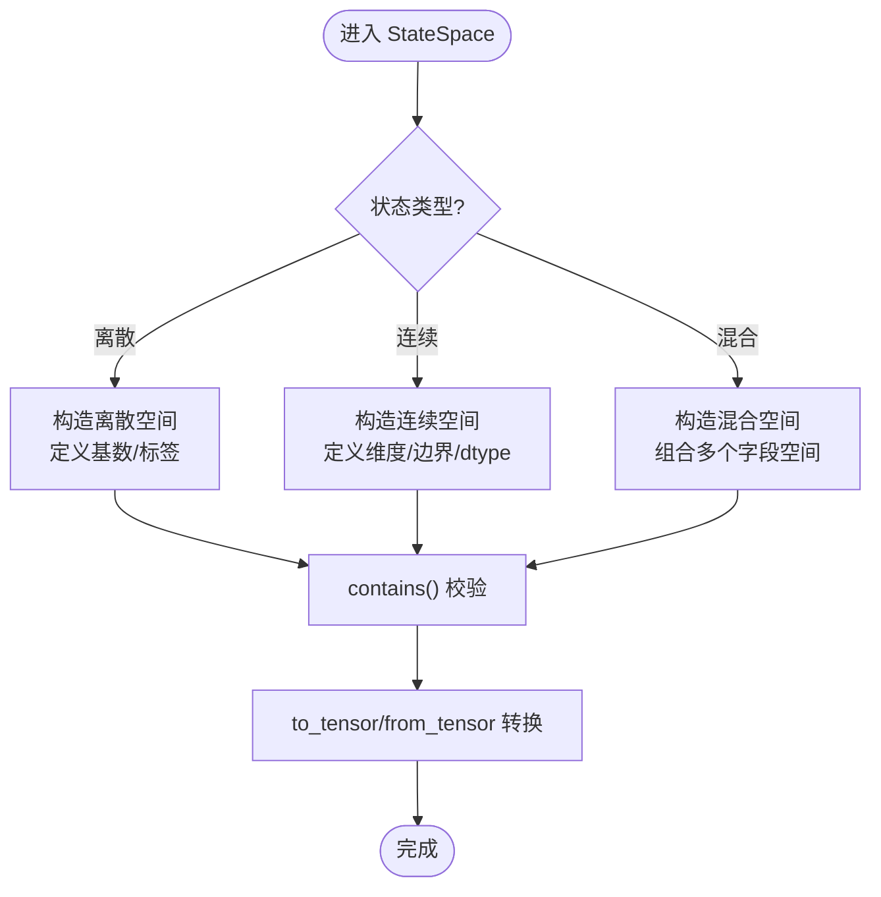
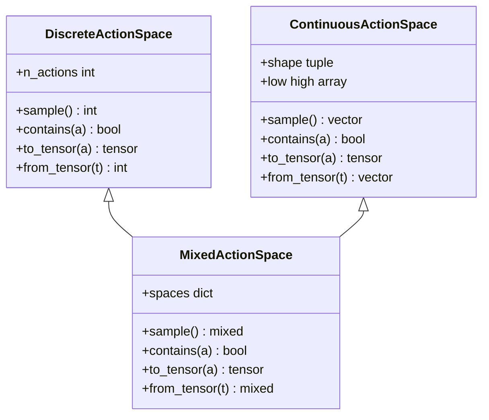
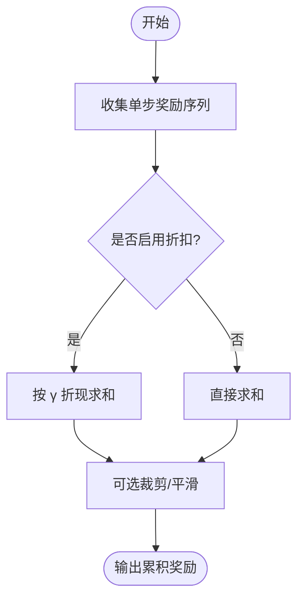
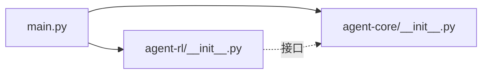

# 环境接口 API

<cite>
**本文引用的文件**   
- [main.py](file://main.py)
- [agent-rl/__init__.py](file://packages/agent-rl/src/agent_rl/__init__.py)
- [agent-core/__init__.py](file://packages/agent-core/src/agent_core/__init__.py)
</cite>

## 目录
1. [简介](#简介)
2. [项目结构](#项目结构)
3. [核心组件](#核心组件)
4. [架构总览](#架构总览)
5. [详细组件分析](#详细组件分析)
6. [依赖分析](#依赖分析)
7. [性能考虑](#性能考虑)
8. [故障排查指南](#故障排查指南)
9. [结论](#结论)
10. [附录](#附录)

## 简介
本文件面向强化学习环境的开发者与使用者，系统化地定义并文档化“环境接口”的规范与最佳实践。内容覆盖：
- Environment 基类的设计模式与生命周期方法（reset、step、get_state）
- StateSpace 状态空间的离散与连续表示方式
- ActionSpace 动作空间的离散与连续处理机制
- RewardFunction 奖励函数的即时奖励计算与累积折扣策略
- 自定义环境的完整实现示例（状态定义、动作映射、奖励计算）

说明：当前仓库中未包含可直接运行的环境实现代码，本文基于通用强化学习范式给出接口设计与使用建议，并在需要处提供“章节来源”以指向仓库中的入口与包初始化文件，便于读者定位扩展点。

## 项目结构
仓库采用多包组织方式，主入口位于根目录 main.py；agent-rl 与 agent-core 为两个核心子包，分别承载强化学习与智能体核心能力。与环境接口相关的扩展点通常位于 agent-rl 包内，用户可通过该包注册或继承新的环境类型。

图表来源
- [main.py](file://main.py)
- [agent-rl/__init__.py](file://packages/agent-rl/src/agent_rl/__init__.py)
- [agent-core/__init__.py](file://packages/agent-core/src/agent_core/__init__.py)

章节来源
- [main.py](file://main.py)
- [agent-rl/__init__.py](file://packages/agent-rl/src/agent_rl/__init__.py)
- [agent-core/__init__.py](file://packages/agent-core/src/agent_core/__init__.py)

## 核心组件
本节从接口层面定义环境相关的关键抽象，帮助统一不同环境的交互协议。

- Environment 基类
  - reset()：重置环境至初始状态，返回初始观测与必要元信息。
  - step(action)：执行一个动作，返回新观测、即时奖励、终止标志与可选诊断信息。
  - get_state()：获取当前内部状态（可用于回放、调试或离线评估）。
  - 其他约定：支持 render()/close() 等可选方法用于可视化与资源清理。

- StateSpace 状态空间
  - 离散状态：用整数索引或枚举值表示有限集合。
  - 连续状态：用多维浮点向量表示，需声明维度与取值范围。
  - 混合状态：组合离散与连续字段，按字段名或位置对齐。

- ActionSpace 动作空间
  - 离散动作：整数索引或类别标签。
  - 连续动作：固定维度的实数向量，可带上下界约束。
  - 混合动作：同时包含离散与连续分量。

- RewardFunction 奖励函数
  - 即时奖励：根据当前状态、动作、下一状态计算一步奖励。
  - 累积奖励与折扣：通过折扣因子 γ 对远期奖励进行折现，支持 episode 级汇总。

章节来源
- [agent-rl/__init__.py](file://packages/agent-rl/src/agent_rl/__init__.py)

## 架构总览
下图展示了一个典型的环境交互流程：训练器调用环境接口完成一次步进，随后将轨迹数据送入策略更新或回放缓冲区。

图表来源
- [agent-rl/__init__.py](file://packages/agent-rl/src/agent_rl/__init__.py)

## 详细组件分析

### Environment 基类设计
- 职责边界
  - 封装环境动力学与观测生成，不耦合具体算法。
  - 保证 reset/step/get_state 的幂等性与一致性。
- 关键方法
  - reset()：确保每次调用后环境处于一致初始分布。
  - step(action)：原子性地推进环境，返回四元组（观测、奖励、终止、诊断）。
  - get_state()：暴露内部状态快照，便于回放与评测。
- 错误与异常
  - 非法动作应抛出明确异常或返回诊断码。
  - 越界状态需记录日志并安全截断或回退。

图表来源
- [agent-rl/__init__.py](file://packages/agent-rl/src/agent_rl/__init__.py)

章节来源
- [agent-rl/__init__.py](file://packages/agent-rl/src/agent_rl/__init__.py)

### StateSpace 状态空间
- 离散状态
  - 使用整数索引或枚举，适合有限网格、分类场景。
  - 提供 contains() 校验与 to_tensor/from_tensor 转换。
- 连续状态
  - 使用固定维度的浮点数组，支持归一化与裁剪。
  - 提供 bounds 与 dtype 配置。
- 混合状态
  - 字典或命名元组形式，按字段访问。
  - 各字段独立定义其 Space，整体做联合校验。

章节来源
- [agent-rl/__init__.py](file://packages/agent-rl/src/agent_rl/__init__.py)

### ActionSpace 动作空间
- 离散动作
  - 整数索引或类别标签，适合控制开关、方向选择等。
- 连续动作
  - 多维实数向量，常用于机械臂关节角度、油门刹车等。
- 混合动作
  - 同时包含离散与连续分量，常见于分层控制。
- 动作合法性检查
  - 在 step 前进行 contains() 校验，避免非法输入导致环境崩溃。

图表来源
- [agent-rl/__init__.py](file://packages/agent-rl/src/agent_rl/__init__.py)

章节来源
- [agent-rl/__init__.py](file://packages/agent-rl/src/agent_rl/__init__.py)

### RewardFunction 奖励函数
- 即时奖励
  - 依据 (state, action, next_state) 计算单步奖励。
  - 支持稀疏/稠密奖励，以及任务阶段切换时的奖励重标定。
- 累积奖励与折扣
  - 使用折扣因子 γ ∈ [0,1] 对后续奖励进行折现。
  - 提供 discounted_sum 工具函数，便于评估与对比。
- 稳定性
  - 对极端奖励进行裁剪或平滑，防止梯度爆炸或数值不稳定。

章节来源
- [agent-rl/__init__.py](file://packages/agent-rl/src/agent_rl/__init__.py)

### 自定义环境实现示例
以下提供一个从零构建自定义环境的步骤清单，涵盖状态定义、动作映射与奖励计算逻辑。请结合 agent-rl 包的扩展点进行实现。

- 步骤
  1) 定义 StateSpace：确定离散/连续/混合结构，实现 contains 与张量转换。
  2) 定义 ActionSpace：选择离散/连续/混合，设置边界与采样策略。
  3) 实现 Environment：
     - reset()：生成初始状态，返回初始观测。
     - step(action)：校验动作、更新状态、计算奖励、判断终止。
     - get_state()：返回内部状态快照。
  4) 实现 RewardFunction：编写即时奖励公式，并提供折扣聚合工具。
  5) 集成到训练管线：在 agent-rl 入口注册环境类型，供训练器加载。

- 注意事项
  - 保持观测与状态的解耦：观测可以是状态的有损投影。
  - 动作与状态的空间一致性：step 前后必须满足各自 Space 的约束。
  - 可复现性：固定随机种子，保证实验可比。

章节来源
- [agent-rl/__init__.py](file://packages/agent-rl/src/agent_rl/__init__.py)

## 依赖分析
- 包关系
  - main.py 作为应用入口，负责初始化与编排。
  - agent-rl 提供环境接口与 RL 相关能力。
  - agent-core 提供智能体核心能力，与环境解耦。
- 可能的循环依赖
  - 应避免在 agent-rl 中反向导入 agent-core 的具体实现，仅通过接口或配置交互。

图表来源
- [main.py](file://main.py)
- [agent-rl/__init__.py](file://packages/agent-rl/src/agent_rl/__init__.py)
- [agent-core/__init__.py](file://packages/agent-core/src/agent_core/__init__.py)

章节来源
- [main.py](file://main.py)
- [agent-rl/__init__.py](file://packages/agent-rl/src/agent_rl/__init__.py)
- [agent-core/__init__.py](file://packages/agent-core/src/agent_core/__init__.py)

## 性能考虑
- 批量环境
  - 使用向量化环境减少 Python 层开销，提升吞吐。
- 内存与缓存
  - 对高频计算的中间结果进行缓存，注意失效策略。
- 数值稳定
  - 对奖励与状态进行归一化/裁剪，避免溢出。
- I/O 与渲染
  - 渲染仅在调试时开启，生产环境关闭以提升速度。

## 故障排查指南
- 常见问题
  - 动作越界：检查 ActionSpace.contains 与 step 前置校验。
  - 状态不一致：确认 reset 后状态与观测一致，get_state 返回值可被解析。
  - 奖励爆炸：检查 RewardFunction 的裁剪与平滑策略。
  - 终止条件误判：核对 done 标志与最大步长限制。
- 定位手段
  - 打印 get_state 快照与诊断信息。
  - 使用最小可复现实例隔离问题。
  - 逐步注释掉非核心逻辑，二分定位。

## 结论
本文给出了强化学习环境接口的标准化设计，包括 Environment、StateSpace、ActionSpace 与 RewardFunction 的职责划分与交互约定。通过统一的接口与清晰的实现步骤，开发者可以快速构建高质量、可复用的自定义环境，并与现有训练管线无缝集成。

## 附录
- 术语表
  - 观测：环境对外暴露的可测量信号。
  - 状态：环境内部完整描述。
  - 动作：智能体施加于环境的控制信号。
  - 奖励：环境对智能体行为的标量反馈。
  - 折扣因子：对未来奖励的衰减系数。