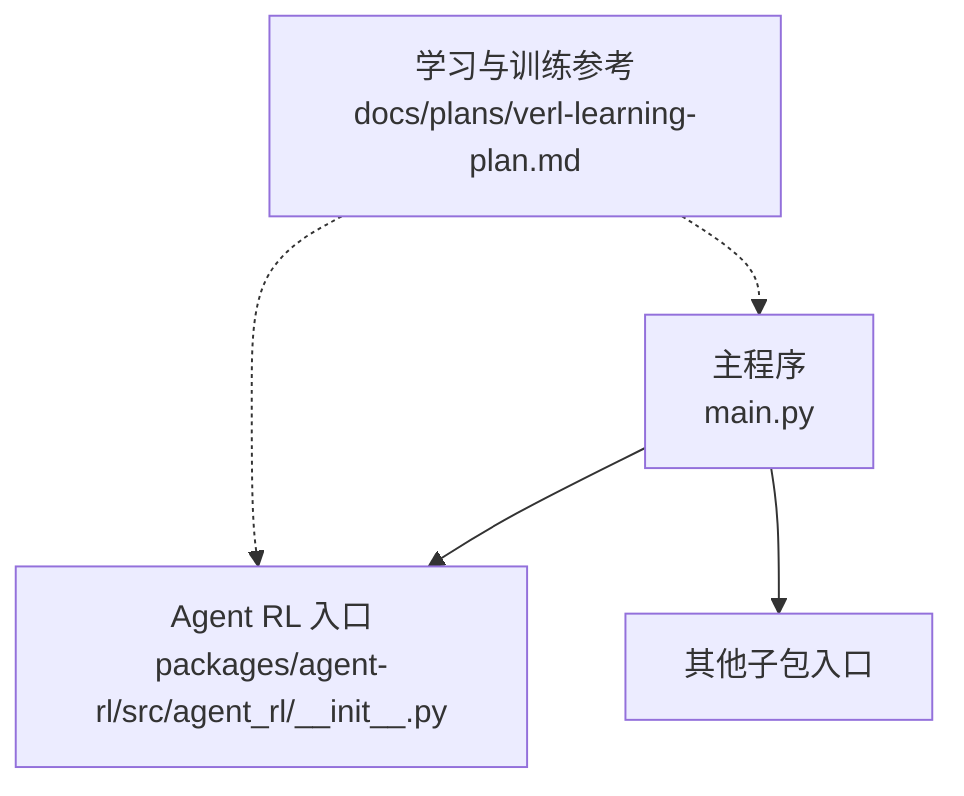
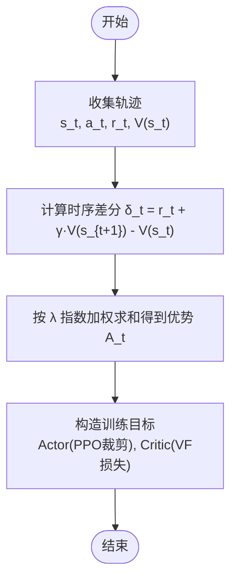
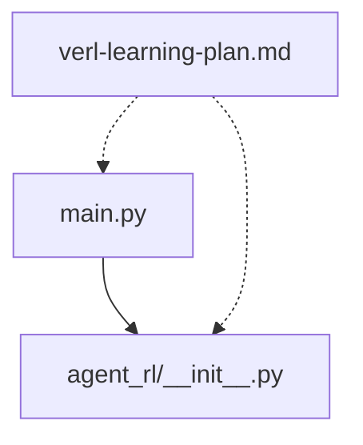

# Actor-Critic 算法

<cite>
**本文引用的文件**   
- [main.py](file://main.py)
- [agent_rl/__init__.py](file://packages/agent-rl/src/agent_rl/__init__.py)
- [verl-learning-plan.md](file://docs/plans/verl-learning-plan.md)
</cite>

## 目录
1. [简介](#简介)
2. [项目结构](#项目结构)
3. [核心组件](#核心组件)
4. [架构总览](#架构总览)
5. [详细组件分析](#详细组件分析)
6. [依赖关系分析](#依赖关系分析)
7. [性能与稳定性](#性能与稳定性)
8. [故障排查指南](#故障排查指南)
9. [结论](#结论)
10. [附录](#附录)

## 简介
本文件面向需要理解与使用 Actor-Critic 系列算法（A2C/A3C、PPO）的工程师与研究者，提供从双网络架构到训练流程、参数配置、监控与收敛性分析的完整说明。文档同时结合仓库中的学习路线与 PPO 训练循环示例，给出可操作的实践建议与常见问题排障方法。

## 项目结构
当前仓库包含多个子包，其中 agent-rl 为强化学习智能体相关模块的入口；主程序 main.py 聚合了若干子包的演示能力。与 Actor-Critic 相关的实现细节与训练流程参考位于 docs/plans/verl-learning-plan.md 的学习计划与 PPO 训练循环示例。



图示来源
- [main.py:1-13](file://main.py#L1-L13)
- [agent_rl/__init__.py:1-15](file://packages/agent-rl/src/agent_rl/__init__.py#L1-L15)
- [verl-learning-plan.md:151-212](file://docs/plans/verl-learning-plan.md#L151-L212)

章节来源
- [main.py:1-13](file://main.py#L1-L13)
- [agent_rl/__init__.py:1-15](file://packages/agent-rl/src/agent_rl/__init__.py#L1-L15)

## 核心组件
- 双网络架构
  - Actor 网络：输出策略分布（离散动作的概率或连续动作的参数），负责“做什么”。
  - Critic 网络：估计状态价值函数 V(s)，用于评估当前策略优劣并降低梯度方差。
- 优势函数（Advantage Function）
  - 常用 GAE（Generalized Advantage Estimation）在时序差分误差基础上进行指数加权平均，平衡偏差与方差。
- A2C/A3C 与 PPO 的差异
  - A2C/A3C：同步/异步多工作线程采样更新，通常使用重要性采样修正或截断策略。
  - PPO：通过裁剪目标函数限制新旧策略偏离程度，提升训练稳定性与样本效率。
- Agent 类与关键超参
  - 学习率：Actor 与 Critic 分别设置，便于控制策略与价值函数的更新步长。
  - GAE 参数 λ：控制优势估计的偏差-方差权衡。
  - 熵正则化系数：鼓励探索，防止策略过早收敛。
  - PPO 裁剪范围 ε、KL 惩罚系数等：稳定近端优化过程。

章节来源
- [verl-learning-plan.md:283-311](file://docs/plans/verl-learning-plan.md#L283-L311)

## 架构总览
下图展示基于 PPO 的训练数据流与控制流：Rollout 阶段由 Actor 与环境交互生成轨迹，Critic 计算价值，Reward 模块给出奖励信号，随后计算优势并进行 Actor/Critic 的联合更新。

```mermaid
sequenceDiagram
participant Env as "环境"
participant Actor as "Actor 网络"
participant Critic as "Critic 网络"
participant Reward as "奖励模块"
participant Trainer as "训练器(含GAE/PPO)"
Env->>Actor : "输入状态 s_t"<br/>输出动作 a_t
Actor-->>Env : "执行动作 a_t"
Env-->>Reward : "返回奖励 r_t, 终止标志"
Reward-->>Trainer : "r_t"
Critic->>Trainer : "V(s_t)"
Trainer->>Trainer : "计算优势 A_t (GAE)"
Trainer->>Actor : "按 PPO 裁剪目标更新"
Trainer->>Critic : "按价值损失更新"
```

图示来源
- [verl-learning-plan.md:283-311](file://docs/plans/verl-learning-plan.md#L283-L311)

## 详细组件分析

### 双网络设计与职责划分
- Actor 网络
  - 输入：环境观测（如图像、向量、文本提示）。
  - 输出：动作概率分布或连续动作参数。
  - 作用：最大化期望累积回报，受 KL 约束与熵正则影响。
- Critic 网络
  - 输入：环境观测。
  - 输出：状态价值 V(s)。
  - 作用：提供基线以减少梯度方差，辅助优势估计。

章节来源
- [verl-learning-plan.md:283-311](file://docs/plans/verl-learning-plan.md#L283-L311)

### 优势函数（GAE）计算流程


图示来源
- [verl-learning-plan.md:283-311](file://docs/plans/verl-learning-plan.md#L283-L311)

### A2C/A3C 与 PPO 的实现差异
- A2C/A3C
  - 多工作线程并行采样，定期同步或异步更新全局参数。
  - 常配合重要性采样或截断策略以稳定更新。
- PPO
  - 单批或多批次内多次小步更新，采用裁剪目标函数限制策略变化幅度。
  - 引入 KL 惩罚项进一步约束策略漂移。

章节来源
- [verl-learning-plan.md:283-311](file://docs/plans/verl-learning-plan.md#L283-L311)

### ActorCriticAgent 核心参数说明
- 学习率
  - actor.optim.lr：Actor 网络优化器学习率。
  - critic.optim.lr：Critic 网络优化器学习率。
- GAE 参数
  - lambda（λ）：优势估计的衰减因子，越大越接近蒙特卡洛估计，越小更偏向单步 TD。
- 熵正则化
  - entropy_coeff：对策略熵的正则权重，鼓励探索。
- PPO 高级特性
  - clip_range（ε）：裁剪范围，限制新旧策略比率。
  - kl_coef：KL 惩罚系数，抑制策略过度偏离参考策略。
- 批量与微批
  - ppo_mini_batch_size：PPO 小批大小。
  - ppo_micro_batch_size_per_gpu：每 GPU 微批大小，控制显存占用。
-  rollout 与推理
  - rollout.name/log_prob_micro_batch_size_per_gpu/tensor_model_parallel_size/gpu_memory_utilization：控制序列生成与 log_prob 计算的资源分配。

章节来源
- [verl-learning-plan.md:162-189](file://docs/plans/verl-learning-plan.md#L162-L189)

### 经验回放缓冲区与批量训练
- 经验回放缓冲区
  - 存储轨迹片段（状态、动作、奖励、价值、log_prob 等），支持按 episode 或时间片切分。
  - 针对 PPO 的 mini/micro batch 设计，兼顾吞吐与显存。
- 批量训练
  - 先 Rollout 收集一批样本，再在本地进行多轮 PPO 更新。
  - 结合 vLLM 等推理后端加速采样与 log_prob 计算。

章节来源
- [verl-learning-plan.md:162-189](file://docs/plans/verl-learning-plan.md#L162-L189)
- [verl-learning-plan.md:283-311](file://docs/plans/verl-learning-plan.md#L283-L311)

### 复杂环境训练配置示例（Atari/机器人控制）
- 通用要点
  - 调整 max_prompt_length/max_response_length 对应环境交互长度。
  - 根据任务复杂度调大 train_batch_size，并适当减小 micro batch 以适配显存。
  - 对于高维视觉输入，增大 rollout.gpu_memory_utilization 或使用并行推理后端。
- 参考命令与指标
  - 参考 PPO 启动命令与关键观察指标，确保 val/test_score、actor/pg_loss、critic/vf_loss、actor/entropy_loss 等指标稳定下降或趋于平稳。

章节来源
- [verl-learning-plan.md:162-201](file://docs/plans/verl-learning-plan.md#L162-L201)

### 训练过程监控与收敛性分析
- 关键指标
  - 验证集分数：val/test_score/
  - 策略损失：actor/pg_loss
  - 价值损失：critic/vf_loss
  - 策略熵：actor/entropy_loss
  - KL 惩罚：actor/reward_kl_penalty
  - 响应长度：response_length/mean
  - 奖励均值：critic/rewards/mean
- 收敛判断
  - 当验证分数稳定且策略损失与价值损失不再显著下降时，可视为收敛。
  - 若出现 NaN loss，优先检查学习率与 KL 系数。

章节来源
- [verl-learning-plan.md:191-201](file://docs/plans/verl-learning-plan.md#L191-L201)
- [verl-learning-plan.md:505-512](file://docs/plans/verl-learning-plan.md#L505-L512)

## 依赖关系分析
- 主程序 main.py 聚合了若干子包入口，agent-rl 作为 RL 能力入口之一。
- 训练流程与配置参考来自学习计划文档，指导如何组织训练脚本与参数。



图示来源
- [main.py:1-13](file://main.py#L1-L13)
- [agent_rl/__init__.py:1-15](file://packages/agent-rl/src/agent_rl/__init__.py#L1-L15)
- [verl-learning-plan.md:151-212](file://docs/plans/verl-learning-plan.md#L151-L212)

章节来源
- [main.py:1-13](file://main.py#L1-L13)
- [agent_rl/__init__.py:1-15](file://packages/agent-rl/src/agent_rl/__init__.py#L1-L15)
- [verl-learning-plan.md:151-212](file://docs/plans/verl-learning-plan.md#L151-L212)

## 性能与稳定性
- 显存与吞吐
  - 合理设置 ppo_micro_batch_size_per_gpu 与 rollout.gpu_memory_utilization，避免 OOM。
  - 使用并行推理后端（如 vLLM）提升采样与 log_prob 计算效率。
- 数值稳定
  - 控制学习率上限（例如 ≤ 1e-5），必要时启用梯度裁剪。
  - 调整 KL 系数，防止策略剧烈波动导致 NaN。
- 收敛性
  - 关注熵与 KL 惩罚的变化趋势，避免过早收敛或过度探索。

章节来源
- [verl-learning-plan.md:162-189](file://docs/plans/verl-learning-plan.md#L162-L189)
- [verl-learning-plan.md:505-512](file://docs/plans/verl-learning-plan.md#L505-L512)

## 故障排查指南
- 单卡显存不足
  - 降低 ppo_micro_batch_size_per_gpu 与 gpu_memory_utilization，或改用更小模型。
- NaN Loss
  - 检查学习率是否过高；调整 KL 系数；确认奖励尺度是否合理。
- 训练不收敛
  - 检查 GAE λ 与熵系数；适当增加 mini batch 数量；缩短 rollout 长度。

章节来源
- [verl-learning-plan.md:505-512](file://docs/plans/verl-learning-plan.md#L505-L512)

## 结论
Actor-Critic 框架通过双网络分工与优势估计有效提升了策略优化的稳定性与效率。PPO 的裁剪与 KL 约束使其在复杂环境中具备更强的鲁棒性。结合合理的批量与微批策略、完善的监控指标与问题排查流程，可在多种任务上取得良好效果。

## 附录
- 快速上手
  - 参考 PPO 启动命令与关键指标，逐步调参并观察收敛曲线。
- 扩展阅读
  - 学习计划中关于 HybridFlow 与 RLHF 框架的系统设计，有助于理解大规模训练的工程实现。