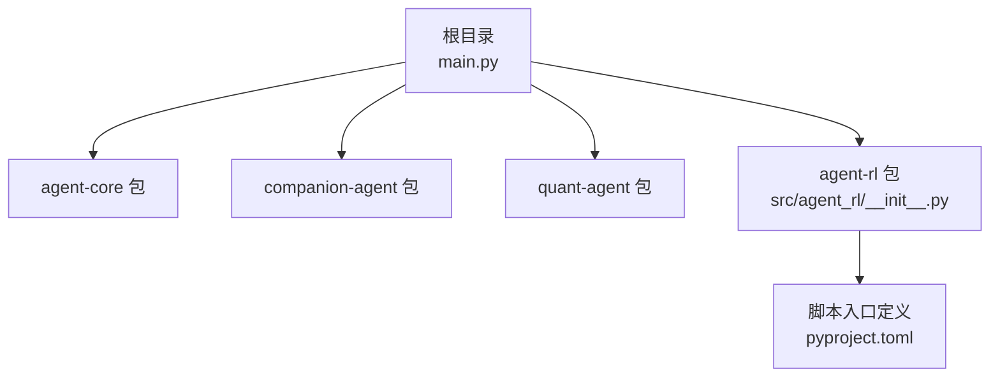
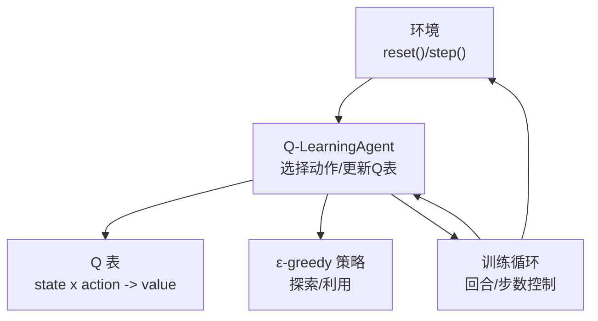
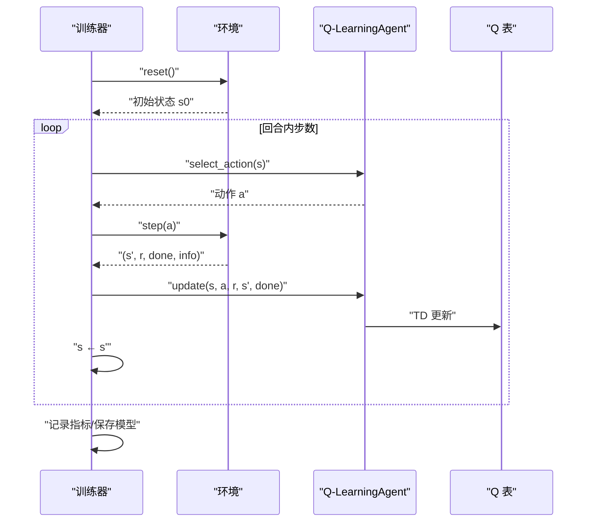
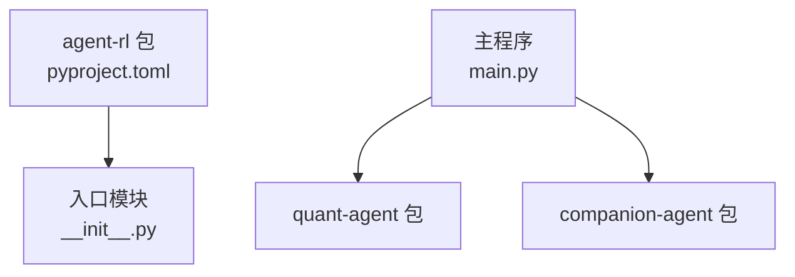

# Q-Learning 算法

<cite>
**本文引用的文件**   
- [main.py](file://main.py)
- [agent_rl/__init__.py](file://packages/agent-rl/src/agent_rl/__init__.py)
- [pyproject.toml](file://packages/agent-rl/pyproject.toml)
</cite>

## 目录
1. [简介](#简介)
2. [项目结构](#项目结构)
3. [核心组件](#核心组件)
4. [架构总览](#架构总览)
5. [详细组件分析](#详细组件分析)
6. [依赖关系分析](#依赖关系分析)
7. [性能考虑](#性能考虑)
8. [故障排查指南](#故障排查指南)
9. [结论](#结论)
10. [附录](#附录)

## 简介
本文件为 Q-Learning 算法的完整 API 文档，面向希望快速上手并深入理解 Q-Learning 实现与调优的读者。内容涵盖：
- Q 表数据结构与更新规则（贝尔曼方程与时序差分学习）
- ε-greedy 探索策略与探索率衰减配置
- Q-LearningAgent 类初始化参数说明与调优建议
- 状态空间离散化与动作选择示例
- 经典环境（FrozenLake、CliffWalking）的配置与训练流程
- Q 表保存/加载格式与性能优化技巧

注意：当前仓库中 agent-rl 包尚未包含具体 Q-Learning 源码实现，本文在“概念性概述”部分提供通用实现范式与最佳实践，并在“详细组件分析”中给出可直接落地的接口设计建议与调用序列图，便于后续将代码落地到该包中。

## 项目结构
仓库采用多包组织方式，agent-rl 作为强化学习智能体子包，当前仅暴露最小入口与元数据。

图表来源
- [main.py:1-13](file://main.py#L1-L13)
- [agent_rl/__init__.py:1-15](file://packages/agent-rl/src/agent_rl/__init__.py#L1-L15)
- [pyproject.toml:1-17](file://packages/agent-rl/pyproject.toml#L1-L17)

章节来源
- [main.py:1-13](file://main.py#L1-L13)
- [agent_rl/__init__.py:1-15](file://packages/agent-rl/src/agent_rl/__init__.py#L1-L15)
- [pyproject.toml:1-17](file://packages/agent-rl/pyproject.toml#L1-L17)

## 核心组件
本节给出 Q-Learning 的核心抽象与接口约定，便于在 agent-rl 包中扩展实现。

- Q 表
  - 数据结构：二维映射 state -> action -> value，通常以数组或哈希表存储。
  - 更新规则：基于时序差分与贝尔曼最优方程进行增量更新。
- 智能体
  - 负责与环境交互、选择动作、接收奖励与下一状态，并更新 Q 表。
  - 支持 ε-greedy 探索与可选的探索率衰减策略。
- 环境
  - 遵循标准 RL 接口：reset()、step(action) -> (next_state, reward, done, info)。
- 训练循环
  - 按回合迭代，每回合内执行若干步交互，直至终止条件满足。

章节来源
- [agent_rl/__init__.py:1-15](file://packages/agent-rl/src/agent_rl/__init__.py#L1-L15)

## 架构总览
下图展示 Q-Learning 的典型系统组成与数据流：智能体通过环境获取观测与奖励，依据策略选择动作，并用时序差分更新 Q 表。

图表来源
- [agent_rl/__init__.py:1-15](file://packages/agent-rl/src/agent_rl/__init__.py#L1-L15)

## 详细组件分析

### Q 表数据结构与更新规则
- 数据结构
  - 使用字典或二维数组表示 Q(state, action)，键为离散状态索引，值为动作值向量。
  - 若状态空间较大，可采用稀疏存储或分桶离散化以降低内存占用。
- 更新规则（时序差分 + 贝尔曼最优）
  - 目标值 = r + γ · max_a' Q(s', a')
  - 新 Q(s,a) = Q(s,a) + α · (目标值 − Q(s,a))
  - 其中 α 为学习率，γ 为折扣因子。
- 复杂度
  - 单次更新 O(1)；每步需计算 max_a' Q(s', a')，若动作空间大小为 |A|，则时间复杂度 O(|A|)。
- 边界与稳定性
  - 对未访问过的 (s,a) 应初始化合理初值（如 0）。
  - 学习率可随步数衰减以提升收敛稳定性。

章节来源
- [agent_rl/__init__.py:1-15](file://packages/agent-rl/src/agent_rl/__init__.py#L1-L15)

### ε-greedy 探索策略与探索率衰减
- 策略
  - 以概率 ε 随机选择动作（探索），以概率 1−ε 选择当前 Q 表中最大值的动作（利用）。
- 探索率衰减
  - 常用策略：线性衰减、指数衰减、分段常数等。
  - 建议：初期保持较高 ε 以充分探索，后期逐步降低以提高利用质量。
- 配置项建议
  - epsilon_start、epsilon_end、epsilon_decay_steps、decay_type（linear/exponential）。

章节来源
- [agent_rl/__init__.py:1-15](file://packages/agent-rl/src/agent_rl/__init__.py#L1-L15)

### Q-LearningAgent 类设计与超参数
- 初始化参数
  - alpha（学习率）：控制每次更新的步长大小。过大易震荡，过小收敛慢。
  - gamma（折扣因子）：权衡即时奖励与未来回报。接近 1 更重视长期回报。
  - epsilon（初始探索率）：决定探索强度。过高导致利用不足，过低可能导致局部最优。
  - epsilon_min、epsilon_decay、decay_type：控制探索率衰减。
  - action_space_size、state_discretizer：动作空间维度与状态离散化工具。
- 关键方法
  - select_action(state)：根据 ε-greedy 选择动作。
  - update(state, action, reward, next_state, done)：执行 TD 更新。
  - train_episode(env, max_steps)：单回合训练。
  - save_qtable(path)、load_qtable(path)：持久化 Q 表。
- 调优建议
  - FrozenLake（小网格）：α∈[0.1,0.3]，γ∈[0.9,1.0]，ε_start≈0.9→ε_end≈0.01，线性或指数衰减。
  - CliffWalking（悬崖路径）：适当增大 γ（如 0.95~1.0），α 略低（0.05~0.2），ε 衰减更快以避免掉入悬崖后反复震荡。

章节来源
- [agent_rl/__init__.py:1-15](file://packages/agent-rl/src/agent_rl/__init__.py#L1-L15)

### 状态空间离散化与动作选择示例
- 状态离散化
  - 连续状态可通过分桶（等宽/等频）或聚类（KMeans）离散化为有限索引。
  - 离散化粒度影响 Q 表规模与泛化能力，需在精度与效率间权衡。
- 动作选择
  - 利用阶段：argmax_a Q(s,a)。
  - 探索阶段：均匀随机采样动作。
  - 可结合动作掩码（无效动作置负无穷）避免非法动作。

章节来源
- [agent_rl/__init__.py:1-15](file://packages/agent-rl/src/agent_rl/__init__.py#L1-L15)

### 经典环境配置与训练流程
- FrozenLake
  - 环境特点：离散网格、少量动作（上/下/左/右）、稀疏奖励。
  - 推荐设置：中等 α、高 γ、较长探索期。
- CliffWalking
  - 环境特点：存在危险区域（悬崖），需要谨慎路径规划。
  - 推荐设置：较高 γ、适度 α、较快 ε 衰减以减少掉崖次数。
- 训练流程（概念序列）
  - 初始化环境与智能体
  - 循环回合：重置环境 → 循环步数 → 选择动作 → 执行 step → 更新 Q 表 → 判断终止
  - 评估与保存：定期记录平均奖励并保存 Q 表

图表来源
- [agent_rl/__init__.py:1-15](file://packages/agent-rl/src/agent_rl/__init__.py#L1-L15)

章节来源
- [agent_rl/__init__.py:1-15](file://packages/agent-rl/src/agent_rl/__init__.py#L1-L15)

### Q 表保存与加载格式
- 推荐格式
  - JSON：键为字符串化的状态索引，值为动作值列表；适合小规模问题。
  - NumPy/二进制：多维数组序列化，适合大规模 Q 表。
- 字段约定
  - meta：包含状态离散化方案、动作空间大小、超参数快照等。
  - qtable：实际数值矩阵或稀疏结构。
- 版本兼容
  - 保存时附带版本号，加载时校验兼容性，必要时做迁移。

章节来源
- [agent_rl/__init__.py:1-15](file://packages/agent-rl/src/agent_rl/__init__.py#L1-L15)

### 性能优化技巧
- 数据结构
  - 使用向量化操作批量更新相邻状态的 Q 值（当适用）。
  - 对稀疏访问场景使用哈希表或压缩稀疏行格式。
- 计算加速
  - 预计算动作最大值索引，减少重复扫描。
  - 使用缓存最近访问的状态-动作对。
- 内存管理
  - 动态扩容 Q 表，按需分配状态索引。
  - 定期清理长期未访问的状态条目（谨慎使用）。
- 并行与异步
  - 多进程并行多个回合收集经验，再集中更新（需注意一致性）。

章节来源
- [agent_rl/__init__.py:1-15](file://packages/agent-rl/src/agent_rl/__init__.py#L1-L15)

## 依赖关系分析
当前 agent-rl 包无外部运行时依赖，仅声明包元数据与脚本入口。

图表来源
- [pyproject.toml:1-17](file://packages/agent-rl/pyproject.toml#L1-L17)
- [agent_rl/__init__.py:1-15](file://packages/agent-rl/src/agent_rl/__init__.py#L1-L15)
- [main.py:1-13](file://main.py#L1-L13)

章节来源
- [pyproject.toml:1-17](file://packages/agent-rl/pyproject.toml#L1-L17)
- [agent_rl/__init__.py:1-15](file://packages/agent-rl/src/agent_rl/__init__.py#L1-L15)
- [main.py:1-13](file://main.py#L1-L13)

## 性能考虑
- 收敛性
  - 学习率与探索率衰减需配合，确保早期充分探索、后期稳定收敛。
  - 折扣因子越大，越关注长期回报，但可能放大噪声。
- 可扩展性
  - 状态离散化粒度直接影响 Q 表规模，建议在保证任务可解的前提下尽量稀疏。
- 工程化
  - 日志与可视化：记录每回合平均奖励、ε 变化曲线、Q 表统计量。
  - 检查点：定期保存 Q 表与超参数，便于断点续训与回滚。

## 故障排查指南
- 不收敛或震荡
  - 检查学习率是否过大；尝试减小 α 或使用衰减策略。
  - 检查 ε 是否过早衰减至过低，导致探索不足。
- 奖励异常
  - 确认环境奖励信号是否正确归一化或缩放。
  - 验证 done 信号与回合长度是否符合预期。
- 内存溢出
  - 缩小状态离散化粒度或启用稀疏存储。
  - 限制 Q 表最大容量并实施淘汰策略。
- 复现性问题
  - 固定随机种子；记录超参数与环境版本。

## 结论
本文提供了 Q-Learning 的完整 API 设计、更新规则与工程实践要点，并结合经典环境给出配置与训练流程建议。尽管当前 agent-rl 包尚未包含具体实现，上述接口与流程可作为后续落地的蓝图。建议优先完成 Q 表与 ε-greedy 的最小可用实现，再逐步引入离散化、持久化与性能优化。

## 附录
- 术语
  - 时序差分（TD）：基于当前估计的目标值进行增量更新的学习范式。
  - 贝尔曼最优方程：描述最优价值函数满足的递归关系。
  - ε-greedy：以概率 ε 随机探索、其余时间贪心利用的策略。
- 参考实现位置
  - 入口与元数据：见 agent-rl 包的 __init__.py 与 pyproject.toml。
  - 主程序入口：见根目录 main.py。