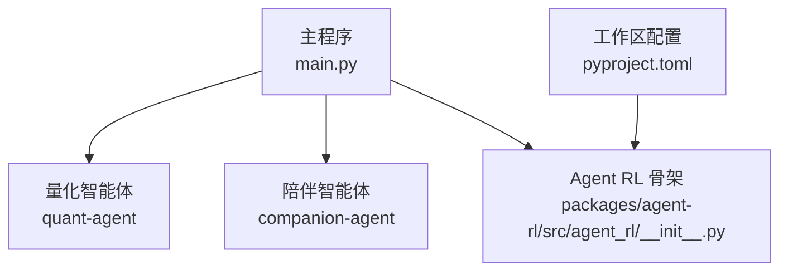
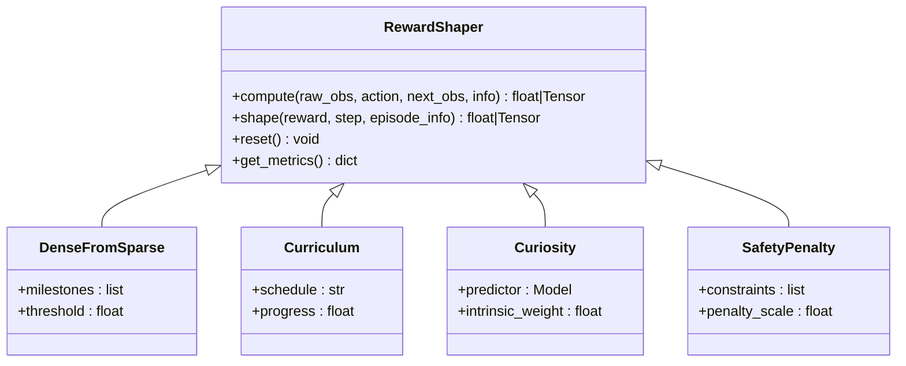
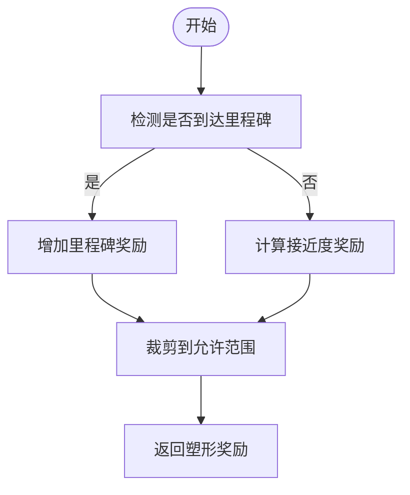
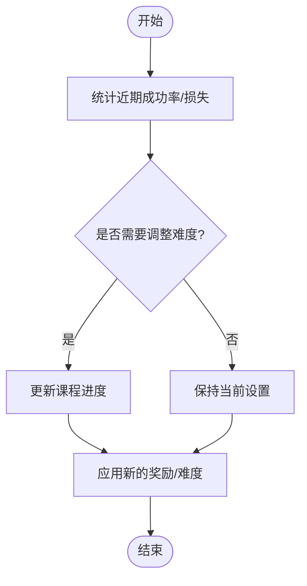
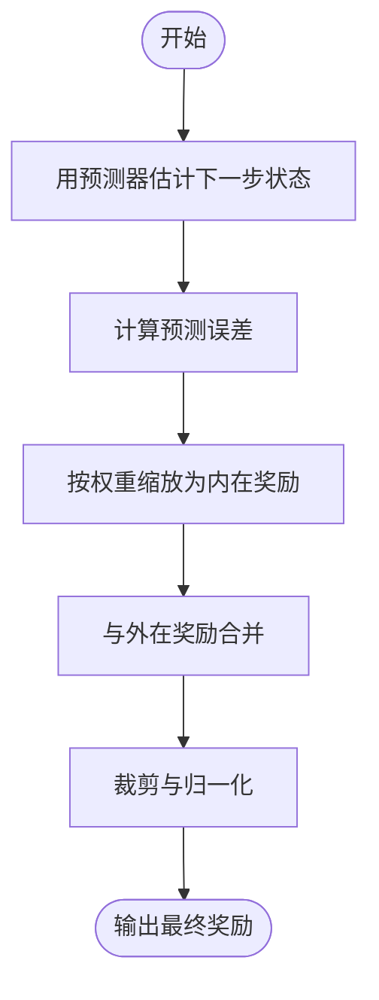
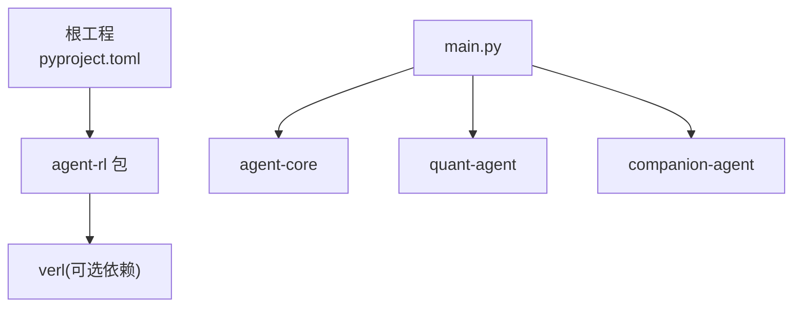

# 奖励塑形 API

<cite>
**本文引用的文件**   
- [main.py](file://main.py)
- [pyproject.toml](file://pyproject.toml)
- [agent_rl/__init__.py](file://packages/agent-rl/src/agent_rl/__init__.py)
- [verl-learning-plan.md](file://docs/plans/verl-learning-plan.md)
</cite>

## 目录
1. [简介](#简介)
2. [项目结构](#项目结构)
3. [核心组件](#核心组件)
4. [架构总览](#架构总览)
5. [详细组件分析](#详细组件分析)
6. [依赖分析](#依赖分析)
7. [性能考虑](#性能考虑)
8. [故障排查指南](#故障排查指南)
9. [结论](#结论)
10. [附录](#附录)

## 简介
本文件为“奖励塑形系统”的 API 与实现指南，聚焦于以下目标：
- 定义 RewardShaper 基类的设计与扩展点，提供自定义奖励函数的开发接口。
- 文档化内置奖励塑形技术：稀疏奖励稠密化、课程学习、好奇心驱动探索等方法的实现要点。
- 明确奖励函数设计规范与安全约束，避免奖励黑客问题。
- 给出多场景下的奖励函数设计模式：任务分解奖励、行为塑造奖励、安全约束奖励等。
- 记录多目标奖励的权重平衡与动态调整策略。
- 说明奖励归一化、裁剪与标准化处理方法。
- 提供奖励函数调试与可视化的工具使用指南。

当前仓库中 agent-rl 包处于骨架阶段，尚未包含具体实现；本文在“实现现状”部分如实标注，并在后续章节给出面向未来的 API 设计与集成建议，以便与 verl 训练框架对接。

## 项目结构
仓库采用 uv workspace 组织多个子包，其中 agent-rl 作为强化学习能力面，目前仅包含最小可运行骨架。顶层 main.py 聚合各子包的入口能力。



图示来源
- [main.py:1-13](file://main.py#L1-L13)
- [pyproject.toml:1-30](file://pyproject.toml#L1-L30)
- [agent_rl/__init__.py:1-15](file://packages/agent-rl/src/agent_rl/__init__.py#L1-L15)

章节来源
- [main.py:1-13](file://main.py#L1-L13)
- [pyproject.toml:1-30](file://pyproject.toml#L1-L30)
- [agent_rl/__init__.py:1-15](file://packages/agent-rl/src/agent_rl/__init__.py#L1-L15)

## 核心组件
- RewardShaper 基类（待实现）
  - 职责：封装奖励计算管线，支持组合式塑形（如稀疏→稠密、课程进度、好奇心内驱、安全惩罚等）。
  - 关键抽象方法（建议）：
    - compute(raw_obs, action, next_obs, info) -> float | Tensor
    - shape(reward, step, episode_info) -> float | Tensor
    - reset() -> None
    - get_metrics() -> dict
  - 扩展点：通过注册表或工厂模式加载不同塑形器，形成链式处理。
- 内置塑形器（规划中）
  - 稀疏奖励稠密化：对阶段性里程碑给予中间奖励，平滑信号。
  - 课程学习：随训练进展逐步放宽难度或引入新维度。
  - 好奇心驱动探索：基于预测误差或信息增益的内生奖励。
- 安全与规范
  - 奖励边界、单调性检查、对抗样本鲁棒性校验。
  - 禁止直接优化代理内部状态或绕过环境约束。
- 多目标与权重
  - 静态加权与动态自适应（如基于方差或不确定性）。
- 数值稳定
  - 归一化（指数移动平均）、裁剪（clip）、标准化（z-score）。
- 调试与可视化
  - 指标采集、分维度贡献拆解、回放与曲线绘制。

章节来源
- [verl-learning-plan.md:283-311](file://docs/plans/verl-learning-plan.md#L283-L311)
- [verl-learning-plan.md:408-489](file://docs/plans/verl-learning-plan.md#L408-L489)

## 架构总览
下图展示未来将如何把 agent-rl 的 RewardShaper 与 verl 的训练循环对接。verl 的训练流程会在 rollout 后调用 reward 模块计算分数，随后进行优势估计与参数更新。

```mermaid
sequenceDiagram
participant Env as "环境"
participant Actor as "Actor(策略)"
participant Rollout as "Rollout 生成"
participant Reward as "RewardShaper"
participant Critic as "Critic(价值)"
participant Trainer as "Trainer(算法)"
Env->>Actor : 观测 obs
Actor-->>Rollout : 动作 action
Rollout->>Env : 执行 action
Env-->>Rollout : 返回 next_obs, 原始奖励 r_raw, info
Rollout->>Reward : compute(r_raw, obs, action, next_obs, info)
Reward-->>Rollout : 塑形后奖励 r
Rollout->>Critic : 计算价值 v
Rollout->>Trainer : 传入 (r, v, log_prob, ...)
Trainer->>Trainer : 计算优势/损失并更新
```

图示来源
- [verl-learning-plan.md:283-311](file://docs/plans/verl-learning-plan.md#L283-L311)

## 详细组件分析

### RewardShaper 基类与扩展点（设计稿）
- 设计原则
  - 单一职责：每个塑形器只负责一种变换（如稀疏→稠密、安全惩罚）。
  - 可组合：以管道方式串联多个塑形器。
  - 可观测：暴露 metrics 便于监控与诊断。
- 接口约定（建议）
  - 输入：原始奖励、观测、动作、下一观测、额外信息。
  - 输出：标量或张量形式的塑形奖励。
  - 生命周期：reset 用于每回合初始化；compute 用于单步；shape 用于整条轨迹后处理。
- 注册与装配
  - 通过命名空间注册塑形器类型，由配置选择并组装。



图示来源
- [verl-learning-plan.md:408-489](file://docs/plans/verl-learning-plan.md#L408-L489)

章节来源
- [verl-learning-plan.md:408-489](file://docs/plans/verl-learning-plan.md#L408-L489)

### 内置塑形技术：实现要点与流程图

#### 稀疏奖励稠密化
- 思路：在稀疏终奖励基础上，依据里程碑或接近度分配中间奖励，提升信号密度。
- 关键点：里程碑阈值、衰减函数、避免过度引导导致次优路径。



图示来源
- [verl-learning-plan.md:283-311](file://docs/plans/verl-learning-plan.md#L283-L311)

#### 课程学习
- 思路：按训练进度或成功率动态调整任务难度或奖励维度。
- 关键点：调度策略（线性/指数/自适应）、评估窗口、回退机制。



图示来源
- [verl-learning-plan.md:283-311](file://docs/plans/verl-learning-plan.md#L283-L311)

#### 好奇心驱动探索
- 思路：利用模型对状态的预测误差或信息增益构造内在奖励，鼓励探索未知区域。
- 关键点：预测器稳定性、内在奖励权重、与外在奖励的融合策略。



图示来源
- [verl-learning-plan.md:283-311](file://docs/plans/verl-learning-plan.md#L283-L311)

### 奖励函数设计规范与安全约束
- 规范性
  - 输入输出类型一致，避免 NaN/Inf。
  - 奖励应与环境真实目标对齐，避免可被轻易操纵的捷径。
- 安全性
  - 限制奖励上界，防止爆炸。
  - 对异常输入做防御性校验。
  - 禁止直接访问或修改受保护的环境状态。
- 可解释性
  - 输出分维度贡献，便于定位问题。

章节来源
- [verl-learning-plan.md:191-211](file://docs/plans/verl-learning-plan.md#L191-L211)

### 多场景奖励函数设计模式
- 任务分解奖励：将大目标拆分为子目标，逐层奖励推进。
- 行为塑造奖励：对中间行为给予小步反馈，加速收敛。
- 安全约束奖励：对越界或违规动作施加惩罚，保障合规。

[本节为概念性内容，不直接分析具体文件]

### 多目标奖励的权重平衡与动态调整
- 静态加权：根据先验重要性设定固定权重。
- 动态自适应：基于方差、不确定性或成功率自动调节权重。
- 正则项：加入 KL 或熵正则，防止策略退化。

章节来源
- [verl-learning-plan.md:191-211](file://docs/plans/verl-learning-plan.md#L191-L211)

### 奖励归一化、裁剪与标准化
- 归一化：指数移动平均或滚动窗口均值/方差。
- 裁剪：将奖励限制在合理区间，抑制异常值影响。
- 标准化：z-score 标准化，提高训练稳定性。

章节来源
- [verl-learning-plan.md:191-211](file://docs/plans/verl-learning-plan.md#L191-L211)

### 调试与可视化
- 指标采集：记录 val/test_score、pg_loss、vf_loss、entropy、KL 惩罚、响应长度、奖励均值等。
- 可视化：绘制奖励曲线、分维度贡献、策略熵变化。
- 回放：保存轨迹片段，结合可视化定位问题。

章节来源
- [verl-learning-plan.md:191-211](file://docs/plans/verl-learning-plan.md#L191-L211)

## 依赖分析
- 工作区与包关系
  - pyproject.toml 声明了 agent-rl 为工作区成员，并被主工程依赖。
  - agent-rl 当前无外部依赖，预留可选依赖位置以接入 verl。
- 与 verl 的集成方向
  - 将 verl 及其依赖设为可选依赖，按需启用。
  - 通过命令行封装或模块导入两种方式对接训练流程。



图示来源
- [pyproject.toml:1-30](file://pyproject.toml#L1-L30)
- [main.py:1-13](file://main.py#L1-L13)

章节来源
- [pyproject.toml:1-30](file://pyproject.toml#L1-L30)
- [main.py:1-13](file://main.py#L1-L13)

## 性能考虑
- 奖励计算应尽量向量化，减少 Python 循环开销。
- 对高维状态的好奇心预测器可采用轻量网络或缓存机制。
- 奖励归一化与裁剪应在 GPU 上批量执行，避免频繁主机-设备拷贝。
- 与 verl 的 rollout 和 critic 并行时，注意内存占用与通信开销。

[本节为通用指导，不直接分析具体文件]

## 故障排查指南
- 常见问题
  - NaN/Inf 奖励：检查裁剪与归一化逻辑，确认输入合法性。
  - 训练不稳定：降低学习率、调整 KL 系数或奖励权重。
  - 内存不足：减小 micro batch size 或使用 LoRA 方案。
- 定位方法
  - 查看关键指标：val/test_score、actor/pg_loss、critic/vf_loss、actor/entropy_loss、actor/reward_kl_penalty、response_length/mean、critic/rewards/mean。
  - 分段打印：在 RewardShaper 的各阶段输出中间值，定位异常来源。

章节来源
- [verl-learning-plan.md:191-211](file://docs/plans/verl-learning-plan.md#L191-L211)

## 结论
当前 agent-rl 包处于骨架阶段，尚未包含 RewardShaper 的具体实现。本文给出了面向未来的 API 设计、内置塑形技术要点、安全规范、多目标策略与数值稳定方法，以及与 verl 训练循环的对接建议。建议在后续迭代中优先完成 RewardShaper 基类与稀疏→稠密、课程学习、好奇心驱动等基础塑形器的实现，并配套指标采集与可视化能力，确保可观测与可维护。

[本节为总结性内容，不直接分析具体文件]

## 附录
- 与 verl 的对接步骤（参考计划）
  - 添加可选依赖：verl、vLLM、ray、torch。
  - 封装训练入口：将命令行参数映射为 Python API。
  - 编写自定义奖励函数：参考 verl/utils/reward_score 的规则奖励实现风格。

章节来源
- [verl-learning-plan.md:408-489](file://docs/plans/verl-learning-plan.md#L408-L489)