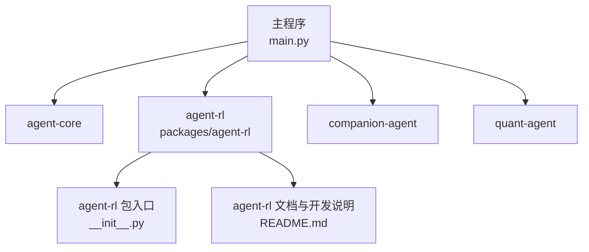
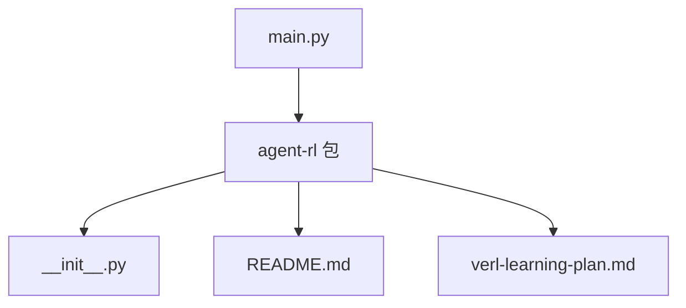
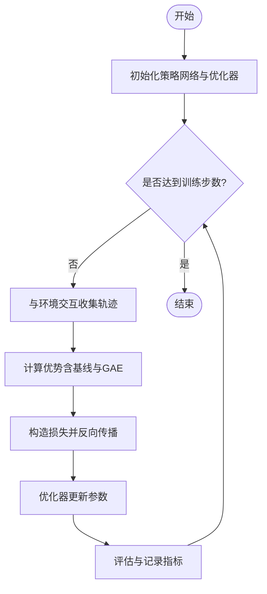

# 策略梯度算法

<cite>
**本文引用的文件**   
- [main.py](file://main.py)
- [agent-rl/README.md](file://packages/agent-rl/README.md)
- [agent-rl/__init__.py](file://packages/agent-rl/src/agent_rl/__init__.py)
- [verl-learning-plan.md](file://docs/plans/verl-learning-plan.md)
</cite>

## 目录
1. [简介](#简介)
2. [项目结构](#项目结构)
3. [核心组件](#核心组件)
4. [架构总览](#架构总览)
5. [详细组件分析](#详细组件分析)
6. [依赖分析](#依赖分析)
7. [性能考虑](#性能考虑)
8. [故障排查指南](#故障排查指南)
9. [结论](#结论)
10. [附录](#附录)

## 简介
本文件面向希望在 JanusAgent 的 agent-rl 包中实现与使用策略梯度（Policy Gradient）算法的读者，提供从数学原理到工程实现的系统化说明。重点包括：
- 策略梯度的数学基础与 REINFORCE 的核心思想
- PolicyGradientAgent 类的 API 设计、策略网络架构与梯度计算方式
- 关键超参数配置指南（学习率、折扣因子、基线函数等）
- 连续动作空间与离散动作空间的差异化实现方案
- CartPole、MountainCar 等标准环境的训练示例指引
- 策略网络的初始化、损失函数设计与优化器选择建议
- 策略可视化与分析工具的使用说明

## 项目结构
当前仓库采用多包组织，agent-rl 作为强化学习子包，负责环境交互、策略优化、奖励建模与模型部署能力。顶层 main.py 用于聚合各子包的入口。



图示来源
- [main.py:1-13](file://main.py#L1-L13)
- [agent-rl/__init__.py:1-14](file://packages/agent-rl/src/agent_rl/__init__.py#L1-L14)
- [agent-rl/README.md:1-15](file://packages/agent-rl/README.md#L1-L15)

章节来源
- [main.py:1-13](file://main.py#L1-L13)
- [agent-rl/README.md:1-15](file://packages/agent-rl/README.md#L1-L15)
- [agent-rl/__init__.py:1-14](file://packages/agent-rl/src/agent_rl/__init__.py#L1-L14)

## 核心组件
- PolicyGradientAgent：封装策略梯度智能体的生命周期，包括与环境交互、轨迹收集、优势估计、策略更新与评估。
- 策略网络：根据状态输入输出动作分布（离散或连续），支持可插拔的网络结构与初始化策略。
- 损失函数：基于 REINFORCE 的对数似然加权奖励形式，可选基线以降低方差。
- 优化器：默认使用 Adam 类优化器，支持学习率调度与梯度裁剪。
- 经验回放与轨迹管理：按 episode 收集 (s, a, r, s') 序列，并计算折扣累积回报与优势。
- 评估与可视化：记录回合长度、累计奖励、策略熵、价值误差等指标，并提供绘图接口。

章节来源
- [agent-rl/README.md:1-15](file://packages/agent-rl/README.md#L1-L15)
- [agent-rl/__init__.py:1-14](file://packages/agent-rl/src/agent_rl/__init__.py#L1-L14)

## 架构总览
下图展示策略梯度训练的整体流程：智能体与环境交互生成轨迹，计算优势与损失，执行反向传播更新策略网络，并进行周期性的评估与保存。

```mermaid
sequenceDiagram
participant Env as "环境"
participant Agent as "PolicyGradientAgent"
participant Net as "策略网络"
participant Opt as "优化器"
participant Log as "日志/可视化"
loop 每个训练步
Env->>Agent : 观测 s_t
Agent->>Net : 前向推理得到动作分布 π(·|s_t)
Net-->>Agent : 动作 a_t 及 log_prob
Agent->>Env : 执行 a_t
Env-->>Agent : 奖励 r_t, 终止标志 done
Agent->>Agent : 收集轨迹并计算优势 A_t
Agent->>Agent : 构造损失 L = -E[log_prob * A]
Agent->>Opt : 反向传播更新参数
Opt-->>Agent : 新参数
Agent->>Log : 记录指标并可视化
end
```

图示来源
- [verl-learning-plan.md:283-311](file://docs/plans/verl-learning-plan.md#L283-L311)

## 详细组件分析

### 数学原理与 REINFORCE 核心思想
- 目标函数：最大化期望累积回报 J(θ) = E_π[Σ γ^t r_t]。
- 策略梯度定理：∇_θ J(θ) = E_π[∇_θ log π(a|s) · A(s,a)]，其中 A(s,a) 为优势函数。
- REINFORCE：使用蒙特卡洛采样近似期望，用单条轨迹的折扣累积回报 R_t 或其变体（如基线 b(s)）作为优势估计。
- 方差控制：引入基线（如状态价值 V(s)）降低梯度方差；可使用广义优势估计（GAE）进一步稳定训练。

章节来源
- [verl-learning-plan.md:283-311](file://docs/plans/verl-learning-plan.md#L283-L311)

### PolicyGradientAgent 类 API 设计
- 初始化
  - 参数：策略网络实例、优化器配置、折扣因子 γ、学习率 α、基线类型（无/均值/V(s)）、GAE 参数 λ、轨迹长度上限、随机种子等。
  - 行为：注册环境、准备日志记录器、初始化策略网络权重。
- 训练循环
  - 方法：train_episode()、train_batch()、update_policy()。
  - 流程：与环境交互生成轨迹 → 计算优势 → 构建损失 → 反向传播 → 更新参数 → 记录指标。
- 评估与保存
  - 方法：evaluate()、save_checkpoint()、load_checkpoint()。
  - 行为：在固定策略下运行若干回合，统计平均回报与方差，保存/加载检查点。
- 可视化
  - 方法：plot_reward_curve()、plot_entropy()、plot_action_distribution()。
  - 行为：将历史指标绘制为曲线或分布图，便于诊断训练稳定性。

章节来源
- [agent-rl/README.md:1-15](file://packages/agent-rl/README.md#L1-L15)
- [agent-rl/__init__.py:1-14](file://packages/agent-rl/src/agent_rl/__init__.py#L1-L14)

### 策略网络架构设计
- 离散动作空间
  - 输出层：softmax 分类头，维度等于动作数。
  - 隐藏层：多层全连接或卷积（视状态维度而定），激活函数常用 ReLU。
- 连续动作空间
  - 输出层：高斯分布参数（均值 μ 与方差 σ^2），或使用双头网络分别预测均值与方差。
  - 约束：确保方差为正，必要时对 σ 进行指数变换。
- 初始化
  - 权重：Xavier/Glorot 或 He 初始化。
  - 偏置：初始化为零或小常数。
  - 数值稳定：在 softmax 与 log 计算中加入小常数防止溢出。

章节来源
- [verl-learning-plan.md:283-311](file://docs/plans/verl-learning-plan.md#L283-L311)

### 梯度计算方法与损失函数
- 损失函数
  - REINFORCE 损失：L = -Σ log π(a_t|s_t) · A_t。
  - 基线：A_t = R_t - V(s_t)，其中 R_t 为折扣累积回报。
  - 正则项：可选策略熵正则以鼓励探索。
- 梯度计算
  - 通过自动微分框架计算 ∇_θ L，并使用优化器执行参数更新。
  - 梯度裁剪：限制梯度范数以增强稳定性。
- 优势估计
  - 简单蒙特卡洛：R_t。
  - GAE：结合 β 与 γ 平滑优势估计，降低方差并保持偏差可控。

章节来源
- [verl-learning-plan.md:283-311](file://docs/plans/verl-learning-plan.md#L283-L311)

### 关键参数配置指南
- 学习率 α
  - 建议范围：1e-4 ~ 1e-3（离散），1e-4 ~ 5e-4（连续）。
  - 调度：余弦退火或阶梯衰减，配合早停机制。
- 折扣因子 γ
  - 短视任务：0.9 ~ 0.95。
  - 长视任务：0.99 ~ 0.999。
- 基线函数
  - 无基线：简单但方差大。
  - 均值基线：减去滚动平均奖励。
  - 价值基线：训练 V(s) 网络，使用 TD 残差或 GAE。
- GAE 参数 λ
  - 0.9 ~ 0.95 常见，λ=0 退化为蒙特卡洛。
- 轨迹长度与批大小
  - 轨迹长度受环境最大步数限制；批大小影响梯度估计稳定性与内存占用。
- 随机种子
  - 固定种子以保证实验可复现性。

章节来源
- [verl-learning-plan.md:283-311](file://docs/plans/verl-learning-plan.md#L283-L311)

### 连续动作空间与离散动作空间实现差异
- 离散动作空间
  - 策略输出：类别概率分布。
  - 采样：Categorical 分布采样。
  - 评估：准确率、动作频率分布。
- 连续动作空间
  - 策略输出：高斯分布参数。
  - 采样：Normal 分布采样，必要时截断至合法区间。
  - 评估：动作幅度、方差变化、约束违反次数。

章节来源
- [verl-learning-plan.md:283-311](file://docs/plans/verl-learning-plan.md#L283-L311)

### 标准环境训练示例指引
- CartPole（离散动作）
  - 目标：保持杆直立更长时间。
  - 要点：较短视界，γ≈0.99，α≈1e-3，基线可用均值或 V(s)。
- MountainCar（连续/离散均可）
  - 目标：到达山顶。
  - 要点：稀疏奖励，需适当奖励塑形或引入时间惩罚；GAE 有助于稳定。

章节来源
- [verl-learning-plan.md:283-311](file://docs/plans/verl-learning-plan.md#L283-L311)

### 策略可视化与分析工具
- 指标曲线
  - 累计奖励随回合的变化，观察收敛趋势。
  - 策略熵随回合的变化，判断探索程度。
- 动作分布
  - 离散：各动作被选择的概率直方图。
  - 连续：均值与方差随状态的演化。
- 价值拟合
  - 预测值与真实回报的散点图，评估基线质量。

章节来源
- [verl-learning-plan.md:283-311](file://docs/plans/verl-learning-plan.md#L283-L311)

## 依赖分析
- 顶层入口 main.py 聚合多个子包，agent-rl 作为 RL 能力提供者。
- agent-rl 包通过 __init__.py 暴露版本与基本入口函数，README.md 提供开发与运行说明。
- verl 学习计划文档展示了 PPO 训练循环概念流程，可作为策略梯度训练的参考范式。



图示来源
- [main.py:1-13](file://main.py#L1-L13)
- [agent-rl/__init__.py:1-14](file://packages/agent-rl/src/agent_rl/__init__.py#L1-L14)
- [agent-rl/README.md:1-15](file://packages/agent-rl/README.md#L1-L15)
- [verl-learning-plan.md:283-311](file://docs/plans/verl-learning-plan.md#L283-L311)

章节来源
- [main.py:1-13](file://main.py#L1-L13)
- [agent-rl/__init__.py:1-14](file://packages/agent-rl/src/agent_rl/__init__.py#L1-L14)
- [agent-rl/README.md:1-15](file://packages/agent-rl/README.md#L1-L15)
- [verl-learning-plan.md:283-311](file://docs/plans/verl-learning-plan.md#L283-L311)

## 性能考虑
- 数值稳定性
  - 在 log_softmax 与 log_prob 计算中使用数值稳定实现。
  - 对高斯方差进行正约束，避免 NaN。
- 梯度裁剪与学习率调度
  - 设置合理的梯度范数上限，配合学习率衰减提升收敛稳定性。
- 优势估计与方差控制
  - 使用 GAE 与价值基线降低方差，提高样本效率。
- 批处理与并行
  - 增加批大小以提升梯度估计稳定性，注意内存占用。
- 监控与早停
  - 监控奖励与熵的滑动平均，达到阈值后提前停止以避免过拟合。

## 故障排查指南
- 训练不收敛或震荡
  - 检查学习率是否过高；尝试减小 α 或启用学习率调度。
  - 启用梯度裁剪，限制梯度范数。
- 策略熵过低或过高
  - 熵过低：减少熵正则系数或增大探索噪声。
  - 熵过高：增加熵正则系数或调整动作空间约束。
- 价值基线不稳定
  - 降低 V(s) 的学习率，或使用更稳定的 TD 目标与 GAE。
- 稀疏奖励导致进展缓慢
  - 引入时间惩罚或阶段性奖励塑形，缩短有效视界。
- 数值异常（NaN/Inf）
  - 检查 log_prob 与方差计算；添加小常数保护。

章节来源
- [verl-learning-plan.md:283-311](file://docs/plans/verl-learning-plan.md#L283-L311)

## 结论
策略梯度算法通过直接优化期望回报的目标函数，提供了灵活且强大的强化学习方法。REINFORCE 作为最基础的策略梯度实现，结合基线与 GAE 能显著提升稳定性与样本效率。在 agent-rl 包中，PolicyGradientAgent 应围绕“交互—估计—更新—评估”的主循环进行设计，并为离散与连续动作空间提供一致的 API。通过合理的超参数配置、数值稳定技巧与可视化分析，可在 CartPole、MountainCar 等标准环境中快速验证与迭代。

## 附录
- 术语表
  - 策略 π：从状态到动作分布的映射。
  - 优势 A(s,a)：衡量动作相对平均水平的优劣。
  - 折扣因子 γ：对未来奖励的折现程度。
  - GAE：广义优势估计，平衡偏差与方差。
- 参考流程图（概念）
