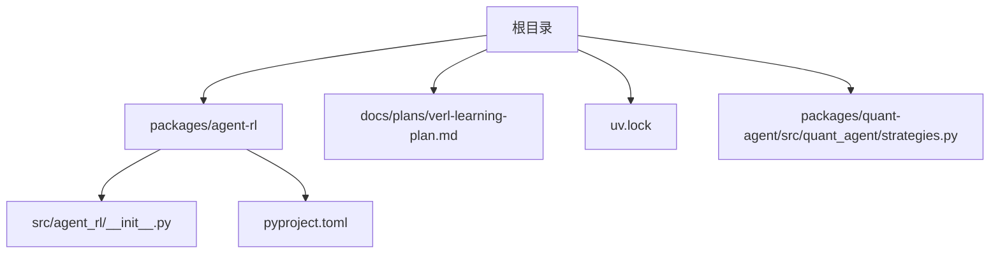
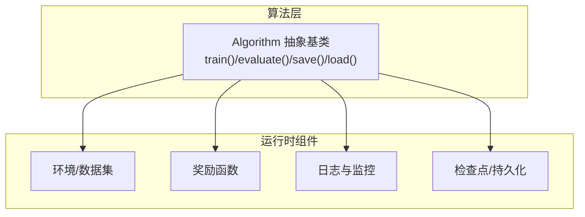
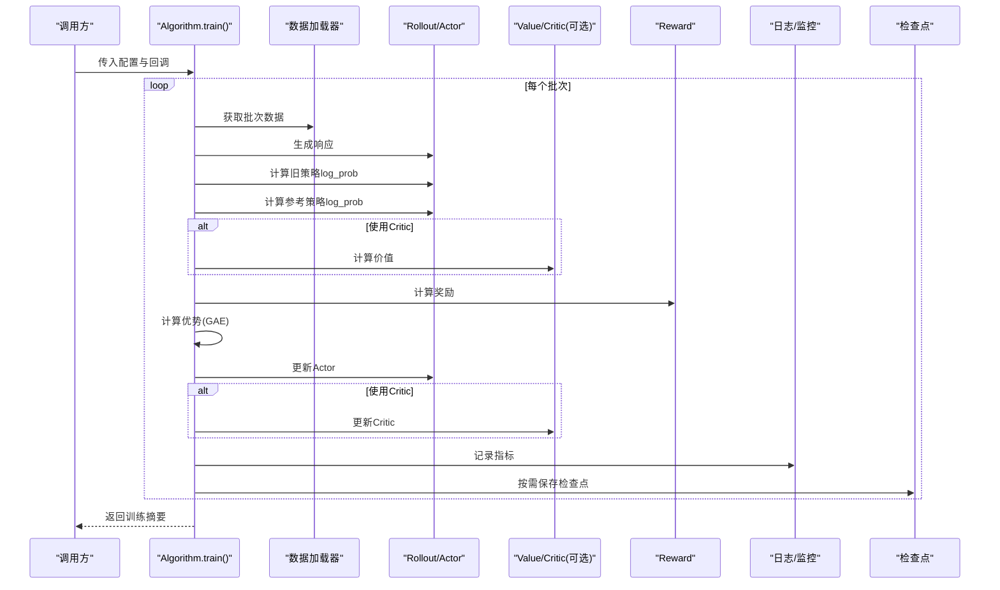
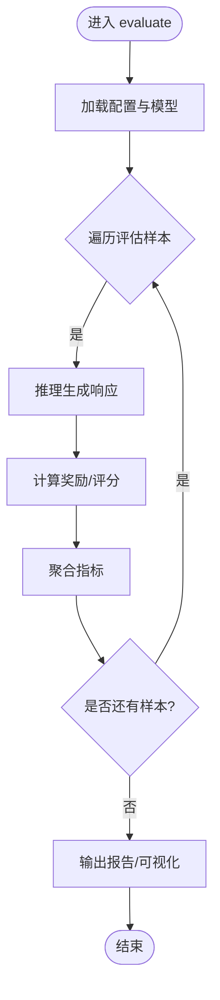
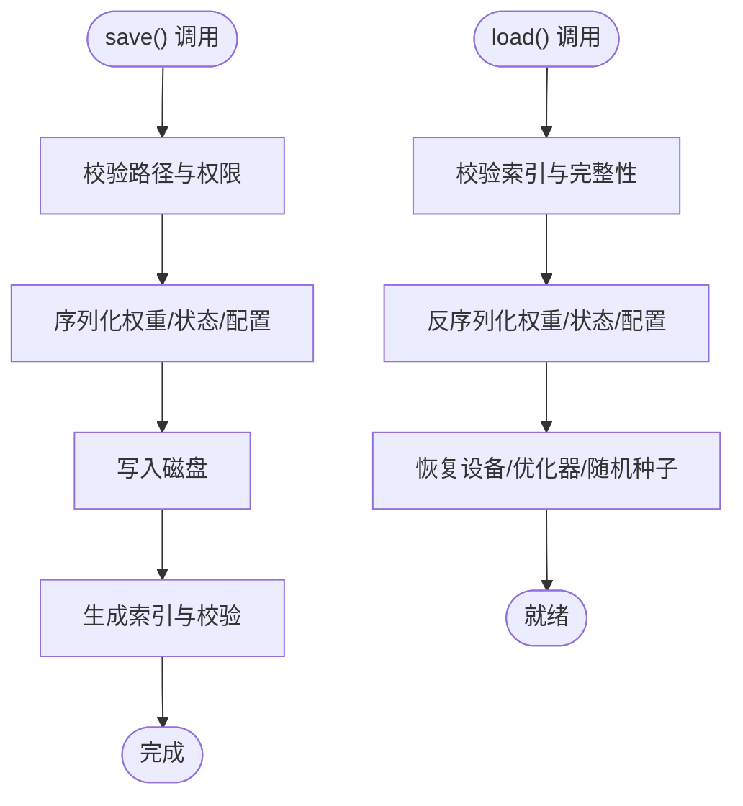
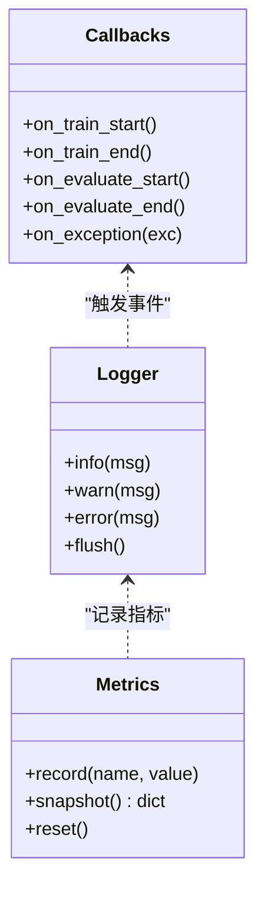
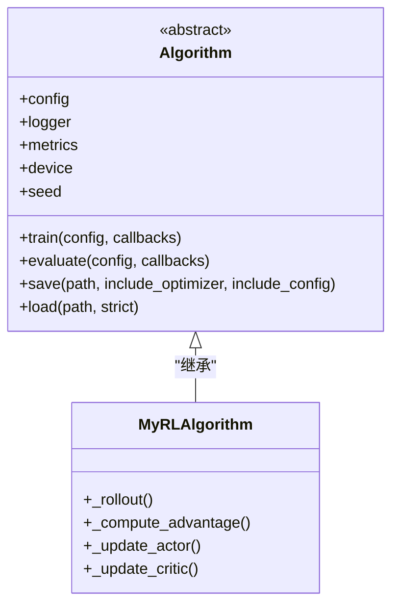
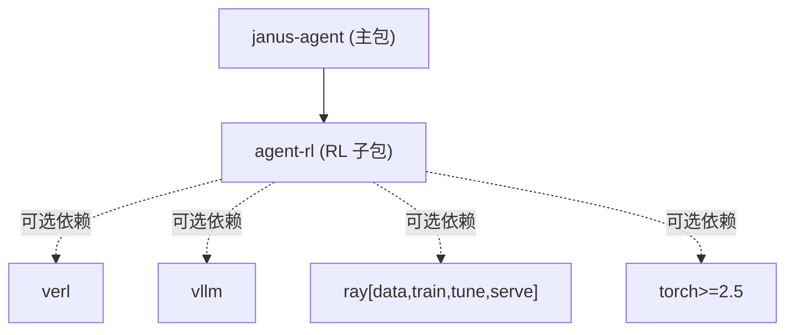

# 算法基类设计

<cite>
**本文引用的文件**   
- [packages/agent-rl/src/agent_rl/__init__.py](file://packages/agent-rl/src/agent_rl/__init__.py)
- [packages/agent-rl/pyproject.toml](file://packages/agent-rl/pyproject.toml)
- [uv.lock](file://uv.lock)
- [docs/plans/verl-learning-plan.md](file://docs/plans/verl-learning-plan.md)
- [packages/quant-agent/src/quant_agent/strategies.py](file://packages/quant-agent/src/quant_agent/strategies.py)
</cite>

## 目录
1. [简介](#简介)
2. [项目结构](#项目结构)
3. [核心组件](#核心组件)
4. [架构总览](#架构总览)
5. [详细组件分析](#详细组件分析)
6. [依赖分析](#依赖分析)
7. [性能考虑](#性能考虑)
8. [故障排查指南](#故障排查指南)
9. [结论](#结论)
10. [附录](#附录)

## 简介
本文件面向“强化学习算法基类”的设计与 API 规范，目标是定义一个统一的 Algorithm 抽象基类，提供训练循环管理、评估框架、模型持久化机制、日志记录与监控接口等通用能力，并明确继承规范与子类实现要求。同时给出基于该基类的自定义算法开发示例与错误处理、调试工具使用指南。

需要特别说明的是：当前仓库中尚未包含实际的 Algorithm 基类源码；本节文档在严格遵循“不臆造代码”的前提下，结合现有工程上下文（如 verl 学习计划、量化策略基类等）进行规范化设计与说明，便于后续落地实现。

## 项目结构
仓库采用多包组织方式，agent-rl 作为强化学习子包，目前处于初始化阶段，仅包含包入口与元数据配置。

图示来源
- [packages/agent-rl/src/agent_rl/__init__.py:1-15](file://packages/agent-rl/src/agent_rl/__init__.py#L1-L15)
- [packages/agent-rl/pyproject.toml:1-17](file://packages/agent-rl/pyproject.toml#L1-L17)
- [uv.lock:2158-2195](file://uv.lock#L2158-L2195)
- [docs/plans/verl-learning-plan.md:1-20](file://docs/plans/verl-learning-plan.md#L1-L20)
- [packages/quant-agent/src/quant_agent/strategies.py:1-13](file://packages/quant-agent/src/quant_agent/strategies.py#L1-L13)

章节来源
- [packages/agent-rl/src/agent_rl/__init__.py:1-15](file://packages/agent-rl/src/agent_rl/__init__.py#L1-L15)
- [packages/agent-rl/pyproject.toml:1-17](file://packages/agent-rl/pyproject.toml#L1-L17)
- [uv.lock:2158-2195](file://uv.lock#L2158-L2195)

## 核心组件
本节定义 Algorithm 抽象基类的职责边界与公共能力，确保不同 RL 算法（PPO、GRPO、DAPO 等）具备一致的训练、评估、保存/加载、日志与监控接口。

- 统一训练循环管理
  - 负责批次迭代、Rollout、优势估计、策略更新、价值函数更新（若适用）、KL 控制、早停与检查点保存等流程编排。
- 评估框架
  - 提供离线/在线评估入口，支持指标聚合、结果输出与可视化对接。
- 模型持久化机制
  - 统一保存/加载权重、优化器状态、随机种子、配置快照与实验元信息。
- 日志记录与监控
  - 结构化日志、指标上报（控制台/W&B/MLflow 等）、事件钩子（开始/结束/异常）。
- 配置与可复现性
  - 标准化配置对象、随机种子设置、设备与并行参数管理。
- 扩展点
  - 奖励函数注册、采样策略、损失计算、统计量收集、回调机制。

章节来源
- [docs/plans/verl-learning-plan.md:283-311](file://docs/plans/verl-learning-plan.md#L283-L311)
- [docs/plans/verl-learning-plan.md:452-489](file://docs/plans/verl-learning-plan.md#L452-L489)

## 架构总览
下图展示 Algorithm 基类与典型外部组件的交互关系：环境/数据集、奖励模块、日志与监控后端、持久化存储。

图示来源
- [docs/plans/verl-learning-plan.md:283-311](file://docs/plans/verl-learning-plan.md#L283-L311)
- [docs/plans/verl-learning-plan.md:452-489](file://docs/plans/verl-learning-plan.md#L452-L489)

## 详细组件分析

### Algorithm 抽象基类 API 规范
- 必需方法
  - train(config, callbacks=None): 执行完整训练流程，返回训练摘要或指标。
  - evaluate(config, callbacks=None): 执行评估流程，返回评估指标字典。
  - save(path, include_optimizer=True, include_config=True): 将模型与必要状态持久化到指定路径。
  - load(path, strict=False): 从指定路径恢复模型与可选状态。
- 推荐属性
  - config: 训练/评估配置对象。
  - logger: 日志记录器实例。
  - metrics: 指标收集器实例。
  - device: 运行设备标识。
  - seed: 随机种子。
- 可选钩子
  - on_train_start/on_train_end
  - on_evaluate_start/on_evaluate_end
  - on_step/before_update/after_update
  - on_save/on_load
- 错误与异常
  - 定义明确的异常类型（见“错误处理与异常类型”小节），并在关键步骤抛出语义化异常。

章节来源
- [docs/plans/verl-learning-plan.md:283-311](file://docs/plans/verl-learning-plan.md#L283-L311)
- [docs/plans/verl-learning-plan.md:452-489](file://docs/plans/verl-learning-plan.md#L452-L489)

### 训练循环管理（参考 PPO 流程）
- 输入：批处理数据（prompt、可选标签/答案等）
- 步骤概览
  - Rollout：生成响应序列
  - 计算旧策略 log_prob 与参考策略 log_prob
  - 计算价值函数值（Critic，若适用）
  - 计算奖励
  - 计算优势（如 GAE）
  - 更新 Actor（如 PPO clip）
  - 更新 Critic（如适用）
  - 记录指标与保存检查点（按频率）
- 输出：训练指标、检查点、日志

图示来源
- [docs/plans/verl-learning-plan.md:283-311](file://docs/plans/verl-learning-plan.md#L283-L311)

章节来源
- [docs/plans/verl-learning-plan.md:283-311](file://docs/plans/verl-learning-plan.md#L283-L311)

### 评估框架
- 目标：稳定度量策略质量，支持离线验证集与在线回放。
- 关键流程
  - 加载配置与模型权重
  - 遍历验证集/回放缓冲区
  - 执行推理与奖励计算
  - 聚合指标（准确率、平均奖励、分布统计等）
  - 输出报告与可视化

[此图为概念流程图，无需图示来源]

章节来源
- [docs/plans/verl-learning-plan.md:452-489](file://docs/plans/verl-learning-plan.md#L452-L489)

### 模型持久化机制
- 保存内容
  - 模型权重、优化器状态（可选）、配置快照、随机种子、时间戳与元信息
- 保存格式
  - 建议以目录形式组织，包含权重文件、配置文件、索引与校验信息
- 加载策略
  - 严格模式与非严格模式，支持部分加载与迁移

[此图为概念流程图，无需图示来源]

章节来源
- [docs/plans/verl-learning-plan.md:452-489](file://docs/plans/verl-learning-plan.md#L452-L489)

### 日志记录与监控接口
- 结构化日志：训练/评估事件、超参、中间指标
- 指标上报：控制台、W&B、MLflow 等后端
- 事件钩子：开始/结束/异常时触发回调

[此图为概念类图，无需图示来源]

章节来源
- [docs/plans/verl-learning-plan.md:283-311](file://docs/plans/verl-learning-plan.md#L283-L311)

### 继承规范与子类实现要求
- 必须实现的抽象方法
  - train()、evaluate()、save()、load()
- 必须提供的属性
  - config、logger、metrics、device、seed
- 推荐实现
  - 自定义损失计算、奖励函数注册、统计量收集、回调逻辑
- 命名与约定
  - 配置对象使用 dataclass 或等价结构，字段具默认值与类型提示
  - 异常类型清晰、错误消息包含上下文

章节来源
- [packages/quant-agent/src/quant_agent/strategies.py:1-13](file://packages/quant-agent/src/quant_agent/strategies.py#L1-L13)
- [docs/plans/verl-learning-plan.md:452-489](file://docs/plans/verl-learning-plan.md#L452-L489)

### 自定义算法开发示例（基于基类）
- 步骤
  - 定义算法配置类（含算法名、模型、数据路径、批大小、长度限制、GPU 数量、输出目录等）
  - 继承 Algorithm 基类，实现 train()/evaluate()/save()/load()
  - 集成奖励函数与日志/监控后端
  - 通过命令行或 Python API 启动训练
- 参考
  - 训练入口封装与配置结构可参考计划文档中的 VerlTrainer 示例思路

图示来源
- [docs/plans/verl-learning-plan.md:452-489](file://docs/plans/verl-learning-plan.md#L452-L489)

章节来源
- [docs/plans/verl-learning-plan.md:452-489](file://docs/plans/verl-learning-plan.md#L452-L489)

## 依赖分析
- agent-rl 包当前无运行时依赖声明，可通过可选依赖引入 verl、vLLM、ray、torch 等组件。
- uv.lock 显示 janus-agent 主包依赖 agent-rl，表明未来可在主工程中启用 RL 能力。

图示来源
- [packages/agent-rl/pyproject.toml:1-17](file://packages/agent-rl/pyproject.toml#L1-L17)
- [uv.lock:2158-2195](file://uv.lock#L2158-L2195)

章节来源
- [packages/agent-rl/pyproject.toml:1-17](file://packages/agent-rl/pyproject.toml#L1-L17)
- [uv.lock:2158-2195](file://uv.lock#L2158-L2195)

## 性能考虑
- 显存与吞吐
  - 调整微批次大小、张量并行度、GPU 内存利用率
  - 使用 LoRA/QLoRA 降低显存占用
- 数值稳定性
  - 合理设置 KL 系数与裁剪阈值，避免 NaN loss
- 分布式与并行
  - 利用 Ray 集群与 FSDP 提升训练效率
- 数据管线
  - 预取与缓存减少 I/O 瓶颈

章节来源
- [docs/plans/verl-learning-plan.md:384-396](file://docs/plans/verl-learning-plan.md#L384-L396)
- [docs/plans/verl-learning-plan.md:507-512](file://docs/plans/verl-learning-plan.md#L507-L512)

## 故障排查指南
- 常见问题
  - GPU 显存不足：减小模型规模、降低微批次与内存利用率，或切换 LoRA RL
  - NaN loss：检查学习率与 KL 系数，确认梯度裁剪与数值稳定技巧
- 定位手段
  - 开启详细日志与指标上报，定位异常步
  - 使用断点与最小复现实例隔离问题
  - 对比不同超参组合的收敛曲线

章节来源
- [docs/plans/verl-learning-plan.md:507-512](file://docs/plans/verl-learning-plan.md#L507-L512)

## 结论
本文定义了 Algorithm 抽象基类的职责边界与 API 规范，涵盖训练循环、评估、持久化、日志与监控等通用能力，并给出继承规范、自定义算法开发示例与性能调优、故障排查建议。尽管当前仓库尚未实现具体基类源码，但上述设计可直接指导后续落地，并与 verl 生态无缝衔接。

## 附录
- 术语
  - Rollout：策略与环境交互生成轨迹
  - Advantage：优势函数，衡量动作相对基准的改进程度
  - GAE：广义优势估计，平衡偏差与方差
- 参考
  - verl 官方文档与论文链接见学习计划文档