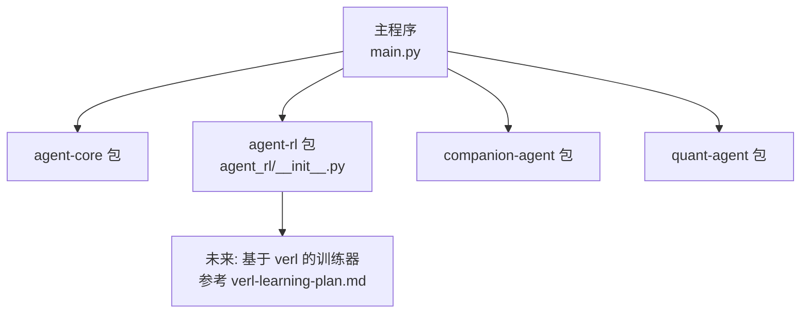
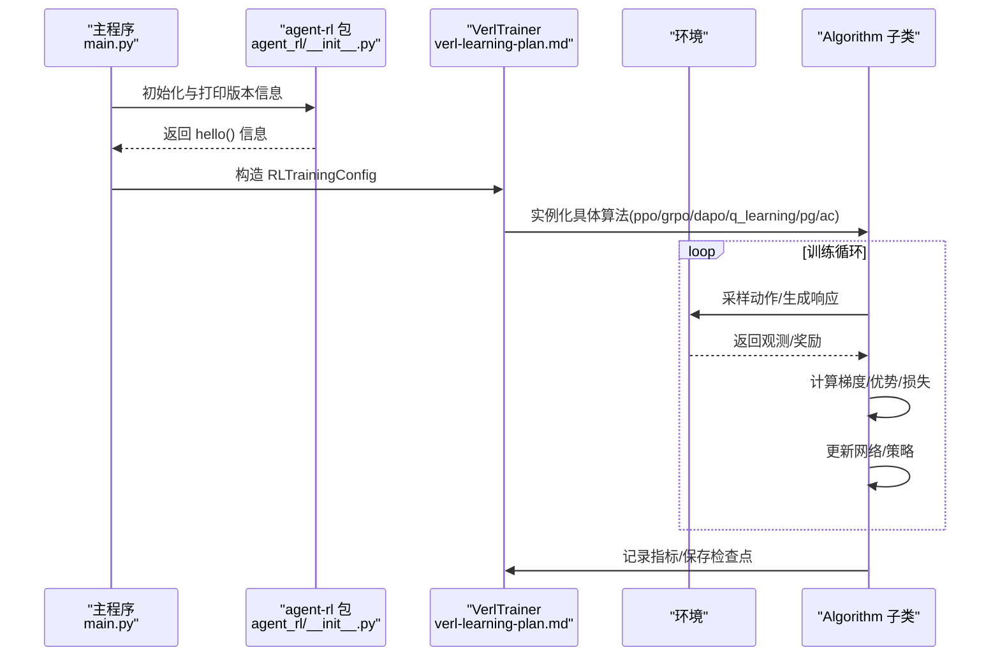
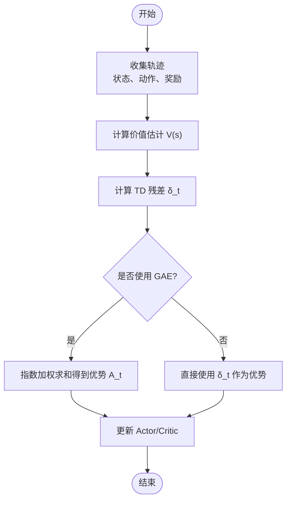
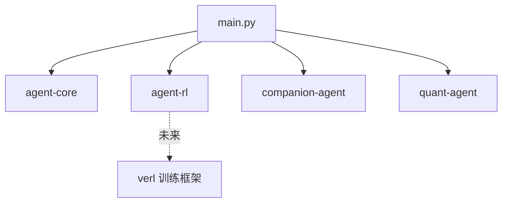

# 算法实现 API

<cite>
**本文引用的文件**   
- [main.py](file://main.py)
- [agent_rl/__init__.py](file://packages/agent-rl/src/agent_rl/__init__.py)
- [verl-learning-plan.md](file://docs/plans/verl-learning-plan.md)
</cite>

## 目录
1. [简介](#简介)
2. [项目结构](#项目结构)
3. [核心组件](#核心组件)
4. [架构总览](#架构总览)
5. [详细组件分析](#详细组件分析)
6. [依赖分析](#依赖分析)
7. [性能考虑](#性能考虑)
8. [故障排查指南](#故障排查指南)
9. [结论](#结论)
10. [附录](#附录)

## 简介
本文件为“强化学习算法实现”的完整 API 文档，面向希望在 JanusAgent 中集成与使用 RL 算法的开发者。当前仓库处于早期阶段：agent-rl 包已创建并暴露最小入口，RL 训练能力计划通过引入 verl（HybridFlow）框架来实现。本文档将：
- 定义 Algorithm 基类的抽象接口设计（train、evaluate、save/load）。
- 文档化 Q-Learning、Policy Gradient、Actor-Critic 的核心更新规则与策略要点。
- 给出超参数配置项与调优建议。
- 提供在相同环境下的性能对比维度与使用场景建议。
- 给出算法选择与配置的示例代码路径（以源码位置引用代替具体代码内容）。

## 项目结构
仓库采用多包组织方式，agent-rl 作为独立的 Python 包存在，负责封装 RL 训练与推理能力；主程序 main.py 聚合多个子包并提供统一入口。

图示来源
- [main.py:1-13](file://main.py#L1-L13)
- [agent_rl/__init__.py:1-15](file://packages/agent-rl/src/agent_rl/__init__.py#L1-L15)

章节来源
- [main.py:1-13](file://main.py#L1-L13)
- [agent_rl/__init__.py:1-15](file://packages/agent-rl/src/agent_rl/__init__.py#L1-L15)

## 核心组件
本节定义 Agent RL 的统一抽象层，以便后续接入多种算法（Q-Learning、Policy Gradient、Actor-Critic 等），并与 verl 训练管线对接。

- 抽象类 Algorithm
  - train(env, config): 执行训练循环，返回训练日志或指标摘要。
  - evaluate(env, config): 在验证/测试集上评估策略，返回平均回报、方差等指标。
  - save(path): 持久化模型权重、优化器状态、配置等。
  - load(path): 从磁盘恢复模型与运行状态。
  - reset(): 重置内部状态（如经验回放缓冲区、统计量）。
  - step(state, action): 单步交互接口（可选，便于在线调试与可视化）。

- 配置对象 RLTrainingConfig
  - algorithm: 选择的算法标识（例如 "q_learning"、"policy_gradient"、"actor_critic"、"ppo"、"grpo"）。
  - model_name: 基础模型名称或路径（当使用 LLM 作为策略时）。
  - train_files / val_files: 训练/验证数据路径或数据集描述。
  - train_batch_size: 训练批次大小。
  - max_prompt_length / max_response_length: 文本长度上限（LLM 场景）。
  - n_gpus_per_node / nnodes: 分布式资源。
  - output_dir: 检查点输出目录。
  - 其他通用超参：学习率、折扣因子、探索率、KL 系数等（见后文“超参数与调优”）。

- 与 verl 的集成点
  - VerlTrainer：根据 RLTrainingConfig 构建命令行参数或直接调用 verl 模块，启动 PPO/GRPO/DAPO 等训练流程。
  - 奖励函数：按任务定制规则奖励或模型奖励，参考 verl 的 reward_score 模块。

章节来源
- [verl-learning-plan.md:452-482](file://docs/plans/verl-learning-plan.md#L452-L482)
- [verl-learning-plan.md:484-489](file://docs/plans/verl-learning-plan.md#L484-L489)

## 架构总览
下图展示从应用入口到 RL 训练器的整体调用关系，以及未来与 verl 的集成点。

图示来源
- [main.py:1-13](file://main.py#L1-L13)
- [agent_rl/__init__.py:1-15](file://packages/agent-rl/src/agent_rl/__init__.py#L1-L15)
- [verl-learning-plan.md:283-311](file://docs/plans/verl-learning-plan.md#L283-L311)
- [verl-learning-plan.md:452-482](file://docs/plans/verl-learning-plan.md#L452-L482)

## 详细组件分析

### Algorithm 基类与接口约定
- 目标
  - 统一训练、评估、持久化接口，屏蔽不同算法差异。
  - 支持离线与在线两种模式：离线批量（verl 风格）与在线回合式（传统 RL）。
- 关键方法
  - train(env, config): 完成一个或多个 epoch 的训练，返回日志。
  - evaluate(env, config): 无干预地运行策略，收集评估指标。
  - save(path)/load(path): 序列化/反序列化模型与状态。
  - reset(): 清理临时状态，保证可重复性。
- 错误处理
  - 对无效配置抛出明确异常（如未支持的 algorithm）。
  - 对 IO 失败进行重试或回滚策略。
- 扩展点
  - 自定义奖励函数注册表。
  - 自定义日志与监控后端（TensorBoard、W&B 等）。

章节来源
- [verl-learning-plan.md:452-482](file://docs/plans/verl-learning-plan.md#L452-L482)

### Q-Learning 实现要点
- 更新规则
  - 使用贝尔曼方程更新 Q 表：Q(s,a) ← Q(s,a) + α[r + γ·max_a' Q(s',a') − Q(s,a)]。
  - α 为学习率，γ 为折扣因子。
- ε-greedy 探索
  - 以概率 ε 随机探索，1−ε 选择当前最优动作。
  - 随训练逐步衰减 ε，平衡探索与利用。
- 适用场景
  - 离散动作空间、状态空间较小或可离散化的问题。
- 超参数
  - 学习率 α、折扣因子 γ、初始探索率 ε_init、衰减速率 ε_decay、最小探索率 ε_min。
- 复杂度
  - 时间 O(T·|A|)，空间 O(|S|·|A|)。

章节来源
- [verl-learning-plan.md:23-39](file://docs/plans/verl-learning-plan.md#L23-L39)

### Policy Gradient 实现要点
- 策略梯度估计
  - 使用 REINFORCE 或其变体：∇θ J(θ) ≈ Σ_t ∇θ log π(a_t|s_t; θ)·G_t。
  - 可加入基线（如状态价值 V(s)）降低方差。
- 实现细节
  - 策略网络输出动作分布（分类或连续高斯）。
  - 累积回报 G_t 可采用蒙特卡洛或 TD(λ) 估计。
- 适用场景
  - 连续或大规模离散动作空间，难以维护 Q 表。
- 超参数
  - 学习率、策略网络结构、基线强度、梯度裁剪阈值。

章节来源
- [verl-learning-plan.md:23-39](file://docs/plans/verl-learning-plan.md#L23-L39)

### Actor-Critic 与优势函数估计
- 双网络架构
  - Actor：输出动作策略 π(a|s)。
  - Critic：估计状态价值 V(s) 或 Q(s,a)。
- 优势函数估计
  - 常用 GAE（Generalized Advantage Estimation）：结合 TD 残差与指数加权平滑，平衡偏差与方差。
- 训练流程（PPO 为例）
  - Rollout 生成轨迹 → 计算旧策略 log_prob → 计算参考策略 log_prob → 计算 Value → 计算 Reward → 计算 Advantage → 更新 Actor（PPO clip）→ 更新 Critic。
- 适用场景
  - 复杂环境、需要稳定训练的连续控制或语言生成任务。
- 超参数
  - 学习率、折扣因子、GAE 的 λ、PPO clip 范围、KL 系数（约束策略漂移）。

章节来源
- [verl-learning-plan.md:283-311](file://docs/plans/verl-learning-plan.md#L283-L311)

### 算法选择与配置示例（路径引用）
- 选择算法
  - 简单离散控制：优先 Q-Learning。
  - 连续控制或大动作空间：Policy Gradient 或 Actor-Critic。
  - 语言生成/RLHF：PPO/GRPO/DAPO（通过 verl 训练器）。
- 配置示例（以路径引用代替代码）
  - RLTrainingConfig 字段与默认值参见：[verl-learning-plan.md:452-482](file://docs/plans/verl-learning-plan.md#L452-L482)
  - GRPO 训练命令示例参见：[verl-learning-plan.md:320-339](file://docs/plans/verl-learning-plan.md#L320-L339)
  - DAPO 相关配置片段参见：[verl-learning-plan.md:341-351](file://docs/plans/verl-learning-plan.md#L341-L351)
  - 自定义奖励函数编写参考：[verl-learning-plan.md:484-489](file://docs/plans/verl-learning-plan.md#L484-L489)

章节来源
- [verl-learning-plan.md:320-339](file://docs/plans/verl-learning-plan.md#L320-L339)
- [verl-learning-plan.md:341-351](file://docs/plans/verl-learning-plan.md#L341-L351)
- [verl-learning-plan.md:452-482](file://docs/plans/verl-learning-plan.md#L452-L482)
- [verl-learning-plan.md:484-489](file://docs/plans/verl-learning-plan.md#L484-L489)

### 概念性流程图：优势函数估计（GAE）

## 依赖分析
- 包级依赖
  - 主程序 main.py 依赖 agent-core、agent-rl、companion-agent、quant-agent。
  - agent-rl 当前无外部运行时依赖，预留与 verl 的集成接口。
- 运行时依赖（规划）
  - verl 及其生态（Ray、PyTorch 等）将在后续引入。

图示来源
- [main.py:1-13](file://main.py#L1-L13)
- [uv.lock:2158-2195](file://uv.lock#L2158-L2195)

章节来源
- [main.py:1-13](file://main.py#L1-L13)
- [uv.lock:2158-2195](file://uv.lock#L2158-L2195)

## 性能考虑
- 批大小与显存
  - 增大 batch size 提升吞吐但增加显存占用；需结合 GPU 内存利用率调整 micro-batch。
- 学习率与稳定性
  - 过高学习率易导致 NaN；建议从小值开始并配合梯度裁剪与 KL 约束。
- 探索与收敛
  - ε 衰减过快可能导致过早收敛于次优策略；需结合任务难度动态调整。
- 优势估计方差
  - GAE 的 λ 越大方差越低但偏差越高；需权衡。
- 分布式训练
  - 合理设置 n_gpus_per_node 与 nnodes，避免通信瓶颈。

## 故障排查指南
- 常见问题
  - 单卡显存不足：减小模型规模与 micro-batch，或启用 LoRA RL。
  - 训练出现 NaN loss：降低学习率、检查 KL 系数与梯度裁剪。
- 定位步骤
  - 检查 RLTrainingConfig 的关键字段是否正确。
  - 确认奖励函数返回值范围与数值稳定性。
  - 查看训练日志中的 loss、advantage、KL 散度曲线。

章节来源
- [verl-learning-plan.md:507-512](file://docs/plans/verl-learning-plan.md#L507-L512)

## 结论
当前仓库已搭建好 agent-rl 包的骨架与主程序入口，RL 训练能力将通过 verl 框架逐步引入。本文档给出了统一的 Algorithm 抽象接口、三种经典算法的实现要点与超参数建议，并提供了与 verl 集成的路径与示例位置。下一步应优先落地 VerlTrainer 与奖励函数封装，再逐步完善各算法的具体实现与评测基准。

## 附录
- 术语速查
  - On-policy/Off-policy：策略是否与采样策略一致。
  - GAE：广义优势估计，用于降低优势估计方差。
  - PPO/GRPO/DAPO：不同的策略优化方法与采样策略。
- 进一步阅读
  - HybridFlow 论文与 verl 官方仓库（见学习计划文档）。