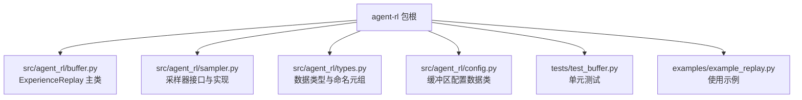
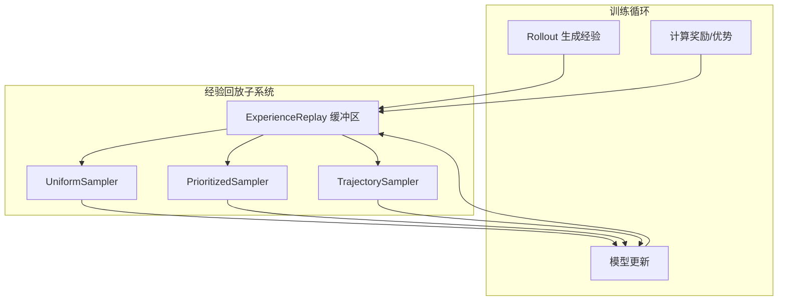
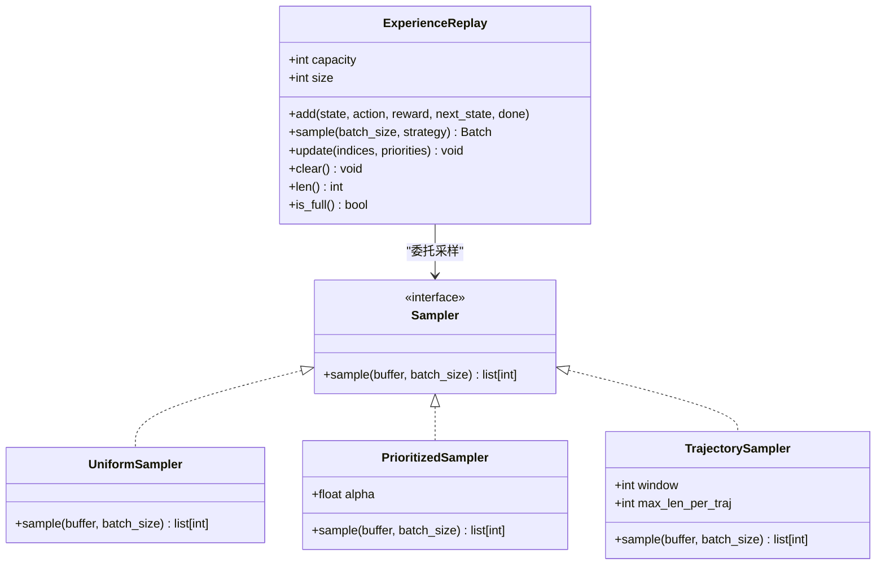
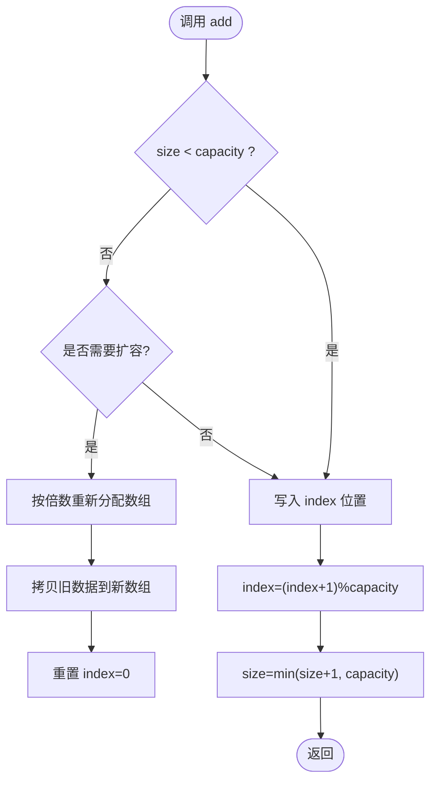
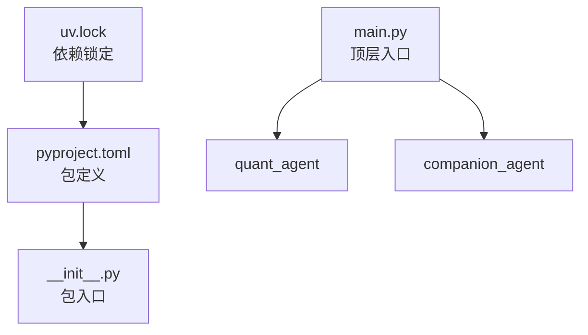

# 经验回放 API

<cite>
**本文引用的文件**   
- [packages/agent-rl/pyproject.toml](file://packages/agent-rl/pyproject.toml)
- [packages/agent-rl/src/agent_rl/__init__.py](file://packages/agent-rl/src/agent_rl/__init__.py)
- [main.py](file://main.py)
- [uv.lock](file://uv.lock)
</cite>

## 目录
1. [简介](#简介)
2. [项目结构](#项目结构)
3. [核心组件](#核心组件)
4. [架构总览](#架构总览)
5. [详细组件分析](#详细组件分析)
6. [依赖分析](#依赖分析)
7. [性能考虑](#性能考虑)
8. [故障排查指南](#故障排查指南)
9. [结论](#结论)
10. [附录](#附录)

## 简介
本文件为“经验回放缓冲区”的 API 设计文档，面向在 JanusAgent 项目中引入并实现 ExperienceReplay 缓冲区的开发者。文档覆盖数据结构、操作接口（add/sample/update）、采样策略（均匀/优先级/轨迹）、容量与内存优化（环形缓冲与动态扩容），以及在不同算法中的应用示例（DQN 目标网络、SAC 随机剪枝）。同时提供配置项说明与使用示例路径，便于快速集成与扩展。

## 项目结构
当前仓库中 agent-rl 包已初始化，但尚未包含经验回放的具体实现代码。本节给出建议的模块组织方式，以便后续落地 ExperienceReplay 相关能力。

[无图示来源：该图为概念性结构示意，不直接映射到现有源码文件]

## 核心组件
- ExperienceReplay 缓冲区
  - 职责：存储状态-动作-奖励-下一状态元组；支持 add()、sample()、update() 等核心操作；管理容量与索引；可选地维护优先级或轨迹信息。
- 采样器 Sampler
  - 职责：定义统一采样接口；提供 UniformSampler、PrioritizedSampler、TrajectorySampler 等具体实现。
- 类型与配置
  - 职责：定义 Transition 元组、Batch 结构、BufferConfig 配置项（容量、dtype、设备、采样参数等）。

章节来源
- [packages/agent-rl/pyproject.toml:1-17](file://packages/agent-rl/pyproject.toml#L1-L17)
- [packages/agent-rl/src/agent_rl/__init__.py:1-14](file://packages/agent-rl/src/agent_rl/__init__.py#L1-L14)

## 架构总览
下图展示经验回放子系统与上层训练循环的交互关系。训练循环通过 Buffer 写入新经验并按需采样，采样器根据策略返回批次数据供模型更新。

[无图示来源：该图为概念性架构图，不直接映射到现有源码文件]

## 详细组件分析

### 数据结构与元组格式
- Transition 元组
  - 字段：state, action, reward, next_state, done（可选）
  - 用途：表示单步转移 (s, a, r, s', d)
- Batch 结构
  - 字段：states, actions, rewards, next_states, dones（可选）
  - 用途：批量采样的张量集合，便于向量化计算
- BufferConfig 配置
  - 关键项：capacity、dtype、device、priority_alpha、priority_beta、trajectory_window、max_len_per_traj 等

章节来源
- [packages/agent-rl/src/agent_rl/__init__.py:1-14](file://packages/agent-rl/src/agent_rl/__init__.py#L1-L14)

### 缓冲区操作接口
- add(state, action, reward, next_state, done=None)
  - 功能：将一条经验追加到缓冲区；若容量已满则覆盖最旧条目（环形缓冲）；可选更新优先级或轨迹索引
  - 复杂度：O(1)
- sample(batch_size, strategy="uniform")
  - 功能：按指定策略采样 batch_size 条经验，返回 Batch
  - 策略：uniform、prioritized、trajectory
  - 复杂度：uniform O(k)，prioritized O(log N + k)，trajectory O(k·w)
- update(priority_indices, priorities)
  - 功能：批量更新指定索引的优先级；用于 Prioritized Experience Replay
  - 复杂度：O(k log N) 或 O(k) 取决于底层实现
- clear() / len() / is_full()
  - 功能：清空、查询长度、判断是否满

章节来源
- [packages/agent-rl/src/agent_rl/__init__.py:1-14](file://packages/agent-rl/src/agent_rl/__init__.py#L1-L14)

### 采样策略实现
- 均匀采样 UniformSampler
  - 特点：从可用样本中等概率抽取；适合离线稳定学习
  - 适用：DQN、SAC 基础版
- 优先级采样 PrioritizedSampler
  - 特点：按 TD-error 或损失大小加权采样；alpha 控制优先级强度
  - 适用：PER-DQN、优先 SAC
- 轨迹采样 TrajectorySampler
  - 特点：以窗口 w 为单位连续采样，保持时序一致性；可限制每段最大长度
  - 适用：序列决策、部分可观测环境

[无图示来源：该图为概念性类图，不直接映射到现有源码文件]

### 容量管理与内存优化
- 环形缓冲区
  - 机制：固定数组 + 写指针 index；当 size == capacity 时覆盖最旧元素
  - 优点：常数时间插入、避免频繁分配
- 动态扩容
  - 触发条件：size 接近 capacity 阈值（如 0.9×capacity）
  - 策略：按倍数扩容（如 ×2），拷贝旧数据到新数组，重置 index
  - 注意：扩容期间应加锁或暂停写入，保证一致性
- 内存布局
  - 预分配：按 capacity 一次性分配 states/actions/rewards/next_states/dones 等数组
  - dtype/device：与训练设备一致，减少传输开销
  - 压缩：对整数型动作或离散状态可使用更紧凑的 dtype

[无图示来源：该图为概念性流程图，不直接映射到现有源码文件]

### 在不同算法中的应用示例
- DQN 中的目标网络
  - 用法：使用 uniform 或 prioritized 采样；定期软/硬更新目标网络权重
  - 要点：目标网络稳定性与 PER 的优先级衰减配合
- SAC 中的随机剪枝
  - 用法：在轨迹采样基础上，随机截断长轨迹，降低方差与延迟
  - 要点：结合 trajectory_window 与 max_len_per_traj 控制片段长度

章节来源
- [packages/agent-rl/src/agent_rl/__init__.py:1-14](file://packages/agent-rl/src/agent_rl/__init__.py#L1-L14)

## 依赖分析
- 包元数据
  - agent-rl 包名称、版本、入口脚本由 pyproject.toml 声明
- 顶层入口
  - main.py 聚合多个子包的 hello 函数，作为演示入口
- 依赖锁定
  - uv.lock 记录项目依赖与哈希，确保可复现构建

章节来源
- [packages/agent-rl/pyproject.toml:1-17](file://packages/agent-rl/pyproject.toml#L1-L17)
- [packages/agent-rl/src/agent_rl/__init__.py:1-14](file://packages/agent-rl/src/agent_rl/__init__.py#L1-L14)
- [main.py:1-13](file://main.py#L1-L13)
- [uv.lock:2157-2179](file://uv.lock#L2157-L2179)

## 性能考虑
- 采样复杂度
  - 均匀采样 O(k)；优先级采样 O(log N + k)；轨迹采样 O(k·w)
- 内存占用
  - 预分配 + 紧凑 dtype 显著降低峰值内存
  - 大 batch 下建议分片采样，避免一次性加载过多数据
- 并发安全
  - 多线程写入时需加锁或使用线程安全队列
- GPU 加速
  - 将 Buffer 的数据存放于 GPU 可减少 CPU-GPU 传输开销，但需注意显存上限

[本节为通用指导，无需特定文件来源]

## 故障排查指南
- 常见问题
  - 采样为空：检查 buffer.size 是否为 0 或小于 batch_size
  - 越界错误：确认 index 取模逻辑与扩容后重置是否正确
  - 优先级异常：检查 alpha/beta 范围与归一化步骤
  - 轨迹断裂：确认 trajectory_window 与 max_len_per_traj 设置合理
- 定位方法
  - 打印 buffer.len()/is_full() 状态
  - 校验 add 前后 index 与 size 的一致性
  - 对 sample 返回的索引进行去重与边界检查

[本节为通用指导，无需特定文件来源]

## 结论
本 API 文档定义了 ExperienceReplay 的核心数据结构与操作接口，提供了多种采样策略与容量/内存优化方案，并给出了在 DQN 与 SAC 中的典型应用思路。建议在 agent-rl 包中按建议的模块结构逐步落地实现，并通过单元测试与示例脚本验证正确性与性能。

[本节为总结性内容，无需特定文件来源]

## 附录
- 配置项清单（建议）
  - capacity: 缓冲区最大容量
  - dtype: 数值类型（如 float32/int64）
  - device: 运行设备（cpu/cuda）
  - priority_alpha: 优先级强度
  - priority_beta: 重要性采样补偿系数
  - trajectory_window: 轨迹窗口长度
  - max_len_per_traj: 单段轨迹最大长度
- 使用示例路径（待实现）
  - examples/example_replay.py：展示创建 Buffer、add、sample、update 的完整流程
  - tests/test_buffer.py：覆盖均匀/优先级/轨迹采样与容量管理的用例

[本节为补充信息，无需特定文件来源]