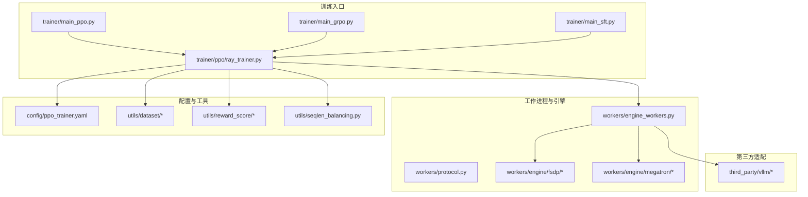
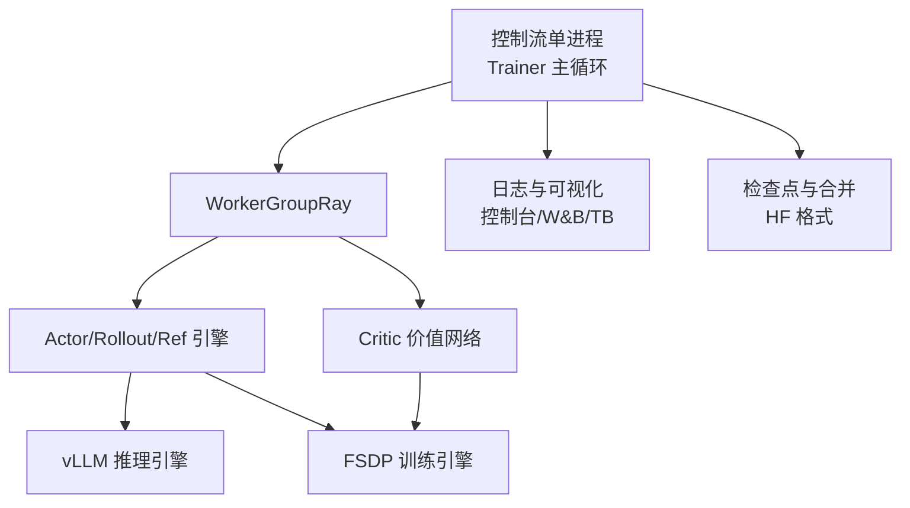
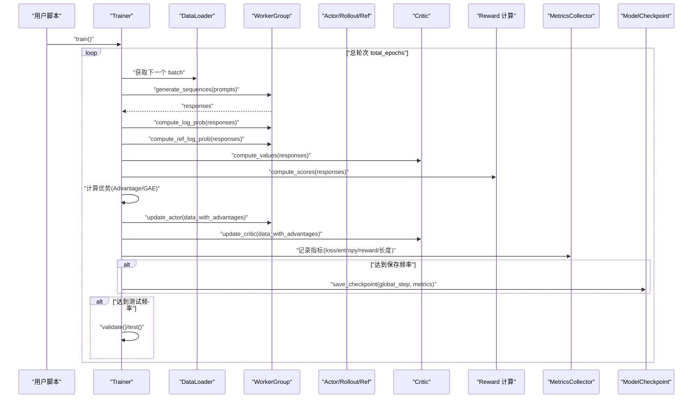
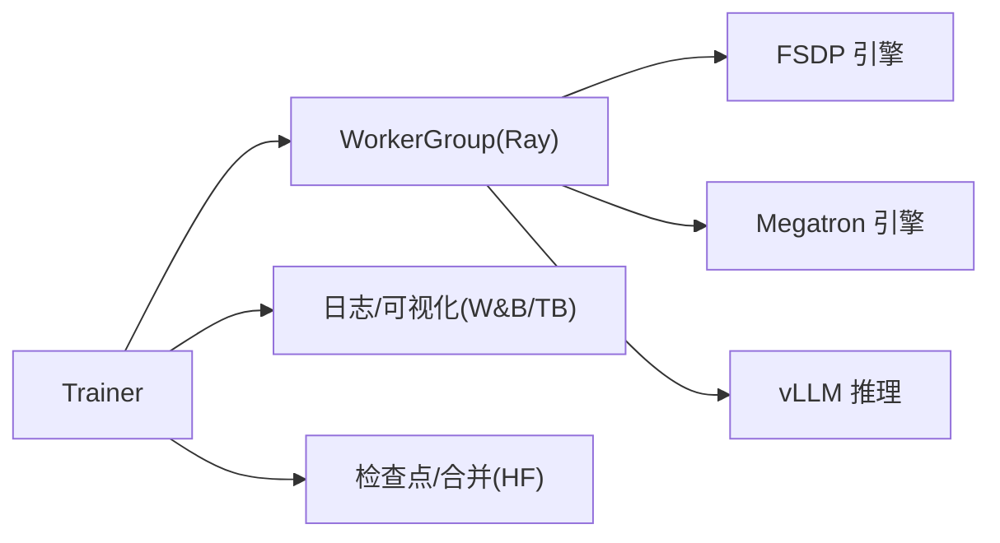

# 训练管理 API

<cite>
**本文引用的文件**   
- [verl-learning-plan.md](file://docs/plans/verl-learning-plan.md)
</cite>

## 目录
1. [简介](#简介)
2. [项目结构](#项目结构)
3. [核心组件](#核心组件)
4. [架构总览](#架构总览)
5. [详细组件分析](#详细组件分析)
6. [依赖分析](#依赖分析)
7. [性能考虑](#性能考虑)
8. [故障排查指南](#故障排查指南)
9. [结论](#结论)
10. [附录](#附录)

## 简介
本文件面向“训练管理系统”的 API 文档，聚焦以下目标：
- Trainer 类的训练循环控制：轮次管理、进度监控与中断恢复
- TrainingConfig 数据结构：学习率调度、批量大小、终止条件等
- MetricsCollector 指标收集与分析：损失曲线、收敛性检测、过拟合预警
- ModelCheckpoint 版本管理与最佳模型选择策略
- 分布式训练扩展接口与并行优化方案
- 完整训练流程配置与监控示例

说明：当前仓库未包含具体实现代码，本文基于仓库中的 verl 学习计划文档进行系统化整理与抽象，形成可落地的 API 设计建议与使用示例。

## 项目结构
从计划文档可知，训练系统围绕 verl 生态组织，关键目录与职责如下：
- trainer：训练入口与主循环（PPO/GRPO/SFT）
- workers：工作进程与引擎（Actor/Rollout/Ref/Critic/FSDP/Megatron）
- config：训练配置模板
- utils：数据集、奖励评分、序列长度平衡等工具
- third_party/vllm：推理加速适配层

图表来源
- [verl-learning-plan.md:252-281](file://docs/plans/verl-learning-plan.md#L252-L281)

章节来源
- [verl-learning-plan.md:252-281](file://docs/plans/verl-learning-plan.md#L252-L281)

## 核心组件
本节给出面向使用者的 API 抽象与职责划分，便于后续对接与扩展。

- Trainer（训练控制器）
  - 职责：训练循环编排、轮次与步数管理、日志与检查点触发、异常与中断处理、验证与测试调度
  - 关键方法（建议）：train()、step()、validate()、test()、save_checkpoint()、resume_from_checkpoint()、stop_training()
- TrainingConfig（训练配置）
  - 职责：集中管理数据、模型、优化器、调度器、批大小、终止条件、保存频率、评估频率等
  - 关键字段（建议）：算法类型、模型路径、训练/验证数据、批次大小、最大提示/回复长度、GPU 数量、节点数、输出目录、学习率与调度、KL 系数、保存/测试频率、总轮次等
- MetricsCollector（指标收集器）
  - 职责：采集并聚合训练指标、绘制损失曲线、检测收敛性与过拟合、导出可视化
  - 关键能力（建议）：记录 loss/entropy/reward 等指标、滑动窗口统计、趋势分析与告警、多后端日志（控制台/W&B/TensorBoard）
- ModelCheckpoint（模型检查点）
  - 职责：版本化保存权重、元数据与配置；按策略选择最佳模型；支持断点恢复
  - 关键能力（建议）：命名规范（global_step_N）、保留策略（最近 N/Top K）、合并为 HuggingFace 格式、校验完整性

章节来源
- [verl-learning-plan.md:252-281](file://docs/plans/verl-learning-plan.md#L252-L281)

## 架构总览
整体采用“控制流（单进程）+ 计算流（多进程）”的两级数据流设计，通过 Ray 与 WorkerGroup 交互，新增算法仅需修改控制流，计算流可在 FSDP/Megatron 间切换。

图表来源
- [verl-learning-plan.md:215-251](file://docs/plans/verl-learning-plan.md#L215-L251)

## 详细组件分析

### Trainer 训练循环控制
- 训练轮次管理
  - 外层循环：按 total_epochs 迭代
  - 内层循环：按 dataloader 批次推进，每步执行 rollout、优势计算、参数更新
- 进度监控
  - 每步/每轮记录关键指标（loss、reward、熵、响应长度等），并写入日志后端
- 中断恢复
  - 周期性保存检查点；启动时自动加载最新或指定 checkpoint，恢复优化器状态与随机种子

图表来源
- [verl-learning-plan.md:283-311](file://docs/plans/verl-learning-plan.md#L283-L311)

章节来源
- [verl-learning-plan.md:283-311](file://docs/plans/verl-learning-plan.md#L283-L311)

### TrainingConfig 数据结构
- 数据来源与字段参考
  - 命令行参数覆盖范围涵盖数据路径、模型路径、批大小、rollout 与 critic 的微批次、学习率、KL 系数、日志后端、保存/测试频率、总轮次、GPU/节点数等
- 建议字段分组
  - 数据：train_files、val_files、max_prompt_length、max_response_length
  - 模型：actor_rollout_ref.model.path、critic.model.path
  - 优化与调度：actor.optim.lr、critic.optim.lr、algorithm.kl_ctrl.kl_coef
  - 批大小：data.train_batch_size、actor_rollout_ref.actor.ppo_mini_batch_size、actor_rollout_ref.actor.ppo_micro_batch_size_per_gpu、critic.ppo_micro_batch_size_per_gpu
  - 推理与并行：actor_rollout_ref.rollout.name、log_prob_micro_batch_size_per_gpu、tensor_model_parallel_size、gpu_memory_utilization
  - 训练控制：trainer.logger、trainer.val_before_train、trainer.n_gpus_per_node、trainer.nnodes、trainer.save_freq、trainer.test_freq、trainer.total_epochs
  - 输出：output_dir（用于保存检查点与日志）

章节来源
- [verl-learning-plan.md:161-189](file://docs/plans/verl-learning-plan.md#L161-L189)

### MetricsCollector 指标收集与分析
- 指标体系
  - 验证集分数：val/test_score/
  - 策略相关：actor/pg_loss、actor/entropy_loss、actor/reward_kl_penalty
  - 价值相关：critic/vf_loss、critic/rewards/mean
  - 生成质量：response_length/mean
- 功能建议
  - 实时记录与聚合、滑动窗口平滑、趋势变化检测
  - 收敛性检测：当验证分数连续若干步无提升且 loss 波动增大时发出信号
  - 过拟合预警：训练 loss 持续下降而验证分数停滞或下降
  - 可视化：控制台、W&B、TensorBoard 多后端输出

章节来源
- [verl-learning-plan.md:191-201](file://docs/plans/verl-learning-plan.md#L191-L201)

### ModelCheckpoint 版本管理与最佳模型选择
- 版本管理
  - 以 global_step_N 作为目录标识，保存权重、配置与元数据
- 最佳模型选择策略
  - 基于验证分数 Top-K 保留或最近 N 个检查点
  - 支持将 FSDP 分片权重合并为 HuggingFace 格式，便于部署与评测
- 中断恢复
  - 启动时扫描 checkpoints 目录，自动加载最新或指定 step 的检查点

章节来源
- [verl-learning-plan.md:203-211](file://docs/plans/verl-learning-plan.md#L203-L211)

### 分布式训练扩展接口与并行优化
- 扩展接口
  - 通过 @register(dispatch_mode=...) 装饰器注册新的计算模块，自动完成数据分片/分发/收集
  - 新增 RL 算法只需修改控制流，计算流在 FSDP/Megatron 间无缝切换
- 并行优化建议
  - 调整 vLLM gpu_memory_utilization 与 log_prob 微批次大小
  - 调优 ppo_micro_batch_size_per_gpu 与 mini_batch_size
  - 合理设置 tensor_model_parallel_size 与节点/GPU 数量

章节来源
- [verl-learning-plan.md:240-251](file://docs/plans/verl-learning-plan.md#L240-L251)
- [verl-learning-plan.md:384-395](file://docs/plans/verl-learning-plan.md#L384-L395)

## 依赖分析
- 外部依赖
  - Ray：分布式任务编排与 Actor 通信
  - vLLM：高效推理与采样
  - PyTorch FSDP：全分片数据并行
  - Megatron-LM：张量/流水线并行（可选）
  - 日志与可视化：控制台、W&B、TensorBoard
- 内部耦合
  - Trainer 与 WorkerGroup 松耦合，通过协议对象传递数据
  - Engine 层对 FSDP/Megatron 的抽象使算法与并行后端解耦

图表来源
- [verl-learning-plan.md:215-251](file://docs/plans/verl-learning-plan.md#L215-L251)

章节来源
- [verl-learning-plan.md:215-251](file://docs/plans/verl-learning-plan.md#L215-L251)

## 性能考虑
- 显存与吞吐
  - 降低 ppo_micro_batch_size_per_gpu 与 gpu_memory_utilization 缓解显存压力
  - 增大 mini_batch_size 提升吞吐，但需权衡稳定性
- 并行度
  - 根据模型规模调整 tensor_model_parallel_size 与 n_gpus_per_node/nnodes
- 日志开销
  - 合理设置 save_freq 与 test_freq，避免频繁 I/O 影响训练速度

[本节为通用指导，不直接分析具体文件]

## 故障排查指南
- NaN Loss
  - 可能原因：学习率过高、KL 系数不当
  - 建议：降低 actor/critic 的学习率至合理范围，调整 KL 惩罚项
- 单卡显存不足
  - 建议：使用更小模型、降低 micro_batch_size 与 gpu_memory_utilization，或采用 LoRA + RL
- 推理引擎选择
  - vLLM 生态完善适合生产；SGLang 在多轮 RL 与 VLM RL 上有独特优化

章节来源
- [verl-learning-plan.md:505-515](file://docs/plans/verl-learning-plan.md#L505-L515)

## 结论
本文基于仓库中的 verl 学习计划文档，抽象出训练管理系统的核心 API 与架构要点，包括 Trainer 的训练循环、TrainingConfig 的配置项、MetricsCollector 的指标体系、ModelCheckpoint 的版本与最佳模型策略，以及分布式扩展与并行优化建议。该设计可作为后续工程实现的蓝图，帮助快速落地稳定高效的训练系统。

[本节为总结性内容，不直接分析具体文件]

## 附录

### 完整训练流程配置与监控示例
- 启动 PPO 训练的关键参数
  - 数据：train_files、val_files、max_prompt_length、max_response_length
  - 模型：actor_rollout_ref.model.path、critic.model.path
  - 优化与调度：actor.optim.lr、critic.optim.lr、algorithm.kl_ctrl.kl_coef
  - 批大小：data.train_batch_size、actor_rollout_ref.actor.ppo_mini_batch_size、actor_rollout_ref.actor.ppo_micro_batch_size_per_gpu、critic.ppo_micro_batch_size_per_gpu
  - 推理与并行：actor_rollout_ref.rollout.name、log_prob_micro_batch_size_per_gpu、tensor_model_parallel_size、gpu_memory_utilization
  - 训练控制：trainer.logger、trainer.val_before_train、trainer.n_gpus_per_node、trainer.nnodes、trainer.save_freq、trainer.test_freq、trainer.total_epochs
- 监控与可视化
  - 开启 W&B：trainer.logger='["console","wandb"]'，并设置 project_name/experiment_name
  - 开启 TensorBoard：trainer.logger='["console","tb"]'
- 模型保存与合并
  - 使用 model_merger 将 FSDP 分片权重合并为 HuggingFace 格式，便于部署与评测

章节来源
- [verl-learning-plan.md:161-189](file://docs/plans/verl-learning-plan.md#L161-L189)
- [verl-learning-plan.md:517-527](file://docs/plans/verl-learning-plan.md#L517-L527)
- [verl-learning-plan.md:203-211](file://docs/plans/verl-learning-plan.md#L203-L211)