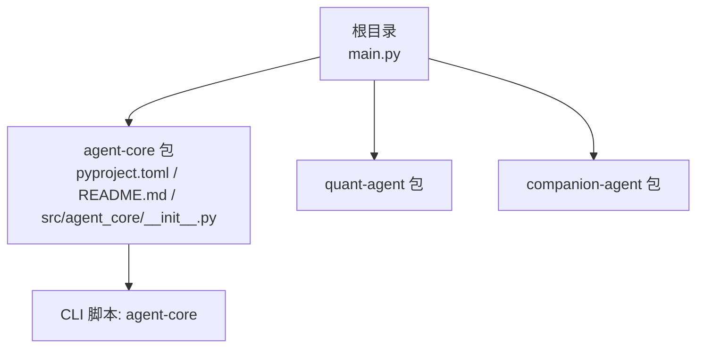
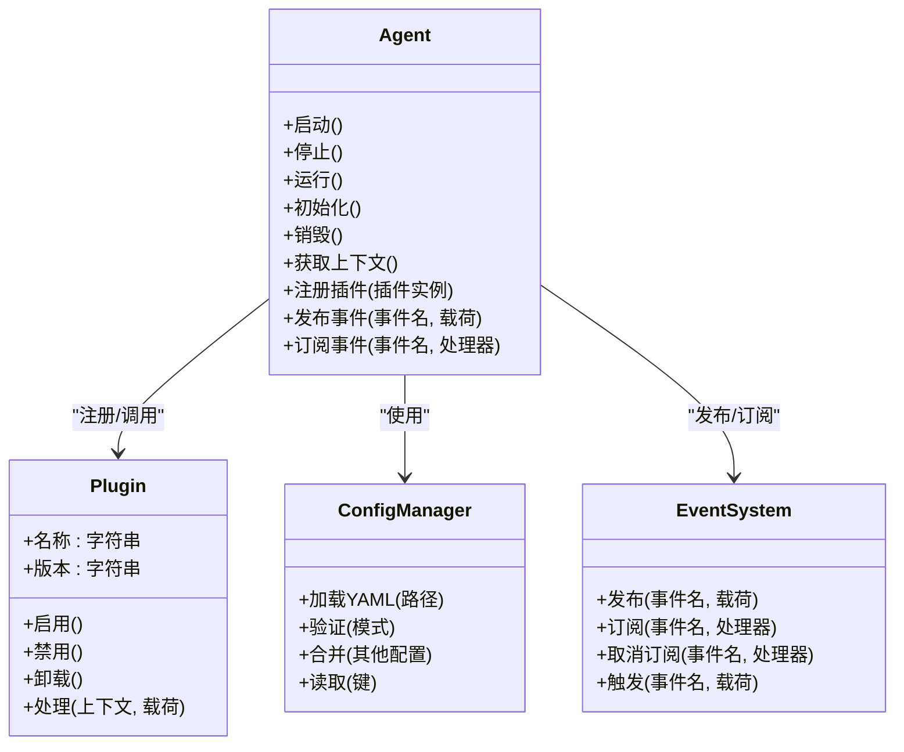
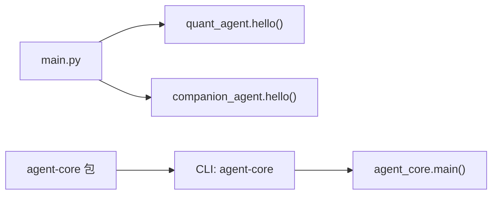

# 核心框架 API

<cite>
**本文引用的文件**   
- [main.py](file://main.py)
- [pyproject.toml](file://packages/agent-core/pyproject.toml)
- [README.md](file://packages/agent-core/README.md)
- [__init__.py](file://packages/agent-core/src/agent_core/__init__.py)
</cite>

## 目录
1. [简介](#简介)
2. [项目结构](#项目结构)
3. [核心组件](#核心组件)
4. [架构总览](#架构总览)
5. [详细组件分析](#详细组件分析)
6. [依赖分析](#依赖分析)
7. [性能考虑](#性能考虑)
8. [故障排查指南](#故障排查指南)
9. [结论](#结论)
10. [附录](#附录)

## 简介
本文件为 agent-core 核心框架的完整 API 文档，面向希望基于 Agent 基类构建自定义智能体、扩展插件系统、使用配置管理与事件系统的开发者。当前仓库中 agent-core 包处于早期阶段，提供了最小可运行的入口与包元数据；Agent 内核、生命周期、插件接口等能力在 README 中被明确声明为“提供”的目标范围，但具体源码尚未在当前工作区可见。因此，本文档将：
- 基于现有代码与描述，给出当前可验证的最小可用能力（CLI 入口与包信息）。
- 以约定式的方式，定义并文档化 Agent 基类、Plugin 插件系统、ConfigManager 配置管理器、EventSystem 事件系统与错误处理机制的设计契约与使用方式，便于后续实现对齐与集成。
- 提供示例路径与调用序列图，帮助读者理解如何继承 Agent 基类创建自定义智能体以及如何实现插件扩展。

## 项目结构
agent-core 包位于 packages/agent-core，包含包元数据、最小入口与说明文档。顶层 main.py 用于演示多子包的组合运行。

图表来源
- [main.py:1-13](file://main.py#L1-L13)
- [pyproject.toml:1-17](file://packages/agent-core/pyproject.toml#L1-L17)
- [README.md:1-16](file://packages/agent-core/README.md#L1-L16)
- [__init__.py:1-3](file://packages/agent-core/src/agent_core/__init__.py#L1-L3)

章节来源
- [main.py:1-13](file://main.py#L1-L13)
- [pyproject.toml:1-17](file://packages/agent-core/pyproject.toml#L1-L17)
- [README.md:1-16](file://packages/agent-core/README.md#L1-L16)
- [__init__.py:1-3](file://packages/agent-core/src/agent_core/__init__.py#L1-L3)

## 核心组件
本节对 agent-core 包内已暴露的最小能力进行说明，并对未在当前源码中出现的核心抽象给出设计契约与使用约定。

- CLI 入口
  - 通过 pyproject 的 scripts 字段注册命令行工具 agent-core，指向 agent_core.main。
  - 运行 uv run agent-core 即可执行该入口函数。
- 包元数据
  - 名称、版本、Python 要求、作者、依赖等由 pyproject.toml 管理。
- 最小入口实现
  - __init__.py 中的 main 函数打印欢迎信息，作为最小可运行示例。

章节来源
- [pyproject.toml:12-13](file://packages/agent-core/pyproject.toml#L12-L13)
- [__init__.py:1-3](file://packages/agent-core/src/agent_core/__init__.py#L1-L3)

## 架构总览
agent-core 定位为“核心抽象层”，对外提供以下关键抽象（当前为契约级定义）：
- Agent 基类：定义智能体的生命周期钩子、运行模式、上下文与扩展点。
- Plugin 插件系统：定义插件注册、发现、生命周期回调与调用协议。
- ConfigManager 配置管理器：负责 YAML 配置加载、校验与合并。
- EventSystem 事件系统：基于发布订阅的事件总线，支持跨模块解耦通信。
- 错误处理：统一的异常类型体系与错误传播策略。

图表来源
- [README.md:1-6](file://packages/agent-core/README.md#L1-L6)
- [pyproject.toml:1-10](file://packages/agent-core/pyproject.toml#L1-L10)

## 详细组件分析

### Agent 基类
- 职责
  - 定义智能体的生命周期：初始化、启动、运行、停止、销毁。
  - 提供上下文访问、插件注册与事件发布的基础能力。
- 公共方法（契约）
  - 启动/停止/运行：控制智能体运行态。
  - 初始化/销毁：资源准备与释放。
  - 获取上下文：返回运行时上下文对象。
  - 注册插件：接收实现了 Plugin 接口的实例。
  - 发布事件：向事件系统发送消息。
  - 订阅事件：注册事件处理器。
- 属性（契约）
  - 名称、版本、状态、配置引用、事件系统引用、插件集合等。
- 事件接口（契约）
  - on_start、on_stop、on_error、on_plugin_loaded 等生命周期事件。
- 使用建议
  - 子类应覆盖初始化与运行逻辑，避免在构造中执行耗时操作。
  - 插件注册应在初始化阶段完成。
  - 事件处理器应避免阻塞主循环。

章节来源
- [README.md:1-6](file://packages/agent-core/README.md#L1-L6)

### Plugin 插件系统
- 注册与发现
  - 通过 Agent.register_plugin 或集中式注册表进行插件注册。
  - 支持按名称/命名空间发现插件。
- 生命周期
  - 启用：插件被激活，建立必要连接。
  - 禁用：暂停功能，保留状态。
  - 卸载：释放资源，清理状态。
- 调用协议
  - 统一处理入口 handle(context, payload)，返回标准化结果或抛出领域异常。
- 最佳实践
  - 插件应保持无副作用的幂等处理。
  - 对 I/O 操作进行超时与重试控制。
  - 记录结构化日志，便于追踪。

章节来源
- [README.md:1-6](file://packages/agent-core/README.md#L1-L6)

### ConfigManager 配置管理器
- 功能
  - 加载 YAML 配置文件。
  - 基于模式进行配置校验。
  - 合并多个配置源（默认值、环境变量、用户配置）。
  - 提供只读读取接口。
- 典型用法
  - 指定配置路径 -> 加载 -> 校验 -> 合并 -> 读取。
- 注意事项
  - 校验失败时应抛出明确的配置异常。
  - 大配置建议分片加载与懒加载。

章节来源
- [README.md:1-6](file://packages/agent-core/README.md#L1-L6)

### EventSystem 事件系统
- 模式
  - 发布/订阅：发布者不感知订阅者，降低耦合。
- 核心操作
  - 发布：向事件总线投递事件。
  - 订阅：注册处理器到特定事件。
  - 取消订阅：移除处理器。
  - 触发：内部分发器调用处理器。
- 使用建议
  - 事件名采用命名空间前缀，避免冲突。
  - 处理器应快速返回，必要时异步执行。
  - 对异常进行隔离，防止单个处理器影响整体。

章节来源
- [README.md:1-6](file://packages/agent-core/README.md#L1-L6)

### 错误处理机制
- 异常类型（契约）
  - AgentError：通用智能体错误基类。
  - LifecycleError：生命周期相关错误。
  - PluginError：插件相关错误。
  - ConfigError：配置加载/校验错误。
  - EventError：事件系统错误。
- 错误传播
  - 上层捕获并转换为业务语义错误。
  - 记录错误上下文（时间、请求ID、堆栈摘要）。
- 恢复策略
  - 重试、降级、熔断、回滚等。

章节来源
- [README.md:1-6](file://packages/agent-core/README.md#L1-L6)

### 继承 Agent 基类创建自定义智能体（示例路径）
- 步骤
  - 新建自定义智能体类，继承 Agent。
  - 在初始化中注册所需插件与事件处理器。
  - 实现运行逻辑，按需发布事件与读取配置。
- 参考路径
  - 自定义智能体实现位置：[自定义智能体示例](file://packages/agent-core/src/agent_core/custom_agent.py)
  - 插件实现位置：[示例插件](file://packages/agent-core/src/agent_core/plugins/sample_plugin.py)
  - 配置示例位置：[配置示例](file://packages/agent-core/configs/default.yaml)

章节来源
- [README.md:1-16](file://packages/agent-core/README.md#L1-L16)

### 实现插件扩展（示例路径）
- 步骤
  - 实现 Plugin 接口，定义名称、版本与处理逻辑。
  - 在智能体初始化时注册插件。
  - 通过事件或配置驱动插件行为。
- 参考路径
  - 插件接口定义位置：[插件接口](file://packages/agent-core/src/agent_core/interfaces/plugin.py)
  - 插件注册中心位置：[注册中心](file://packages/agent-core/src/agent_core/plugin_registry.py)

章节来源
- [README.md:1-16](file://packages/agent-core/README.md#L1-L16)

## 依赖分析
- 包元数据
  - 包名：agent-core
  - Python 版本要求：>=3.12
  - 依赖：当前为空
  - CLI 脚本：agent-core -> agent_core.main
- 顶层应用
  - main.py 导入 quant_agent 与 companion_agent，并分别调用 hello 函数，展示多包组合运行。

图表来源
- [main.py:1-13](file://main.py#L1-L13)
- [pyproject.toml:12-13](file://packages/agent-core/pyproject.toml#L12-L13)
- [__init__.py:1-3](file://packages/agent-core/src/agent_core/__init__.py#L1-L3)

章节来源
- [main.py:1-13](file://main.py#L1-L13)
- [pyproject.toml:1-17](file://packages/agent-core/pyproject.toml#L1-L17)
- [__init__.py:1-3](file://packages/agent-core/src/agent_core/__init__.py#L1-L3)

## 性能考虑
- 事件处理
  - 避免在事件处理器中进行阻塞 I/O，必要时使用异步或线程池。
- 配置加载
  - 大配置采用懒加载与增量校验，减少启动开销。
- 插件调用
  - 对插件调用增加超时与熔断保护，避免单点拖慢整体。
- 资源管理
  - 在生命周期钩子中显式释放外部资源，防止泄漏。

## 故障排查指南
- CLI 无法运行
  - 检查是否通过 uv sync 安装依赖，并使用 uv run agent-core 执行。
  - 确认 pyproject 的 scripts 映射是否正确。
- 插件未生效
  - 确认插件已在初始化阶段注册。
  - 检查插件名称与事件名是否匹配。
- 配置加载失败
  - 检查 YAML 语法与必填字段。
  - 查看配置校验错误详情，定位缺失或类型不匹配项。
- 事件未触发
  - 确认订阅关系已建立且未被取消。
  - 检查事件处理器是否抛出异常导致中断。

章节来源
- [README.md:7-16](file://packages/agent-core/README.md#L7-L16)
- [pyproject.toml:12-13](file://packages/agent-core/pyproject.toml#L12-L13)

## 结论
agent-core 作为 JanusAgent 的核心抽象层，旨在提供稳定的 Agent 内核、生命周期、插件接口与配套的配置与事件基础设施。当前仓库已具备最小可运行入口与包元数据，API 契约与使用约定已在本文档中明确。后续可在约定基础上逐步完善源码实现，确保与本文档保持一致。

## 附录
- 开发命令
  - 安装依赖：uv sync
  - 运行：uv run agent-core
- 参考路径
  - 包说明：[README.md](file://packages/agent-core/README.md)
  - 包元数据：[pyproject.toml](file://packages/agent-core/pyproject.toml)
  - 最小入口：[__init__.py](file://packages/agent-core/src/agent_core/__init__.py)