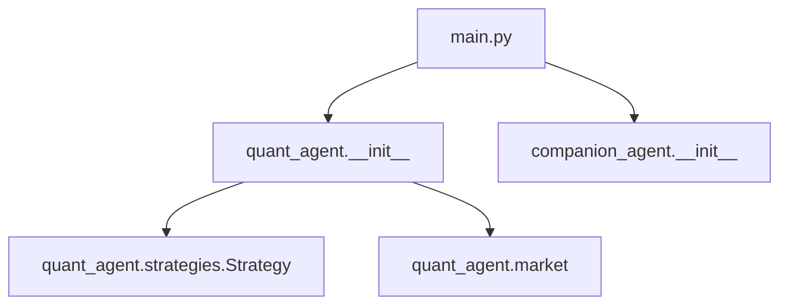
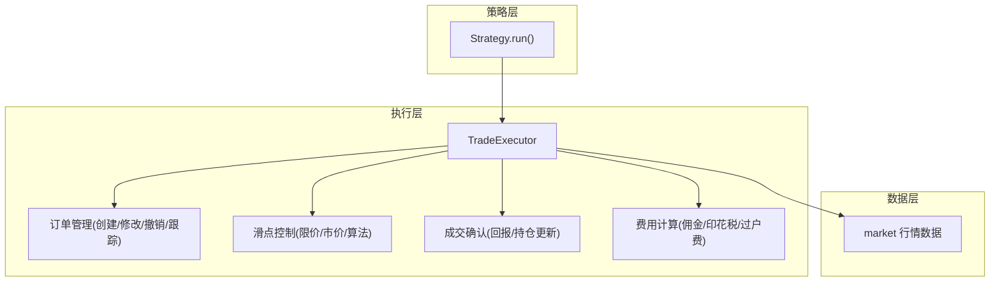
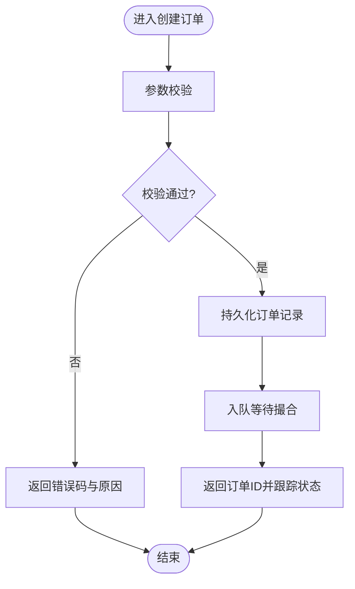
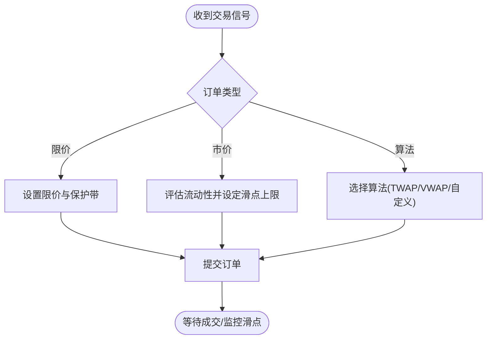
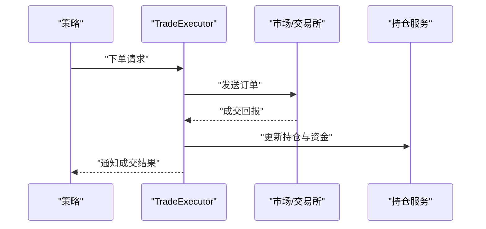
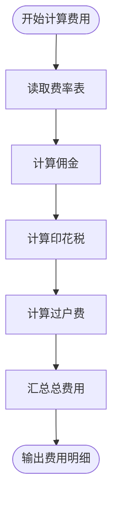
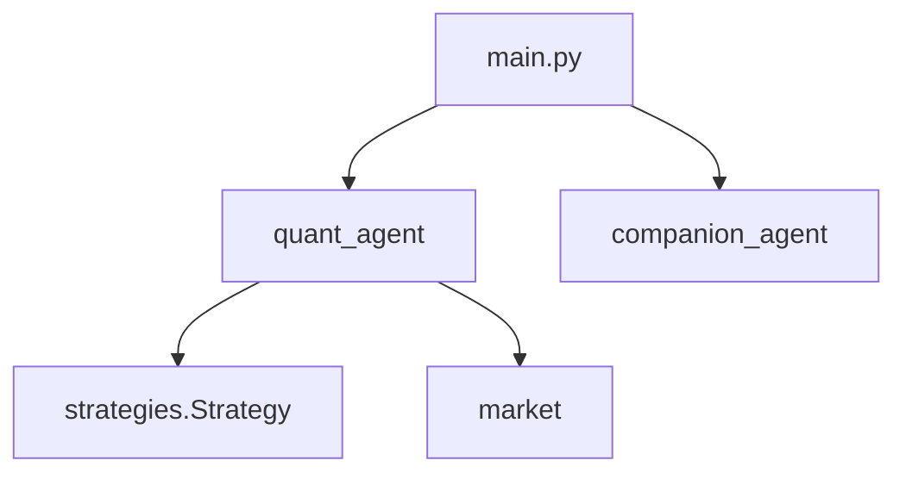

# 交易执行接口

<cite>
**本文引用的文件**   
- [main.py](file://main.py)
- [quant-agent README.md](file://packages/quant-agent/README.md)
- [strategies.py](file://packages/quant-agent/src/quant_agent/strategies.py)
- [market.py](file://packages/quant-agent/src/quant_agent/market.py)
</cite>

## 目录
1. [简介](#简介)
2. [项目结构](#项目结构)
3. [核心组件](#核心组件)
4. [架构总览](#架构总览)
5. [详细组件分析](#详细组件分析)
6. [依赖分析](#依赖分析)
7. [性能考虑](#性能考虑)
8. [故障排查指南](#故障排查指南)
9. [结论](#结论)
10. [附录](#附录)

## 简介
本文件面向 TradeExecutor 交易执行器的 API 设计与实现说明，聚焦以下目标：
- 订单管理接口：创建、修改、撤销与状态跟踪
- 滑点控制机制：限价单、市价单与算法单的执行为策略
- 成交确认接口：实时成交回报与持仓更新
- 交易费用计算：佣金、印花税、过户费等成本估算
- 完整交易执行流程与异常处理示例（以路径引用形式提供）

当前仓库中已包含量化智能体基础能力（市场数据、策略定义与回测框架），TradeExecutor 的设计将在此基础上扩展，形成从策略到执行的闭环。

## 项目结构
仓库采用多包组织方式，量化相关代码位于 quant-agent 包内，入口脚本 main.py 负责初始化并调用各子模块的 hello 方法。

图表来源
- [main.py:1-13](file://main.py#L1-L13)
- [strategies.py:1-12](file://packages/quant-agent/src/quant_agent/strategies.py#L1-L12)

章节来源
- [main.py:1-13](file://main.py#L1-L13)
- [quant-agent README.md:1-16](file://packages/quant-agent/README.md#L1-L16)

## 核心组件
- 策略基类 Strategy：用于定义策略名称、描述以及统一的 run 接口，作为上层策略实现的抽象。
- 市场数据模块 market：提供行情数据访问能力，为策略与执行器提供输入。
- 交易执行器 TradeExecutor（设计目标）：在现有策略与市场能力之上，封装订单生命周期管理、滑点控制、成交确认与费用估算等能力。

章节来源
- [strategies.py:1-12](file://packages/quant-agent/src/quant_agent/strategies.py#L1-L12)
- [market.py](file://packages/quant-agent/src/quant_agent/market.py)

## 架构总览
下图展示 TradeExecutor 在整体系统中的位置与交互关系：策略产生交易信号，执行器将其转化为订单并管理其生命周期；市场模块提供价格与流动性信息；成交确认后触发持仓与费用更新。

图表来源
- [strategies.py:1-12](file://packages/quant-agent/src/quant_agent/strategies.py#L1-L12)
- [market.py](file://packages/quant-agent/src/quant_agent/market.py)

## 详细组件分析

### 订单管理接口
- 功能范围
  - 创建订单：支持限价单、市价单与算法单类型
  - 修改订单：调整价格、数量或有效期
  - 撤销订单：取消未成交或部分成交订单
  - 状态跟踪：查询订单状态、历史变更与时间戳
- 关键约束
  - 参数校验：标的、方向、数量、价格区间、有效期等
  - 幂等性：重复提交同一订单应返回相同结果
  - 并发安全：多线程/异步环境下的锁与一致性保证
- 典型流程（概念图）

[此图为概念流程，不直接映射具体源码文件]

章节来源
- [strategies.py:1-12](file://packages/quant-agent/src/quant_agent/strategies.py#L1-L12)

### 滑点控制机制
- 策略类型
  - 限价单：按指定价格或更优价格成交，避免不利滑点
  - 市价单：追求即时成交，接受一定滑点风险
  - 算法单：拆单、TWAP/VWAP 等算法降低冲击与滑点
- 控制要点
  - 最大可接受滑点阈值
  - 价格保护带与最小报价变动单位
  - 流动性评估与分批下单策略
- 决策流程（概念图）

[此图为概念流程，不直接映射具体源码文件]

### 成交确认接口
- 功能范围
  - 实时成交回报：推送成交明细（价格、数量、时间、对手方等）
  - 持仓更新：根据成交结果更新账户持仓与可用资金
  - 对账与回放：成交流水持久化与审计
- 事件流（概念图）

[此图为概念流程，不直接映射具体源码文件]

### 交易费用计算
- 费用项
  - 佣金：券商收取的交易手续费
  - 印花税：按成交金额比例征收
  - 过户费：证券登记结算机构收取的费用
- 计算原则
  - 基于成交金额与费率表计算
  - 区分买卖方向与品种差异
  - 支持批量与分笔汇总
- 估算流程（概念图）

[此图为概念流程，不直接映射具体源码文件]

### 完整交易执行流程与异常处理示例
- 端到端流程
  - 策略生成信号 → 执行器构建订单 → 滑点控制与路由 → 撮合与成交确认 → 持仓与费用更新 → 结果回调
- 异常处理要点
  - 网络与系统异常：重试与熔断
  - 风控异常：超限、黑名单、合规拦截
  - 数据异常：行情缺失、价格跳变、流动性不足
  - 业务异常：参数非法、订单冲突、重复提交
- 参考入口
  - 主程序入口与模块加载：[main.py:1-13](file://main.py#L1-L13)
  - 策略基类定义：[strategies.py:1-12](file://packages/quant-agent/src/quant_agent/strategies.py#L1-L12)
  - 市场数据接入：[market.py](file://packages/quant-agent/src/quant_agent/market.py)

章节来源
- [main.py:1-13](file://main.py#L1-L13)
- [strategies.py:1-12](file://packages/quant-agent/src/quant_agent/strategies.py#L1-L12)
- [market.py](file://packages/quant-agent/src/quant_agent/market.py)

## 依赖分析
- 内部依赖
  - main.py 依赖 quant_agent 与 companion_agent 两个包
  - quant_agent 包内包含 strategies 与 market 模块
- 外部依赖
  - 运行与开发工具链由 pyproject.toml 与 uv.lock 管理
- 依赖关系图

图表来源
- [main.py:1-13](file://main.py#L1-L13)
- [strategies.py:1-12](file://packages/quant-agent/src/quant_agent/strategies.py#L1-L12)

章节来源
- [main.py:1-13](file://main.py#L1-L13)

## 性能考虑
- 低延迟路径：市价单与算法单的路由优化、批量下单与合并
- 资源控制：连接池、线程/协程池、背压与限流
- 数据缓存：热点行情与费率表的本地缓存
- 幂等与去重：订单号与指纹去重，避免重复撮合
- 观测与度量：关键指标埋点（延迟、成功率、滑点分布、费用占比）

## 故障排查指南
- 常见问题定位
  - 订单未成交：检查限价是否合理、流动性是否充足、滑点阈值是否过严
  - 成交回报丢失：核对消息队列与重试策略、幂等键是否正确
  - 持仓不一致：比对成交流水与持仓快照，检查费用扣减顺序
  - 费用偏差：核对费率表版本与生效日期，确认品种与方向差异
- 建议日志与断点
  - 记录订单全生命周期事件与关键参数
  - 在滑点控制与费用计算处增加断点与采样
  - 使用回放模式复现问题场景

## 结论
TradeExecutor 在现有策略与市场能力基础上，提供完整的订单管理与执行能力，涵盖滑点控制、成交确认与费用估算。通过清晰的职责划分与可扩展的策略体系，可在不同市场与品种上快速落地。后续建议完善测试覆盖、监控告警与灰度发布流程，确保生产环境的稳定性与可观测性。

## 附录
- 术语
  - 限价单：指定价格的订单，仅在该价格或更优价格成交
  - 市价单：以当前最优价格立即成交的订单
  - 算法单：通过算法拆分与调度以降低冲击与滑点的订单
  - 滑点：实际成交价与预期价的偏差
  - 成交回报：成交后返回的详细成交信息
  - 过户费：证券登记结算机构收取的费用
- 参考路径
  - 策略基类：[strategies.py:1-12](file://packages/quant-agent/src/quant_agent/strategies.py#L1-L12)
  - 市场数据：[market.py](file://packages/quant-agent/src/quant_agent/market.py)
  - 主入口：[main.py:1-13](file://main.py#L1-L13)