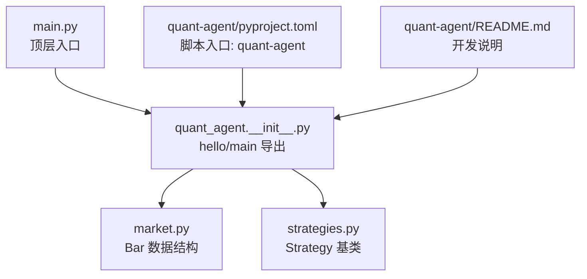
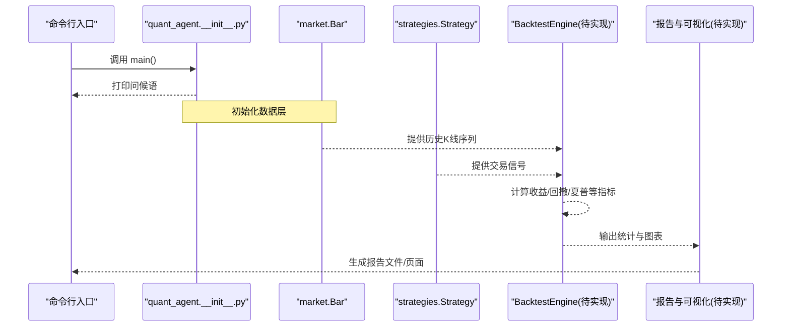
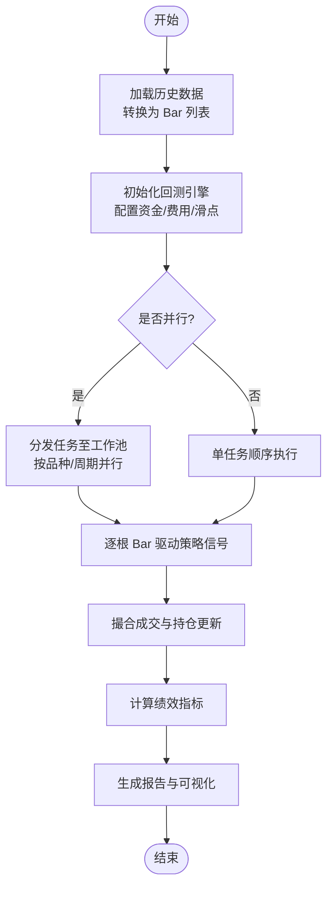
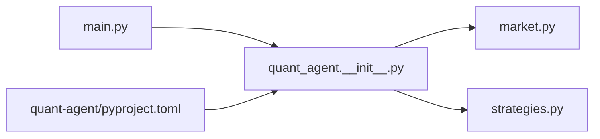

# 回测引擎接口

<cite>
**本文引用的文件**   
- [main.py](file://main.py)
- [quant-agent README.md](file://packages/quant-agent/README.md)
- [quant-agent pyproject.toml](file://packages/quant-agent/pyproject.toml)
- [quant_agent __init__.py](file://packages/quant-agent/src/quant_agent/__init__.py)
- [market.py](file://packages/quant-agent/src/quant_agent/market.py)
- [strategies.py](file://packages/quant-agent/src/quant_agent/strategies.py)
</cite>

## 目录
1. [简介](#简介)
2. [项目结构](#项目结构)
3. [核心组件](#核心组件)
4. [架构总览](#架构总览)
5. [详细组件分析](#详细组件分析)
6. [依赖关系分析](#依赖关系分析)
7. [性能考虑](#性能考虑)
8. [故障排查指南](#故障排查指南)
9. [结论](#结论)
10. [附录](#附录)

## 简介
本文件为 BacktestEngine 回测引擎的完整 API 文档，面向量化交易智能体（quant-agent）模块。当前仓库处于早期阶段，已提供市场数据模型与策略基类，并规划了回测框架能力。本文在现有代码基础上，给出面向未来的接口设计、数据流与处理逻辑说明，并提供多品种、多周期并行回测、绩效分析、参数优化与报告生成的扩展建议，帮助开发者快速落地可运行的回测系统。

## 项目结构
仓库采用多包组织方式，quant-agent 作为量化交易智能体子包，提供市场数据、策略定义与回测框架的基础骨架。入口脚本 main.py 用于启动顶层应用，quant-agent 通过命令行脚本暴露运行入口。

图表来源
- [main.py:1-12](file://main.py#L1-L12)
- [quant_agent __init__.py:1-14](file://packages/quant-agent/src/quant_agent/__init__.py#L1-L14)
- [market.py:1-15](file://packages/quant-agent/src/quant_agent/market.py#L1-L15)
- [strategies.py:1-12](file://packages/quant-agent/src/quant_agent/strategies.py#L1-L12)
- [quant-agent pyproject.toml:1-17](file://packages/quant-agent/pyproject.toml#L1-L17)
- [quant-agent README.md:1-16](file://packages/quant-agent/README.md#L1-L16)

章节来源
- [main.py:1-12](file://main.py#L1-L12)
- [quant-agent README.md:1-16](file://packages/quant-agent/README.md#L1-L16)
- [quant-agent pyproject.toml:1-17](file://packages/quant-agent/pyproject.toml#L1-L17)
- [quant_agent __init__.py:1-14](file://packages/quant-agent/src/quant_agent/__init__.py#L1-L14)

## 核心组件
- 市场数据模型 Bar：统一 K 线/Bar 结构，包含标的、时间戳、开高低收与成交量等字段，是回测引擎输入数据的基本单元。
- 策略基类 Strategy：定义策略名称、描述与 run 方法，供具体策略继承实现交易逻辑。
- 模块入口与版本信息：__init__.py 提供 hello 与 main 函数，便于调试与集成；pyproject.toml 定义命令行入口 quant-agent。

章节来源
- [market.py:1-15](file://packages/quant-agent/src/quant_agent/market.py#L1-L15)
- [strategies.py:1-12](file://packages/quant-agent/src/quant_agent/strategies.py#L1-L12)
- [quant_agent __init__.py:1-14](file://packages/quant-agent/src/quant_agent/__init__.py#L1-L14)
- [quant-agent pyproject.toml:1-17](file://packages/quant-agent/pyproject.toml#L1-L17)

## 架构总览
下图展示从数据到策略再到回测结果的典型流程。当前仓库仅包含数据与策略基类，回测执行与结果统计可按此蓝图逐步实现。

图表来源
- [quant_agent __init__.py:1-14](file://packages/quant-agent/src/quant_agent/__init__.py#L1-L14)
- [market.py:1-15](file://packages/quant-agent/src/quant_agent/market.py#L1-L15)
- [strategies.py:1-12](file://packages/quant-agent/src/quant_agent/strategies.py#L1-L12)

## 详细组件分析

### 数据模型：Bar
- 职责：封装单根 K 线的标准字段，确保回测过程中对行情数据的访问一致。
- 关键字段：symbol、timestamp、open、high、low、close、volume。
- 使用建议：在加载历史数据时，将外部数据源转换为 Bar 列表，并按时间排序后传入回测引擎。

章节来源
- [market.py:1-15](file://packages/quant-agent/src/quant_agent/market.py#L1-L15)

### 策略抽象：Strategy
- 职责：定义策略的通用接口，包括名称、描述与 run 方法。
- 扩展点：子类需实现 run，按 Bar 序列产生买卖信号或订单对象，供回测引擎执行。
- 注意事项：run 中应避免直接 I/O，尽量纯函数式处理，便于并行与测试。

章节来源
- [strategies.py:1-12](file://packages/quant-agent/src/quant_agent/strategies.py#L1-L12)

### 模块入口与脚本
- __init__.py：提供 hello 与 main，便于快速验证环境。
- pyproject.toml：定义 quant-agent 命令行入口，支持 uv run quant-agent 直接运行。

章节来源
- [quant_agent __init__.py:1-14](file://packages/quant-agent/src/quant_agent/__init__.py#L1-L14)
- [quant-agent pyproject.toml:1-17](file://packages/quant-agent/pyproject.toml#L1-L17)

### 回测引擎接口设计（BacktestEngine）
以下为面向未来的接口蓝图，结合现有数据与策略模型，建议如下：

- 初始化与配置
  - 构造参数：数据源（Bar 列表）、策略实例、资金与手续费、滑点、基准指数等。
  - 并行选项：支持多品种、多周期任务队列与线程/进程池调度。
- 回测执行
  - 方法：run() 返回结果对象，内部按时间推进逐根 Bar 驱动策略信号与成交撮合。
  - 并发：对独立品种/周期组合进行并行执行，聚合结果。
- 绩效分析
  - 指标：收益率曲线、年化收益、波动率、夏普比率、最大回撤、胜率、盈亏比、换手率等。
  - 输出：结构化字典或数据表，便于后续分析与可视化。
- 参数优化
  - 策略：网格搜索、遗传算法、贝叶斯优化等。
  - 目标函数：可自定义（如夏普比率、收益回撤比）。
  - 结果：最优参数集与对应绩效汇总。
- 报告生成
  - 内容：关键指标表格、净值曲线、回撤曲线、交易明细、参数敏感性图。
  - 格式：HTML/PDF/CSV，支持离线查看与自动化归档。

注意：以上接口为设计蓝图，尚未在当前仓库源码中实现。实际落地时可基于现有 Bar 与 Strategy 逐步扩展。

[本节为概念性接口设计，不直接分析具体源码文件]

### 回测流程图（概念）

[本图为概念流程，不映射具体源码文件]

## 依赖关系分析
- 顶层入口 main.py 导入 quant_agent 与 companion_agent，调用各自的 hello 函数。
- quant-agent 包通过 pyproject.toml 注册命令行脚本，指向 quant_agent.main。
- quant_agent 模块内依赖 market 与 strategies 两个子模块，分别提供数据与策略抽象。

图表来源
- [main.py:1-12](file://main.py#L1-L12)
- [quant_agent __init__.py:1-14](file://packages/quant-agent/src/quant_agent/__init__.py#L1-L14)
- [market.py:1-15](file://packages/quant-agent/src/quant_agent/market.py#L1-L15)
- [strategies.py:1-12](file://packages/quant-agent/src/quant_agent/strategies.py#L1-L12)
- [quant-agent pyproject.toml:1-17](file://packages/quant-agent/pyproject.toml#L1-L17)

章节来源
- [main.py:1-12](file://main.py#L1-L12)
- [quant-agent pyproject.toml:1-17](file://packages/quant-agent/pyproject.toml#L1-L17)
- [quant_agent __init__.py:1-14](file://packages/quant-agent/src/quant_agent/__init__.py#L1-L14)

## 性能考虑
- 数据预处理：在回测前完成去重、对齐与排序，减少运行时开销。
- 并行策略：对独立品种/周期组合进行并行执行，避免共享状态竞争。
- 内存管理：大样本数据建议使用分块读取与惰性计算，降低峰值内存占用。
- 指标计算：向量化计算优先，减少循环与重复计算。
- I/O 优化：批量写入报告与日志，避免频繁磁盘操作。

[本节为通用指导，不直接分析具体源码文件]

## 故障排查指南
- 无法运行 quant-agent 命令
  - 检查 pyproject.toml 中的脚本入口是否正确注册。
  - 确认已通过 uv sync 安装依赖与环境激活。
- 策略未产生交易信号
  - 检查 Strategy.run 的实现是否按 Bar 序列正确输出信号。
  - 核对数据时间范围与策略触发条件是否匹配。
- 回测结果异常
  - 核查手续费、滑点与资金初始值设置。
  - 确认成交撮合逻辑与持仓更新顺序。

章节来源
- [quant-agent pyproject.toml:1-17](file://packages/quant-agent/pyproject.toml#L1-L17)
- [strategies.py:1-12](file://packages/quant-agent/src/quant_agent/strategies.py#L1-L12)

## 结论
当前仓库提供了量化智能体的基础骨架：统一的 Bar 数据模型与 Strategy 策略基类，以及清晰的模块入口与脚本配置。围绕这些基础，建议尽快实现 BacktestEngine 的核心回测与绩效分析能力，并完善参数优化与报告生成，形成“数据→策略→回测→优化→报告”的闭环。

[本节为总结性内容，不直接分析具体源码文件]

## 附录
- 开发运行
  - 安装依赖：uv sync
  - 运行入口：uv run quant-agent
- 参考路径
  - 顶层入口：main.py
  - 模块入口与脚本：quant_agent.__init__.py、quant-agent/pyproject.toml
  - 数据与策略：market.py、strategies.py

章节来源
- [quant-agent README.md:1-16](file://packages/quant-agent/README.md#L1-L16)
- [main.py:1-12](file://main.py#L1-L12)
- [quant-agent pyproject.toml:1-17](file://packages/quant-agent/pyproject.toml#L1-L17)
- [quant_agent __init__.py:1-14](file://packages/quant-agent/src/quant_agent/__init__.py#L1-L14)
- [market.py:1-15](file://packages/quant-agent/src/quant_agent/market.py#L1-L15)
- [strategies.py:1-12](file://packages/quant-agent/src/quant_agent/strategies.py#L1-L12)