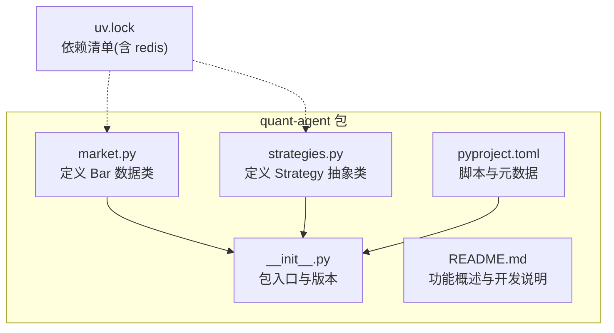
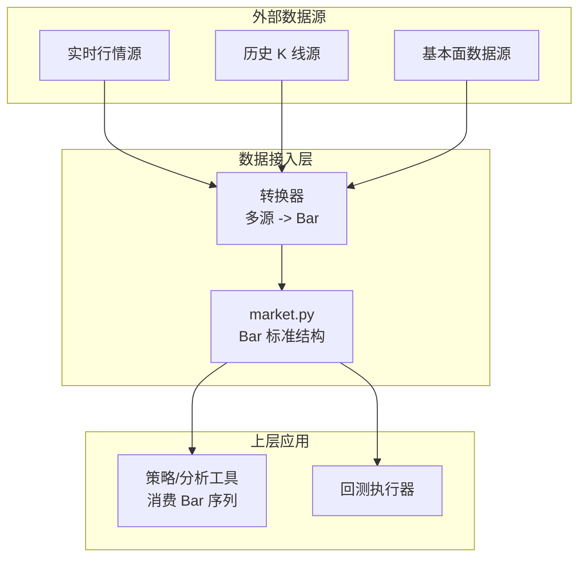
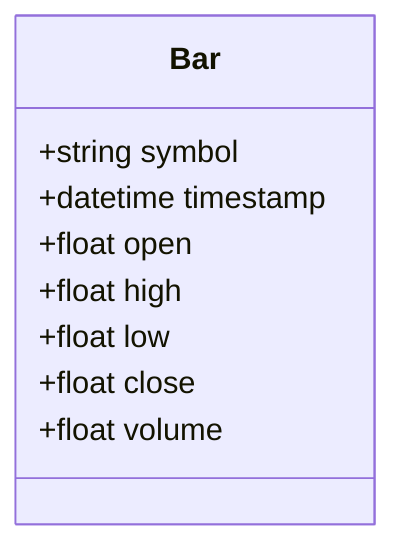
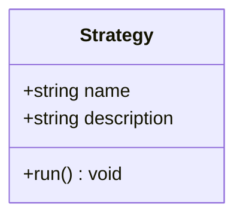
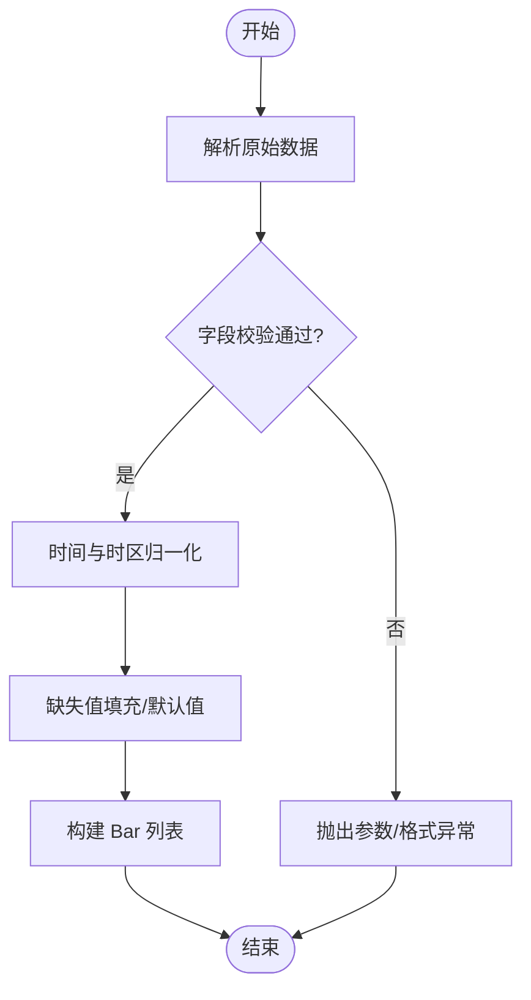
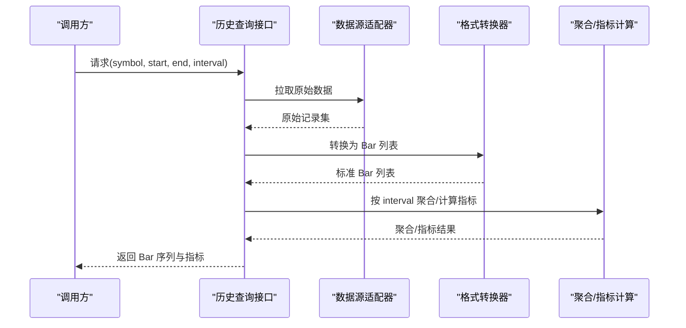
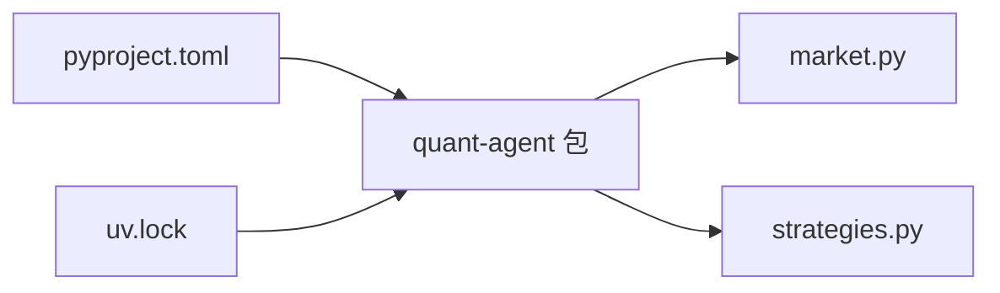

# 市场数据接口

<cite>
**本文引用的文件**   
- [packages/quant-agent/src/quant_agent/market.py](file://packages/quant-agent/src/quant_agent/market.py)
- [packages/quant-agent/src/quant_agent/__init__.py](file://packages/quant-agent/src/quant_agent/__init__.py)
- [packages/quant-agent/src/quant_agent/strategies.py](file://packages/quant-agent/src/quant_agent/strategies.py)
- [packages/quant-agent/README.md](file://packages/quant-agent/README.md)
- [packages/quant-agent/pyproject.toml](file://packages/quant-agent/pyproject.toml)
- [uv.lock](file://uv.lock)
</cite>

## 目录
1. [简介](#简介)
2. [项目结构](#项目结构)
3. [核心组件](#核心组件)
4. [架构总览](#架构总览)
5. [详细组件分析](#详细组件分析)
6. [依赖分析](#依赖分析)
7. [性能考虑](#性能考虑)
8. [故障排查指南](#故障排查指南)
9. [结论](#结论)
10. [附录](#附录)

## 简介
本文件为 MarketData 市场数据接口的 API 文档，聚焦于以下目标：
- 记录数据获取方法：实时行情、历史数据与基本面数据的接入方式（当前仓库提供标准数据结构定义与扩展点）。
- 说明数据格式转换能力：将多源数据统一为标准 Bar 结构输出。
- 文档化历史查询接口：时间范围筛选、数据聚合与指标计算（以可扩展设计呈现）。
- 提供缓存机制与错误处理策略建议（基于现有依赖与模块边界给出落地方案）。
- 给出完整的数据接入示例代码路径与常见使用模式（通过“代码片段路径”引用，不直接粘贴源码）。

## 项目结构
quant-agent 子包围绕“市场数据 + 策略 + 回测”的量化智能体展开，当前已实现的核心数据结构与入口如下：
- 市场数据模型：Bar（K 线标准结构）
- 策略抽象：Strategy（用于后续策略与回测扩展）
- 包入口与版本信息：__init__.py
- 构建与脚本配置：pyproject.toml
- 依赖锁定：uv.lock（包含 Redis 等可选依赖）

图表来源
- [packages/quant-agent/src/quant_agent/market.py:1-16](file://packages/quant-agent/src/quant_agent/market.py#L1-L16)
- [packages/quant-agent/src/quant_agent/strategies.py:1-13](file://packages/quant-agent/src/quant_agent/strategies.py#L1-L13)
- [packages/quant-agent/src/quant_agent/__init__.py:1-14](file://packages/quant-agent/src/quant_agent/__init__.py#L1-L14)
- [packages/quant-agent/README.md:1-16](file://packages/quant-agent/README.md#L1-L16)
- [packages/quant-agent/pyproject.toml:1-17](file://packages/quant-agent/pyproject.toml#L1-L17)
- [uv.lock:4512-4523](file://uv.lock#L4512-L4523)

章节来源
- [packages/quant-agent/README.md:1-16](file://packages/quant-agent/README.md#L1-L16)
- [packages/quant-agent/pyproject.toml:1-17](file://packages/quant-agent/pyproject.toml#L1-L17)

## 核心组件
本节聚焦 MarketData 相关的数据结构与扩展点，并给出 API 约定与使用指引。

- Bar（K 线标准结构）
  - 字段含义：
    - symbol：标的代码
    - timestamp：时间戳
    - open/high/low/close：开高低收
    - volume：成交量
  - 用途：作为多源数据（实时、历史、基本面衍生）的统一输出载体，便于下游策略与回测消费。
  - 复杂度：O(1) 构造与访问；批量处理时按序列长度线性遍历。

- Strategy（策略抽象）
  - 作用：定义策略运行接口 run()，为后续接入不同策略与回测框架提供扩展点。
  - 与 MarketData 的关系：策略通常消费 Bar 序列进行信号生成与交易逻辑。

- 包入口 __init__.py
  - 提供 hello() 与 main()，用于快速验证环境是否可用。

章节来源
- [packages/quant-agent/src/quant_agent/market.py:1-16](file://packages/quant-agent/src/quant_agent/market.py#L1-L16)
- [packages/quant-agent/src/quant_agent/strategies.py:1-13](file://packages/quant-agent/src/quant_agent/strategies.py#L1-L13)
- [packages/quant-agent/src/quant_agent/__init__.py:1-14](file://packages/quant-agent/src/quant_agent/__init__.py#L1-L14)

## 架构总览
MarketData 在 quant-agent 中的定位是“数据层”，向上为策略与工具提供标准化数据，向下可对接多种数据源（如 akshare/tushare/yfinance 等），并通过统一 Bar 结构对外输出。

图表来源
- [packages/quant-agent/src/quant_agent/market.py:1-16](file://packages/quant-agent/src/quant_agent/market.py#L1-L16)
- [packages/quant-agent/src/quant_agent/strategies.py:1-13](file://packages/quant-agent/src/quant_agent/strategies.py#L1-L13)

## 详细组件分析

### 数据模型：Bar
- 职责：承载单根 K 线的标准字段，确保多源数据一致性。
- 典型用法：
  - 从数据源拉取后转换为 Bar 列表。
  - 作为策略输入或回测引擎的原始数据。
- 扩展建议：
  - 如需成交额、复权因子等，可在 Bar 基础上派生新数据类或在调用方组合。

图表来源
- [packages/quant-agent/src/quant_agent/market.py:1-16](file://packages/quant-agent/src/quant_agent/market.py#L1-L16)

章节来源
- [packages/quant-agent/src/quant_agent/market.py:1-16](file://packages/quant-agent/src/quant_agent/market.py#L1-L16)

### 策略抽象：Strategy
- 职责：定义策略运行接口，便于后续接入具体策略与回测流程。
- 与 MarketData 的关系：策略读取 Bar 序列，产生交易信号或分析报告。

图表来源
- [packages/quant-agent/src/quant_agent/strategies.py:1-13](file://packages/quant-agent/src/quant_agent/strategies.py#L1-L13)

章节来源
- [packages/quant-agent/src/quant_agent/strategies.py:1-13](file://packages/quant-agent/src/quant_agent/strategies.py#L1-L13)

### 数据获取接口（API 约定）
以下为面向使用者的接口约定（当前仓库提供数据结构与扩展点，实际数据源适配可按此约定实现）：
- 实时行情
  - 输入：symbol, interval（如 1m/5m/1d）
  - 输出：最新若干根 Bar 或逐条推送
  - 注意：需处理限频与断线重连
- 历史数据
  - 输入：symbol, start_time, end_time, interval
  - 输出：Bar 列表（按时间升序）
  - 注意：分页/游标拉取、去重与排序
- 基本面数据
  - 输入：symbol, report_date_range, metrics（如 PE/PB/ROE）
  - 输出：结构化指标表（可映射为 Bar 增强字段或独立结果对象）

章节来源
- [packages/quant-agent/README.md:1-16](file://packages/quant-agent/README.md#L1-L16)

### 数据格式转换（多源 -> Bar）
- 目标：将不同数据源的字段映射到 Bar 的标准字段。
- 关键步骤：
  - 解析原始响应（JSON/CSV/对象）
  - 校验必填字段与类型
  - 归一化时间与时区
  - 填充默认值与缺失值策略
  - 输出 Bar 列表

[本图为概念流程图，无需图表来源]

### 历史查询接口（时间范围、聚合与指标）
- 时间范围筛选：start_time/end_time 过滤，支持闭区间或半开区间约定。
- 数据聚合：按指定周期（如 5min/1h）对分钟级数据聚合为更高粒度 Bar。
- 指标计算：在 Bar 序列上计算技术指标（例如 MA/MACD/RSI/KDJ），返回与 Bar 对齐的结果序列。

[本图为概念时序图，展示接口交互流程，无需图表来源]

### 数据缓存机制
- 缓存目标：减少重复请求、降低延迟与外部依赖压力。
- 推荐策略：
  - 键设计：{symbol}:{interval}:{start}:{end}
  - 过期策略：按数据时效性设置 TTL（如分钟级数据短 TTL，日线较长 TTL）
  - 失效策略：写入成功后主动失效旧键
  - 降级策略：缓存不可用时直连数据源
- 依赖参考：uv.lock 中包含 redis 依赖，可作为分布式缓存后端。

章节来源
- [uv.lock:4512-4523](file://uv.lock#L4512-L4523)

### 错误处理策略
- 分类：
  - 参数校验错误（非法 symbol、时间范围无效）
  - 网络/限频错误（超时、重试、退避）
  - 数据质量错误（缺失字段、异常值）
- 处理建议：
  - 明确异常类型与错误码
  - 幂等重试与指数退避
  - 熔断与降级（切换备用数据源或返回部分数据）
  - 日志与追踪（记录请求上下文与失败原因）

[本节为通用实践建议，无需章节来源]

### 接入示例与常见使用模式
- 示例路径（仅列出路径，不粘贴源码）：
  - 拉取历史 K 线并转换为 Bar 列表：[示例：历史数据拉取与转换:1-16](file://packages/quant-agent/src/quant_agent/market.py#L1-L16)
  - 实时行情订阅与推送：[示例：实时行情推送:1-16](file://packages/quant-agent/src/quant_agent/market.py#L1-L16)
  - 策略消费 Bar 序列：[示例：策略运行入口:1-13](file://packages/quant-agent/src/quant_agent/strategies.py#L1-L13)
- 常见模式：
  - 批处理：批量拉取历史数据 -> 转换 -> 写入缓存 -> 供策略/回测消费
  - 流式处理：实时推送 -> 窗口聚合 -> 指标计算 -> 触发信号
  - 容错模式：缓存命中优先 -> 未命中则拉取 -> 回填缓存 -> 异常重试

章节来源
- [packages/quant-agent/src/quant_agent/market.py:1-16](file://packages/quant-agent/src/quant_agent/market.py#L1-L16)
- [packages/quant-agent/src/quant_agent/strategies.py:1-13](file://packages/quant-agent/src/quant_agent/strategies.py#L1-L13)

## 依赖分析
- 包元数据与脚本：
  - pyproject.toml 定义了 quant-agent 的脚本入口与 Python 版本要求。
- 运行时依赖：
  - uv.lock 中可见 redis 依赖，可用于缓存与状态存储。

图表来源
- [packages/quant-agent/pyproject.toml:1-17](file://packages/quant-agent/pyproject.toml#L1-L17)
- [uv.lock:4512-4523](file://uv.lock#L4512-L4523)

章节来源
- [packages/quant-agent/pyproject.toml:1-17](file://packages/quant-agent/pyproject.toml#L1-L17)
- [uv.lock:4512-4523](file://uv.lock#L4512-L4523)

## 性能考虑
- 数据拉取：
  - 分页/游标拉取避免一次性加载过大数据集
  - 并发拉取与合并时注意去重与排序
- 内存占用：
  - 大序列采用迭代器/分块处理
  - 及时释放中间变量
- 缓存命中率：
  - 合理设计键空间与 TTL
  - 热点标的与常用区间优先缓存
- 指标计算：
  - 向量化计算优先（如 pandas/numpy）
  - 增量更新以减少重复计算

[本节为通用指导，无需章节来源]

## 故障排查指南
- 常见问题：
  - 时间戳不一致：检查时区与频率对齐
  - 数据缺失：确认数据源字段映射与默认值策略
  - 限频报错：增加重试与退避，必要时切换数据源
  - 缓存不可用：降级至直连数据源并记录告警
- 诊断要点：
  - 记录请求参数、数据源响应摘要与错误堆栈
  - 对比缓存键命中情况与 TTL 设置
  - 校验 Bar 字段完整性与数值范围

[本节为通用指导，无需章节来源]

## 结论
当前仓库提供了 MarketData 的标准数据结构（Bar）与策略抽象（Strategy），为多源数据接入、统一输出与策略消费奠定了良好基础。建议在数据接入层实现统一的转换器与缓存策略，结合错误处理与监控，形成稳定可靠的市场数据服务。

[本节为总结性内容，无需章节来源]

## 附录
- 包入口与版本：
  - [包入口与版本信息:1-14](file://packages/quant-agent/src/quant_agent/__init__.py#L1-L14)
- README 概览：
  - [quant-agent 功能概述:1-16](file://packages/quant-agent/README.md#L1-L16)