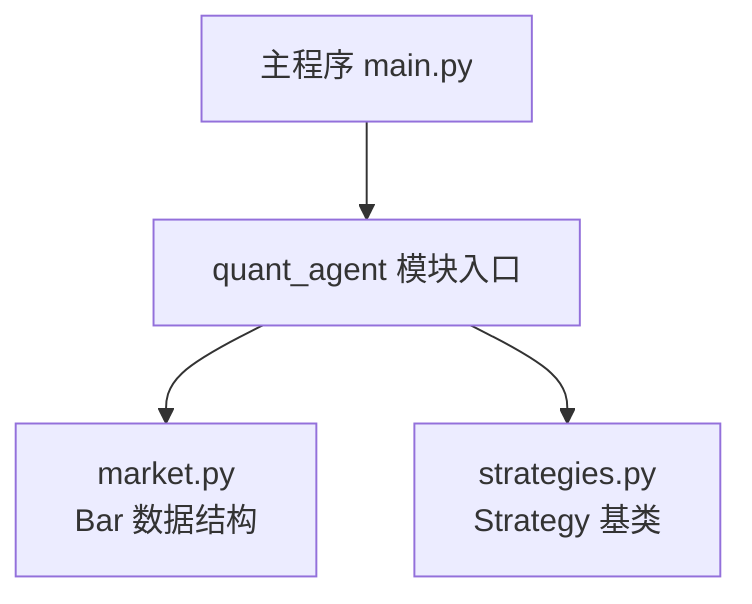
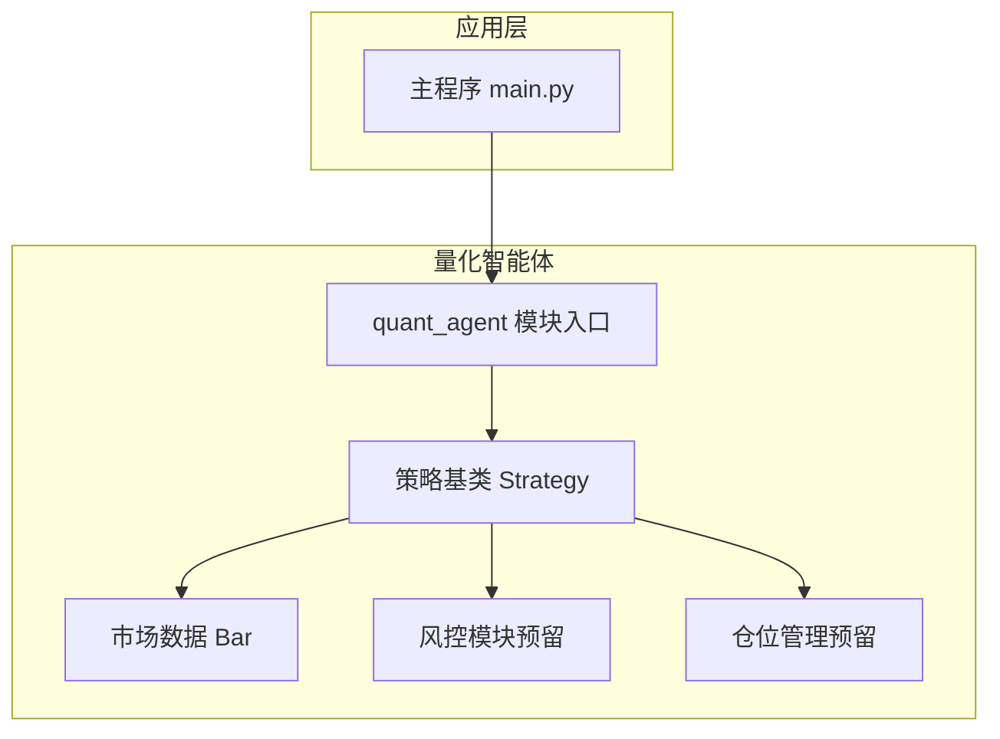
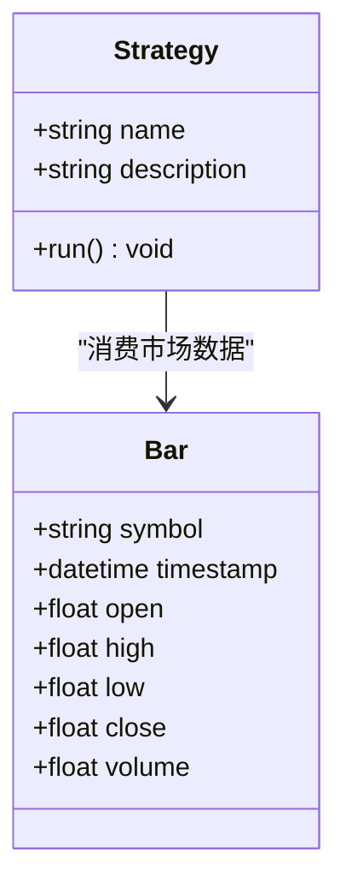
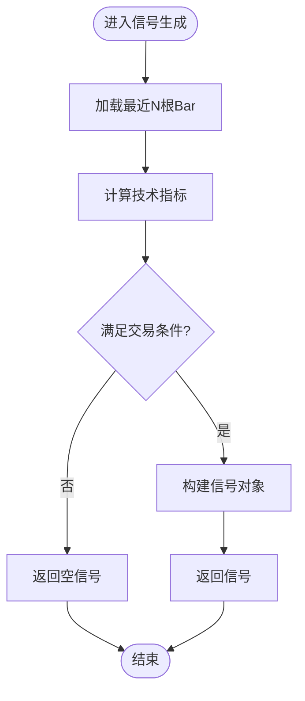
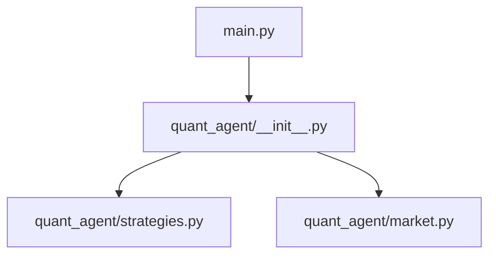

# 策略开发接口

<cite>
**本文引用的文件**   
- [main.py](file://main.py)
- [quant_agent/__init__.py](file://packages/quant-agent/src/quant_agent/__init__.py)
- [quant_agent/market.py](file://packages/quant-agent/src/quant_agent/market.py)
- [quant_agent/strategies.py](file://packages/quant-agent/src/quant_agent/strategies.py)
</cite>

## 目录
1. [简介](#简介)
2. [项目结构](#项目结构)
3. [核心组件](#核心组件)
4. [架构总览](#架构总览)
5. [详细组件分析](#详细组件分析)
6. [依赖分析](#依赖分析)
7. [性能考虑](#性能考虑)
8. [故障排查指南](#故障排查指南)
9. [结论](#结论)
10. [附录](#附录)

## 简介
本文件面向量化策略开发者，提供 Strategy 策略基类的完整开发接口文档。内容覆盖：
- 信号生成方法的实现规范（技术指标计算、条件判断与信号输出格式）
- 仓位管理接口（动态仓位调整、分批建仓与平仓逻辑）
- 风险控制集成点（止损止盈设置、最大回撤控制）
- 策略生命周期管理（初始化、运行、清理阶段）
- 完整的量化策略开发示例与最佳实践指南

本项目为多智能体框架的一部分，其中“理性之面”负责市场数据、策略与回测执行；“感性之面”负责对话与记忆等辅助能力。本文聚焦于 quant-agent 子包中的策略接口设计。

## 项目结构
仓库采用多包组织方式，与策略相关的关键代码位于 packages/quant-agent 下，包含：
- 策略基类定义
- 市场数据结构（K线 Bar）
- 模块入口与版本信息

图表来源
- [main.py:1-13](file://main.py#L1-L13)
- [quant_agent/__init__.py:1-15](file://packages/quant-agent/src/quant_agent/__init__.py#L1-L15)
- [quant_agent/market.py:1-16](file://packages/quant-agent/src/quant_agent/market.py#L1-L16)
- [quant_agent/strategies.py:1-13](file://packages/quant-agent/src/quant_agent/strategies.py#L1-L13)

章节来源
- [main.py:1-13](file://main.py#L1-L13)
- [quant_agent/__init__.py:1-15](file://packages/quant-agent/src/quant_agent/__init__.py#L1-L15)

## 核心组件
- 策略基类 Strategy：提供策略的标识信息与统一运行入口 run()，子类需实现具体交易逻辑。
- 市场数据 Bar：标准 K 线数据结构，包含标的、时间戳与 OHLCV 字段，供策略进行指标计算与信号生成。

章节来源
- [quant_agent/strategies.py:1-13](file://packages/quant-agent/src/quant_agent/strategies.py#L1-L13)
- [quant_agent/market.py:1-16](file://packages/quant-agent/src/quant_agent/market.py#L1-L16)

## 架构总览
下图展示了从主程序到策略与市场数据的调用关系，以及未来扩展的风险控制与仓位管理模块位置。

图表来源
- [main.py:1-13](file://main.py#L1-L13)
- [quant_agent/__init__.py:1-15](file://packages/quant-agent/src/quant_agent/__init__.py#L1-L15)
- [quant_agent/strategies.py:1-13](file://packages/quant-agent/src/quant_agent/strategies.py#L1-L13)
- [quant_agent/market.py:1-16](file://packages/quant-agent/src/quant_agent/market.py#L1-L16)

## 详细组件分析

### 策略基类 Strategy 接口规范
- 目标
  - 为所有交易策略提供统一的抽象基类，确保策略具备一致的命名、描述与运行入口。
- 属性
  - name：策略名称（字符串），用于识别与日志记录。
  - description：策略说明（字符串），用于文档与展示。
- 方法
  - run()：策略主循环或单次运行入口。当前基类抛出未实现异常，子类必须重写以实现具体逻辑。
- 扩展建议
  - 在子类中实现以下生命周期钩子（推荐）：
    - on_init()：初始化参数、加载历史数据、准备指标缓存等。
    - on_bar(bar)：逐根 K 线处理，计算指标、生成信号、触发下单。
    - on_close()：周期结束后的收尾工作，如统计汇总、状态持久化。
  - 信号输出格式（建议）：
    - 使用结构化对象或字典，至少包含：symbol、direction（多头/空头/中性）、size（数量或比例）、reason（触发原因）、timestamp（时间戳）。
  - 与仓位管理和风控的协作：
    - 通过仓位管理接口提交订单请求，由仓位管理器结合风控规则最终生成可执行指令。

图表来源
- [quant_agent/strategies.py:1-13](file://packages/quant-agent/src/quant_agent/strategies.py#L1-L13)
- [quant_agent/market.py:1-16](file://packages/quant-agent/src/quant_agent/market.py#L1-L16)

章节来源
- [quant_agent/strategies.py:1-13](file://packages/quant-agent/src/quant_agent/strategies.py#L1-L13)

### 市场数据 Bar 数据结构
- 字段说明
  - symbol：标的代码（字符串）
  - timestamp：K 线时间戳（datetime）
  - open/high/low/close/volume：开盘价、最高价、最低价、收盘价、成交量（float）
- 用途
  - 作为策略输入的基本单位，支撑技术指标计算与信号生成。
- 注意事项
  - 时间戳应保证单调递增且无重复。
  - 价格与成交量需做基础校验（非负、合理范围）。

章节来源
- [quant_agent/market.py:1-16](file://packages/quant-agent/src/quant_agent/market.py#L1-L16)

### 信号生成方法实现规范
- 输入
  - 最新 Bar 序列或窗口数据（例如最近 N 根 K 线）。
  - 可选：账户状态快照（用于仓位与风险约束）。
- 处理流程
  - 技术指标计算：基于 Bar 序列计算趋势、波动率、动量等指标。
  - 条件判断：将指标阈值、形态识别或模型输出转化为交易信号。
  - 信号输出：按约定格式返回结构化信号对象。
- 输出格式（建议）
  - 字段：symbol、direction、size、reason、timestamp
  - direction 取值：多头、空头、中性
  - size 可为绝对数量或相对比例（需在仓位管理中归一化）
- 错误与边界
  - 数据不足时返回空信号或等待。
  - 指标计算失败时应记录日志并跳过该时刻。

[此图为概念流程图，不直接映射具体源码文件]

### 仓位管理接口（预留扩展）
- 职责
  - 接收策略信号，结合账户资金、持仓与风控规则，计算实际下单数量与价格。
- 关键能力
  - 动态仓位调整：根据波动率、夏普比率或回撤等因子动态缩放仓位。
  - 分批建仓：将大单拆分为多笔小单，降低冲击成本。
  - 平仓逻辑：支持按信号、时间或风控触发自动减仓或清仓。
- 接口契约（建议）
  - submit_order(signal) -> order_id
  - cancel_order(order_id) -> bool
  - get_position(symbol) -> position_info
  - set_risk_limits(limits) -> bool
- 与风控集成
  - 在下单前检查止损止盈、单笔亏损上限、最大回撤等限制。

[本节为接口设计建议，尚未在源码中实现]

### 风险控制集成点（预留扩展）
- 止损止盈
  - 入场后设置初始止损与止盈价位，随行情推进可移动止损（追踪止损）。
- 最大回撤控制
  - 监控组合净值曲线，当回撤超过阈值时降低仓位或暂停开新仓。
- 头寸集中度与相关性
  - 限制单一标的或高相关性标的的暴露度。
- 事件驱动
  - 实时监听成交回报与行情推送，及时更新风控状态。

[本节为接口设计建议，尚未在源码中实现]

### 策略生命周期管理（推荐扩展）
- 初始化阶段 on_init()
  - 加载配置、历史数据与指标缓存。
  - 注册回调与风控规则。
- 运行阶段 on_bar(bar)
  - 增量更新指标，生成信号，提交订单。
- 清理阶段 on_close()
  - 保存状态、输出报告、释放资源。
- 异常恢复
  - 断线重连、数据补齐、状态一致性校验。

[本节为生命周期设计建议，尚未在源码中实现]

### 量化策略开发示例（参考路径）
- 示例要点
  - 继承 Strategy 基类，实现 run() 或推荐的 on_init/on_bar/on_close。
  - 使用 Bar 数据计算指标，生成符合约定的信号。
  - 通过仓位管理与风控接口完成下单与风险控制。
- 参考路径
  - 策略基类定义：[quant_agent/strategies.py:1-13](file://packages/quant-agent/src/quant_agent/strategies.py#L1-L13)
  - 市场数据结构：[quant_agent/market.py:1-16](file://packages/quant-agent/src/quant_agent/market.py#L1-L16)
  - 模块入口与版本：[quant_agent/__init__.py:1-15](file://packages/quant-agent/src/quant_agent/__init__.py#L1-L15)
  - 主程序入口：[main.py:1-13](file://main.py#L1-L13)

[本节为示例指引，不包含具体代码片段]

### 最佳实践指南
- 数据与指标
  - 对缺失值与异常值进行预处理；指标计算避免未来函数。
- 信号与风控
  - 信号与风控解耦：策略只负责发出意图，风控决定最终是否执行。
  - 使用标准化信号格式，便于回测与实盘复用。
- 仓位与执行
  - 分批建仓与滑点预估；避免在流动性差的时段频繁交易。
- 可观测性
  - 记录关键指标、信号与订单流水；提供可视化面板。
- 测试与验证
  - 单元测试覆盖指标与信号逻辑；回测验证稳健性与过拟合检测。

[本节为通用指导，不直接分析具体文件]

## 依赖分析
- 主程序 main.py 导入并调用 quant_agent 与 companion_agent 的 hello() 方法，体现模块化装配。
- quant_agent 模块提供版本信息与入口函数，策略与市场数据在其内部组织。
- 当前策略基类与 Bar 数据之间为弱耦合，便于后续扩展风控与仓位管理。

图表来源
- [main.py:1-13](file://main.py#L1-L13)
- [quant_agent/__init__.py:1-15](file://packages/quant-agent/src/quant_agent/__init__.py#L1-L15)
- [quant_agent/strategies.py:1-13](file://packages/quant-agent/src/quant_agent/strategies.py#L1-L13)
- [quant_agent/market.py:1-16](file://packages/quant-agent/src/quant_agent/market.py#L1-L16)

章节来源
- [main.py:1-13](file://main.py#L1-L13)
- [quant_agent/__init__.py:1-15](file://packages/quant-agent/src/quant_agent/__init__.py#L1-L15)

## 性能考虑
- 指标计算
  - 使用滑动窗口与增量更新，避免每根 K 线全量重算。
- 内存占用
  - 仅保留必要长度的历史窗口；定期清理中间变量。
- I/O 与网络
  - 批量拉取历史数据；减少高频远程调用。
- 并发与异步
  - 指标计算与信号生成可并行化；注意线程安全与锁粒度。
- 数值稳定性
  - 防止除零与溢出；对极端行情做平滑与限幅。

[本节为通用指导，不直接分析具体文件]

## 故障排查指南
- 常见问题
  - 未实现异常：若直接调用基类 run() 会抛出未实现异常，请确保子类重写。
  - 数据缺失：Bar 时间戳不连续或缺少字段会导致指标计算失败。
  - 信号为空：条件未满足或数据不足时返回空信号属正常行为。
- 定位步骤
  - 检查 Bar 数据完整性与时间顺序。
  - 打印指标与条件判断中间结果。
  - 确认信号输出字段是否符合约定。
- 日志与监控
  - 记录关键节点的时间戳与状态变化，便于回放与复现。

章节来源
- [quant_agent/strategies.py:1-13](file://packages/quant-agent/src/quant_agent/strategies.py#L1-L13)
- [quant_agent/market.py:1-16](file://packages/quant-agent/src/quant_agent/market.py#L1-L16)

## 结论
本文档基于现有代码库梳理了 Strategy 策略基类与 Bar 市场数据结构，给出了信号生成、仓位管理、风险控制与生命周期的接口设计与实现规范建议。建议在后续迭代中逐步落地仓位管理与风控模块，完善策略生命周期钩子，提升系统的可扩展性与稳健性。

## 附录
- 术语
  - 信号：策略发出的交易意图，包含方向、数量与原因。
  - 仓位：账户中持有的标的数量或价值占比。
  - 风控：对交易行为进行约束与保护的机制集合。
- 参考路径
  - 策略基类：[quant_agent/strategies.py:1-13](file://packages/quant-agent/src/quant_agent/strategies.py#L1-L13)
  - 市场数据：[quant_agent/market.py:1-16](file://packages/quant-agent/src/quant_agent/market.py#L1-L16)
  - 模块入口：[quant_agent/__init__.py:1-15](file://packages/quant-agent/src/quant_agent/__init__.py#L1-L15)
  - 主程序：[main.py:1-13](file://main.py#L1-L13)