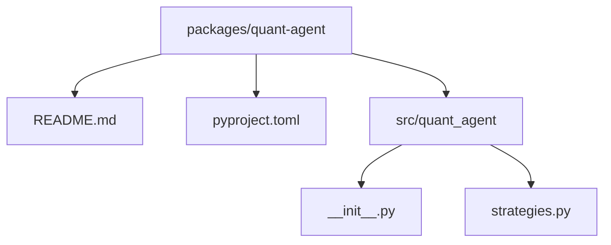
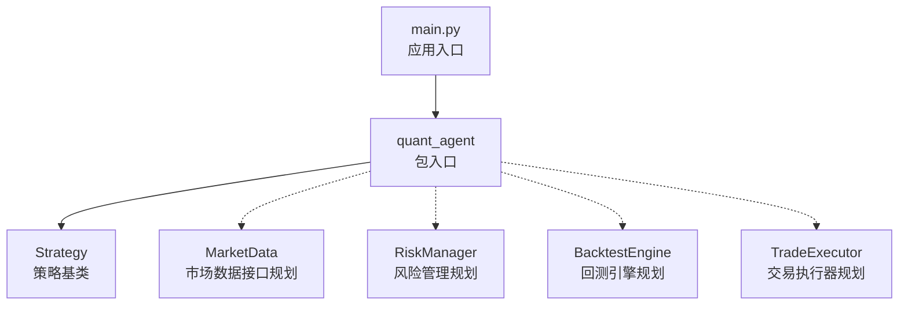
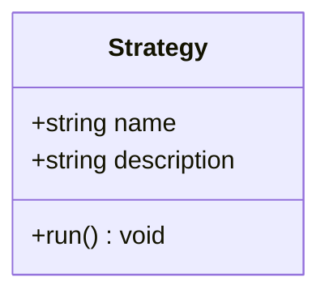
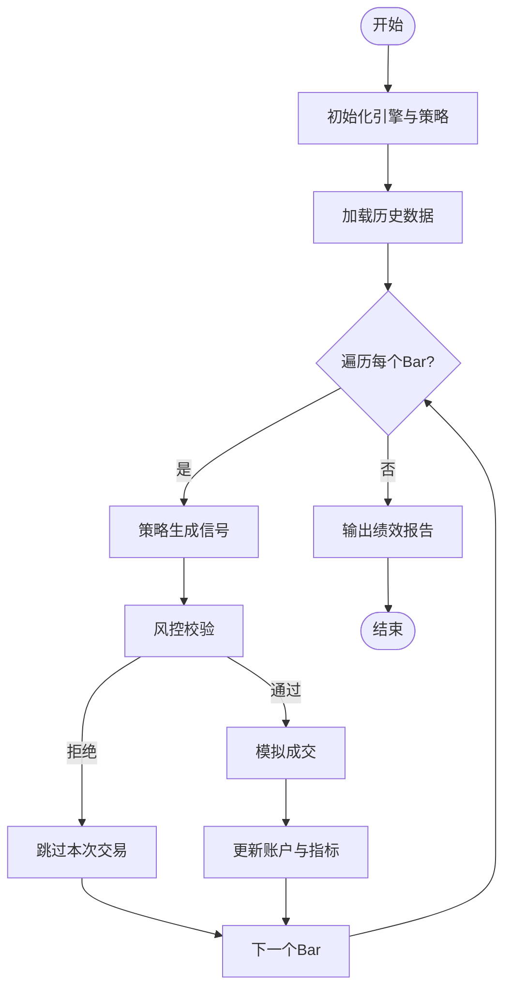
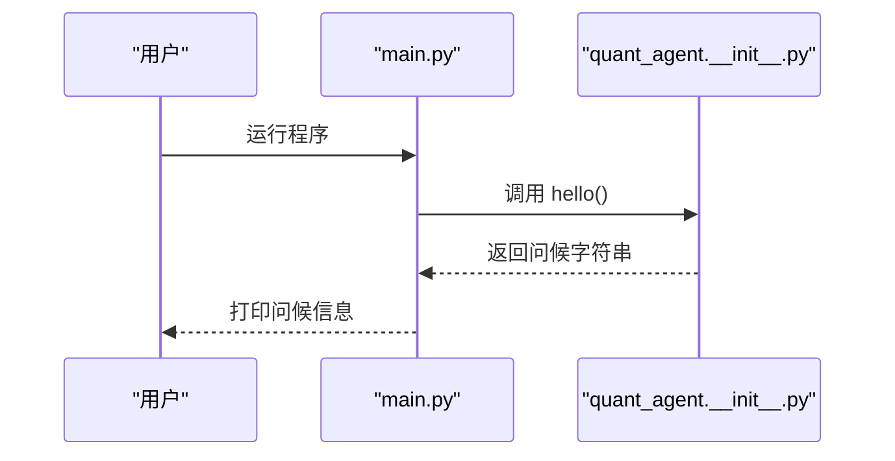
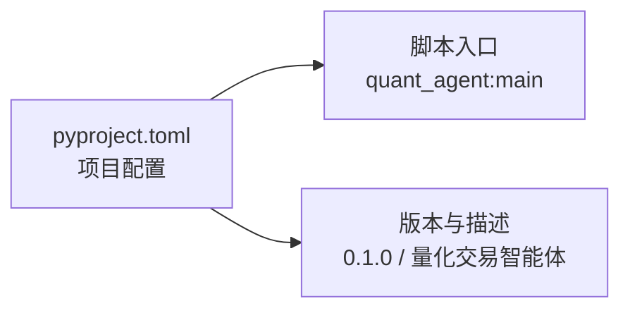

# 量化交易 API

<cite>
**本文引用的文件**   
- [packages/quant-agent/README.md](file://packages/quant-agent/README.md)
- [packages/quant-agent/pyproject.toml](file://packages/quant-agent/pyproject.toml)
- [packages/quant-agent/src/quant_agent/__init__.py](file://packages/quant-agent/src/quant_agent/__init__.py)
- [packages/quant-agent/src/quant_agent/strategies.py](file://packages/quant-agent/src/quant_agent/strategies.py)
- [main.py](file://main.py)
</cite>

## 目录
1. [简介](#简介)
2. [项目结构](#项目结构)
3. [核心组件](#核心组件)
4. [架构总览](#架构总览)
5. [详细组件分析](#详细组件分析)
6. [依赖分析](#依赖分析)
7. [性能考虑](#性能考虑)
8. [故障排查指南](#故障排查指南)
9. [结论](#结论)
10. [附录](#附录)

## 简介
本仓库的 quant-agent 子模块定位为“量化交易智能体”，提供市场数据（K线/Bar 结构）、交易策略定义与回测框架，面向数据驱动的投资决策。当前版本为骨架阶段，已暴露最小可用入口与策略基类，后续将逐步完善数据接入、风险管理、执行器与回测引擎等能力。

## 项目结构
quant-agent 采用典型的 Python 包组织方式：
- 包根包含 README 与 pyproject 配置，用于描述与构建
- src/quant_agent 下放置核心实现，目前包括：
  - __init__.py：包入口、命令行脚本绑定与示例 hello/main
  - strategies.py：策略基类 Strategy 的定义

图表来源
- [packages/quant-agent/README.md:1-16](file://packages/quant-agent/README.md#L1-L16)
- [packages/quant-agent/pyproject.toml:1-18](file://packages/quant-agent/pyproject.toml#L1-L18)
- [packages/quant-agent/src/quant_agent/__init__.py:1-14](file://packages/quant-agent/src/quant_agent/__init__.py#L1-L14)
- [packages/quant-agent/src/quant_agent/strategies.py:1-12](file://packages/quant-agent/src/quant_agent/strategies.py#L1-L12)

章节来源
- [packages/quant-agent/README.md:1-16](file://packages/quant-agent/README.md#L1-L16)
- [packages/quant-agent/pyproject.toml:1-18](file://packages/quant-agent/pyproject.toml#L1-L18)
- [packages/quant-agent/src/quant_agent/__init__.py:1-14](file://packages/quant-agent/src/quant_agent/__init__.py#L1-L14)
- [packages/quant-agent/src/quant_agent/strategies.py:1-12](file://packages/quant-agent/src/quant_agent/strategies.py#L1-L12)

## 核心组件
- MarketData（市场数据接口）
  - 目标：统一获取历史 K 线/Bar、实时行情与基本面数据，并提供格式转换与历史查询方法。
  - 现状：文档层面已规划该接口；当前代码库尚未提供具体实现。
- Strategy（策略基类）
  - 目标：定义策略开发的最小契约，包含名称、描述与 run 生命周期钩子，供子类实现信号生成、仓位管理与风控逻辑。
  - 现状：已在 strategies.py 中提供基础骨架。
- RiskManager（风险管理器）
  - 目标：提供止损止盈设置、仓位限制与风险评估能力。
  - 现状：待实现。
- BacktestEngine（回测引擎）
  - 目标：基于历史数据进行回测，输出绩效指标与分析结果。
  - 现状：待实现。
- TradeExecutor（交易执行器）
  - 目标：订单管理、滑点控制与成交确认机制。
  - 现状：待实现。

章节来源
- [packages/quant-agent/README.md:1-16](file://packages/quant-agent/README.md#L1-L16)
- [packages/quant-agent/src/quant_agent/strategies.py:1-12](file://packages/quant-agent/src/quant_agent/strategies.py#L1-L12)

## 架构总览
下图展示 quant-agent 在整体系统中的位置与交互关系。顶层 main.py 作为应用入口，调用 quant_agent 提供的能力；quant-agent 内部以 Strategy 为核心扩展点，未来将与 MarketData、RiskManager、BacktestEngine、TradeExecutor 协作完成从数据到交易的闭环。

图表来源
- [main.py:1-12](file://main.py#L1-L12)
- [packages/quant-agent/src/quant_agent/__init__.py:1-14](file://packages/quant-agent/src/quant_agent/__init__.py#L1-L14)
- [packages/quant-agent/src/quant_agent/strategies.py:1-12](file://packages/quant-agent/src/quant_agent/strategies.py#L1-L12)

## 详细组件分析

### Strategy 策略基类
- 设计要点
  - 通过 dataclass 提供 name、description 两个字段，便于注册与识别策略。
  - 提供 run 抽象方法，要求子类实现策略主循环或单次运行逻辑。
- 使用建议
  - 子类应覆盖 run，在其中集成 MarketData 获取数据、计算信号、调用 RiskManager 评估风险、并通过 TradeExecutor 下单。
  - 可在 run 内维护状态机（如空仓/持仓/平仓），结合风险控制规则进行仓位管理。
- 复杂度与可扩展性
  - 当前为 O(1) 初始化；run 的时间复杂度取决于策略逻辑与数据规模。
  - 可通过组合模式引入更多服务（数据、风控、执行）以提升可测试性与复用性。

图表来源
- [packages/quant-agent/src/quant_agent/strategies.py:1-12](file://packages/quant-agent/src/quant_agent/strategies.py#L1-L12)

章节来源
- [packages/quant-agent/src/quant_agent/strategies.py:1-12](file://packages/quant-agent/src/quant_agent/strategies.py#L1-L12)

### MarketData 市场数据接口（规划）
- 职责边界
  - 数据获取：历史 K 线/Bar、实时行情、基本面信息。
  - 格式转换：统一返回结构（例如标准化时间戳、价格序列、成交量等）。
  - 历史查询：按标的、周期、起止时间范围检索。
- 典型方法（概念性）
  - get_historical_bars(symbol, interval, start, end) -> Bars
  - get_realtime_quote(symbol) -> Quote
  - convert_to_dataframe(bars) -> DataFrame
- 错误处理
  - 网络异常、限频、缺失数据、时间戳对齐等异常需明确抛出并记录日志。
- 性能建议
  - 本地缓存热点数据；批量拉取时分页/游标；惰性加载减少内存占用。

[本节为概念性说明，未直接分析具体源码文件]

### RiskManager 风险管理器（规划）
- 功能范围
  - 止损止盈：支持固定比例、ATR 动态、追踪止损等。
  - 仓位限制：单标的上限、组合敞口、杠杆约束。
  - 风险评估：VaR、最大回撤、波动率阈值触发。
- 接口约定（概念性）
  - set_stop_loss(tp, sl)
  - check_position_limits(position) -> bool
  - risk_assess(portfolio) -> Report
- 与策略集成
  - 在下单前调用 check_position_limits 与 risk_assess，拒绝超限订单。

[本节为概念性说明，未直接分析具体源码文件]

### BacktestEngine 回测引擎（规划）
- 能力清单
  - 历史数据回放、事件驱动或向量化回测。
  - 费用模型（佣金、滑点、冲击成本）。
  - 绩效指标（年化收益、夏普比率、最大回撤、胜率等）。
- 关键流程（概念性）
  - 初始化引擎与策略实例 -> 加载历史数据 -> 逐 Bar 推进 -> 策略产生信号 -> 风控校验 -> 模拟成交 -> 更新账户与指标 -> 输出报告。

[本节为概念性说明，未直接分析具体源码文件]

### TradeExecutor 交易执行器（规划）
- 职责
  - 订单管理：创建、修改、撤销、状态跟踪。
  - 滑点控制：限价/市价单滑点模型、部分成交处理。
  - 成交确认：对账单匹配、延迟与失败重试。
- 与策略集成
  - 策略仅关注信号与期望头寸，执行细节由 TradeExecutor 封装。

[本节为概念性说明，未直接分析具体源码文件]

### 应用入口与运行方式
- 包入口
  - quant_agent.hello 与 quant_agent.main 提供简单演示与 CLI 绑定。
- 顶层入口
  - main.py 作为应用启动点，调用 quant_agent.hello 打印问候语。

图表来源
- [main.py:1-12](file://main.py#L1-L12)
- [packages/quant-agent/src/quant_agent/__init__.py:1-14](file://packages/quant-agent/src/quant_agent/__init__.py#L1-L14)

章节来源
- [packages/quant-agent/src/quant_agent/__init__.py:1-14](file://packages/quant-agent/src/quant_agent/__init__.py#L1-L14)
- [main.py:1-12](file://main.py#L1-L12)

## 依赖分析
- 包元数据
  - 项目名称：quant-agent
  - 版本：0.1.0
  - 描述：JanusAgent 理性之面 — 量化交易智能体
  - 构建后端：uv_build
  - 脚本入口：quant-agent = quant_agent:main
- 运行时依赖
  - 当前无第三方依赖声明，便于快速起步与最小化环境。

图表来源
- [packages/quant-agent/pyproject.toml:1-18](file://packages/quant-agent/pyproject.toml#L1-L18)

章节来源
- [packages/quant-agent/pyproject.toml:1-18](file://packages/quant-agent/pyproject.toml#L1-L18)

## 性能考虑
- 数据层
  - 优先使用增量/分页拉取；对热点标的做本地缓存；避免全量重复读取。
- 策略层
  - 将重计算逻辑缓存或懒加载；尽量使用向量化操作处理大规模时序数据。
- 回测层
  - 事件驱动模式下注意对象分配与锁竞争；向量化模式注意内存峰值。
- 执行层
  - 合并订单批次、控制并发度；对失败订单实施指数退避重试。

[本节为通用指导，不直接分析具体源码文件]

## 故障排查指南
- 常见问题
  - 无法找到 quant_agent 模块：检查包安装路径与 PYTHONPATH；确认 uv sync 后环境激活。
  - 运行命令无效：确认 pyproject.scripts 中的入口函数存在且可导入。
  - 策略未实现 run：继承 Strategy 的子类必须实现 run，否则会抛出未实现异常。
- 定位步骤
  - 使用顶层 main.py 验证入口是否可正常打印问候语。
  - 逐步引入 MarketData/RiskManager/BacktestEngine/TradeExecutor 的占位实现，隔离问题域。
  - 开启日志与异常堆栈，记录关键输入参数与中间状态。

章节来源
- [packages/quant-agent/src/quant_agent/__init__.py:1-14](file://packages/quant-agent/src/quant_agent/__init__.py#L1-L14)
- [packages/quant-agent/src/quant_agent/strategies.py:1-12](file://packages/quant-agent/src/quant_agent/strategies.py#L1-L12)
- [packages/quant-agent/pyproject.toml:12-14](file://packages/quant-agent/pyproject.toml#L12-L14)

## 结论
当前 quant-agent 处于骨架阶段，已提供策略基类与最小入口，便于快速搭建自定义策略与后续扩展。下一步建议优先落地 MarketData 数据接入与格式规范，随后补齐 RiskManager、BacktestEngine 与 TradeExecutor，形成从数据到执行的完整闭环。

## 附录
- 快速上手
  - 安装依赖：uv sync
  - 运行：uv run quant-agent
- 参考
  - 包说明与运行方式参见 README。

章节来源
- [packages/quant-agent/README.md:1-16](file://packages/quant-agent/README.md#L1-L16)