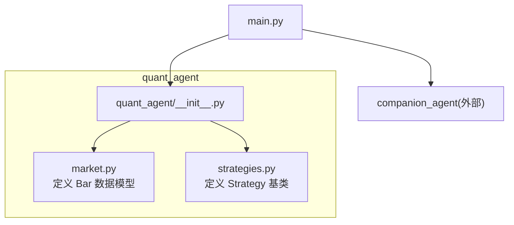
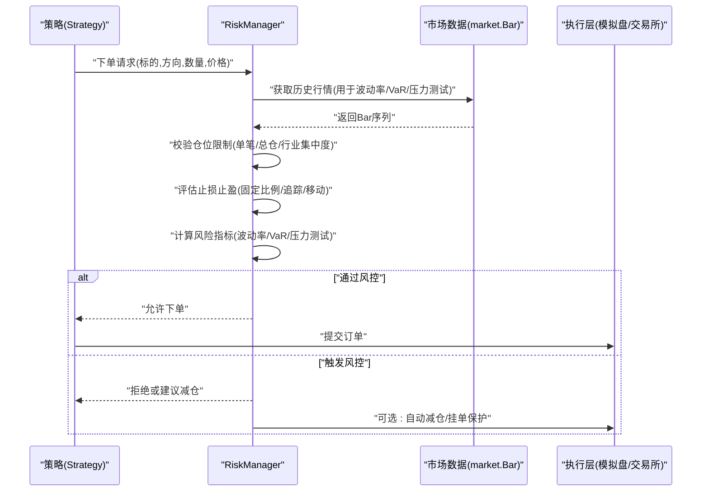
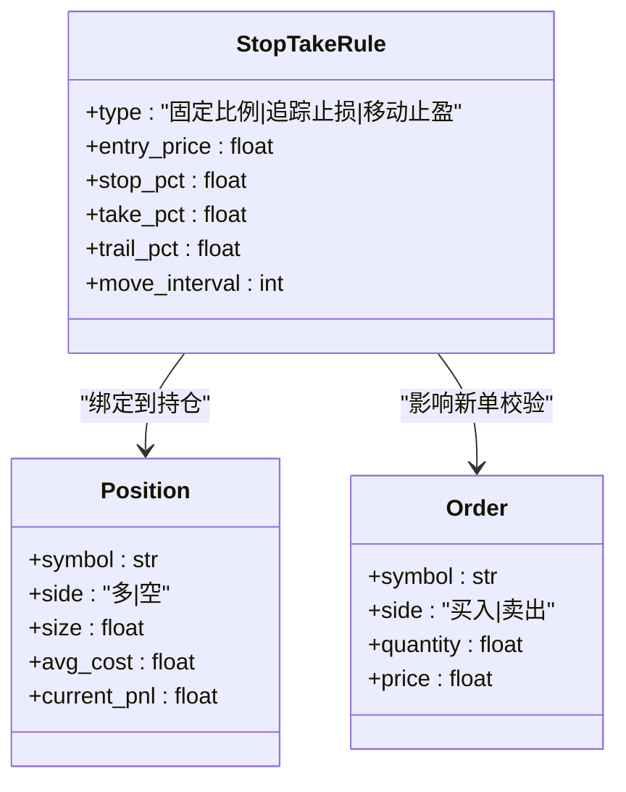
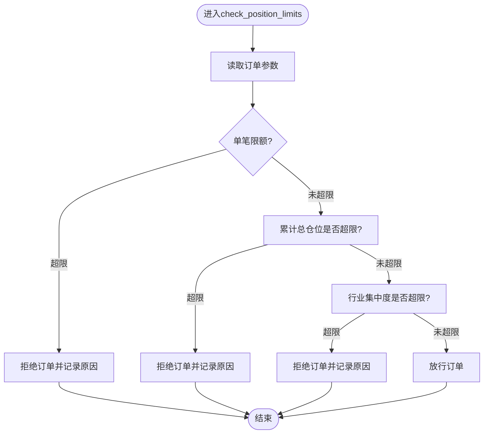
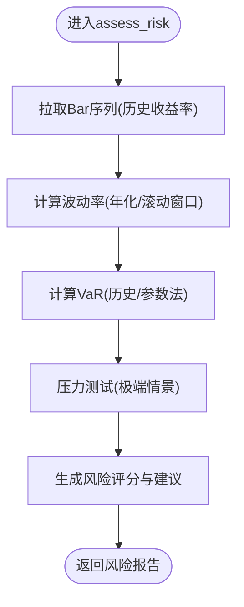
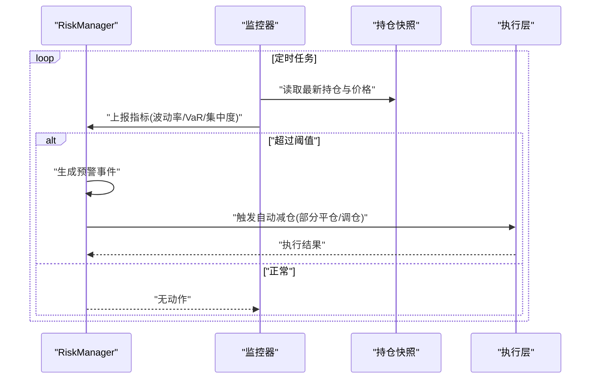
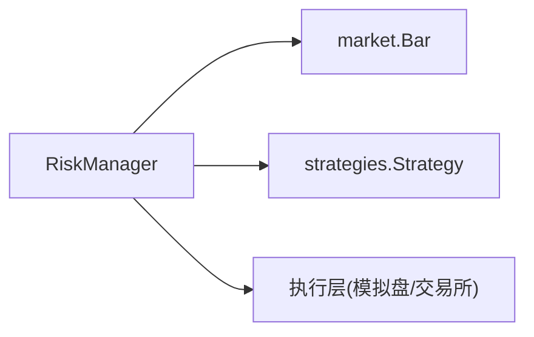

# 风险管理接口

<cite>
**本文引用的文件**   
- [main.py](file://main.py)
- [quant_agent/__init__.py](file://packages/quant-agent/src/quant_agent/__init__.py)
- [quant_agent/market.py](file://packages/quant-agent/src/quant_agent/market.py)
- [quant_agent/strategies.py](file://packages/quant-agent/src/quant_agent/strategies.py)
- [coding.md](file://.agent/rules/coding.md)
</cite>

## 目录
1. [简介](#简介)
2. [项目结构](#项目结构)
3. [核心组件](#核心组件)
4. [架构总览](#架构总览)
5. [详细组件分析](#详细组件分析)
6. [依赖分析](#依赖分析)
7. [性能考虑](#性能考虑)
8. [故障排查指南](#故障排查指南)
9. [结论](#结论)
10. [附录](#附录)

## 简介
本文件为 RiskManager（风险管理器）的 API 设计文档，聚焦以下能力：
- 止损止盈设置：支持固定比例、追踪止损与移动止盈等类型
- 仓位限制：单笔交易限额、总仓位控制、行业集中度限制
- 风险评估：波动率计算、VaR 分析与压力测试
- 风险预警：阈值监控与自动减仓逻辑
- 配置示例与实际应用场景说明

重要说明：当前仓库中尚未实现 RiskManager 的具体代码。本文档基于现有量化模块（市场数据 Bar、策略基类 Strategy）与编码规范，给出可落地的接口设计与集成方案，便于后续在 quant-agent 包内扩展实现。

## 项目结构
当前仓库中与风险管理相关的可用基础构件位于 quant-agent 包：
- 市场数据模型：Bar（K线/Bar 结构）
- 策略抽象：Strategy（策略运行入口）
- 顶层入口：main.py（聚合调用各子包）

图表来源
- [main.py:1-13](file://main.py#L1-L13)
- [quant_agent/__init__.py:1-15](file://packages/quant-agent/src/quant_agent/__init__.py#L1-L15)
- [quant_agent/market.py:1-16](file://packages/quant-agent/src/quant_agent/market.py#L1-L16)
- [quant_agent/strategies.py:1-13](file://packages/quant-agent/src/quant_agent/strategies.py#L1-L13)

章节来源
- [main.py:1-13](file://main.py#L1-L13)
- [quant_agent/__init__.py:1-15](file://packages/quant-agent/src/quant_agent/__init__.py#L1-L15)
- [quant_agent/market.py:1-16](file://packages/quant-agent/src/quant_agent/market.py#L1-L16)
- [quant_agent/strategies.py:1-13](file://packages/quant-agent/src/quant_agent/strategies.py#L1-L13)

## 核心组件
- 市场数据模型 Bar：提供 OHLCV 时间序列基础单元，是波动率、VaR 与压力测试的数据源。
- 策略基类 Strategy：统一策略运行入口，RiskManager 可在策略执行前后进行风控拦截与调整。
- 编码规范：要求公开函数具备类型注解、Google 风格 docstring、明确错误处理，这为 RiskManager 的接口契约奠定基础。

章节来源
- [quant_agent/market.py:1-16](file://packages/quant-agent/src/quant_agent/market.py#L1-L16)
- [quant_agent/strategies.py:1-13](file://packages/quant-agent/src/quant_agent/strategies.py#L1-L13)
- [coding.md:1-65](file://.agent/rules/coding.md#L1-L65)

## 架构总览
下图展示 RiskManager 在策略执行流程中的位置与交互关系。RiskManager 作为横切关注点，对订单与持仓进行前置校验、动态止损止盈管理、组合风险度量与预警处置。

图表来源
- [quant_agent/strategies.py:1-13](file://packages/quant-agent/src/quant_agent/strategies.py#L1-L13)
- [quant_agent/market.py:1-16](file://packages/quant-agent/src/quant_agent/market.py#L1-L16)

## 详细组件分析

### RiskManager 类与方法概览
- 职责
  - 止损止盈管理：固定比例止损/止盈、追踪止损、移动止盈
  - 仓位限制：单笔限额、总仓位上限、行业集中度上限
  - 风险评估：波动率、VaR、压力测试
  - 风险预警：阈值监控、自动减仓
- 关键方法（建议）
  - set_stop_take_rules(rules): 设置止损止盈规则
  - check_position_limits(order): 校验仓位限制
  - assess_risk(positions, market_data): 计算风险指标
  - monitor_and_alert(): 周期扫描并触发预警
  - auto_reduce_if_needed(alert): 根据预警执行自动减仓
- 输入输出约定
  - 输入以 Bar 序列为主，结合当前持仓与订单信息
  - 输出包含是否放行、建议动作（加仓/减仓/平仓）、风险评分与指标明细

章节来源
- [coding.md:1-65](file://.agent/rules/coding.md#L1-L65)

#### 止损止盈规则数据结构
- 固定比例止损/止盈：按入场价百分比设定触发价
- 追踪止损：随最高盈利回撤一定幅度触发
- 移动止盈：按时间或价格区间动态上移止盈位

图表来源
- [quant_agent/market.py:1-16](file://packages/quant-agent/src/quant_agent/market.py#L1-L16)

章节来源
- [quant_agent/market.py:1-16](file://packages/quant-agent/src/quant_agent/market.py#L1-L16)

#### 仓位限制检查流程

图表来源
- [quant_agent/strategies.py:1-13](file://packages/quant-agent/src/quant_agent/strategies.py#L1-L13)

章节来源
- [quant_agent/strategies.py:1-13](file://packages/quant-agent/src/quant_agent/strategies.py#L1-L13)

#### 风险评估流程（波动率/VaR/压力测试）

图表来源
- [quant_agent/market.py:1-16](file://packages/quant-agent/src/quant_agent/market.py#L1-L16)

章节来源
- [quant_agent/market.py:1-16](file://packages/quant-agent/src/quant_agent/market.py#L1-L16)

#### 风险预警与自动减仓时序

图表来源
- [quant_agent/strategies.py:1-13](file://packages/quant-agent/src/quant_agent/strategies.py#L1-L13)

章节来源
- [quant_agent/strategies.py:1-13](file://packages/quant-agent/src/quant_agent/strategies.py#L1-L13)

### 配置项与示例
- 止损止盈配置
  - fixed_stop_pct: 固定止损比例
  - fixed_take_pct: 固定止盈比例
  - trail_pct: 追踪止损回撤比例
  - move_interval: 移动止盈重估间隔（分钟或根数）
- 仓位限制配置
  - single_order_limit: 单笔最大名义价值
  - total_position_limit: 组合总仓位上限
  - sector_concentration_limit: 单一行业权重上限
- 风险评估配置
  - vol_window: 波动率滚动窗口长度
  - var_confidence: VaR置信水平
  - stress_scenarios: 压力情景列表（如“单日跌幅5%”、“流动性枯竭”）
- 预警与自动减仓配置
  - alert_thresholds: 风险指标阈值字典
  - auto_reduce_ratio: 自动减仓比例
  - reduce_max_per_step: 单次最大减仓比例

章节来源
- [coding.md:1-65](file://.agent/rules/coding.md#L1-L65)

### 实际应用场景
- 场景一：趋势跟踪策略启用追踪止损
  - 在策略 run() 前调用 RiskManager.set_stop_take_rules() 注入追踪止损参数
  - 每次信号产生后，先经 check_position_limits() 校验，再提交订单
- 场景二：高波动环境下的 VaR 控制
  - 使用 assess_risk() 计算滚动 VaR，若超过阈值则降低仓位或暂停开新仓
- 场景三：行业集中度过高时的自动减仓
  - monitor_and_alert() 检测到行业权重超限时，触发 auto_reduce_if_needed() 按比例减仓至安全区间

章节来源
- [quant_agent/strategies.py:1-13](file://packages/quant-agent/src/quant_agent/strategies.py#L1-L13)
- [quant_agent/market.py:1-16](file://packages/quant-agent/src/quant_agent/market.py#L1-L16)

## 依赖分析
- 内部依赖
  - RiskManager 依赖 market.Bar 作为数据源
  - RiskManager 与 Strategy 协作，在策略执行前后进行风控拦截
- 外部依赖
  - 执行层（模拟盘/交易所）：接收最终订单
- 耦合与内聚
  - RiskManager 应仅暴露最小必要接口，保持与策略和执行的松耦合
  - 数据流集中于 Bar 序列，避免跨模块状态泄露

图表来源
- [quant_agent/market.py:1-16](file://packages/quant-agent/src/quant_agent/market.py#L1-L16)
- [quant_agent/strategies.py:1-13](file://packages/quant-agent/src/quant_agent/strategies.py#L1-L13)

章节来源
- [quant_agent/market.py:1-16](file://packages/quant-agent/src/quant_agent/market.py#L1-L16)
- [quant_agent/strategies.py:1-13](file://packages/quant-agent/src/quant_agent/strategies.py#L1-L13)

## 性能考虑
- 批量计算：对多标的同时计算波动率与 VaR 时，优先向量化计算，减少循环开销
- 缓存策略：对高频指标（如滚动波动率）采用增量更新与滑动窗口缓存
- 异步化：monitor_and_alert() 与 assess_risk() 可异步执行，避免阻塞策略主线程
- 限流与退避：当执行层响应慢或失败时，自动降级为只读风控模式

[本节为通用指导，不直接分析具体文件]

## 故障排查指南
- 常见问题
  - 订单被风控拒绝：检查单笔限额、总仓位与行业集中度配置是否正确
  - 止损未触发：确认入场价、止损比例与追踪止损参数是否生效
  - VaR 异常：核查 Bar 序列质量与缺失值处理
- 定位步骤
  - 打印 RiskManager 中间状态（规则、指标、决策）
  - 对比策略信号与风控决策日志
  - 回放历史 Bar 序列复现问题
- 参考规范
  - 遵循编码规范中的错误处理与类型注解要求，确保可观测性与可维护性

章节来源
- [coding.md:1-65](file://.agent/rules/coding.md#L1-L65)

## 结论
本文档基于现有量化模块与编码规范，给出了 RiskManager 的完整接口设计、数据流与集成方式。建议在 quant-agent 包内新增 risk_manager.py 实现上述接口，并在策略 run() 前后接入风控校验与预警机制，逐步完善止损止盈、仓位限制、风险评估与自动减仓能力。

[本节为总结性内容，不直接分析具体文件]

## 附录
- 术语
  - 固定比例止损/止盈：按入场价百分比设定的触发价
  - 追踪止损：随最高盈利回撤一定幅度触发
  - 移动止盈：按时间或价格区间动态上移止盈位
  - VaR：在给定置信水平下的最大可能损失
  - 压力测试：在极端市场情景下评估组合表现
- 相关入口
  - main.py 聚合调用 quant_agent 与 companion_agent，可作为未来接入 RiskManager 的统一入口

章节来源
- [main.py:1-13](file://main.py#L1-L13)
- [quant_agent/__init__.py:1-15](file://packages/quant-agent/src/quant_agent/__init__.py#L1-L15)