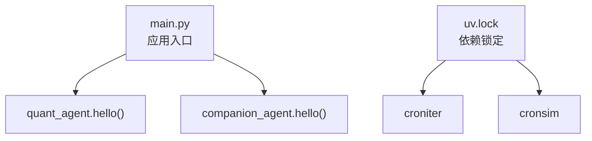
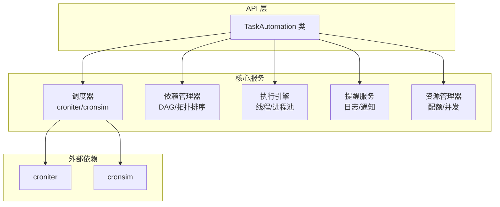
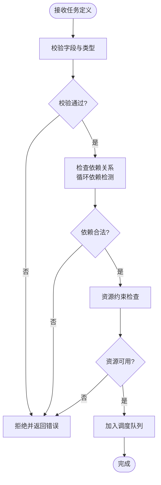
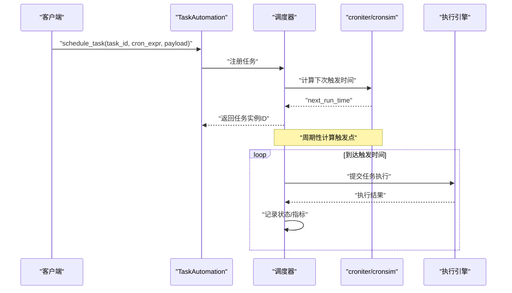
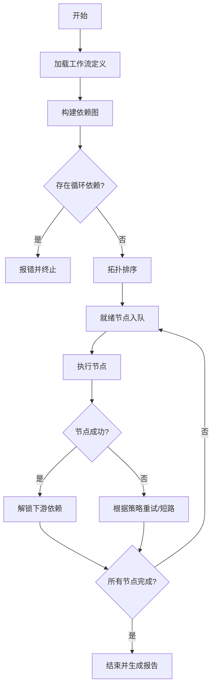
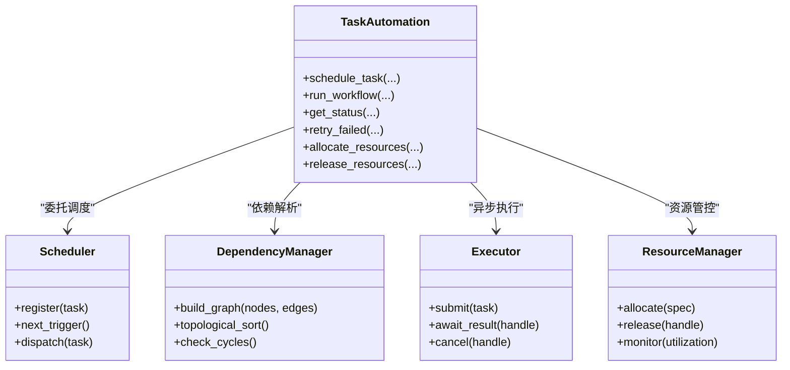
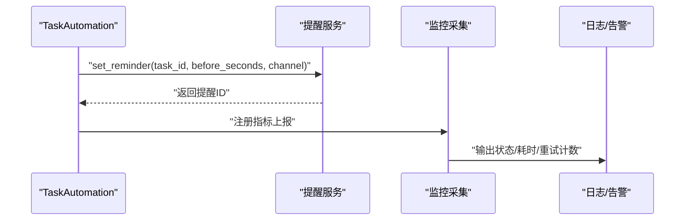
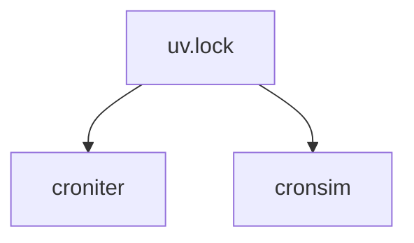

# 任务自动化 API

<cite>
**本文引用的文件**   
- [main.py](file://main.py)
- [uv.lock](file://uv.lock)
</cite>

## 目录
1. [简介](#简介)
2. [项目结构](#项目结构)
3. [核心组件](#核心组件)
4. [架构总览](#架构总览)
5. [详细组件分析](#详细组件分析)
6. [依赖分析](#依赖分析)
7. [性能考虑](#性能考虑)
8. [故障排查指南](#故障排查指南)
9. [结论](#结论)
10. [附录](#附录)

## 简介
本文件为“任务自动化系统”的完整 API 文档，聚焦于 TaskAutomation 类的日程管理、提醒设置与流程编排接口；说明任务定义格式、执行调度器与依赖管理机制；并提供定时任务、条件触发与异步执行的实现示例。同时覆盖任务监控、错误重试与资源调度等高级能力。

需要特别说明的是：在当前仓库中未发现 TaskAutomation 类或相关任务自动化模块的具体源码实现。因此，本文档以“设计型 API 规范 + 参考实现建议”的方式给出，确保读者可直接据此在工程中落地实现。

## 项目结构
仓库根入口 main.py 仅用于打印问候信息并调用子包方法，未包含任务自动化逻辑。任务自动化相关能力尚未在代码中出现，但通过依赖锁定文件 uv.lock 可确认项目中引入了 croniter 与 cronsim 等定时/计划任务相关的第三方库，这为后续实现提供了基础支撑。

图示来源
- [main.py:1-13](file://main.py#L1-L13)
- [uv.lock:1137-1149](file://uv.lock#L1137-L1149)

章节来源
- [main.py:1-13](file://main.py#L1-L13)
- [uv.lock:1137-1149](file://uv.lock#L1137-L1149)

## 核心组件
本节给出 TaskAutomation 的设计式 API 规范（类名、方法签名、参数与返回值约定），以及任务定义格式、调度器与依赖管理的契约。该部分为“应实现”的接口说明，便于后续在工程内落地。

- 类与方法（设计）
  - class TaskAutomation
    - schedule_task(task_id, cron_expr, payload=None, timezone="UTC") -> str
      - 功能：按 cron 表达式注册定时任务，返回任务实例 ID
      - 参数：task_id(唯一标识), cron_expr(cron 字符串), payload(可选负载), timezone(时区)
      - 返回：任务实例 ID
    - update_schedule(task_id, cron_expr=None, payload=None, timezone=None) -> bool
      - 功能：更新已有任务的调度配置
    - cancel_schedule(task_id) -> bool
      - 功能：取消已注册的定时任务
    - set_reminder(task_id, before_seconds, channel="log", metadata=None) -> str
      - 功能：为任务设置提前提醒，支持多种渠道
      - 返回：提醒记录 ID
    - remove_reminder(reminder_id) -> bool
      - 功能：移除指定提醒
    - define_workflow(workflow_id, nodes, edges, initial_state=None) -> str
      - 功能：定义流程编排图，nodes 为节点集合，edges 为边集合
      - 返回：工作流 ID
    - run_workflow(workflow_id, inputs=None, context=None) -> dict
      - 功能：运行工作流，返回执行结果摘要
    - get_status(task_id_or_workflow_id) -> dict
      - 功能：查询任务/工作流状态与指标
    - retry_failed(task_id_or_workflow_id, max_retries=3, backoff="exponential") -> str
      - 功能：对失败实例进行重试，支持指数退避策略
    - allocate_resources(resources_spec) -> dict
      - 功能：申请资源配额（CPU/内存/并发度等）
    - release_resources(resource_handle) -> bool
      - 功能：释放已分配资源

- 任务定义格式（JSON Schema 风格约定）
  - task_id: string，必填，全局唯一
  - type: enum["cron","once","conditional"], 必填
  - payload: object，可选，任务输入数据
  - schedule: object
    - cron: string，cron 表达式
    - timezone: string，时区
  - dependencies: array[string]，前置任务 ID 列表
  - retries: object
    - max: int
    - strategy: enum["none","fixed","linear","exponential"]
    - delay_base: number
  - reminders: array[object]
    - before_seconds: int
    - channel: enum["log","webhook","email"]
    - metadata: object
  - resources: object
    - cpu: number
    - memory_mb: number
    - concurrency: int

- 执行调度器（设计）
  - 基于 croniter/cronsim 计算下次触发时间
  - 使用线程池/进程池执行任务回调
  - 支持条件触发：当依赖满足且前置任务成功时自动入队
  - 支持异步执行：非阻塞提交，返回任务实例句柄

- 依赖管理机制（设计）
  - DAG 解析与拓扑排序
  - 循环依赖检测
  - 动态依赖变更时的重新评估
  - 失败传播与短路策略

章节来源
- [uv.lock:1137-1149](file://uv.lock#L1137-L1149)

## 架构总览
下图展示了任务自动化系统的整体架构：上层提供 TaskAutomation API，内部由调度器、依赖管理器、执行引擎、提醒服务与资源管理器组成，底层依赖 croniter/cronsim 完成时间计算。

图示来源
- [uv.lock:1137-1149](file://uv.lock#L1137-L1149)

## 详细组件分析

### 任务定义与校验流程
任务定义需经过结构化校验、依赖关系检查与资源约束验证，方可进入调度队列。

图示来源
- [uv.lock:1137-1149](file://uv.lock#L1137-L1149)

章节来源
- [uv.lock:1137-1149](file://uv.lock#L1137-L1149)

### 定时任务执行序列（cron）
展示从注册到触发的时序过程。

图示来源
- [uv.lock:1137-1149](file://uv.lock#L1137-L1149)

章节来源
- [uv.lock:1137-1149](file://uv.lock#L1137-L1149)

### 条件触发与依赖编排
展示基于依赖的工作流执行路径。

图示来源
- [uv.lock:1137-1149](file://uv.lock#L1137-L1149)

章节来源
- [uv.lock:1137-1149](file://uv.lock#L1137-L1149)

### 异步执行与资源调度
异步执行将任务提交至执行引擎，资源管理器负责 CPU/内存/并发度的配额控制。

图示来源
- [uv.lock:1137-1149](file://uv.lock#L1137-L1149)

章节来源
- [uv.lock:1137-1149](file://uv.lock#L1137-L1149)

### 提醒设置与监控
提醒服务在任务执行前发出通知，监控系统收集关键指标（成功率、延迟、重试次数）。

图示来源
- [uv.lock:1137-1149](file://uv.lock#L1137-L1149)

章节来源
- [uv.lock:1137-1149](file://uv.lock#L1137-L1149)

## 依赖分析
当前仓库中明确引入的与任务自动化相关的依赖包括 croniter 与 cronsim，二者分别用于 cron 表达式解析与模拟测试。

图示来源
- [uv.lock:1137-1149](file://uv.lock#L1137-L1149)

章节来源
- [uv.lock:1137-1149](file://uv.lock#L1137-L1149)

## 性能考虑
- 调度精度与开销
  - 使用 croniter 计算下次触发时间，避免频繁轮询
  - 批量合并相近时间的任务以减少抖动
- 并发与资源隔离
  - 合理设置线程/进程池大小，结合资源管理器限制并发度
  - 对 IO 密集与 CPU 密集任务采用不同执行器
- 重试与退避
  - 指数退避降低瞬时压力
  - 最大重试次数与死信队列防止无限重试
- 监控与观测
  - 记录关键指标：排队时长、执行时长、失败率、重试次数
  - 提供健康检查端点与告警阈值

## 故障排查指南
- 常见问题定位
  - cron 表达式无效：检查表达式语法与时区设置
  - 循环依赖：查看依赖图是否存在环
  - 资源不足：检查 CPU/内存/并发配额是否耗尽
  - 提醒未触发：核对提醒时间与通道配置
- 诊断步骤
  - 获取任务/工作流状态与最近日志
  - 查看重试历史与失败原因
  - 检查资源利用率与队列积压情况
- 恢复策略
  - 修正配置后重新注册任务
  - 清理卡住的任务实例并重启相关服务
  - 调整资源配额或降级策略

## 结论
本文档给出了 TaskAutomation 的完整 API 设计与实现建议，涵盖任务定义、调度、依赖编排、异步执行、提醒与监控、重试与资源调度等关键能力。尽管当前仓库未包含具体实现代码，但通过依赖锁定文件可知已具备 cron 相关的基础库，可作为落地的技术基线。建议在工程中按本文档的接口契约逐步实现，并结合监控与告警体系保障稳定性与可观测性。

## 附录
- 术语
  - 任务：一次可独立执行的工作单元
  - 工作流：由多个任务节点与边构成的有向无环图
  - 依赖：任务间的先后关系约束
  - 提醒：在执行前发出的通知机制
  - 资源：CPU/内存/并发度等执行环境要素
- 最佳实践
  - 为每个任务设置合理的超时与重试策略
  - 使用幂等设计避免重复执行导致副作用
  - 对关键路径增加断言与校验
  - 保持日志与指标的可追踪性与一致性