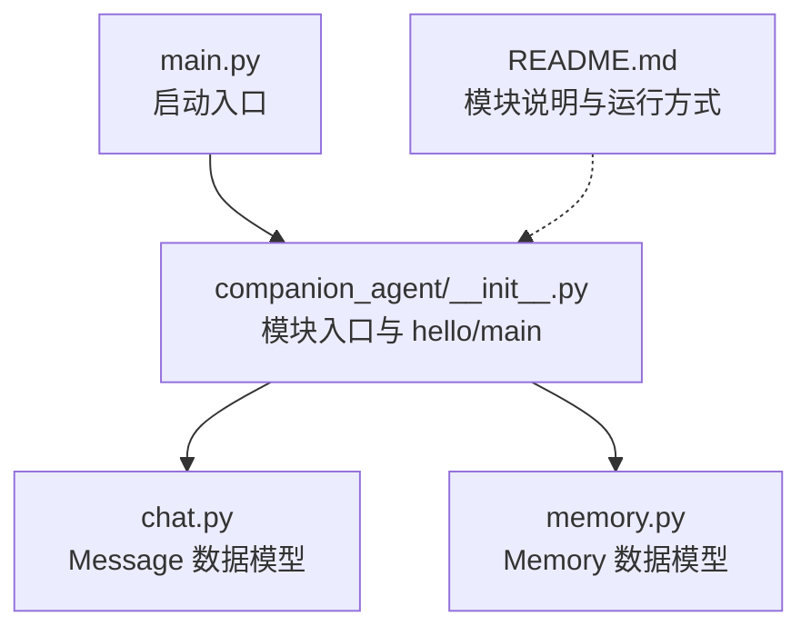
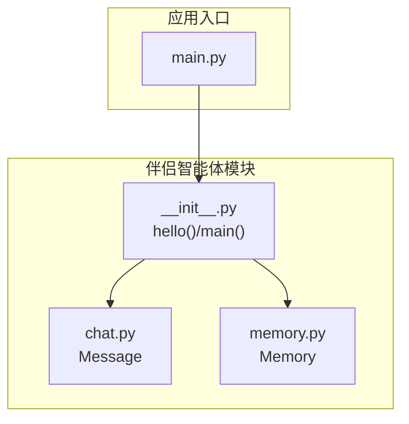
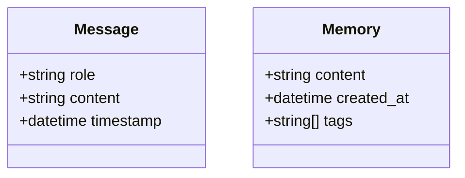
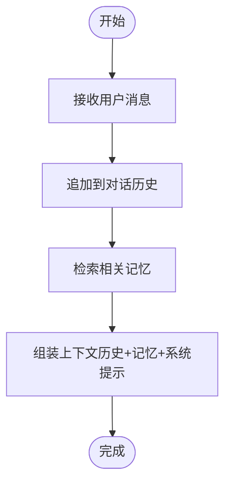
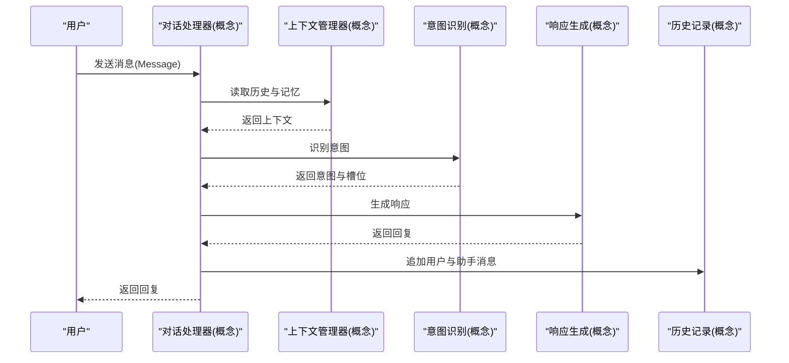
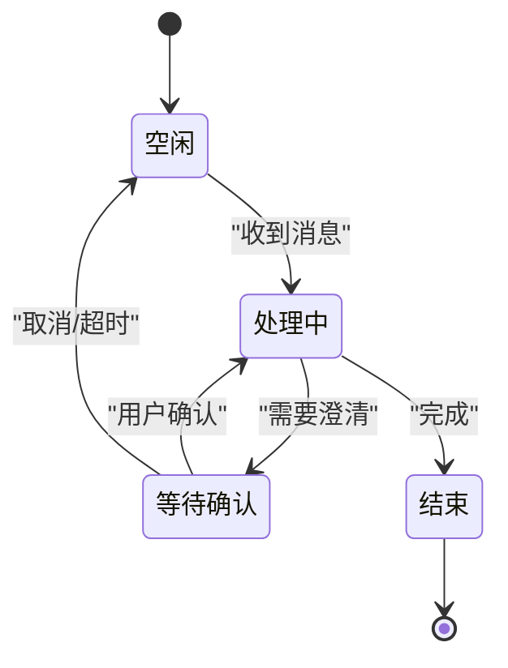
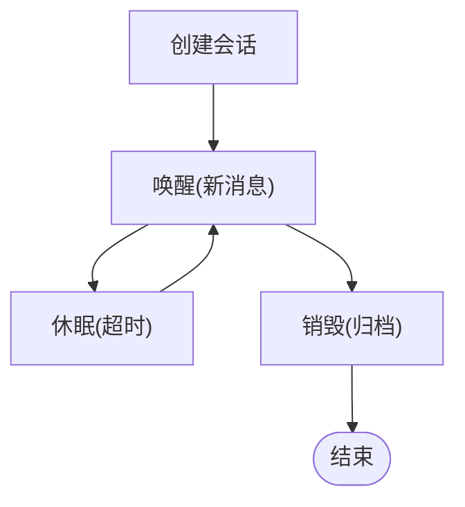
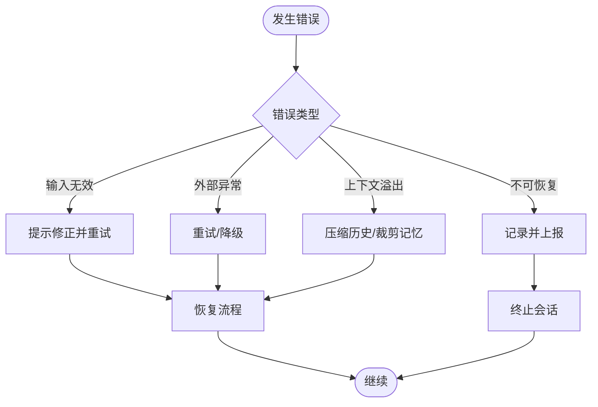
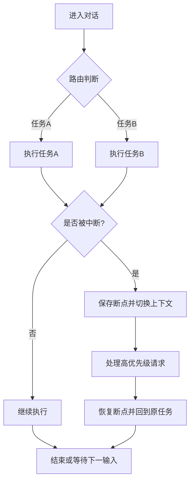
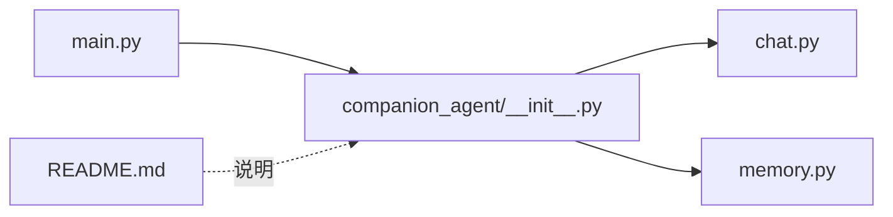

# 对话管理 API

<cite>
**本文引用的文件**   
- [main.py](file://main.py)
- [companion_agent/__init__.py](file://packages/companion-agent/src/companion_agent/__init__.py)
- [chat.py](file://packages/companion-agent/src/ com panion_agent/chat.py)
- [memory.py](file://packages/companion-agent/src/companion_agent/memory.py)
- [README.md](file://packages/companion-agent/README.md)
</cite>

## 目录
1. [简介](#简介)
2. [项目结构](#项目结构)
3. [核心组件](#核心组件)
4. [架构总览](#架构总览)
5. [详细组件分析](#详细组件分析)
6. [依赖分析](#依赖分析)
7. [性能考虑](#性能考虑)
8. [故障排查指南](#故障排查指南)
9. [结论](#结论)
10. [附录](#附录)

## 简介
本文件为“对话管理系统”的 API 文档，聚焦于多轮对话处理接口与能力边界。当前仓库提供了对话数据模型（消息、记忆）以及一个情感陪伴智能体模块的入口与说明。基于现有代码，本文给出：
- 消息接收与上下文维护的数据契约
- 会话状态管理与对话历史追踪的设计建议
- 对话上下文构建机制、意图识别与响应生成流程的概念性设计
- 对话状态机、生命周期与错误恢复策略的实现示例（概念级）
- 对话流控制、中断处理与上下文切换的高级用法（概念级）

注意：当前仓库未提供 ConversationHandler 类的具体实现，因此本节以数据模型与模块入口为依据，给出可扩展的 API 设计与最佳实践。

## 项目结构
仓库采用多包组织方式，与对话管理相关的主要位于 companion-agent 包中，包含：
- 对话数据模型：消息、记忆
- 模块入口与版本信息
- 顶层主程序用于聚合各子模块

图示来源
- [main.py:1-13](file://main.py#L1-L13)
- [companion_agent/__init__.py:1-15](file://packages/companion-agent/src/companion_agent/__init__.py#L1-L15)
- [chat.py:1-12](file://packages/companion-agent/src/companion_agent/chat.py#L1-L12)
- [memory.py:1-12](file://packages/companion-agent/src/companion_agent/memory.py#L1-L12)
- [README.md:1-16](file://packages/companion-agent/README.md#L1-L16)

章节来源
- [main.py:1-13](file://main.py#L1-L13)
- [companion_agent/__init__.py:1-15](file://packages/companion-agent/src/companion_agent/__init__.py#L1-L15)
- [chat.py:1-12](file://packages/companion-agent/src/companion_agent/chat.py#L1-L12)
- [memory.py:1-12](file://packages/companion-agent/src/companion_agent/memory.py#L1-L12)
- [README.md:1-16](file://packages/companion-agent/README.md#L1-L16)

## 核心组件
- 消息模型（Message）
  - 角色：用户或助手
  - 内容：文本消息体
  - 时间戳：消息产生时间
- 记忆模型（Memory）
  - 内容：长期记忆片段
  - 创建时间：持久化时间
  - 标签：用于检索与过滤的记忆标签

这些数据结构构成了对话上下文的基础单元，可用于构建会话历史、检索相关记忆并参与意图识别与响应生成。

章节来源
- [chat.py:1-12](file://packages/companion-agent/src/companion_agent/chat.py#L1-L12)
- [memory.py:1-12](file://packages/companion-agent/src/companion_agent/memory.py#L1-L12)

## 架构总览
从现有入口与数据模型出发，可抽象出如下高层架构：
- 入口层：主程序加载并调用子模块
- 模块层：companion_agent 提供对话与记忆的数据契约
- 数据层：Message 与 Memory 作为上下文与历史的载体

图示来源
- [main.py:1-13](file://main.py#L1-L13)
- [companion_agent/__init__.py:1-15](file://packages/companion-agent/src/companion_agent/__init__.py#L1-L15)
- [chat.py:1-12](file://packages/companion-agent/src/companion_agent/chat.py#L1-L12)
- [memory.py:1-12](file://packages/companion-agent/src/companion_agent/memory.py#L1-L12)

## 详细组件分析

### 数据模型类图

图示来源
- [chat.py:1-12](file://packages/companion-agent/src/companion_agent/chat.py#L1-L12)
- [memory.py:1-12](file://packages/companion-agent/src/companion_agent/memory.py#L1-L12)

章节来源
- [chat.py:1-12](file://packages/companion-agent/src/companion_agent/chat.py#L1-L12)
- [memory.py:1-12](file://packages/companion-agent/src/companion_agent/memory.py#L1-L12)

### 对话上下文构建机制（概念设计）
- 输入：用户消息（Message）
- 上下文组装：
  - 最近 N 条对话历史（Message 列表）
  - 相关记忆片段（Memory 列表，按标签或相似度检索）
  - 系统提示与任务目标（可选）
- 输出：供意图识别与响应生成的结构化上下文

[此图为概念流程图，不直接映射具体源码文件]

### 意图识别与响应生成流程（概念设计）
- 意图识别：基于上下文进行意图分类或槽位填充
- 决策路由：根据意图选择工作流或工具
- 响应生成：结合记忆与工具结果生成回复
- 历史更新：将用户与助手消息写入历史

[此图为概念序列图，不直接映射具体源码文件]

### 对话状态机设计（概念设计）
- 状态定义：空闲、等待输入、处理中、等待确认、结束
- 事件：收到消息、确认输入、超时、异常
- 转移规则：确保状态转换的可预期性与幂等性

[此图为概念状态图，不直接映射具体源码文件]

### 会话生命周期管理（概念设计）
- 创建：初始化会话 ID、清空历史、加载默认记忆
- 活跃：持续接收消息、维护上下文窗口、滚动历史
- 休眠：长时间无交互后进入休眠，保留必要状态
- 销毁：清理资源、归档历史与记忆

[此图为概念流程图，不直接映射具体源码文件]

### 错误恢复策略（概念设计）
- 输入校验失败：提示用户修正或回退到上一有效状态
- 外部服务异常：重试、降级、记录诊断信息
- 上下文溢出：压缩历史或裁剪无关记忆
- 不可恢复错误：上报并终止会话，保存现场

[此图为概念流程图，不直接映射具体源码文件]

### 高级用法：对话流控制、中断处理与上下文切换（概念设计）
- 对话流控制：通过显式路由表或工作流编排，决定下一步动作
- 中断处理：支持打断当前任务，保存断点，优先处理高优先级请求
- 上下文切换：在多任务或多角色间切换时，隔离各自上下文，避免污染

[此图为概念流程图，不直接映射具体源码文件]

## 依赖分析
- main.py 依赖 companion_agent 模块，用于打印问候语与演示入口
- companion_agent 模块内部由 chat.py 与 memory.py 提供数据模型
- README.md 提供模块说明与运行方式

图示来源
- [main.py:1-13](file://main.py#L1-L13)
- [companion_agent/__init__.py:1-15](file://packages/companion-agent/src/companion_agent/__init__.py#L1-L15)
- [chat.py:1-12](file://packages/companion-agent/src/companion_agent/chat.py#L1-L12)
- [memory.py:1-12](file://packages/companion-agent/src/companion_agent/memory.py#L1-L12)
- [README.md:1-16](file://packages/companion-agent/README.md#L1-L16)

章节来源
- [main.py:1-13](file://main.py#L1-L13)
- [companion_agent/__init__.py:1-15](file://packages/companion-agent/src/companion_agent/__init__.py#L1-L15)
- [README.md:1-16](file://packages/companion-agent/README.md#L1-L16)

## 性能考虑
- 上下文窗口管理：限制历史长度与记忆数量，避免过大上下文导致延迟
- 记忆检索优化：使用标签索引或向量检索提升召回效率
- 异步处理：对耗时操作（如外部工具调用）采用异步与超时控制
- 压缩与摘要：在长对话中对历史进行摘要，减少重复信息

[本节为通用指导，不直接分析具体文件]

## 故障排查指南
- 模块入口验证：检查 companion_agent.hello() 是否正常返回
- 数据模型校验：确认 Message 与 Memory 字段完整且类型正确
- 运行方式：参考 README 中的安装与运行命令，确保环境依赖就绪

章节来源
- [companion_agent/__init__.py:1-15](file://packages/companion-agent/src/companion_agent/__init__.py#L1-L15)
- [README.md:1-16](file://packages/companion-agent/README.md#L1-L16)

## 结论
当前仓库提供了对话管理的核心数据模型与模块入口，可作为构建 ConversationHandler 的基础。建议在后续迭代中：
- 明确会话 ID 与生命周期管理
- 扩展上下文构建与记忆检索逻辑
- 引入意图识别与响应生成的工作流
- 完善错误恢复与日志诊断

[本节为总结性内容，不直接分析具体文件]

## 附录
- 运行与开发
  - 安装依赖与运行方式请参考 companion-agent 包的 README

章节来源
- [README.md:1-16](file://packages/companion-agent/README.md#L1-L16)