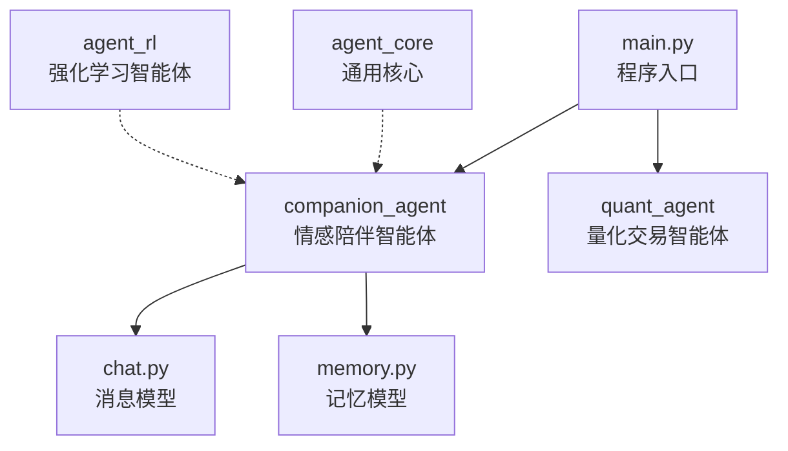
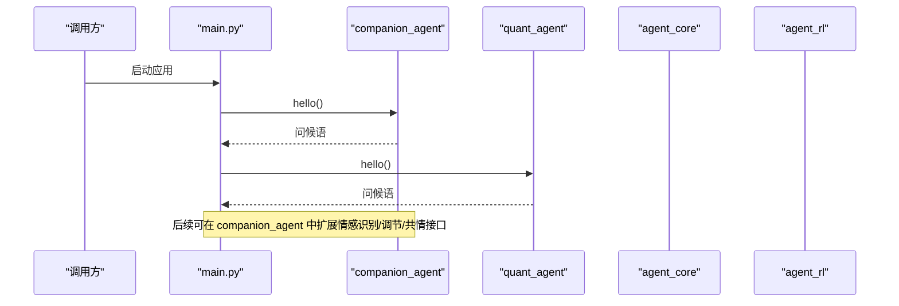
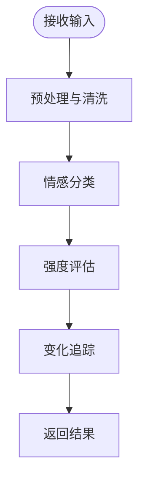
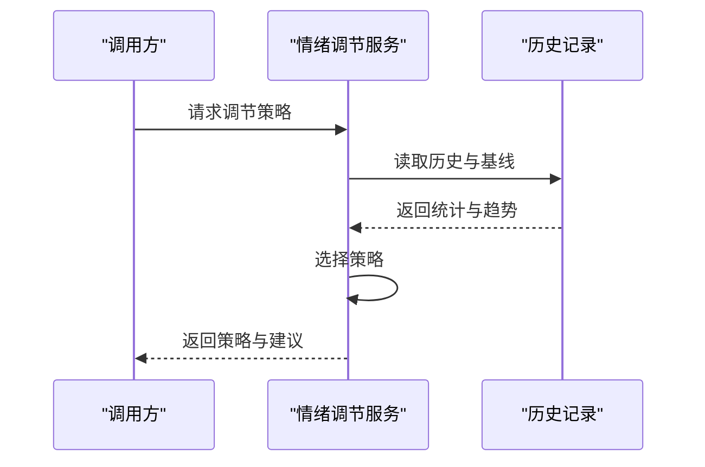
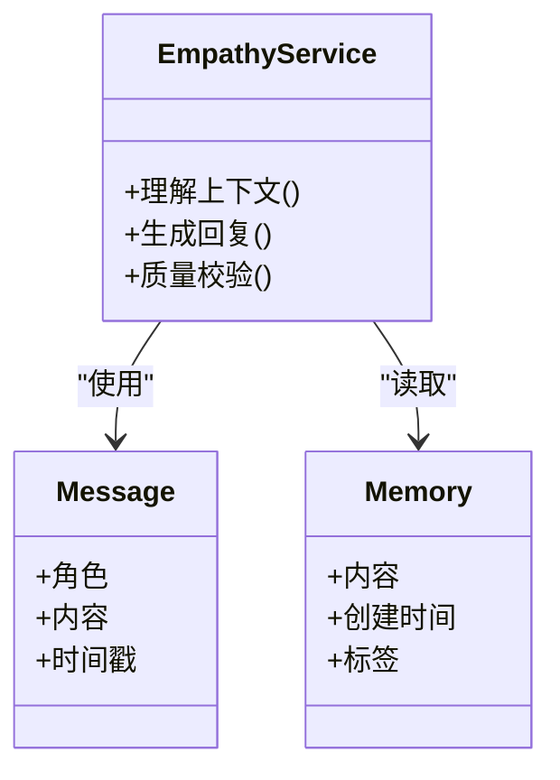
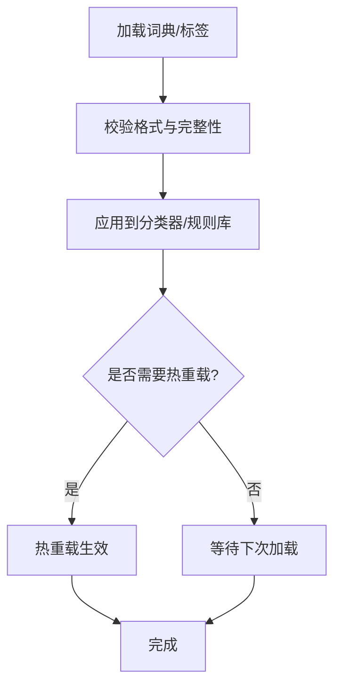
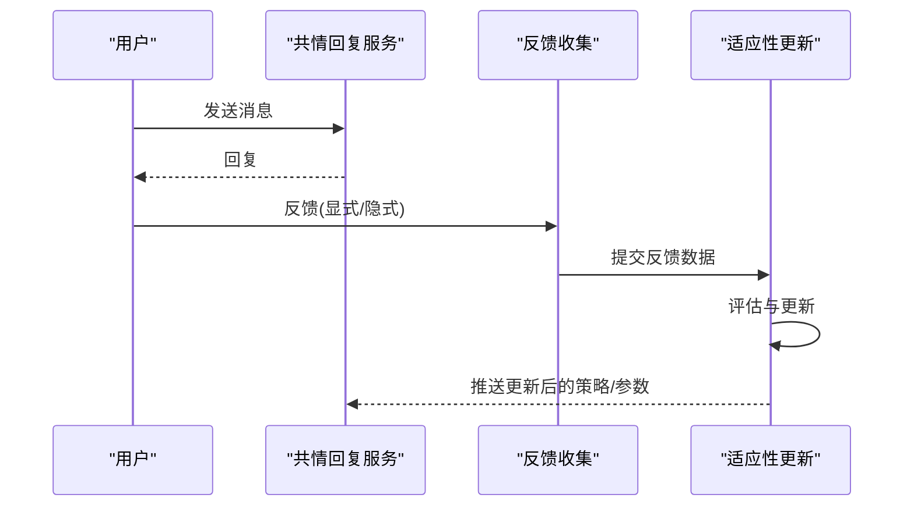
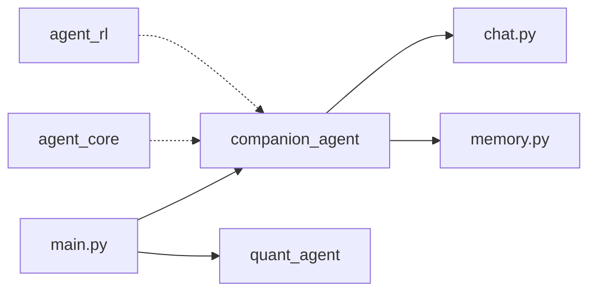

# 情感分析 API

<cite>
**本文引用的文件**   
- [main.py](file://main.py)
- [companion_agent/__init__.py](file://packages/companion-agent/src/companion_agent/__init__.py)
- [companion_agent/chat.py](file://packages/companion-agent/src/companion_agent/chat.py)
- [companion_agent/memory.py](file://packages/companion-agent/src/companion_agent/memory.py)
- [quant_agent/__init__.py](file://packages/quant-agent/src/quant_agent/__init__.py)
- [agent_core/__init__.py](file://packages/agent-core/src/agent_core/__init__.py)
- [agent_rl/__init__.py](file://packages/agent-rl/src/agent_rl/__init__.py)
</cite>

## 目录
1. [简介](#简介)
2. [项目结构](#项目结构)
3. [核心组件](#核心组件)
4. [架构总览](#架构总览)
5. [详细组件分析](#详细组件分析)
6. [依赖关系分析](#依赖关系分析)
7. [性能考虑](#性能考虑)
8. [故障排查指南](#故障排查指南)
9. [结论](#结论)
10. [附录](#附录)

## 简介
本文件为“情感分析系统”的 API 文档，聚焦以下能力：
- 情感识别：对输入文本进行情感分类与强度评估
- 情绪调节：基于上下文与记忆，生成有助于用户情绪改善的引导策略
- 共情回复：结合对话历史与用户画像，输出具有同理心的自然语言回复

同时提供：
- 情感词典扩展、自定义情感标签、跨语言情感分析的接口约定与示例路径
- 情感反馈循环、情感适应性与隐私保护的高级功能说明

注意：当前仓库处于早期骨架阶段，尚未包含具体实现。本文档以现有模块为基础，给出面向实现的接口契约与调用流程建议，便于后续开发落地。

## 项目结构
仓库采用多包组织方式，主入口聚合两个智能体：量化（理性）与陪伴（感性）。情感分析相关能力位于“陪伴智能体”子包中，负责对话、记忆与情感交互。

图示来源
- [main.py:1-13](file://main.py#L1-L13)
- [companion_agent/__init__.py:1-14](file://packages/companion-agent/src/companion_agent/__init__.py#L1-L14)
- [companion_agent/chat.py:1-12](file://packages/companion-agent/src/companion_agent/chat.py#L1-L12)
- [companion_agent/memory.py:1-11](file://packages/companion-agent/src/companion_agent/memory.py#L1-L11)
- [quant_agent/__init__.py:1-15](file://packages/quant-agent/src/quant_agent/__init__.py#L1-L15)
- [agent_core/__init__.py:1-3](file://packages/agent-core/src/agent_core/__init__.py#L1-L3)
- [agent_rl/__init__.py:1-15](file://packages/agent-rl/src/agent_rl/__init__.py#L1-L15)

章节来源
- [main.py:1-13](file://main.py#L1-L13)
- [companion_agent/__init__.py:1-14](file://packages/companion-agent/src/companion_agent/__init__.py#L1-L14)
- [companion_agent/chat.py:1-12](file://packages/companion-agent/src/companion_agent/chat.py#L1-L12)
- [companion_agent/memory.py:1-11](file://packages/companion-agent/src/companion_agent/memory.py#L1-L11)
- [quant_agent/__init__.py:1-15](file://packages/quant-agent/src/quant_agent/__init__.py#L1-L15)
- [agent_core/__init__.py:1-3](file://packages/agent-core/src/agent_core/__init__.py#L1-L3)
- [agent_rl/__init__.py:1-15](file://packages/agent-rl/src/agent_rl/__init__.py#L1-L15)

## 核心组件
围绕情感分析，建议将“陪伴智能体”拆分为如下接口层（当前仓库未实现，以下为接口契约建议）：
- 情感识别服务
  - 情感分类：返回类别与置信度
  - 强度评估：返回连续强度值或离散等级
  - 变化追踪：记录时间序列，支持前后对比
- 情绪调节服务
  - 策略选择：根据当前状态与目标，选择调节策略
  - 干预生成：生成可执行的调节提示或话术
- 共情回复服务
  - 上下文理解：融合对话历史与记忆
  - 回复生成：输出具备同理心的自然语言
- 数据与配置
  - 情感词典：可扩展词表与权重
  - 自定义标签：动态注册新情感标签
  - 跨语言：统一抽象，按语言加载对应资源

章节来源
- [companion_agent/__init__.py:1-14](file://packages/companion-agent/src/companion_agent/__init__.py#L1-L14)
- [companion_agent/chat.py:1-12](file://packages/companion-agent/src/companion_agent/chat.py#L1-L12)
- [companion_agent/memory.py:1-11](file://packages/companion-agent/src/companion_agent/memory.py#L1-L11)

## 架构总览
整体采用“入口聚合 + 领域分包”的架构。主程序启动后，分别初始化并调用各子智能体的对外能力；情感分析能力集中在“陪伴智能体”，并通过消息与记忆模型支撑对话与个性化。

图示来源
- [main.py:1-13](file://main.py#L1-L13)
- [companion_agent/__init__.py:1-14](file://packages/companion-agent/src/companion_agent/__init__.py#L1-L14)
- [quant_agent/__init__.py:1-15](file://packages/quant-agent/src/quant_agent/__init__.py#L1-L15)
- [agent_core/__init__.py:1-3](file://packages/agent-core/src/agent_core/__init__.py#L1-L3)
- [agent_rl/__init__.py:1-15](file://packages/agent-rl/src/agent_rl/__init__.py#L1-L15)

## 详细组件分析

### 情感识别接口（建议）
- 功能
  - 情感分类：输入文本，输出情感类别与置信度
  - 强度评估：输入文本或会话片段，输出强度数值或等级
  - 变化追踪：维护时间序列，计算前后差异
- 输入/输出约定（概念性）
  - 输入：文本、可选语言、可选上下文摘要
  - 输出：类别、置信度、强度、时间戳、会话ID
- 复杂度与性能
  - 分类模型推理通常为 O(n) 或 O(n log n)，取决于分词与模型
  - 建议缓存高频短语与用户基线，降低重复计算

[此图为概念流程图，不直接映射到具体源码文件]

章节来源
- [companion_agent/chat.py:1-12](file://packages/companion-agent/src/companion_agent/chat.py#L1-L12)
- [companion_agent/memory.py:1-11](file://packages/companion-agent/src/companion_agent/memory.py#L1-L11)

### 情绪调节接口（建议）
- 功能
  - 策略选择：依据当前情感状态与目标，选择合适的情绪调节策略
  - 干预生成：生成可执行的话术或行动建议
- 输入/输出约定（概念性）
  - 输入：当前情感状态、强度、历史趋势、用户偏好
  - 输出：策略ID、解释、建议内容、预期效果
- 安全与边界
  - 避免过度承诺或不当心理建议
  - 当检测到高风险信号时，降级为通用安抚话术并提示人工介入

[此图为概念时序图，不直接映射到具体源码文件]

章节来源
- [companion_agent/memory.py:1-11](file://packages/companion-agent/src/companion_agent/memory.py#L1-L11)

### 共情回复接口（建议）
- 功能
  - 上下文理解：融合对话历史与记忆
  - 回复生成：输出具备同理心的自然语言
- 输入/输出约定（概念性）
  - 输入：用户消息、对话历史、情感状态、记忆摘要
  - 输出：回复文本、情感基调、是否触发调节动作
- 质量保障
  - 一致性校验：确保与用户画像一致
  - 敏感性过滤：避免冒犯性表达

图示来源
- [companion_agent/chat.py:1-12](file://packages/companion-agent/src/companion_agent/chat.py#L1-L12)
- [companion_agent/memory.py:1-11](file://packages/companion-agent/src/companion_agent/memory.py#L1-L11)

章节来源
- [companion_agent/chat.py:1-12](file://packages/companion-agent/src/companion_agent/chat.py#L1-L12)
- [companion_agent/memory.py:1-11](file://packages/companion-agent/src/companion_agent/memory.py#L1-L11)

### 情感词典与自定义标签（建议）
- 情感词典扩展
  - 支持外部词表导入、权重更新、版本管理
  - 提供热重载机制，无需重启服务
- 自定义情感标签
  - 动态注册新标签，定义语义范围与边界
  - 与分类器联动，增量训练或规则增强
- 跨语言支持
  - 统一抽象接口，按语言加载对应资源
  - 提供语言检测与回退策略

[此图为概念流程图，不直接映射到具体源码文件]

章节来源
- [companion_agent/__init__.py:1-14](file://packages/companion-agent/src/companion_agent/__init__.py#L1-L14)

### 情感反馈循环与适应性（建议）
- 反馈收集
  - 显式反馈：用户对回复的情感评分或修正
  - 隐式反馈：停留时长、继续对话概率、复访率
- 适应性更新
  - 短期：在线微调策略参数
  - 长期：离线重训模型与更新词典
- 风险控制
  - 变更阈值与灰度发布
  - 回滚策略与A/B测试

[此图为概念时序图，不直接映射到具体源码文件]

章节来源
- [companion_agent/memory.py:1-11](file://packages/companion-agent/src/companion_agent/memory.py#L1-L11)

### 情感隐私保护（建议）
- 最小化采集：仅收集必要字段
- 匿名化与去标识化：移除可识别信息
- 本地化处理：尽可能在设备端完成敏感处理
- 访问控制与审计：权限分级、操作留痕
- 合规与透明：告知用途、提供退出选项

[本节为通用指导，不直接映射到具体源码文件]

## 依赖关系分析
当前仓库中，主入口聚合了多个子智能体；情感分析能力位于“陪伴智能体”。其他包（量化、核心、RL）通过依赖注入或模块化方式与陪伴智能体协作。

图示来源
- [main.py:1-13](file://main.py#L1-L13)
- [companion_agent/__init__.py:1-14](file://packages/companion-agent/src/companion_agent/__init__.py#L1-L14)
- [companion_agent/chat.py:1-12](file://packages/companion-agent/src/companion_agent/chat.py#L1-L12)
- [companion_agent/memory.py:1-11](file://packages/companion-agent/src/companion_agent/memory.py#L1-L11)
- [quant_agent/__init__.py:1-15](file://packages/quant-agent/src/quant_agent/__init__.py#L1-L15)
- [agent_core/__init__.py:1-3](file://packages/agent-core/src/agent_core/__init__.py#L1-L3)
- [agent_rl/__init__.py:1-15](file://packages/agent-rl/src/agent_rl/__init__.py#L1-L15)

章节来源
- [main.py:1-13](file://main.py#L1-L13)
- [companion_agent/__init__.py:1-14](file://packages/companion-agent/src/companion_agent/__init__.py#L1-L14)
- [companion_agent/chat.py:1-12](file://packages/companion-agent/src/companion_agent/chat.py#L1-L12)
- [companion_agent/memory.py:1-11](file://packages/companion-agent/src/companion_agent/memory.py#L1-L11)
- [quant_agent/__init__.py:1-15](file://packages/quant-agent/src/quant_agent/__init__.py#L1-L15)
- [agent_core/__init__.py:1-3](file://packages/agent-core/src/agent_core/__init__.py#L1-L3)
- [agent_rl/__init__.py:1-15](file://packages/agent-rl/src/agent_rl/__init__.py#L1-L15)

## 性能考虑
- 批处理与缓存
  - 批量推理减少模型切换开销
  - 缓存高频短语与用户基线，降低重复计算
- 异步与流式
  - 长文本处理采用异步管道
  - 流式输出提升用户体验
- 资源限制
  - 设置超时与重试上限
  - 监控内存与CPU占用，防止OOM

[本节为通用指导，不直接映射到具体源码文件]

## 故障排查指南
- 常见问题
  - 模型加载失败：检查路径与权限
  - 词典不一致：校验版本与格式
  - 响应超时：调整并发与批大小
- 日志与诊断
  - 关键节点打点：输入、模型、输出
  - 错误码与堆栈：统一封装，便于定位
- 回滚与恢复
  - 灰度发布与快速回滚
  - 健康检查与自动重启

[本节为通用指导，不直接映射到具体源码文件]

## 结论
当前仓库提供了多智能体框架的基础骨架，情感分析能力应在“陪伴智能体”中逐步完善。建议优先落地情感识别、情绪调节与共情回复三大接口，并配套词典扩展、自定义标签与跨语言支持。同时建立反馈循环与隐私保护机制，确保系统的可持续演进与合规性。

[本节为总结性内容，不直接映射到具体源码文件]

## 附录
- 术语
  - 情感分类：将文本映射到预定义情感类别
  - 强度评估：衡量情感的强弱程度
  - 变化追踪：记录情感随时间的演变
  - 共情回复：具备同理心与关怀的回复
- 参考路径
  - 对话模型定义：[companion_agent/chat.py](file://packages/companion-agent/src/companion_agent/chat.py)
  - 记忆模型定义：[companion_agent/memory.py](file://packages/companion-agent/src/companion_agent/memory.py)
  - 陪伴智能体入口：[companion_agent/__init__.py](file://packages/companion-agent/src/companion_agent/__init__.py)
  - 主入口聚合：[main.py](file://main.py)