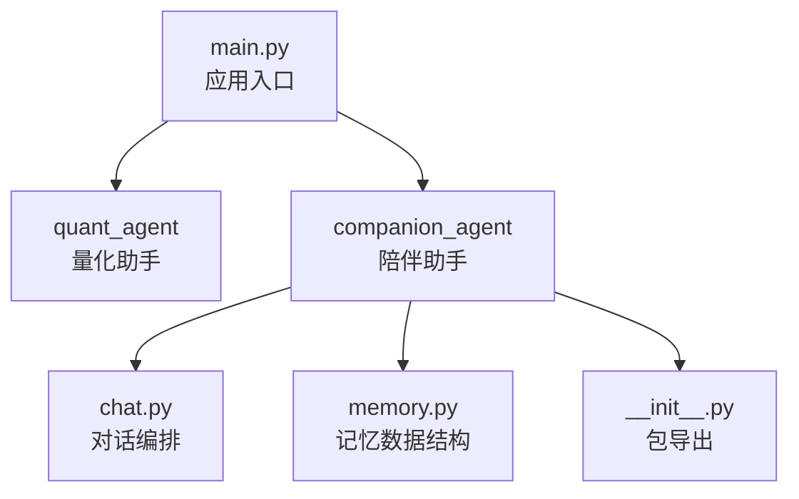
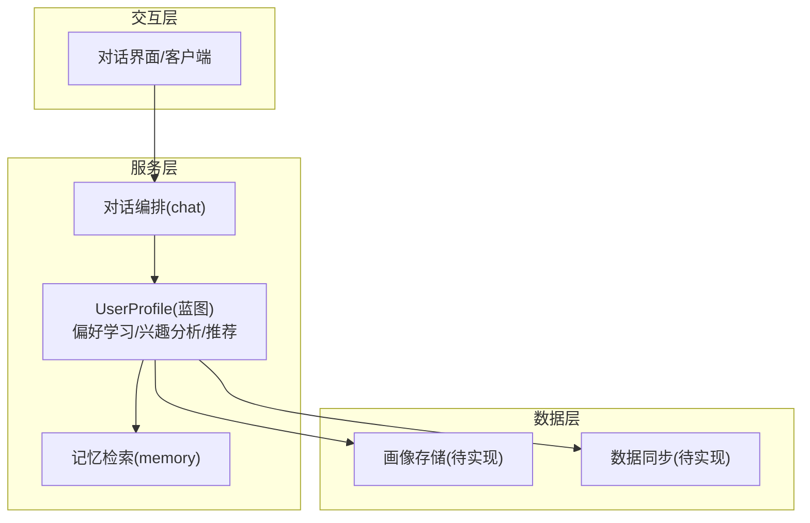
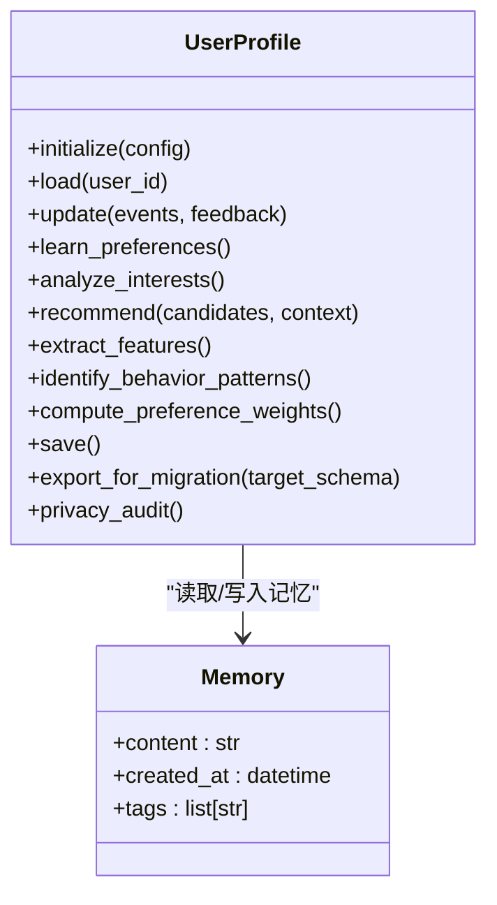
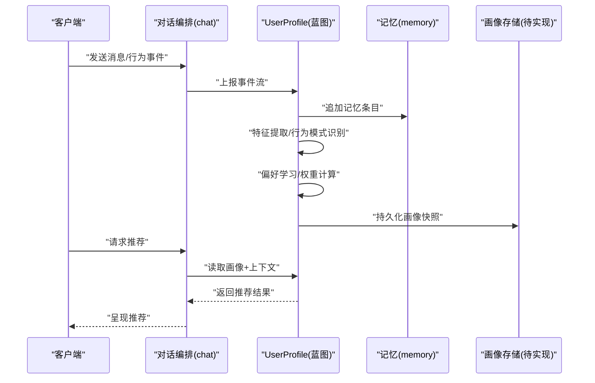
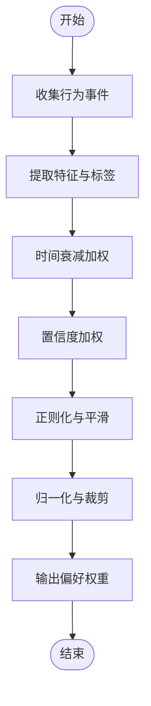
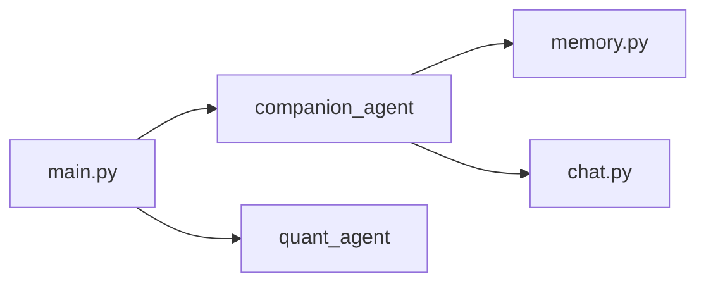

# 用户画像 API

<cite>
**本文引用的文件**   
- [main.py](file://main.py)
- [memory.py](file://packages/companion-agent/src/companion_agent/memory.py)
- [__init__.py](file://packages/companion-agent/src/companion_agent/__init__.py)
- [chat.py](file://packages/companion-agent/src/companion_agent/chat.py)
- [roadmap.html](file://docs/plans/roadmap.html)
- [todolist.html](file://docs/plans/todolist.html)
</cite>

## 目录
1. [简介](#简介)
2. [项目结构](#项目结构)
3. [核心组件](#核心组件)
4. [架构总览](#架构总览)
5. [详细组件分析](#详细组件分析)
6. [依赖分析](#依赖分析)
7. [性能考虑](#性能考虑)
8. [故障排查指南](#故障排查指南)
9. [结论](#结论)
10. [附录](#附录)

## 简介
本文件面向“用户画像构建系统”的 API 设计，聚焦于 UserProfile 类的用户偏好学习、兴趣分析与个性化推荐接口。文档同时覆盖用户特征提取、行为模式识别与偏好权重计算机制，并提供画像更新策略、隐私保护机制、数据同步功能的实现示例；此外包含用户分群、画像可视化与画像迁移的高级用法说明。

需要特别说明：当前仓库中尚未发现名为 UserProfile 的具体类或相关画像模块的实现代码。因此，本节与后续章节中的“API 定义、算法流程与示例”均为基于仓库现有规划与记忆模块的结构化建议与蓝图，旨在为后续落地提供清晰的设计参考。

## 项目结构
仓库采用多包组织方式，主入口 main.py 聚合了量化助手与陪伴型助手两个子包的 hello 能力。陪伴型助手（companion-agent）包含聊天与记忆等基础能力，是未来承载用户画像与长期记忆的合适位置。

图示来源
- [main.py:1-13](file://main.py#L1-L13)
- [chat.py](file://packages/companion-agent/src/companion_agent/chat.py)
- [memory.py:1-11](file://packages/companion-agent/src/companion_agent/memory.py#L1-L11)
- [__init__.py](file://packages/companion-agent/src/companion_agent/__init__.py)

章节来源
- [main.py:1-13](file://main.py#L1-L13)
- [memory.py:1-11](file://packages/companion-agent/src/companion_agent/memory.py#L1-L11)

## 核心组件
- 记忆模型 Memory：用于持久化对话片段、时间戳与标签，可作为用户画像的数据源之一。
- 陪伴助手入口 companion_agent：对外暴露 hello 等能力，适合作为画像系统的集成点。
- 对话编排 chat：负责会话上下文与工具调用，可接入画像读取与写入逻辑。

章节来源
- [memory.py:1-11](file://packages/companion-agent/src/companion_agent/memory.py#L1-L11)
- [__init__.py](file://packages/companion-agent/src/companion_agent/__init__.py)
- [chat.py](file://packages/companion-agent/src/companion_agent/chat.py)

## 架构总览
下图给出“用户画像构建系统”的概念性架构，展示从对话到画像、再到推荐的端到端流程。该图为概念图，不直接映射具体源码文件。

[此图为概念架构，未直接映射具体源码文件]

## 详细组件分析

### 组件一：UserProfile 类（蓝图）
说明：当前仓库未发现 UserProfile 的具体实现。以下为其建议的 API 蓝图，涵盖用户偏好学习、兴趣分析与个性化推荐接口，并附带特征提取、行为模式识别与偏好权重计算的机制说明。

- 初始化与配置
  - 构造参数：用户标识、存储后端、隐私开关、同步策略、权重策略等。
  - 生命周期：创建、加载、更新、保存、销毁。

- 用户偏好学习
  - 输入：对话事件流、显式反馈、任务完成记录。
  - 输出：偏好向量、主题分布、领域置信度。
  - 机制：增量学习、滑动窗口、衰减因子、冲突检测与合并。

- 兴趣分析
  - 输入：历史行为序列、内容标签、交互时长、点击/收藏/分享等行为。
  - 输出：兴趣图谱、兴趣强度、兴趣演化轨迹。
  - 机制：主题建模、时序平滑、异常抑制、冷启动策略。

- 个性化推荐
  - 输入：候选集、上下文、用户画像、实时信号。
  - 输出：排序结果、推荐理由、多样性与新颖性指标。
  - 机制：召回+精排、在线学习、A/B 分流、可解释性。

- 用户特征提取
  - 静态特征：人口属性、设备信息、注册渠道（需符合隐私规范）。
  - 动态特征：最近 N 次交互、会话内意图、停留时长、跳出率。
  - 语义特征：关键词、实体、情感极性、话题归属。

- 行为模式识别
  - 周期性与趋势：日/周/月活跃、季节性偏好。
  - 序列模式：N-gram、隐马尔可夫、轻量级时序聚类。
  - 异常检测：突发兴趣、短期热点、噪声过滤。

- 偏好权重计算
  - 维度权重：按领域重要性自适应调整。
  - 时间衰减：近期行为更高权重。
  - 置信度加权：基于样本量与一致性评分。
  - 正则化：防止过拟合与漂移。

- 画像更新策略
  - 触发条件：新事件到达、定时刷新、阈值变更。
  - 更新粒度：全量重建 vs 增量融合。
  - 版本控制：快照、差异回滚、审计日志。

- 隐私保护机制
  - 最小化采集、目的限定、可撤回同意。
  - 匿名化/去标识化、差分隐私、本地化计算。
  - 访问控制、加密存储、合规审计。

- 数据同步功能
  - 多端一致：幂等写入、冲突解决、最终一致。
  - 离线优先：队列缓存、断点续传、冲突合并。
  - 安全传输：TLS、签名校验、防重放。

- 高级用法
  - 用户分群：规则/聚类/分层策略，支持动态分组。
  - 画像可视化：雷达图、趋势折线、热力矩阵。
  - 画像迁移：跨平台/跨版本迁移、字段映射、兼容性校验。

图示来源
- [memory.py:1-11](file://packages/companion-agent/src/companion_agent/memory.py#L1-L11)

章节来源
- [memory.py:1-11](file://packages/companion-agent/src/companion_agent/memory.py#L1-L11)

### 组件二：API 工作流（序列图）
说明：以下为“偏好学习与推荐”的概念性序列图，展示从对话事件到画像更新与推荐输出的典型流程。该图为概念图，不直接映射具体源码文件。

[此图为概念流程，未直接映射具体源码文件]

### 组件三：复杂逻辑流程图（偏好权重计算）
说明：以下为“偏好权重计算”的概念性流程图，展示时间衰减、置信度加权与正则化的综合过程。该图为概念图，不直接映射具体源码文件。

[此图为概念流程，未直接映射具体源码文件]

## 依赖分析
- 主入口 main.py 导入 quant_agent 与 companion_agent，并调用各自的 hello 方法。
- companion_agent 包包含 memory 与 chat 模块，适合扩展画像能力。
- roadmap 与 todolist 文档提及“记忆底座 + 定制化”，包括“画像驱动的策略/流程动态调整”。

图示来源
- [main.py:1-13](file://main.py#L1-L13)
- [memory.py:1-11](file://packages/companion-agent/src/companion_agent/memory.py#L1-L11)
- [chat.py](file://packages/companion-agent/src/companion_agent/chat.py)

章节来源
- [main.py:1-13](file://main.py#L1-L13)
- [memory.py:1-11](file://packages/companion-agent/src/companion_agent/memory.py#L1-L11)
- [roadmap.html](file://docs/plans/roadmap.html)
- [todolist.html](file://docs/plans/todolist.html)

## 性能考虑
- 增量更新：避免全量重建，使用事件流与滑动窗口降低计算开销。
- 异步处理：画像更新与推荐计算异步化，减少主链路延迟。
- 缓存策略：对热门画像与推荐结果进行缓存，设置合理 TTL。
- 索引优化：对标签与主题建立倒排索引，提升检索效率。
- 批处理：批量写入与合并，降低 I/O 压力。
- 监控与降级：关键路径埋点，异常时回退到默认策略。

## 故障排查指南
- 画像不一致：检查增量合并逻辑与冲突解决策略，确认幂等写入与版本号。
- 推荐偏差：审查权重计算与时间衰减参数，核对训练数据质量与采样策略。
- 隐私合规：确认数据采集最小化、同意管理与脱敏流程是否生效。
- 同步失败：检查网络重试、离线队列与冲突合并策略，查看错误码与日志。
- 性能退化：定位热点画像与高并发场景，评估缓存命中率与索引效率。

## 结论
当前仓库尚未实现 UserProfile 及其画像相关模块，但已具备对话与记忆的基础能力，以及关于“记忆底座 + 定制化”的产品规划。建议在 companion-agent 中引入 UserProfile 蓝图，结合 memory 模块沉淀用户行为与偏好，逐步完善偏好学习、兴趣分析与个性化推荐能力，并配套隐私保护与数据同步机制，以满足产品路线图中对“专属度”与“活的流程”的要求。

## 附录

### 附录一：API 清单（蓝图）
- 初始化与配置
  - initialize(config): 初始化配置项（存储、隐私、同步、权重策略等）
  - load(user_id): 加载指定用户的画像
  - save(): 保存当前画像至存储
- 偏好学习与兴趣分析
  - learn_preferences(): 基于事件流与反馈学习偏好
  - analyze_interests(): 分析兴趣图谱与演化轨迹
- 个性化推荐
  - recommend(candidates, context): 生成个性化推荐结果
- 特征与模式
  - extract_features(): 提取静态/动态/语义特征
  - identify_behavior_patterns(): 识别周期性与序列模式
- 权重与更新
  - compute_preference_weights(): 计算维度权重与时间衰减
  - update(events, feedback): 增量更新画像
- 迁移与审计
  - export_for_migration(target_schema): 导出兼容目标 schema 的画像
  - privacy_audit(): 执行隐私合规自检

章节来源
- [memory.py:1-11](file://packages/companion-agent/src/companion_agent/memory.py#L1-L11)
- [roadmap.html](file://docs/plans/roadmap.html)
- [todolist.html](file://docs/plans/todolist.html)