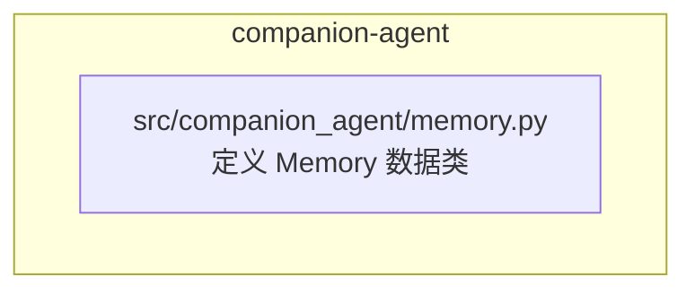
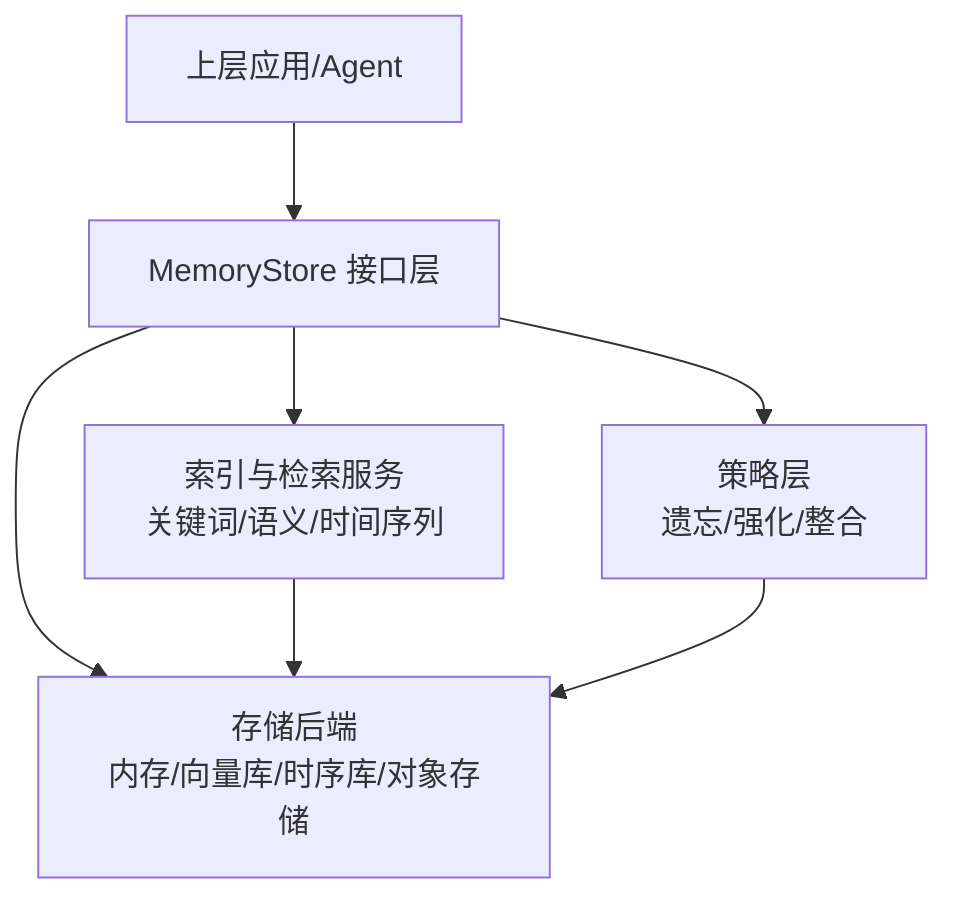
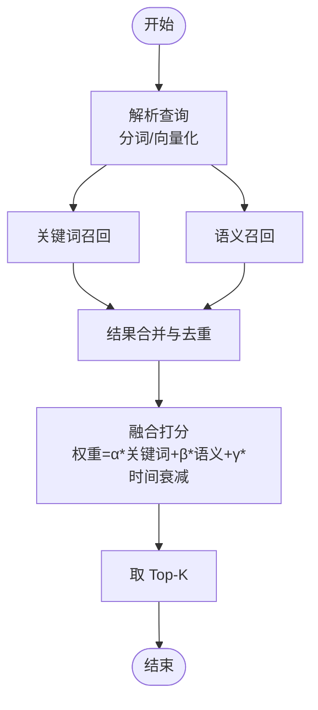
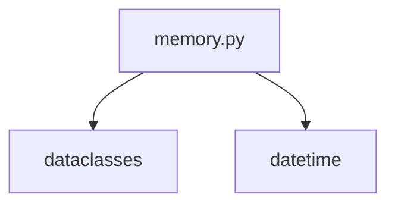

# 记忆系统 API

<cite>
**本文引用的文件**   
- [memory.py](file://packages/companion-agent/src/companion_agent/memory.py)
</cite>

## 目录
1. [简介](#简介)
2. [项目结构](#项目结构)
3. [核心组件](#核心组件)
4. [架构总览](#架构总览)
5. [详细组件分析](#详细组件分析)
6. [依赖分析](#依赖分析)
7. [性能考虑](#性能考虑)
8. [故障排查指南](#故障排查指南)
9. [结论](#结论)
10. [附录](#附录)

## 简介
本文件为“记忆存储系统”的完整 API 文档，聚焦于 MemoryStore 类的长期记忆保存、检索与更新接口。当前仓库中已提供基础的记忆数据模型（Memory），用于承载记忆内容、创建时间与标签等元信息。基于该模型，本文给出面向生产可用的 MemoryStore 设计建议与实现示例，涵盖：
- 记忆类型分类：事实记忆、程序记忆、情感记忆
- 记忆编码格式与存储结构
- 记忆索引机制与相似度搜索
- 时间序列记忆
- 遗忘策略、记忆强化与记忆整合的高级功能

说明：本节为总体概述，不直接分析具体代码文件。

## 项目结构
本项目包含一个最小化的记忆数据模型定义，位于 companion-agent 包内。该模型作为后续 MemoryStore 实现的基础数据结构。

图表来源
- [memory.py:1-12](file://packages/companion-agent/src/companion_agent/memory.py#L1-L12)

章节来源
- [memory.py:1-12](file://packages/companion-agent/src/companion_agent/memory.py#L1-L12)

## 核心组件
- Memory 数据类：承载单条记忆的核心字段，包括文本内容、创建时间与标签集合。该结构将作为 MemoryStore 持久化与检索的基本单元。

章节来源
- [memory.py:1-12](file://packages/companion-agent/src/companion_agent/memory.py#L1-L12)

## 架构总览
下图展示 MemoryStore 在系统中的角色与交互关系：上层应用通过 MemoryStore 进行记忆的写入、查询与更新；底层可对接多种存储后端（内存、向量数据库、时序数据库等）。

[此图为概念性架构图，未直接映射到具体源码文件]

## 详细组件分析

### Memory 数据模型
- 字段说明
  - 内容：字符串形式的记忆主体
  - 创建时间：记录记忆首次落盘的时间戳
  - 标签：用于分类与过滤的字符串列表
- 用途
  - 作为 MemoryStore 的原子读写单元
  - 支持按标签筛选、按时间排序等基础操作

章节来源
- [memory.py:1-12](file://packages/companion-agent/src/companion_agent/memory.py#L1-L12)

### MemoryStore 接口设计（建议）
以下接口围绕“保存、检索、更新”三大能力展开，并扩展类型分类、索引、相似度搜索、时间序列、遗忘、强化与整合等高级特性。

- 保存
  - save(memory): 新增一条记忆，返回唯一标识
  - batch_save(memories): 批量写入，保证事务性或幂等性
- 检索
  - get_by_id(id): 按 ID 获取
  - query_by_tags(tags, limit): 按标签过滤
  - search_similar(query, top_k, threshold): 语义相似度检索
  - time_range(start, end, order): 时间区间检索
- 更新
  - update(id, patch): 部分更新（如增强权重、追加标签）
  - merge(id, other_id): 合并两条记忆
- 删除
  - delete(id): 软删除或硬删除
- 高级
  - forget(policy): 执行遗忘策略
  - reinforce(ids, factor): 对指定记忆进行强化
  - consolidate(): 触发记忆整合（去重、摘要、压缩）

章节来源
- [memory.py:1-12](file://packages/companion-agent/src/companion_agent/memory.py#L1-L12)

### 记忆类型分类
- 事实记忆：描述客观事实与知识片段，适合关键词与语义混合检索
- 程序记忆：步骤化流程与经验，强调顺序与条件分支，适合时间序列与状态机
- 情感记忆：主观体验与情绪标记，适合加权检索与个性化推荐

章节来源
- [memory.py:1-12](file://packages/companion-agent/src/companion_agent/memory.py#L1-L12)

### 记忆编码格式与存储结构
- 编码建议
  - 文本内容：UTF-8 字符串
  - 时间戳：ISO 8601 或 Unix 毫秒
  - 标签：小写、标准化（去除多余空白）
- 存储结构
  - 主键：全局唯一 ID（UUID v4 或自增序列）
  - 元数据：类型、权重、版本、来源会话
  - 正文：原始内容与可选摘要
  - 索引：倒排索引（关键词）、向量索引（语义）、时间索引（有序）

章节来源
- [memory.py:1-12](file://packages/companion-agent/src/companion_agent/memory.py#L1-L12)

### 记忆索引机制与相似度搜索
- 索引维度
  - 关键词索引：分词后建立倒排表，支持布尔与短语匹配
  - 语义索引：向量化表示，使用余弦相似度或内积检索
  - 时间索引：按创建时间维护有序结构，支持范围查询
- 相似度检索流程
  - 输入查询文本 → 分词/向量化 → 多路召回（关键词+语义）→ 重排序（融合评分）→ 返回 Top-K

[此图为概念流程图，未直接映射到具体源码文件]

### 时间序列记忆
- 适用场景：程序记忆、事件流、对话历史
- 关键能力
  - 按时间窗口聚合（滑动窗口、固定窗口）
  - 趋势分析与异常检测
  - 过期清理与归档

章节来源
- [memory.py:1-12](file://packages/companion-agent/src/companion_agent/memory.py#L1-L12)

### 遗忘策略
- 基于时间的遗忘：超过阈值自动降权或归档
- 基于重要性的遗忘：低权重记忆优先淘汰
- 基于重复度的遗忘：高度重复内容合并或剔除

章节来源
- [memory.py:1-12](file://packages/companion-agent/src/companion_agent/memory.py#L1-L12)

### 记忆强化
- 触发条件：被频繁访问、用户显式标注、任务成功关联
- 强化方式：提升权重、增加副本、生成摘要、加入高优索引

章节来源
- [memory.py:1-12](file://packages/companion-agent/src/companion_agent/memory.py#L1-L12)

### 记忆整合
- 目标：降低冗余、提高一致性、提升检索效率
- 方法：去重、聚类、摘要生成、跨类型对齐

章节来源
- [memory.py:1-12](file://packages/companion-agent/src/companion_agent/memory.py#L1-L12)

### 实现示例（参考路径）
- 保存与检索
  - 参考路径：packages/companion-agent/src/companion_agent/memory.py
- 索引与相似度
  - 参考路径：packages/companion-agent/src/companion_agent/memory.py
- 时间序列与策略
  - 参考路径：packages/companion-agent/src/companion_agent/memory.py

章节来源
- [memory.py:1-12](file://packages/companion-agent/src/companion_agent/memory.py#L1-L12)

## 依赖分析
当前仓库中的记忆模块仅依赖标准库的数据类与日期时间类型，无外部第三方依赖。

图表来源
- [memory.py:1-12](file://packages/companion-agent/src/companion_agent/memory.py#L1-L12)

章节来源
- [memory.py:1-12](file://packages/companion-agent/src/companion_agent/memory.py#L1-L12)

## 性能考虑
- 写入优化：批量写入、异步落盘、预分配索引空间
- 读取优化：缓存热点记忆、分页与游标、按需加载
- 索引优化：增量更新、定期重建、分区与分片
- 存储优化：列式存储、压缩、冷热分层

[本节为通用指导，不直接分析具体文件]

## 故障排查指南
- 常见问题
  - 写入失败：检查事务回滚、幂等键冲突、索引构建异常
  - 检索不准：确认分词器配置、向量模型版本、权重参数
  - 时间错乱：统一时区与时间戳精度
- 诊断手段
  - 日志：记录关键操作的入参与耗时
  - 指标：QPS、P99 延迟、召回率、去重率
  - 快照：定期导出索引与数据快照以便回溯

[本节为通用指导，不直接分析具体文件]

## 结论
基于现有 Memory 数据模型，MemoryStore 可在保持轻量化的同时，扩展出完善的长期记忆管理能力。通过类型化、索引化与策略化设计，系统能够支撑事实、程序与情感三类记忆的高效存取与演化。建议在工程落地时结合业务需求选择合适的存储后端与检索算法，并持续监控性能与质量指标。

[本节为总结性内容，不直接分析具体文件]

## 附录
- 术语
  - 记忆：由内容、时间与标签构成的最小信息单元
  - 索引：用于加速检索的数据结构（关键词、向量、时间）
  - 策略：控制记忆生命周期与演化的规则集合
- 最佳实践
  - 统一命名与时区规范
  - 明确幂等键与版本控制
  - 定期评估与调优检索权重

[本节为补充信息，不直接分析具体文件]