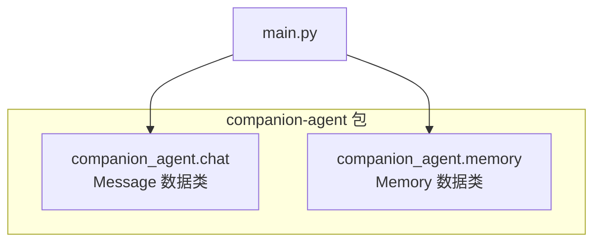
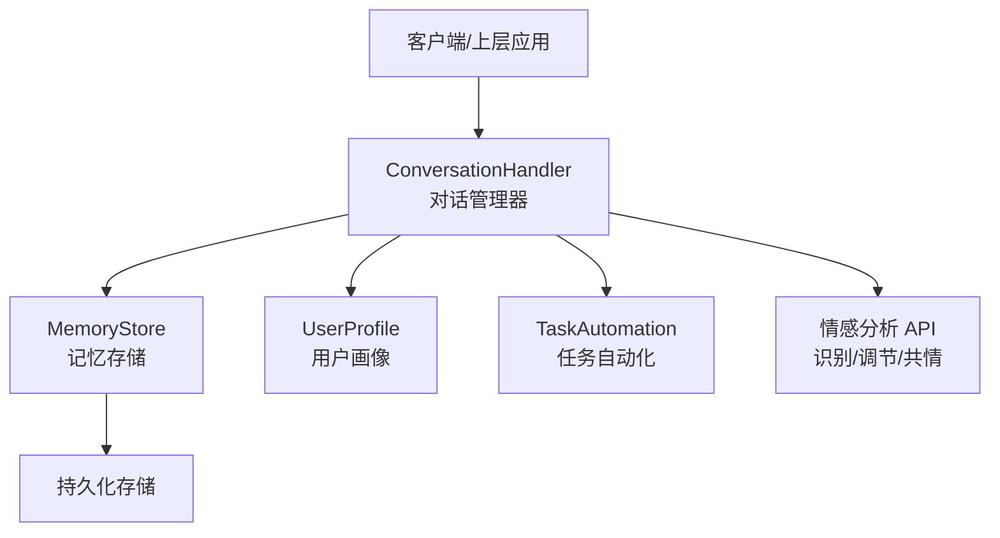
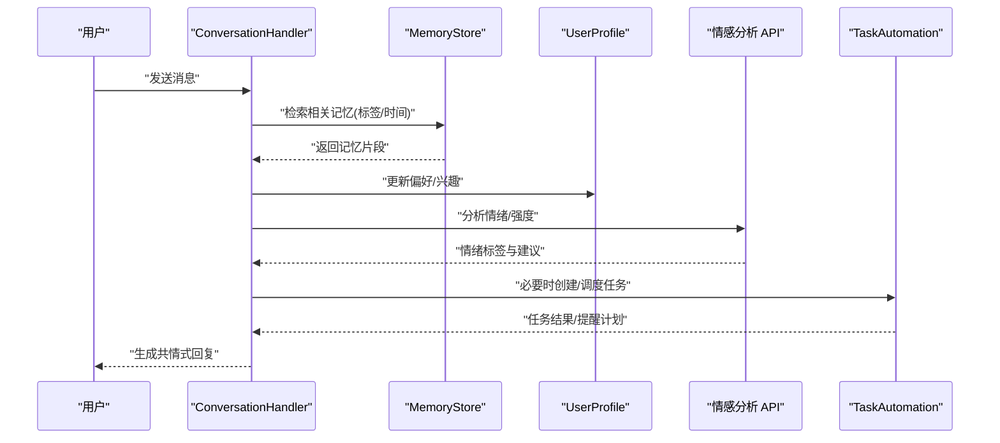
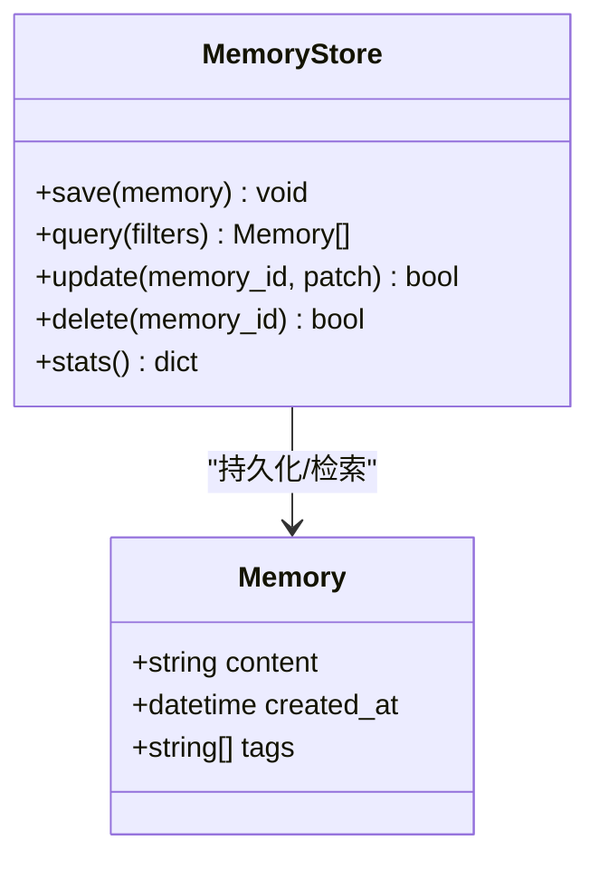
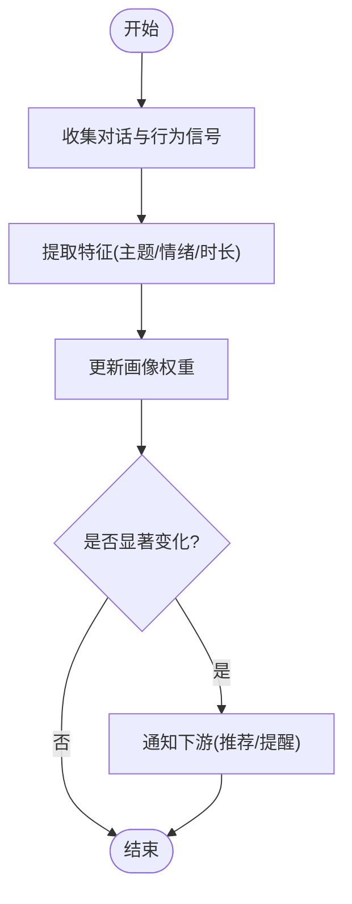
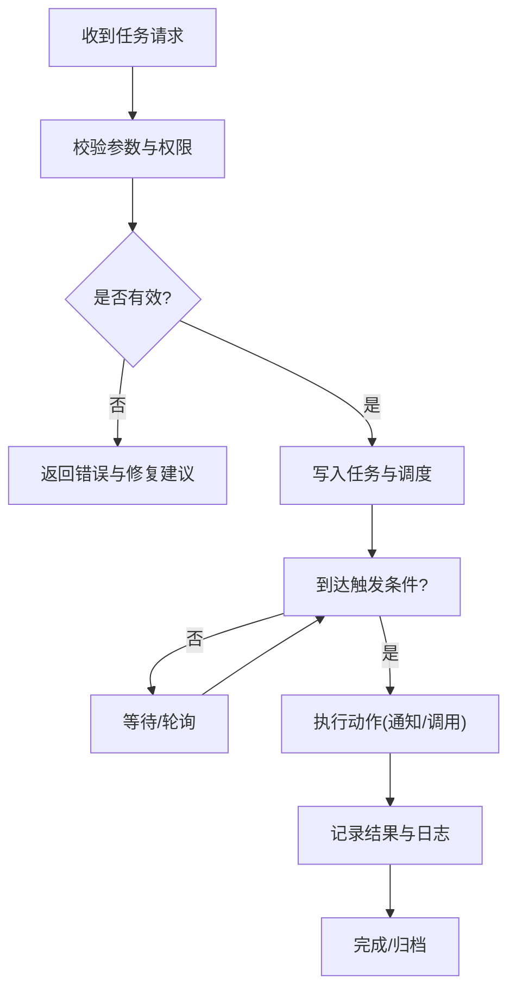
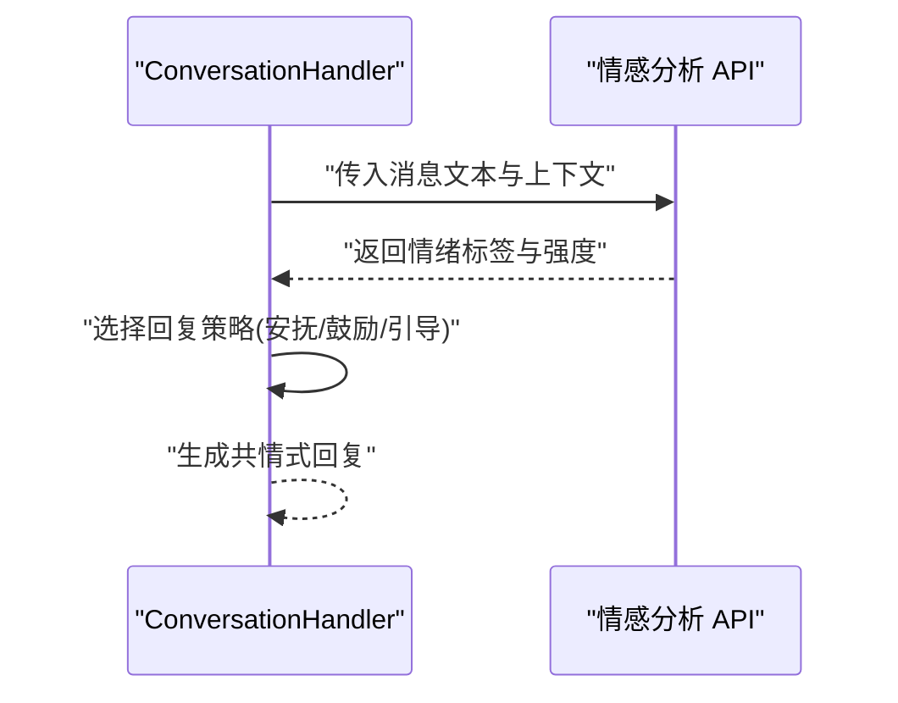
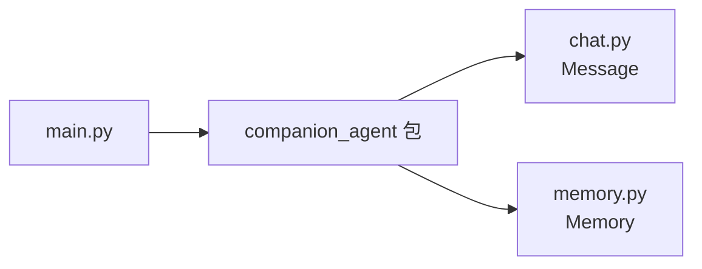

# 陪伴助手 API

<cite>
**本文引用的文件**   
- [main.py](file://main.py)
- [chat.py](file://packages/companion-agent/src/companion_agent/chat.py)
- [memory.py](file://packages/companion-agent/src/companion_agent/memory.py)
</cite>

## 目录
1. [简介](#简介)
2. [项目结构](#项目结构)
3. [核心组件](#核心组件)
4. [架构总览](#架构总览)
5. [详细组件分析](#详细组件分析)
6. [依赖分析](#依赖分析)
7. [性能考虑](#性能考虑)
8. [故障排查指南](#故障排查指南)
9. [结论](#结论)
10. [附录](#附录)

## 简介
本文件为 companion-agent 陪伴助手模块的完整 API 文档，聚焦以下能力：
- ConversationHandler 对话管理器：多轮对话处理、上下文维护与状态管理
- MemoryStore 记忆存储系统：长期记忆的保存、检索与更新接口
- UserProfile 用户画像构建：偏好学习、兴趣分析与个性化推荐
- TaskAutomation 任务自动化：日程管理、提醒设置与流程编排
- 情感分析 API：情感识别、情绪调节与共情回复机制
- 对话机器人开发示例与用户交互场景演示

说明：当前仓库中 companion-agent 模块已提供基础数据模型（消息与记忆），其余高级能力（对话管理、用户画像、任务自动化、情感分析）以概念性设计呈现，便于后续扩展实现。

## 项目结构
companion-agent 模块位于 packages/companion-agent 下，当前可见的核心源文件包括：
- chat.py：定义对话消息的数据结构
- memory.py：定义记忆条目数据结构
- main.py：顶层入口，加载 companion_agent 并输出问候信息

图表来源
- [main.py:1-13](file://main.py#L1-L13)
- [chat.py:1-12](file://packages/companion-agent/src/companion_agent/chat.py#L1-L12)
- [memory.py:1-11](file://packages/companion-agent/src/companion_agent/memory.py#L1-L11)

章节来源
- [main.py:1-13](file://main.py#L1-L13)
- [chat.py:1-12](file://packages/companion-agent/src/companion_agent/chat.py#L1-L12)
- [memory.py:1-11](file://packages/companion-agent/src/companion_agent/memory.py#L1-L11)

## 核心组件
本节概述各核心组件的职责与对外能力边界，结合现有数据模型进行说明。

- ConversationHandler（对话管理器）
  - 职责：维护会话上下文、推进多轮对话、管理对话状态机
  - 输入/输出：接收 Message 序列，返回下一条 assistant 消息或动作指令
  - 状态：会话 ID、历史消息窗口、最近意图、待办事项等

- MemoryStore（记忆存储）
  - 职责：持久化长期记忆、支持按标签/时间/语义检索、增量更新
  - 数据单元：Memory（内容、创建时间、标签集合）
  - 接口：保存、查询、更新、删除、聚合统计

- UserProfile（用户画像）
  - 职责：从对话与行为中学习偏好、兴趣分布、个性化策略
  - 字段建议：偏好权重、兴趣主题、活跃时段、沟通风格

- TaskAutomation（任务自动化）
  - 职责：日程管理、提醒触发、流程编排与执行
  - 能力：创建/修改/取消任务、定时提醒、条件分支与并行步骤

- 情感分析 API
  - 职责：识别用户情绪、进行情绪调节、生成共情式回复
  - 指标：情绪类别、强度、变化趋势；策略：安抚、鼓励、引导

章节来源
- [chat.py:1-12](file://packages/companion-agent/src/companion_agent/chat.py#L1-L12)
- [memory.py:1-11](file://packages/companion-agent/src/companion_agent/memory.py#L1-L11)

## 架构总览
下图展示陪伴助手的高层架构与主要组件关系。ConversationHandler 作为协调者，调用 MemoryStore 读写长期记忆，驱动 UserProfile 更新，并在需要时委托 TaskAutomation 执行任务；情感分析 API 贯穿对话链路，影响回复策略。

图表来源
- [chat.py:1-12](file://packages/companion-agent/src/companion_agent/chat.py#L1-L12)
- [memory.py:1-11](file://packages/companion-agent/src/companion_agent/memory.py#L1-L11)

## 详细组件分析

### ConversationHandler 对话管理器
- 功能要点
  - 多轮对话处理：维护消息队列与上下文窗口，支持滚动摘要
  - 上下文维护：融合短期上下文与长期记忆，形成统一提示
  - 状态管理：会话生命周期、意图跟踪、待办与约束条件
- 关键接口（概念）
  - 初始化：创建会话、加载初始上下文
  - 接收消息：解析用户输入、校验格式、入队
  - 生成回复：检索记忆、更新画像、调用 LLM 或规则引擎
  - 状态变更：记录意图、更新待办、触发提醒
- 错误处理
  - 输入校验失败：返回友好提示并要求修正
  - 记忆不可用：降级到无记忆模式继续对话
  - 外部服务异常：重试与回退策略

图表来源
- [chat.py:1-12](file://packages/companion-agent/src/companion_agent/chat.py#L1-L12)
- [memory.py:1-11](file://packages/companion-agent/src/companion_agent/memory.py#L1-L11)

章节来源
- [chat.py:1-12](file://packages/companion-agent/src/companion_agent/chat.py#L1-L12)

### MemoryStore 记忆存储系统
- 数据模型
  - Memory：包含内容、创建时间与标签列表，用于长期记忆条目
- 核心接口（概念）
  - 保存：写入新记忆，附带标签与时间戳
  - 检索：按标签、时间范围、关键词或相似度检索
  - 更新：增量合并、去重、版本控制
  - 删除：软删除与清理过期条目
- 复杂度与优化
  - 索引策略：标签倒排、时间索引、向量索引（可选）
  - 缓存热点：近期高频记忆缓存，降低 IO 压力
  - 批量操作：批写与批查提升吞吐

图表来源
- [memory.py:1-11](file://packages/companion-agent/src/companion_agent/memory.py#L1-L11)

章节来源
- [memory.py:1-11](file://packages/companion-agent/src/companion_agent/memory.py#L1-L11)

### UserProfile 用户画像构建
- 目标
  - 从对话与行为中学习用户偏好、兴趣分布与沟通风格
- 字段建议
  - 偏好权重：主题、语气、长度、幽默度等
  - 兴趣主题：领域、活动、资源类型
  - 活跃时段：常用时间段与时区
  - 个性化策略：推荐排序、话题引导、提醒时机
- 更新机制
  - 增量学习：基于新消息与反馈调整权重
  - 衰减策略：旧兴趣随时间弱化
  - 冲突消解：多源证据投票与置信度

[此图为概念流程图，不直接映射具体源码文件]

### TaskAutomation 任务自动化
- 能力
  - 日程管理：创建、修改、取消任务，支持重复与优先级
  - 提醒设置：绝对时间与相对延迟，多渠道推送
  - 流程编排：顺序、分支、并行与条件等待
- 接口（概念）
  - 创建任务：参数校验、唯一性检查、持久化
  - 执行器：调度器与执行器分离，支持异步与重试
  - 监控与日志：状态追踪、告警与审计

[此图为概念流程图，不直接映射具体源码文件]

### 情感分析 API
- 功能
  - 情感识别：分类（如积极/消极/中性）、强度评分
  - 情绪调节：根据情绪选择安抚、鼓励或引导策略
  - 共情回复：在语言风格上体现理解与支持
- 集成点
  - 对话链路中实时分析，影响回复策略与任务触发
  - 与 UserProfile 联动，积累情绪偏好与应对方式

[此图为概念流程图，不直接映射具体源码文件]

### 对话机器人开发示例与交互场景
- 示例一：日常陪伴聊天
  - 用户表达心情 → 情感分析识别 → 共情回复 → 记录记忆 → 更新画像
- 示例二：任务提醒
  - 用户提出需求 → 创建任务 → 设定提醒 → 到期推送 → 确认完成
- 示例三：个性化推荐
  - 读取画像与记忆 → 匹配兴趣 → 生成推荐列表 → 收集反馈 → 迭代优化

[此部分为使用场景说明，不直接映射具体源码文件]

## 依赖分析
- 内部依赖
  - main.py 导入 companion_agent 并调用其 hello 方法，作为模块入口
  - chat.py 与 memory.py 提供基础数据模型，供上层组件组合使用
- 外部依赖
  - 标准库 datetime 用于时间戳
  - dataclasses 用于结构化数据定义

图表来源
- [main.py:1-13](file://main.py#L1-L13)
- [chat.py:1-12](file://packages/companion-agent/src/companion_agent/chat.py#L1-L12)
- [memory.py:1-11](file://packages/companion-agent/src/companion_agent/memory.py#L1-L11)

章节来源
- [main.py:1-13](file://main.py#L1-L13)
- [chat.py:1-12](file://packages/companion-agent/src/companion_agent/chat.py#L1-L12)
- [memory.py:1-11](file://packages/companion-agent/src/companion_agent/memory.py#L1-L11)

## 性能考虑
- 记忆检索优化
  - 使用标签倒排与时间索引减少扫描范围
  - 对热门记忆建立缓存层，降低重复 IO
- 对话生成优化
  - 上下文窗口裁剪与摘要压缩，控制 LLM 输入规模
  - 异步并发处理非阻塞任务（如提醒、日志）
- 任务自动化
  - 批量调度与批处理，避免频繁唤醒
  - 幂等设计与重试策略，保证最终一致性

[本节为通用指导，不直接分析具体文件]

## 故障排查指南
- 常见问题
  - 消息格式错误：检查 role 与 content 字段是否符合约定
  - 记忆写入失败：确认存储可用性与标签合法性
  - 任务未触发：核对调度条件与时间配置
- 定位步骤
  - 查看入口输出与日志，确认模块加载成功
  - 验证数据模型字段完整性与类型正确性
  - 隔离问题域（对话、记忆、任务、情感）逐步复现

章节来源
- [main.py:1-13](file://main.py#L1-L13)
- [chat.py:1-12](file://packages/companion-agent/src/companion_agent/chat.py#L1-L12)
- [memory.py:1-11](file://packages/companion-agent/src/companion_agent/memory.py#L1-L11)

## 结论
当前 companion-agent 模块提供了对话与记忆的基础数据模型，为构建完整的陪伴助手奠定了良好基础。建议在后续迭代中完善 ConversationHandler、MemoryStore、UserProfile、TaskAutomation 与情感分析 API 的具体实现，并通过测试与基准评估确保稳定性与性能。

[本节为总结性内容，不直接分析具体文件]

## 附录
- 术语表
  - 会话上下文：当前对话相关的短期信息与长期记忆的组合
  - 标签：用于分类与检索的记忆标记
  - 画像权重：反映用户偏好的数值化指标
- 扩展建议
  - 引入向量数据库增强语义检索
  - 增加可视化仪表盘监控对话质量与任务执行
  - 提供插件化技能体系，按需启用能力

[本节为补充信息，不直接分析具体文件]