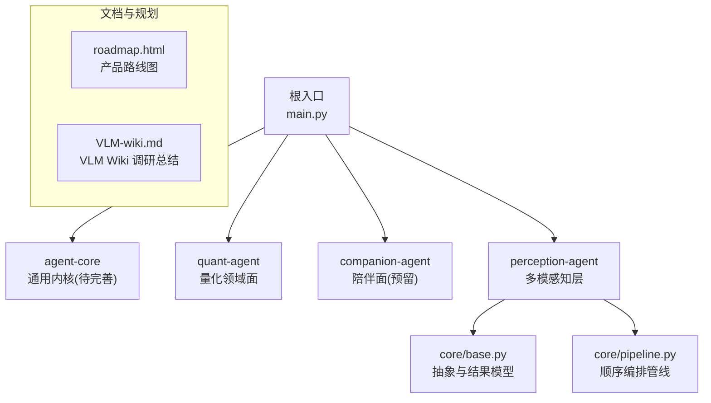
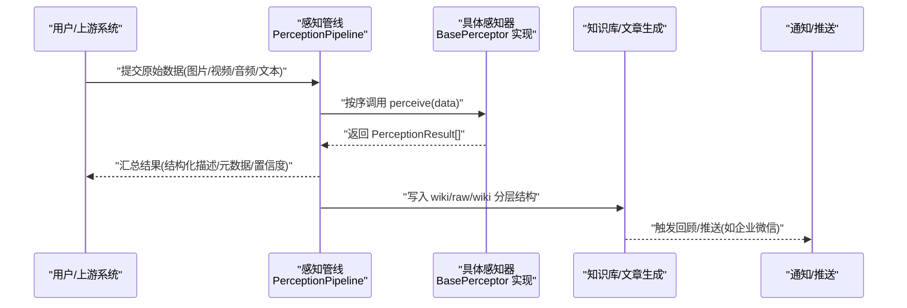
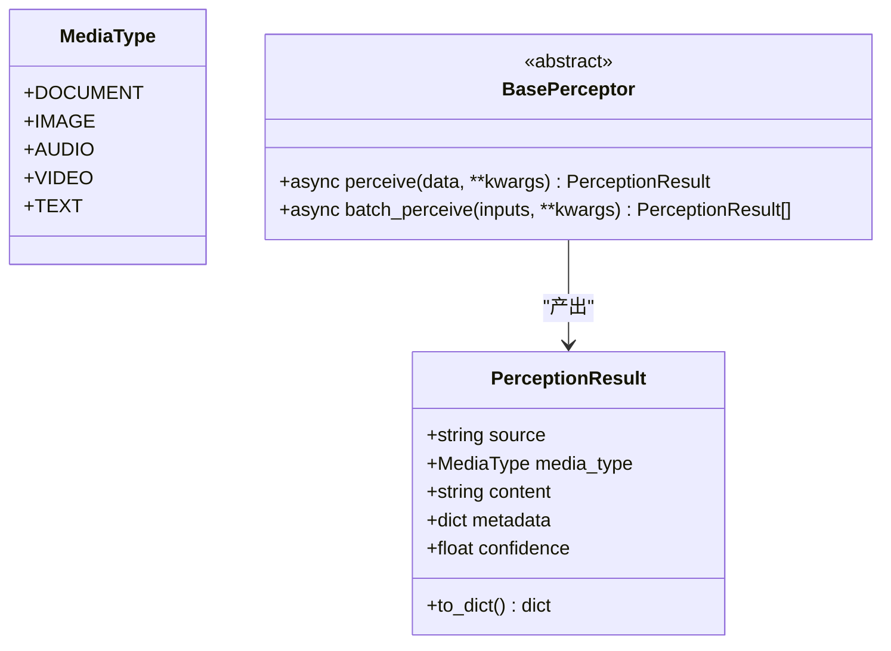
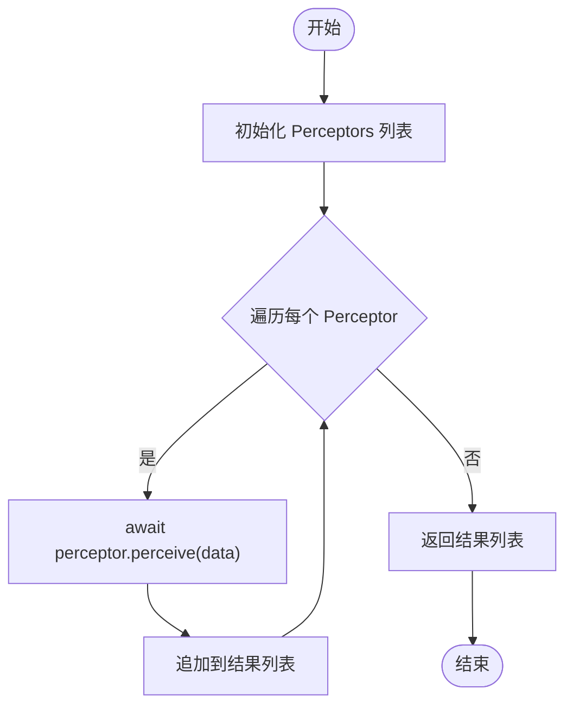
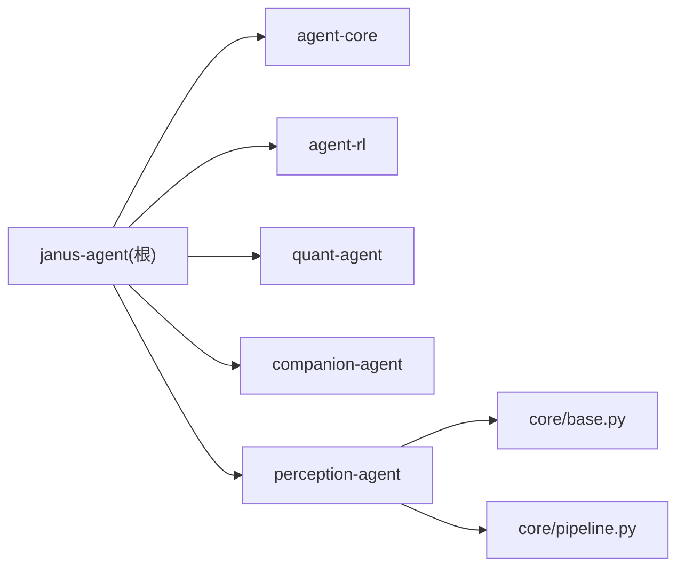

# VLM Wiki技术调研

<cite>
**本文引用的文件**   
- [VLM-wiki.md](file://docs/survey/perception/VLM-wiki.md)
- [main.py](file://main.py)
- [pyproject.toml](file://pyproject.toml)
- [perception-agent __init__.py](file://packages/perception-agent/src/perception_agent/__init__.py)
- [base.py](file://packages/perception-agent/src/perception_agent/core/base.py)
- [pipeline.py](file://packages/perception-agent/src/perception_agent/core/pipeline.py)
- [roadmap.html](file://docs/plans/roadmap.html)
</cite>

## 目录
1. [引言](#引言)
2. [项目结构](#项目结构)
3. [核心组件](#核心组件)
4. [架构总览](#架构总览)
5. [详细组件分析](#详细组件分析)
6. [依赖关系分析](#依赖关系分析)
7. [性能与可扩展性](#性能与可扩展性)
8. [故障排查指南](#故障排查指南)
9. [结论](#结论)
10. [附录](#附录)

## 引言
本调研聚焦于“VLM Wiki”相关能力在本仓库中的现状、可复用点与落地建议。内容来源包括：
- 对 VLM Wiki 外部仓库的调研报告（文档化总结）
- 感知代理（perception-agent）的抽象与管线设计
- JanusAgent 整体产品路线图与里程碑规划
- 工程入口与包组织方式

目标是帮助团队在“多模态感知 + 知识沉淀”的方向上，快速对齐现状、识别差距并制定下一步计划。

## 项目结构
仓库采用多包工作区组织，根入口 main.py 聚合多个子包；感知层以 perception-agent 提供统一的多模态输入抽象与流水线编排；产品路线与调研文档位于 docs 下。

图表来源
- [main.py:1-13](file://main.py#L1-L13)
- [perception-agent __init__.py:1-16](file://packages/perception-agent/src/perception_agent/__init__.py#L1-L16)
- [base.py:1-69](file://packages/perception-agent/src/perception_agent/core/base.py#L1-L69)
- [pipeline.py:1-45](file://packages/perception-agent/src/perception_agent/core/pipeline.py#L1-L45)
- [roadmap.html:1-471](file://docs/plans/roadmap.html#L1-L471)
- [VLM-wiki.md:1-297](file://docs/survey/perception/VLM-wiki.md#L1-L297)

章节来源
- [main.py:1-13](file://main.py#L1-L13)
- [pyproject.toml:1-30](file://pyproject.toml#L1-L30)

## 核心组件
- 感知抽象与结果模型
  - 媒体类型枚举：document/image/audio/video/text
  - 统一结果结构 PerceptionResult：包含 source、media_type、content、metadata、confidence
  - 抽象基类 BasePerceptor：定义 perceive 与 batch_perceive 接口
- 感知流水线
  - PerceptionPipeline：将多个 perceptor 按序串联，对同一份原始输入依次处理，产出多条结构化结果
- 工程入口与工作区
  - main.py 聚合各子包的 hello/main 能力
  - pyproject.toml 声明工作区成员与依赖

章节来源
- [base.py:11-69](file://packages/perception-agent/src/perception_agent/core/base.py#L11-L69)
- [pipeline.py:10-45](file://packages/perception-agent/src/perception_agent/core/pipeline.py#L10-L45)
- [perception-agent __init__.py:1-16](file://packages/perception-agent/src/perception_agent/__init__.py#L1-L16)
- [main.py:1-13](file://main.py#L1-L13)
- [pyproject.toml:1-30](file://pyproject.toml#L1-L30)

## 架构总览
从“多模态摄入 → 感知解析 → 知识沉淀”的角度，结合 VLM Wiki 的设计思想与感知层的抽象，形成如下端到端流程：

图表来源
- [pipeline.py:26-39](file://packages/perception-agent/src/perception_agent/core/pipeline.py#L26-L39)
- [base.py:42-69](file://packages/perception-agent/src/perception_agent/core/base.py#L42-L69)
- [VLM-wiki.md:66-74](file://docs/survey/perception/VLM-wiki.md#L66-L74)

## 详细组件分析

### 感知抽象与结果模型（BasePerceptor / PerceptionResult）
- 设计要点
  - 通过 MediaType 统一输入模态，屏蔽下游差异
  - PerceptionResult 作为跨感知器的标准产物，便于后续入库与检索
  - 支持异步单条与批量处理，为高吞吐场景预留扩展点
- 复杂度与扩展
  - 时间复杂度 O(n) 针对 n 个输入或 n 个 perceptor
  - 可通过继承 BasePerceptor 新增 OCR、布局分析、摘要等专用感知器

图表来源
- [base.py:11-69](file://packages/perception-agent/src/perception_agent/core/base.py#L11-L69)

章节来源
- [base.py:11-69](file://packages/perception-agent/src/perception_agent/core/base.py#L11-L69)

### 感知流水线（PerceptionPipeline）
- 设计要点
  - 将多个 perceptor 串成链式处理，适合“OCR → 版面分析 → 摘要”的组合
  - 保持幂等与可观测性：每个 perceptor 独立产出 PerceptionResult
- 使用建议
  - 将耗时操作（如大模型推理）放在最后环节，避免中间态放大
  - 对失败节点增加重试与降级策略（当前未内置，可在上层封装）

图表来源
- [pipeline.py:26-39](file://packages/perception-agent/src/perception_agent/core/pipeline.py#L26-L39)

章节来源
- [pipeline.py:10-45](file://packages/perception-agent/src/perception_agent/core/pipeline.py#L10-L45)

### VLM Wiki 调研要点与借鉴
- 三层结构与数据流
  - raw/（只读源材料）、wiki/（知识层）、.vlmwiki/（配置层）
  - 典型流程：源材料 → VLM 分析 → 信息抽取 → Wiki 更新 → 模式发现/回顾
- 已实现与缺失
  - 基础设施较完整（导入、反射、推送），但“自动 Wiki 文章生成流水线”尚未打通
  - 音频处理与模式发现未实现；部分 README 能力处于设计阶段
- 借鉴点
  - raw/wiki 分层思想可直接复用
  - 导入去重机制（manifest）可移植
  - “快照 + 历史趋势 + 下一步建议”的三段式回顾输出适合报告自动化

章节来源
- [VLM-wiki.md:28-74](file://docs/survey/perception/VLM-wiki.md#L28-L74)
- [VLM-wiki.md:150-227](file://docs/survey/perception/VLM-wiki.md#L150-L227)
- [VLM-wiki.md:265-297](file://docs/survey/perception/VLM-wiki.md#L265-L297)

### 与 JanusAgent 路线图的衔接
- 北极星与三支柱
  - 个人定制化、专家沉淀、记忆底座
  - 上下文工程为主，参数级手段为辅
- 里程碑与感知层的关系
  - M0/M2 先跑通协作面（量化），M1/M3 构建个性化与自进化闭环
  - 感知层为“多模态输入”的统一入口，支撑未来具身抽象（预留 perception/actuation）

章节来源
- [roadmap.html:200-276](file://docs/plans/roadmap.html#L200-L276)
- [roadmap.html:298-343](file://docs/plans/roadmap.html#L298-L343)
- [roadmap.html:388-443](file://docs/plans/roadmap.html#L388-L443)

## 依赖关系分析
- 包组织与依赖
  - 根项目 janus-agent 依赖 agent-core、agent-rl、quant-agent、companion-agent
  - perception-agent 提供多模感知抽象，供上层业务按需组合
- 模块耦合
  - perception-agent 内部仅依赖自身 core 模块，低耦合、易扩展
  - 与知识库/推送等子系统通过数据结构（PerceptionResult）解耦

图表来源
- [pyproject.toml:1-30](file://pyproject.toml#L1-L30)
- [perception-agent __init__.py:1-16](file://packages/perception-agent/src/perception_agent/__init__.py#L1-L16)
- [base.py:1-69](file://packages/perception-agent/src/perception_agent/core/base.py#L1-L69)
- [pipeline.py:1-45](file://packages/perception-agent/src/perception_agent/core/pipeline.py#L1-L45)

章节来源
- [pyproject.toml:1-30](file://pyproject.toml#L1-L30)

## 性能与可扩展性
- 并发与批处理
  - 建议在 batch_perceive 中引入并发控制（如信号量/任务池），提升吞吐
  - 对大模型推理环节做缓存与去重（基于 content hash）
- 资源与成本
  - 将昂贵推理置于流水线末端，减少无效计算
  - 对长视频/大图进行分片与关键帧采样，降低单次请求体积
- 可观测性
  - 为每个 perceptor 记录耗时、错误码与重试次数，便于定位瓶颈
  - 输出标准化日志字段（source、media_type、confidence）

[本节为通用指导，不直接分析具体文件]

## 故障排查指南
- 常见问题
  - 路径/编码问题：确保传入 data 的类型一致（bytes 或 str），并在 perceptor 内做好校验
  - 超时与重试：对外部 API 调用设置合理超时与指数退避
  - 结果一致性：对同一输入多次运行应得到稳定结果（幂等）
- 定位方法
  - 打印 PerceptionResult 的 to_dict() 检查字段完整性
  - 在 pipeline 中逐段断点，确认每步 perceptor 的输出是否符合预期

[本节为通用指导，不直接分析具体文件]

## 结论
- 感知层已具备清晰的抽象与编排能力，可作为多模态输入的“统一门面”
- VLM Wiki 的三层结构与回顾范式值得借鉴，但需补齐“自动文章生成流水线”
- 建议优先打通“感知结果 → 知识入库”的最小闭环，再逐步扩展至音频/视频与模式发现

[本节为总结性内容，不直接分析具体文件]

## 附录
- 术语
  - VLM：视觉语言模型
  - LLM：大语言模型
  - 感知器（Perceptor）：对单一模态或特定任务进行理解的结构化处理器
  - 感知管线（Pipeline）：将多个感知器按序组合的处理链

[本节为概念说明，不直接分析具体文件]