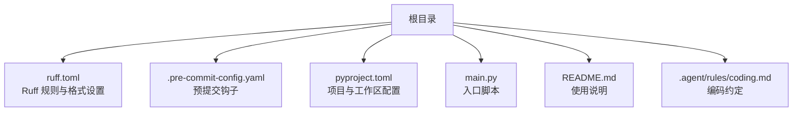
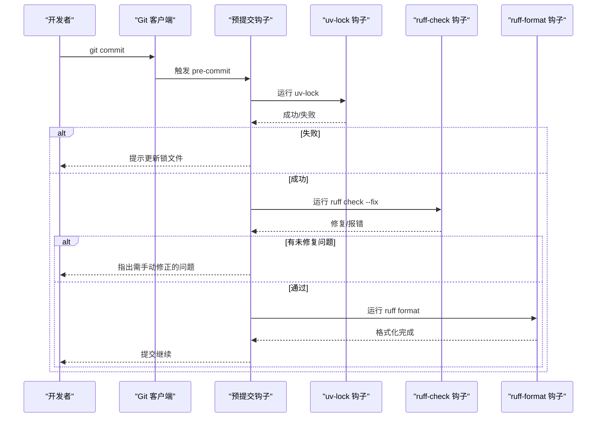
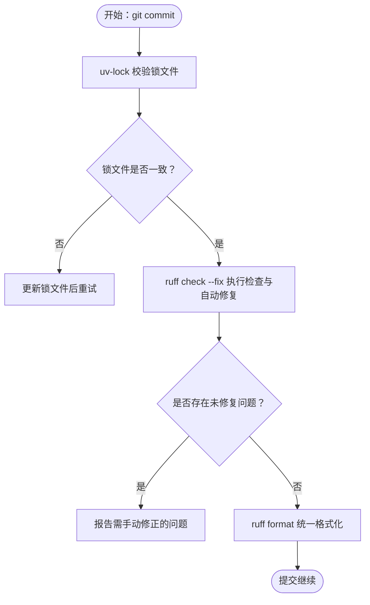
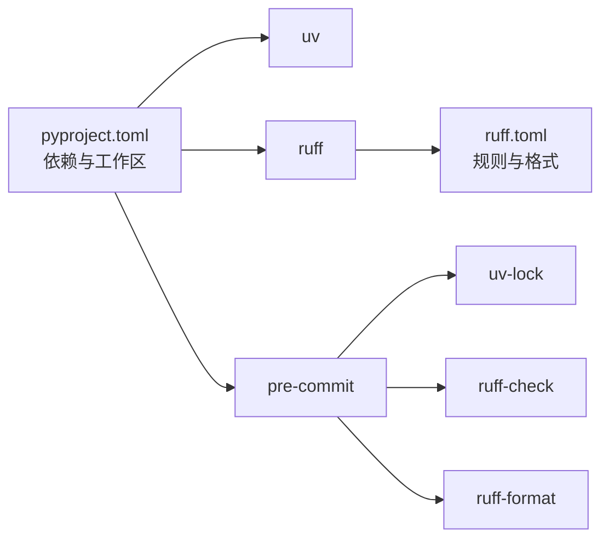

# 代码规范与最佳实践

<cite>
**本文引用的文件**   
- [ruff.toml](file://ruff.toml)
- [.pre-commit-config.yaml](file://.pre-commit-config.yaml)
- [pyproject.toml](file://pyproject.toml)
- [main.py](file://main.py)
- [README.md](file://README.md)
- [coding.md](file://.agent/rules/coding.md)
</cite>

## 目录
1. [引言](#引言)
2. [项目结构](#项目结构)
3. [核心组件](#核心组件)
4. [架构总览](#架构总览)
5. [详细组件分析](#详细组件分析)
6. [依赖分析](#依赖分析)
7. [性能考虑](#性能考虑)
8. [故障排查指南](#故障排查指南)
9. [结论](#结论)
10. [附录](#附录)

## 引言
本指南面向 JanusAgent 项目的开发者，统一代码质量要求与协作流程。内容覆盖：
- Ruff 规则配置（语法检查、导入排序、命名约定等）
- 代码格式化与风格指南（缩进、引号、行宽、注释等）
- 预提交钩子工作流（提交前自动检查与修复）
- 代码审查清单与常见反模式规避
- 正确/错误写法对照示例（以路径引用代替具体代码片段）

目标：在本地与 CI 中保持一致的代码风格与质量基线，减少人工审查成本，提升可维护性与可读性。

## 项目结构
本项目采用多包工作区结构，根目录包含统一的工具链与规范配置：
- ruff.toml：Ruff 的 lint/format 全局配置
- .pre-commit-config.yaml：预提交钩子定义（uv-lock、ruff-check、ruff-format）
- pyproject.toml：项目元数据、依赖与工作区成员声明
- main.py：应用入口示例
- README.md：包含常用命令说明（如 ruff check/.format）
- .agent/rules/coding.md：团队编码约定（测试、导入等）

图表来源
- [ruff.toml:1-70](file://ruff.toml#L1-L70)
- [.pre-commit-config.yaml:1-18](file://.pre-commit-config.yaml#L1-L18)
- [pyproject.toml:1-30](file://pyproject.toml#L1-L30)
- [main.py:1-13](file://main.py#L1-L13)
- [README.md:104-120](file://README.md#L104-L120)
- [coding.md:67-85](file://.agent/rules/coding.md#L67-L85)

章节来源
- [ruff.toml:1-70](file://ruff.toml#L1-L70)
- [.pre-commit-config.yaml:1-18](file://.pre-commit-config.yaml#L1-L18)
- [pyproject.toml:1-30](file://pyproject.toml#L1-L30)
- [main.py:1-13](file://main.py#L1-L13)
- [README.md:104-120](file://README.md#L104-L120)
- [coding.md:67-85](file://.agent/rules/coding.md#L67-L85)

## 核心组件
本节聚焦于代码质量相关的核心配置与约定，确保团队一致性与自动化保障。

- Ruff 规则与格式
  - 语言版本与行宽：目标 Python 版本为 3.12；建议单行最大长度 180 字符
  - 引号风格：统一使用双引号
  - 排除目录：构建产物、AI 相关目录与 tests 不参与检查
  - Lint 选择与忽略：启用广泛规则族（A、ASYNC、B、BLE、C4、COM、DTZ、E、ERA、EXE、F、FLY、G、I、ICN、ISC、LOG、PERF、PIE、PLC、PLE、PLW、PT、PTH、RET、RUF、S、SIM、T、TRY、UP、W），并显式忽略部分主观或开发期宽松规则
  - 导入排序：启用 isort（I）族规则，配合团队约定“标准库→第三方→本地”分组与组内字母序
  - 安全与异常：启用 bandit（S）、tryceratops（TRY）等，但根据团队偏好忽略若干过于严格或主观的规则

- 预提交钩子
  - uv-lock：保证锁文件一致性
  - ruff-check：执行检查并尝试自动修复
  - ruff-format：统一格式化输出

- 编码约定（补充）
  - 测试：使用 pytest，函数式测试，命名遵循 test_<function>_<scenario>
  - 导入：绝对导入优先，按组与字母序排列
  - 禁止项：空 except、类型抑制等

章节来源
- [ruff.toml:1-70](file://ruff.toml#L1-L70)
- [.pre-commit-config.yaml:1-18](file://.pre-commit-config.yaml#L1-L18)
- [coding.md:67-85](file://.agent/rules/coding.md#L67-L85)

## 架构总览
下图展示从开发者提交到预提交钩子执行的端到端流程，以及 Ruff 在其中的作用。

图表来源
- [.pre-commit-config.yaml:1-18](file://.pre-commit-config.yaml#L1-L18)
- [ruff.toml:1-70](file://ruff.toml#L1-L70)

## 详细组件分析

### Ruff 规则与格式化配置详解
- 目标版本与行宽
  - target-version 指定为 py312，确保新语法与语义检查基于最新特性
  - line-length 设置为 180，兼顾可读性与终端显示
- 引号风格
  - quote-style 设为 double，统一字符串字面量风格
- 排除范围
  - exclude 排除 build、.claude、.agents、tests，避免对生成物与测试进行不必要的检查
- Lint 规则族
  - select 启用了大量规则族，涵盖语法、风格、安全、性能、日志、异常处理、路径操作、返回值、类型升级等
  - ignore 列表体现了团队取舍：例如允许 assert、放宽某些异常消息、保留调试打印、不强制 ClassVar 标注可变类属性等
- 导入排序
  - 启用 I 族（isort），结合团队约定实现“标准库→第三方→本地”的三段式分组与组内字母序
- 格式化
  - 由 ruff-format 负责统一缩进、空格、换行、引号等样式

章节来源
- [ruff.toml:1-70](file://ruff.toml#L1-L70)

### 预提交钩子工作流
- uv-lock
  - 确保依赖锁定文件与当前环境一致，防止“在我机器上能跑”的问题
- ruff-check
  - 执行静态检查，并尝试自动修复（--fix），减少手工调整成本
- ruff-format
  - 统一代码风格，避免风格分歧导致的 diff 噪音

图表来源
- [.pre-commit-config.yaml:1-18](file://.pre-commit-config.yaml#L1-L18)

章节来源
- [.pre-commit-config.yaml:1-18](file://.pre-commit-config.yaml#L1-L18)

### 导入与命名约定
- 导入顺序
  - 标准库 → 第三方 → 本地模块，每组内部按字母序排列
  - 优先使用绝对导入，便于跨包引用与重构
- 命名约定
  - 变量与函数：小写下划线分隔
  - 常量：大写下划线分隔
  - 类与接口：帕斯卡命名
  - 布尔变量：is_/has_/should_ 前缀增强可读性
- 参考依据
  - 团队编码约定文档明确导入顺序与测试命名范式

章节来源
- [coding.md:67-85](file://.agent/rules/coding.md#L67-L85)

### 代码审查清单
建议在 PR 或合并前逐项核对：
- 功能正确性
  - 逻辑分支覆盖边界条件
  - 异常路径有明确的错误处理与日志
- 安全性
  - 无硬编码密钥/敏感信息
  - 输入校验与参数白名单
  - 依赖漏洞扫描通过
- 性能
  - 避免 N+1 查询与不必要循环
  - 合理使用缓存与惰性加载
- 可维护性
  - 单一职责，函数/类规模适中
  - 命名清晰，注释解释“为什么”而非“是什么”
- 风格与规范
  - 通过 ruff check 与 ruff format
  - 导入顺序符合约定
  - 无遗留调试语句与 TODO 标记
- 测试
  - 新增/变更逻辑具备对应测试
  - 测试命名遵循 test_<function>_<scenario>

[本节为通用清单，不直接分析具体文件]

### 常见反模式与规避方法
- 空 except 块捕获所有异常，掩盖真实错误
  - 规避：精确捕获特定异常，记录上下文
- 滥用 lambda 赋值或复杂表达式
  - 规避：使用具名函数，提高可读性与可测试性
- 长函数与深层嵌套
  - 规避：拆分职责，提取辅助函数，降低复杂度
- 魔法数字与硬编码
  - 规避：抽取为常量或配置项
- 过度使用断言用于业务校验
  - 规避：在生产环境中断言可能被禁用，应使用显式校验与异常
- 忽略导入顺序与相对导入泛滥
  - 规避：使用 isort 与绝对导入，保持包间依赖清晰

[本节为通用指导，不直接分析具体文件]

### 正确与错误写法对照（路径示例）
以下为“正确 vs 错误”写法的定位参考（请打开对应文件查看实际差异）：
- 导入顺序与分组
  - 错误示例：[main.py:1-3](file://main.py#L1-L3)
  - 正确示例：[main.py:1-3](file://main.py#L1-L3)
- 函数入口与返回
  - 错误示例：[main.py:5-8](file://main.py#L5-L8)
  - 正确示例：[main.py:5-8](file://main.py#L5-L8)
- 注释与调试残留
  - 错误示例：[main.py:6-8](file://main.py#L6-L8)
  - 正确示例：[main.py:6-8](file://main.py#L6-L8)

说明：以上路径仅用于快速定位对比位置，请勿直接复制粘贴代码片段。

章节来源
- [main.py:1-13](file://main.py#L1-L13)

## 依赖分析
- 工具链依赖
  - uv：工作区与依赖管理
  - ruff：lint 与格式化
  - pre-commit：钩子编排
- 配置关系
  - pyproject.toml 声明工作区成员与开发依赖（含 ruff、pre-commit）
  - ruff.toml 提供规则与格式化策略
  - .pre-commit-config.yaml 串联 uv-lock、ruff-check、ruff-format

图表来源
- [pyproject.toml:1-30](file://pyproject.toml#L1-L30)
- [ruff.toml:1-70](file://ruff.toml#L1-L70)
- [.pre-commit-config.yaml:1-18](file://.pre-commit-config.yaml#L1-L18)

章节来源
- [pyproject.toml:1-30](file://pyproject.toml#L1-L30)
- [ruff.toml:1-70](file://ruff.toml#L1-L70)
- [.pre-commit-config.yaml:1-18](file://.pre-commit-config.yaml#L1-L18)

## 性能考虑
- 合理设置 line-length，避免过长行导致编辑器折行与审阅困难
- 利用 ruff 的高性能特性，将检查与格式化纳入预提交，减少后期返工
- 在大型仓库中，按需启用规则族，避免一次性引入过多告警影响效率

[本节为通用指导，不直接分析具体文件]

## 故障排查指南
- 提交被阻断且提示需要更新锁文件
  - 现象：uv-lock 钩子失败
  - 处理：重新安装依赖并生成锁文件，再提交
- ruff-check 报出未自动修复的问题
  - 现象：存在无法自动修复的违规
  - 处理：根据提示逐条修正，必要时在 ruff.toml 中评估是否需要忽略某条规则
- ruff-format 频繁改动无关文件
  - 现象：格式化产生大量 diff
  - 处理：确认团队统一使用 ruff-format，并在 IDE 中集成以避免冲突
- 本地通过但 CI 失败
  - 现象：环境不一致导致结果不同
  - 处理：使用 uv 锁定环境与依赖，确保本地与 CI 一致

章节来源
- [.pre-commit-config.yaml:1-18](file://.pre-commit-config.yaml#L1-L18)
- [ruff.toml:1-70](file://ruff.toml#L1-L70)

## 结论
通过将 Ruff 规则与格式化策略集中配置，并结合预提交钩子自动化执行，JanusAgent 项目在代码风格、导入顺序、异常处理与安全扫描等方面建立了统一的质量基线。配合清晰的审查清单与反模式规避建议，可有效降低沟通成本、提升交付质量与可维护性。

[本节为总结性内容，不直接分析具体文件]

## 附录
- 常用命令
  - 检查：ruff check .
  - 格式化：ruff format .
  - 参考：[README.md:104-120](file://README.md#L104-L120)

章节来源
- [README.md:104-120](file://README.md#L104-L120)