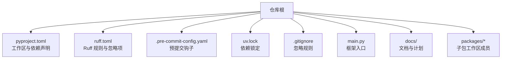
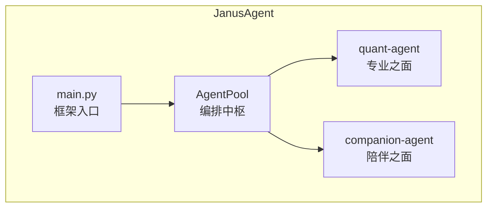
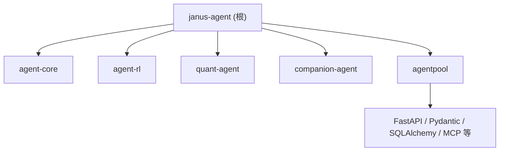

# 开发指南

<cite>
**本文引用的文件**   
- [README.md](file://README.md)
- [pyproject.toml](file://pyproject.toml)
- [ruff.toml](file://ruff.toml)
- [.pre-commit-config.yaml](file://.pre-commit-config.yaml)
- [main.py](file://main.py)
- [uv.lock](file://uv.lock)
- [.gitignore](file://.gitignore)
- [roadmap.md](file://docs/plans/roadmap.md)
</cite>

## 目录
1. [简介](#简介)
2. [项目结构](#项目结构)
3. [核心组件](#核心组件)
4. [架构总览](#架构总览)
5. [详细组件分析](#详细组件分析)
6. [依赖分析](#依赖分析)
7. [性能考虑](#性能考虑)
8. [故障排除指南](#故障排除指南)
9. [贡献者工作流程](#贡献者工作流程)
10. [结论](#结论)
11. [附录](#附录)

## 简介
本指南面向开发者，提供从环境搭建、代码规范、测试策略到调试与排障的完整实践说明，并给出贡献流程与路线图概览。项目采用 uv 工作区模式组织多包（packages/*），以 Ruff 进行代码检查与格式化，通过 pre-commit 在提交前自动执行锁文件更新与代码质量检查。入口程序 main.py 负责启动框架并调用子模块能力。

## 项目结构
仓库为 Python 多包工作区，根配置位于 pyproject.toml，锁定依赖于 uv.lock；代码风格与检查规则由 ruff.toml 管理；提交前钩子由 .pre-commit-config.yaml 定义；.gitignore 屏蔽构建产物、虚拟环境与缓存等。

图表来源
- [pyproject.toml:1-30](file://pyproject.toml#L1-L30)
- [ruff.toml:1-70](file://ruff.toml#L1-L70)
- [.pre-commit-config.yaml:1-18](file://.pre-commit-config.yaml#L1-L18)
- [uv.lock:1-20](file://uv.lock#L1-L20)
- [.gitignore:1-225](file://.gitignore#L1-L225)
- [main.py:1-13](file://main.py#L1-L13)

章节来源
- [README.md:39-112](file://README.md#L39-L112)
- [pyproject.toml:1-30](file://pyproject.toml#L1-L30)
- [ruff.toml:1-70](file://ruff.toml#L1-L70)
- [.pre-commit-config.yaml:1-18](file://.pre-commit-config.yaml#L1-L18)
- [uv.lock:1-20](file://uv.lock#L1-L20)
- [.gitignore:1-225](file://.gitignore#L1-L225)
- [main.py:1-13](file://main.py#L1-L13)

## 核心组件
- 工作区与依赖
  - 使用 uv 工作区模式，根 pyproject.toml 声明 workspace members 指向 packages/*，并通过 dependency-groups.dev 引入开发期工具链（pre-commit、ruff）。
  - 子包通过 [tool.uv.sources] 以 workspace = true 方式引用，便于本地可编辑安装与统一版本管理。
- 代码质量与格式
  - ruff.toml 定义了行宽、目标 Python 版本、忽略目录、格式化引号风格，以及 lint 选择与忽略的规则集合。
- 预提交钩子
  - .pre-commit-config.yaml 集成 uv-pre-commit 的 uv-lock 钩子与 ruff-pre-commit 的 ruff-check（含 --fix）和 ruff-format。
- 应用入口
  - main.py 作为框架入口，打印标识信息并调用子模块能力函数。

章节来源
- [pyproject.toml:14-30](file://pyproject.toml#L14-L30)
- [ruff.toml:1-70](file://ruff.toml#L1-L70)
- [.pre-commit-config.yaml:1-18](file://.pre-commit-config.yaml#L1-L18)
- [main.py:1-13](file://main.py#L1-L13)

## 架构总览
整体架构围绕“双面孔”智能体展开：量化之面与陪伴之面共享编排中枢 AgentPool，并通过多种协议暴露能力。根入口 main.py 负责组装与启动。

图表来源
- [README.md:61-84](file://README.md#L61-L84)
- [main.py:1-13](file://main.py#L1-L13)

## 详细组件分析

### 开发环境搭建
- 前置要求
  - Python 版本：>=3.12（pyproject.toml 声明 requires-python）。
  - 包管理器：uv（工作区模式）。
- 初始化与同步
  - 在工作区根目录执行依赖同步命令，确保所有子包与开发依赖安装完成。
- 运行与验证
  - 通过入口脚本启动框架，确认子模块能力可被正常调用。
- 常用命令
  - 代码检查：ruff check .
  - 代码格式化：ruff format .
  - 运行测试：pytest

章节来源
- [README.md:95-112](file://README.md#L95-L112)
- [pyproject.toml:1-12](file://pyproject.toml#L1-L12)

### 代码规范与最佳实践
- 语言与风格
  - 目标 Python 版本：py312。
  - 行宽限制：180。
  - 格式化引号风格：双引号。
- 规则集
  - 启用广泛规则族（如 pycodestyle、flake8-*、pylint、bandit、isort、perflint、pyupgrade 等），并根据团队偏好选择性忽略部分规则。
- 忽略范围
  - 排除 build、.claude、.agents、tests 等目录，避免对生成或测试代码强约束。
- 建议
  - 遵循 Google 风格文档字符串（见 README 开发栈说明）。
  - 保持 import 顺序与分组一致（isort 规则生效）。
  - 谨慎使用 assert 与随机数生成器（对应规则已纳入检查）。

章节来源
- [ruff.toml:1-70](file://ruff.toml#L1-L70)
- [README.md:114-125](file://README.md#L114-L125)

### 预提交钩子设置
- 钩子清单
  - uv-lock：保证 uv.lock 与工作区状态一致。
  - ruff-check：执行静态检查并尝试自动修复。
  - ruff-format：统一代码格式。
- 使用方法
  - 首次安装后，在提交前自动触发上述钩子；若失败需根据提示修复后再提交。

章节来源
- [.pre-commit-config.yaml:1-18](file://.pre-commit-config.yaml#L1-L18)

### 测试策略与用例编写
- 测试框架
  - 使用 pytest 作为统一测试运行器。
- 分层策略
  - 单元测试：针对函数/类方法的最小单元验证。
  - 集成测试：跨模块/协议的端到端场景验证。
  - 性能测试：关注关键路径耗时与资源占用（结合 perf 相关规则与外部基准工具）。
- 建议
  - 将测试数据与断言结果隔离，便于快照对比。
  - 异步测试使用 pytest-asyncio（参考 agentpool 的 dev-dependencies）。
  - 覆盖率统计使用 pytest-cov，并在 CI 中设定阈值。

章节来源
- [README.md:110-112](file://README.md#L110-L112)
- [uv.lock:167-186](file://uv.lock#L167-L186)

### 调试技巧与故障排除
- 日志与结构化输出
  - 使用 structlog 等结构化日志库（参考 agentpool 依赖），配合环境变量控制级别与输出目标。
- 常见问题定位
  - 依赖冲突：优先核对 uv.lock 与 pyproject.toml 的一致性，必要时重新同步。
  - 预提交失败：查看 ruff 输出并执行自动修复，再提交。
  - 导入错误：确认子包已在工作区内且可编辑安装。
- 性能分析
  - 使用 pyinstrument 等工具对热点路径采样分析（参考 agentpool 的 benchmark 依赖）。

章节来源
- [uv.lock:167-186](file://uv.lock#L167-L186)
- [.pre-commit-config.yaml:1-18](file://.pre-commit-config.yaml#L1-L18)

### 贡献者工作流程
- 分支模型
  - 主分支保护，功能分支命名建议 feature/*，修复分支 hotfix/*。
- 提交流程
  - 本地执行 ruff check/format 与测试用例，确保通过。
  - 提交前由 pre-commit 自动校验 uv.lock 与代码风格。
- Pull Request 审查标准
  - 变更需有对应测试覆盖。
  - 代码风格符合 ruff 规则。
  - 变更影响范围清晰，必要时补充文档或示例。

章节来源
- [.pre-commit-config.yaml:1-18](file://.pre-commit-config.yaml#L1-L18)
- [README.md:114-125](file://README.md#L114-L125)

### 项目路线图与未来规划
- 北极星与演进主线
  - 以“上下文工程为主”，沉淀通用内核 agent-core，逐步走向具身智能。
- 里程碑概览
  - M0 骨架跑通 → M2 协助面（量化）→ M1 定制化+记忆底座 → M3 自进化闭环 → M4 通用内核沉淀。
- 长期愿景
  - 具身 Janus：多模感知与 VLA 反馈闭环，触觉差异化能力。

章节来源
- [roadmap.md:1-191](file://docs/plans/roadmap.md#L1-L191)

## 依赖分析
- 工作区成员
  - 根 pyproject.toml 声明 workspace members 为 packages/*，uv.lock manifest 列出具体成员。
- 关键依赖
  - 根项目依赖多个子包（agent-core、agent-rl、quant-agent、companion-agent）。
  - 子包 agentpool 包含大量运行时与可选依赖（如 FastAPI、MCP、Pydantic、SQLAlchemy 等），并提供 dev/benchmark/docs/lint 等可选组。
- 版本锁定
  - uv.lock 记录精确版本与平台标记，确保可复现构建。

图表来源
- [pyproject.toml:1-12](file://pyproject.toml#L1-L12)
- [uv.lock:12-20](file://uv.lock#L12-L20)
- [uv.lock:35-96](file://uv.lock#L35-L96)

章节来源
- [pyproject.toml:1-30](file://pyproject.toml#L1-L30)
- [uv.lock:1-20](file://uv.lock#L1-L20)
- [uv.lock:35-96](file://uv.lock#L35-L96)

## 性能考虑
- 代码层面
  - 遵循 ruff 的 PERF 规则族，避免不必要的循环与拷贝，合理使用生成器与惰性求值。
- 依赖层面
  - 按需启用可选依赖组，减少冷启动开销。
- 分析与优化
  - 使用 pyinstrument 进行热点定位，结合 structlog 输出关键指标。
  - 对 I/O 密集路径考虑异步化与连接池复用。

[本节为通用指导，不直接分析具体文件]

## 故障排除指南
- 依赖问题
  - 现象：安装失败或版本冲突。
  - 处理：删除 uv.lock 后重新同步，或检查平台标记与镜像源。
- 预提交失败
  - 现象：ruff-check/ruff-format 报错。
  - 处理：按提示修复，或使用 --fix 自动修复后重试。
- 运行异常
  - 现象：导入错误或模块未找到。
  - 处理：确认子包已正确注册到工作区并可编辑安装；清理 __pycache__ 与缓存目录。

章节来源
- [.gitignore:1-225](file://.gitignore#L1-L225)
- [.pre-commit-config.yaml:1-18](file://.pre-commit-config.yaml#L1-L18)

## 结论
本项目以 uv 工作区为核心，结合 Ruff 与 pre-commit 形成稳定的开发与质量保障流水线。通过清晰的架构分层与路线图指引，可在短期内实现“能办事”的量化助手，并逐步沉淀通用内核与自进化机制。建议在日常开发中严格遵循代码规范与测试策略，持续完善性能与可观测性。

[本节为总结性内容，不直接分析具体文件]

## 附录

### 快速开始命令速查
- 同步依赖：uv sync --all-extras
- 启动框架：python main.py
- 代码检查：ruff check .
- 代码格式化：ruff format .
- 运行测试：pytest

章节来源
- [README.md:95-112](file://README.md#L95-L112)

### 忽略文件与缓存
- 主要忽略项包括：构建产物、虚拟环境、测试缓存、IDE 配置、Ruff 缓存等。
- 注意：uv.lock 通常建议纳入版本控制以保证可复现性（参见 .gitignore 注释说明）。

章节来源
- [.gitignore:1-225](file://.gitignore#L1-L225)