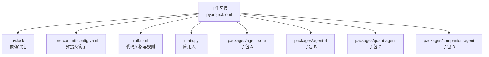
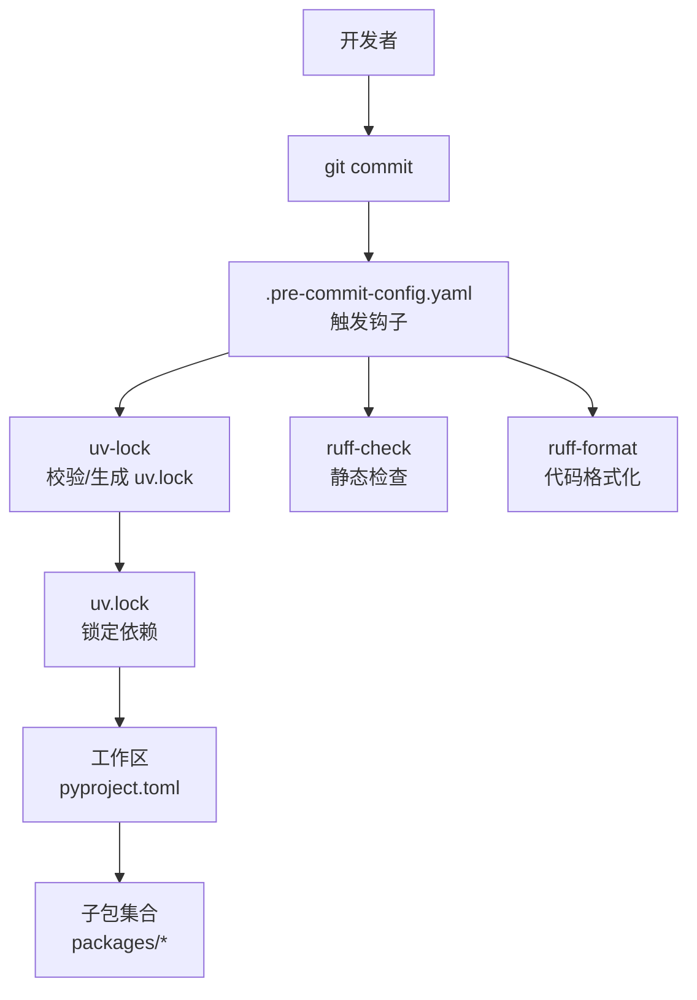
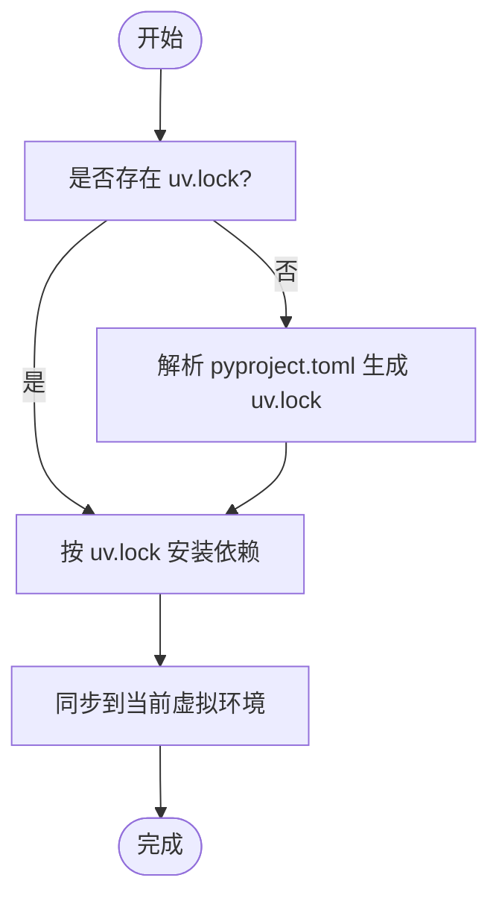
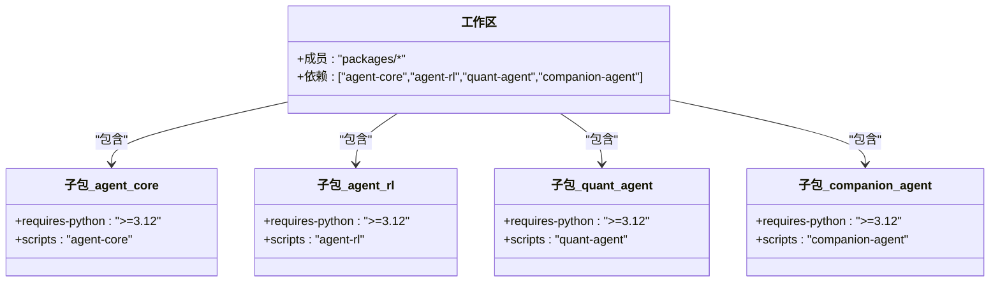
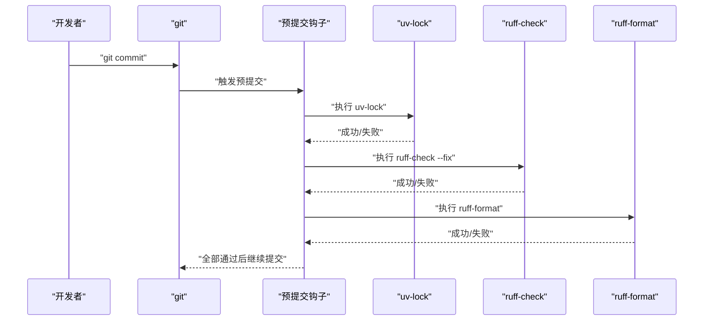
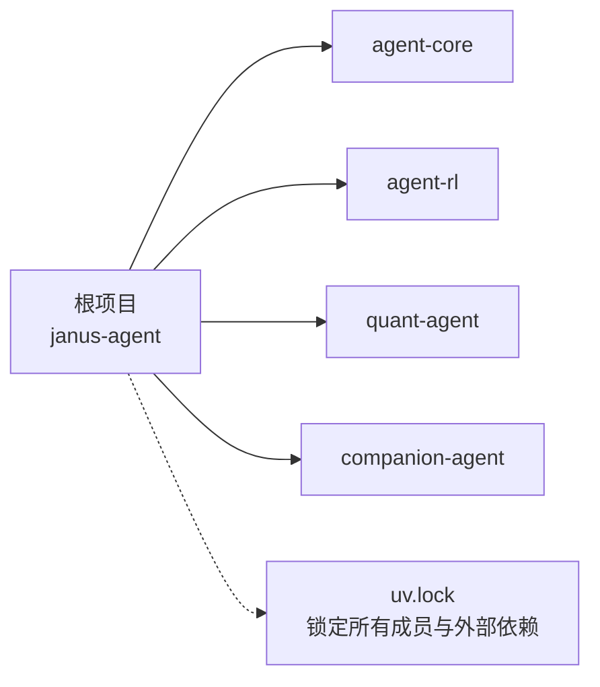

# 开发环境搭建

<cite>
**本文引用的文件**
- [pyproject.toml](file://pyproject.toml)
- [uv.lock](file://uv.lock)
- [.pre-commit-config.yaml](file://.pre-commit-config.yaml)
- [ruff.toml](file://ruff.toml)
- [main.py](file://main.py)
- [packages/agent-core/pyproject.toml](file://packages/agent-core/pyproject.toml)
- [packages/agent-rl/pyproject.toml](file://packages/agent-rl/pyproject.toml)
- [packages/quant-agent/pyproject.toml](file://packages/quant-agent/pyproject.toml)
- [packages/companion-agent/pyproject.toml](file://packages/companion-agent/pyproject.toml)
</cite>

## 目录
1. [简介](#简介)
2. [项目结构](#项目结构)
3. [核心组件](#核心组件)
4. [架构总览](#架构总览)
5. [详细组件分析](#详细组件分析)
6. [依赖分析](#依赖分析)
7. [性能考虑](#性能考虑)
8. [故障排查指南](#故障排查指南)
9. [结论](#结论)
10. [附录](#附录)

## 简介
本指南面向首次参与 JanusAgent 项目的开发者，目标是帮助你在本地快速、稳定地搭建可复现的开发环境。内容涵盖：
- Python 3.12+ 的安装与配置要求（含虚拟环境管理）
- uv 包管理器在依赖安装、版本锁定与环境同步中的使用
- 工作空间与多包管理（基于 pyproject.toml）
- 预提交钩子的安装与配置，确保代码质量检查在提交前自动运行
- 常见环境问题的排查与解决方案

## 项目结构
仓库采用“单根工作区 + 多子包”的组织方式：
- 根目录包含应用入口、工作区配置、锁文件与代码质量工具配置
- packages 目录下为多个独立的可发布包，通过工作区统一管理与解析依赖

图示来源
- [pyproject.toml:14-17](file://pyproject.toml#L14-L17)
- [uv.lock:12-20](file://uv.lock#L12-L20)
- [.pre-commit-config.yaml:1-18](file://.pre-commit-config.yaml#L1-L18)
- [ruff.toml:1-70](file://ruff.toml#L1-L70)
- [main.py:1-13](file://main.py#L1-L13)

章节来源
- [pyproject.toml:1-30](file://pyproject.toml#L1-L30)
- [uv.lock:12-20](file://uv.lock#L12-L20)
- [main.py:1-13](file://main.py#L1-L13)

## 核心组件
- 工作区与工作区成员
  - 根 pyproject.toml 声明了工作区成员为 packages/*，并声明了四个本地子包的依赖关系
  - uv.lock 记录了工作区中所有成员的完整依赖树与版本锁定信息
- 子包清单
  - agent-core、agent-rl、quant-agent、companion-agent 均为独立的 Python 包，各自拥有 pyproject.toml 与构建后端 uv_build
- 代码质量与格式化
  - ruff.toml 定义了目标 Python 版本、忽略规则与启用规则集
  - .pre-commit-config.yaml 集成了 uv-lock、ruff-check、ruff-format 三个钩子
- 应用入口
  - main.py 作为示例入口，演示如何导入并使用子包提供的能力

章节来源
- [pyproject.toml:1-30](file://pyproject.toml#L1-L30)
- [uv.lock:12-20](file://uv.lock#L12-L20)
- [packages/agent-core/pyproject.toml:1-18](file://packages/agent-core/pyproject.toml#L1-L18)
- [packages/agent-rl/pyproject.toml:1-17](file://packages/agent-rl/pyproject.toml#L1-L17)
- [packages/quant-agent/pyproject.toml:1-18](file://packages/quant-agent/pyproject.toml#L1-L18)
- [packages/companion-agent/pyproject.toml:1-18](file://packages/companion-agent/pyproject.toml#L1-L18)
- [ruff.toml:1-70](file://ruff.toml#L1-L70)
- [.pre-commit-config.yaml:1-18](file://.pre-commit-config.yaml#L1-L18)
- [main.py:1-13](file://main.py#L1-L13)

## 架构总览
下图展示了工作区、子包与依赖锁定之间的关系，以及预提交钩子在提交流程中的作用。

图示来源
- [.pre-commit-config.yaml:1-18](file://.pre-commit-config.yaml#L1-L18)
- [pyproject.toml:14-17](file://pyproject.toml#L14-L17)
- [uv.lock:12-20](file://uv.lock#L12-L20)

## 详细组件分析

### Python 环境与虚拟环境
- 最低版本要求
  - 工作区与子包均要求 Python >= 3.12
- 推荐做法
  - 使用系统自带的 Python 3.12+ 或 pyenv/conda 等版本管理工具安装
  - 使用 uv 创建与管理虚拟环境（也可使用 venv/pipenv/poetry，但本项目以 uv 为核心）
- 常用命令（说明性步骤）
  - 在工作区根目录执行 uv 的初始化/安装依赖命令，使 uv 根据 pyproject.toml 与 uv.lock 解析并安装依赖
  - 若需要切换 Python 版本，请确保满足 requires-python 约束

章节来源
- [pyproject.toml:6](file://pyproject.toml#L6)
- [packages/agent-core/pyproject.toml:9](file://packages/agent-core/pyproject.toml#L9)
- [packages/agent-rl/pyproject.toml:9](file://packages/agent-rl/pyproject.toml#L9)
- [packages/quant-agent/pyproject.toml:9](file://packages/quant-agent/pyproject.toml#L9)
- [packages/companion-agent/pyproject.toml:9](file://packages/companion-agent/pyproject.toml#L9)

### uv 包管理器：依赖安装、版本锁定与环境同步
- 依赖声明
  - 根 pyproject.toml 声明了四个本地子包作为依赖，并通过 [tool.uv.sources] 指向工作区内成员
- 工作区成员
  - [tool.uv.workspace] 将 packages/* 纳入工作区，便于统一解析依赖与构建
- 版本锁定
  - uv.lock 记录了解析后的精确版本与哈希，保证团队与 CI 的一致性
- 典型操作（说明性步骤）
  - 首次克隆后，在工作区根目录执行 uv 的依赖安装命令，使其根据 pyproject.toml 与 uv.lock 完成安装
  - 当修改依赖后，再次执行安装命令以更新 uv.lock
  - 如需在不同机器上复现相同环境，直接拉取 uv.lock 并执行安装即可

图示来源
- [pyproject.toml:1-30](file://pyproject.toml#L1-L30)
- [uv.lock:1-20](file://uv.lock#L1-L20)

章节来源
- [pyproject.toml:1-30](file://pyproject.toml#L1-L30)
- [uv.lock:1-20](file://uv.lock#L1-L20)

### 工作空间与多包管理
- 工作区定义
  - 根 pyproject.toml 通过 [tool.uv.workspace] 指定成员为 packages/*
- 子包清单
  - agent-core、agent-rl、quant-agent、companion-agent 各自维护独立的元数据与脚本入口
- 依赖映射
  - 根 pyproject.toml 的 dependencies 列出了四个子包名称，并在 [tool.uv.sources] 中将它们映射为工作区成员

图示来源
- [pyproject.toml:14-30](file://pyproject.toml#L14-L30)
- [packages/agent-core/pyproject.toml:1-18](file://packages/agent-core/pyproject.toml#L1-L18)
- [packages/agent-rl/pyproject.toml:1-17](file://packages/agent-rl/pyproject.toml#L1-L17)
- [packages/quant-agent/pyproject.toml:1-18](file://packages/quant-agent/pyproject.toml#L1-L18)
- [packages/companion-agent/pyproject.toml:1-18](file://packages/companion-agent/pyproject.toml#L1-L18)

章节来源
- [pyproject.toml:14-30](file://pyproject.toml#L14-L30)
- [packages/agent-core/pyproject.toml:1-18](file://packages/agent-core/pyproject.toml#L1-L18)
- [packages/agent-rl/pyproject.toml:1-17](file://packages/agent-rl/pyproject.toml#L1-L17)
- [packages/quant-agent/pyproject.toml:1-18](file://packages/quant-agent/pyproject.toml#L1-L18)
- [packages/companion-agent/pyproject.toml:1-18](file://packages/companion-agent/pyproject.toml#L1-L18)

### 预提交钩子：安装与配置
- 钩子清单
  - uv-lock：在提交前校验/生成 uv.lock，确保依赖锁定一致
  - ruff-check：执行静态检查，并尝试自动修复
  - ruff-format：执行代码格式化
- 安装步骤（说明性步骤）
  - 在工作区根目录安装预提交钩子
  - 首次提交时会自动运行上述钩子；如失败，需根据提示修复后再提交
- 行为说明
  - 若 uv.lock 与当前依赖不一致，uv-lock 会阻止提交并提示更新
  - ruff 会根据 ruff.toml 的规则集进行检查与格式化

图示来源
- [.pre-commit-config.yaml:1-18](file://.pre-commit-config.yaml#L1-L18)
- [ruff.toml:1-70](file://ruff.toml#L1-L70)

章节来源
- [.pre-commit-config.yaml:1-18](file://.pre-commit-config.yaml#L1-L18)
- [ruff.toml:1-70](file://ruff.toml#L1-L70)

### 应用入口与运行
- 入口文件
  - main.py 导入了 quant-agent 与 companion-agent 两个子包，并调用其导出函数进行演示
- 运行方式（说明性步骤）
  - 在已安装依赖的虚拟环境中，于工作区根目录执行 python main.py 即可运行示例

章节来源
- [main.py:1-13](file://main.py#L1-L13)

## 依赖分析
- 顶层依赖
  - 根 pyproject.toml 声明了四个本地子包作为依赖
- 工作区成员
  - uv.lock 的 manifest.members 列出了工作区内的所有成员，包括根项目与各个子包
- 外部依赖
  - uv.lock 中包含了大量第三方库及其版本与哈希，用于跨平台与跨机器的可复现安装

图示来源
- [pyproject.toml:7-12](file://pyproject.toml#L7-L12)
- [uv.lock:12-20](file://uv.lock#L12-L20)

章节来源
- [pyproject.toml:7-12](file://pyproject.toml#L7-L12)
- [uv.lock:12-20](file://uv.lock#L12-L20)

## 性能考虑
- 使用 uv 安装与解析依赖通常比传统 pip 更快，尤其在大型工作区场景下
- 保持 uv.lock 受控与最小化变更，有助于减少重复解析与下载时间
- 合理划分子包边界，避免不必要的循环依赖，提升依赖解析效率

## 故障排查指南
- Python 版本不匹配
  - 现象：安装或运行时提示版本不满足 requires-python
  - 处理：确认当前 Python 版本 >= 3.12，必要时升级或切换至符合要求的解释器
- uv.lock 冲突
  - 现象：提交被 uv-lock 钩子拒绝，提示 uv.lock 与实际依赖不一致
  - 处理：在工作区根目录重新执行 uv 的依赖安装命令以更新 uv.lock，再提交
- 预提交钩子未生效
  - 现象：提交未触发检查
  - 处理：确认已在本地安装并初始化预提交钩子；检查 .pre-commit-config.yaml 是否被误改
- 代码风格检查失败
  - 现象：ruff-check/ruff-format 报错
  - 处理：根据 ruff.toml 的规则集修复问题；ruff-check 已配置自动修复时可先执行修复再提交
- 子包不可导入
  - 现象：运行 main.py 时报找不到模块
  - 处理：确认已在当前虚拟环境中安装了工作区依赖；必要时重新安装依赖

章节来源
- [pyproject.toml:6](file://pyproject.toml#L6)
- [uv.lock:1-20](file://uv.lock#L1-L20)
- [.pre-commit-config.yaml:1-18](file://.pre-commit-config.yaml#L1-L18)
- [ruff.toml:1-70](file://ruff.toml#L1-L70)
- [main.py:1-13](file://main.py#L1-L13)

## 结论
通过遵循本指南，你可以：
- 使用 Python 3.12+ 与 uv 快速搭建可复现的开发环境
- 利用工作区与 uv.lock 实现多包依赖的统一管理与版本锁定
- 借助预提交钩子在提交前自动完成依赖锁定校验、静态检查与格式化
- 高效排查常见环境问题，保障团队协作的一致性与稳定性

## 附录
- 相关配置文件路径
  - 工作区与依赖：[pyproject.toml](file://pyproject.toml)
  - 依赖锁定：[uv.lock](file://uv.lock)
  - 预提交钩子：[.pre-commit-config.yaml](file://.pre-commit-config.yaml)
  - 代码风格与规则：[ruff.toml](file://ruff.toml)
  - 应用入口：[main.py](file://main.py)
  - 子包配置：
    - [packages/agent-core/pyproject.toml](file://packages/agent-core/pyproject.toml)
    - [packages/agent-rl/pyproject.toml](file://packages/agent-rl/pyproject.toml)
    - [packages/quant-agent/pyproject.toml](file://packages/quant-agent/pyproject.toml)
    - [packages/companion-agent/pyproject.toml](file://packages/companion-agent/pyproject.toml)