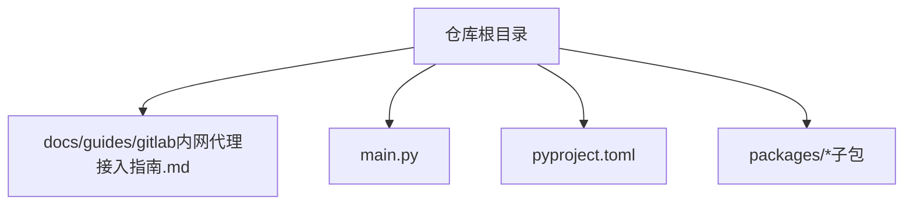
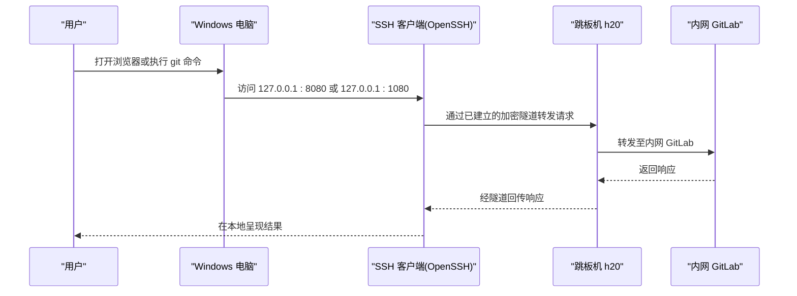
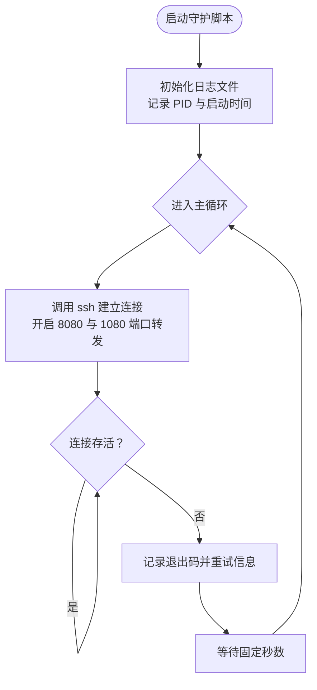
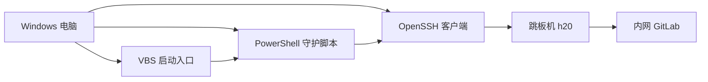

# GitLab 内网代理接入指南

<cite>
**本文引用的文件**
- [docs/guides/gitlab内网代理接入指南.md](file://docs/guides/gitlab内网代理接入指南.md)
- [main.py](file://main.py)
- [pyproject.toml](file://pyproject.toml)
</cite>

## 目录
1. [简介](#简介)
2. [项目结构](#项目结构)
3. [核心组件](#核心组件)
4. [架构总览](#架构总览)
5. [详细组件分析](#详细组件分析)
6. [依赖关系分析](#依赖关系分析)
7. [性能与稳定性考虑](#性能与稳定性考虑)
8. [故障排查指南](#故障排查指南)
9. [结论](#结论)
10. [附录：关键文件位置速查](#附录关键文件位置速查)

## 简介
本指南面向 Windows 新员工，帮助你在公司内网环境下通过跳板机 h20 建立 SSH 隧道，从而访问内网 GitLab（gitlab.irootech.com）及其他内网服务。方案特点：
- 一条 SSH 连接同时提供两条本地入口：
  - 127.0.0.1:8080：专用于访问内网 GitLab
  - 127.0.0.1:1080：通用 SOCKS5 代理，可被浏览器、git、curl 等工具使用
- 开机自动启动、断线自动重连，日常无需人工干预
- 全程基于 Windows 自带 OpenSSH 与 PowerShell，无需额外安装

## 项目结构
仓库包含一个面向个人智能体框架的 Python 工程，以及一份“GitLab 内网代理接入指南”文档。与本次目标直接相关的核心内容位于 docs/guides 下的指南文档；其余为工程代码与配置。

图表来源
- [docs/guides/gitlab内网代理接入指南.md:1-259](file://docs/guides/gitlab内网代理接入指南.md#L1-L259)
- [main.py:1-13](file://main.py#L1-L13)
- [pyproject.toml:1-30](file://pyproject.toml#L1-L30)

章节来源
- [docs/guides/gitlab内网代理接入指南.md:1-259](file://docs/guides/gitlab内网代理接入指南.md#L1-L259)
- [main.py:1-13](file://main.py#L1-L13)
- [pyproject.toml:1-30](file://pyproject.toml#L1-L30)

## 核心组件
- 用户端（Windows 电脑）
  - OpenSSH 客户端（内置）
  - PowerShell 脚本（守护进程，负责建隧道与断线重连）
  - VBS 启动入口（登录时隐藏窗口拉起脚本）
- 跳板机（h20）
  - 作为 SSH 服务端，具备访问内网 GitLab 的网络能力
- 内网服务（GitLab）
  - 仅可通过跳板机访问

章节来源
- [docs/guides/gitlab内网代理接入指南.md:1-259](file://docs/guides/gitlab内网代理接入指南.md#L1-L259)

## 架构总览
下图展示了从本地到内网 GitLab 的数据流与组件交互。

图表来源
- [docs/guides/gitlab内网代理接入指南.md:1-259](file://docs/guides/gitlab内网代理接入指南.md#L1-L259)

## 详细组件分析

### 一、前置准备与环境检查
- 系统要求：Windows 10/11，自带 OpenSSH 客户端
- 所需凭据：跳板机 h20 的 IP 与用户名（域账号）
- 建议终端：PowerShell

章节来源
- [docs/guides/gitlab内网代理接入指南.md:29-37](file://docs/guides/gitlab内网代理接入指南.md#L29-L37)

### 二、SSH 客户端验证与密钥生成
- 验证 ssh 可用
- 若未存在 ed25519 公钥则生成，并将公钥交由管理员添加到 h20 的 authorized_keys，实现免密登录

章节来源
- [docs/guides/gitlab内网代理接入指南.md:41-77](file://docs/guides/gitlab内网代理接入指南.md#L41-L77)

### 三、SSH 主机别名配置
- 在 %USERPROFILE%\.ssh\config 中定义 Host h20，填入真实 HostName 与 User
- 便于后续直接使用 h20 别名进行连接

章节来源
- [docs/guides/gitlab内网代理接入指南.md:81-101](file://docs/guides/gitlab内网代理接入指南.md#L81-L101)

### 四、免密登录测试
- 使用一次性命令测试 h20 的免密登录是否成功
- 出现预期输出即表示认证链路正常

章节来源
- [docs/guides/gitlab内网代理接入指南.md:105-114](file://docs/guides/gitlab内网代理接入指南.md#L105-L114)

### 五、隧道守护脚本（PowerShell）
- 功能要点：
  - 循环调用 ssh，建立单条连接并开启两个端口：
    - -L 127.0.0.1:8080:gitlab.irootech.com:80（GitLab 专线）
    - -D 127.0.0.1:1080（SOCKS5 代理）
  - 断线后等待固定间隔再重连
  - 将运行日志写入 %USERPROFILE%\.ssh\ssh-tunnel-h20.log
- 生成方式：一键命令创建脚本文件，路径为 %USERPROFILE%\.ssh\ssh-tunnel-h20.ps1

章节来源
- [docs/guides/gitlab内网代理接入指南.md:118-150](file://docs/guides/gitlab内网代理接入指南.md#L118-L150)

#### 守护脚本流程图

图表来源
- [docs/guides/gitlab内网代理接入指南.md:118-150](file://docs/guides/gitlab内网代理接入指南.md#L118-L150)

### 六、开机自启（VBS 启动入口）
- 在 Windows 启动文件夹放置 VBS 脚本，以隐藏窗口方式调用 PowerShell 脚本
- 无需管理员权限，登录后自动拉起隧道

章节来源
- [docs/guides/gitlab内网代理接入指南.md:154-170](file://docs/guides/gitlab内网代理接入指南.md#L154-L170)

### 七、立即启动与端口验证
- 手动触发 VBS 启动入口
- 等待数秒后检查本地 8080 与 1080 端口是否处于监听状态，且由同一进程持有

章节来源
- [docs/guides/gitlab内网代理接入指南.md:174-189](file://docs/guides/gitlab内网代理接入指南.md#L174-L189)

### 八、使用方法
- 方式 A：浏览器直接访问 http://127.0.0.1:8080（或通过域名 + 端口访问）
- 方式 B：为 git 设置全局 SOCKS5 代理指向 127.0.0.1:1080
- 方式 C：在浏览器或系统代理中配置 SOCKS5 127.0.0.1:1080，即可访问任意内网地址

章节来源
- [docs/guides/gitlab内网代理接入指南.md:193-216](file://docs/guides/gitlab内网代理接入指南.md#L193-L216)

### 九、日常管理速查
- 查看端口监听情况
- 手动启动/停止隧道
- 查看最近日志
- 取消开机自启

章节来源
- [docs/guides/gitlab内网代理接入指南.md:220-228](file://docs/guides/gitlab内网代理接入指南.md#L220-L228)

### 十、常见问题 FAQ
- 端口只出现其一：可能端口被占用，需释放后重启
- 访问 8080 报错：可能是 HTTPS 强制跳转导致，优先使用域名访问或 SOCKS5
- 频繁断开重连：检查 h20 账号与公钥是否正确
- 计划任务方案：需要管理员权限，普通员工用 Startup 方案即可
- 单连接双端口：节省资源，减少认证次数与进程数量

章节来源
- [docs/guides/gitlab内网代理接入指南.md:232-247](file://docs/guides/gitlab内网代理接入指南.md#L232-L247)

## 依赖关系分析
- 外部依赖
  - Windows 系统（OpenSSH 客户端）
  - PowerShell 运行时
  - VBS 宿主（wscript.exe）
- 网络依赖
  - 跳板机 h20（可达内网）
  - 内网 GitLab（gitlab.irootech.com）
- 本地文件
  - SSH 配置文件：%USERPROFILE%\.ssh\config
  - 守护脚本：%USERPROFILE%\.ssh\ssh-tunnel-h20.ps1
  - 自启入口：%APPDATA%\Microsoft\Windows\Start Menu\Programs\Startup\start-ssh-tunnel-h20.vbs
  - 运行日志：%USERPROFILE%\.ssh\ssh-tunnel-h20.log

图表来源
- [docs/guides/gitlab内网代理接入指南.md:1-259](file://docs/guides/gitlab内网代理接入指南.md#L1-L259)

## 性能与稳定性考虑
- 单连接复用：通过 -L 与 -D 共用同一条 SSH 连接，降低认证开销与进程数
- 心跳保活：启用 ServerAliveInterval/ServerAliveCountMax/TCPKeepAlive，提升长连接稳定性
- 快速失败：ExitOnForwardFailure 确保端口转发失败时尽早退出，避免静默失效
- 自愈重连：守护脚本循环拉起，配合固定重试间隔，提高可用性
- 资源占用：单进程承载多端口转发，减少内存与 CPU 占用

章节来源
- [docs/guides/gitlab内网代理接入指南.md:118-150](file://docs/guides/gitlab内网代理接入指南.md#L118-L150)

## 故障排查指南
- 确认 OpenSSH 可用：执行版本检查命令
- 确认公钥已生效：在 h20 上验证 authorized_keys 是否包含本机公钥
- 检查端口占用：查询 8080/1080 占用进程并释放
- 查看日志定位问题：读取最近若干行日志，关注连接与重连信息
- 临时关闭自启：删除启动文件夹中的 VBS 入口，避免重复拉起

章节来源
- [docs/guides/gitlab内网代理接入指南.md:41-77](file://docs/guides/gitlab内网代理接入指南.md#L41-L77)
- [docs/guides/gitlab内网代理接入指南.md:220-228](file://docs/guides/gitlab内网代理接入指南.md#L220-L228)

## 结论
本方案以最小依赖、零额外安装的方式，利用 Windows 原生能力完成内网 GitLab 的可靠访问。通过“单连接双端口 + 断线自愈 + 开机自启”，实现了开箱即用、低维护成本的内网代理体验。

## 附录：关键文件位置速查
- SSH 配置：%USERPROFILE%\.ssh\config
- 守护脚本：%USERPROFILE%\.ssh\ssh-tunnel-h20.ps1
- 自启入口：%APPDATA%\Microsoft\Windows\Start Menu\Programs\Startup\start-ssh-tunnel-h20.vbs
- 运行日志：%USERPROFILE%\.ssh\ssh-tunnel-h20.log

章节来源
- [docs/guides/gitlab内网代理接入指南.md:251-258](file://docs/guides/gitlab内网代理接入指南.md#L251-L258)