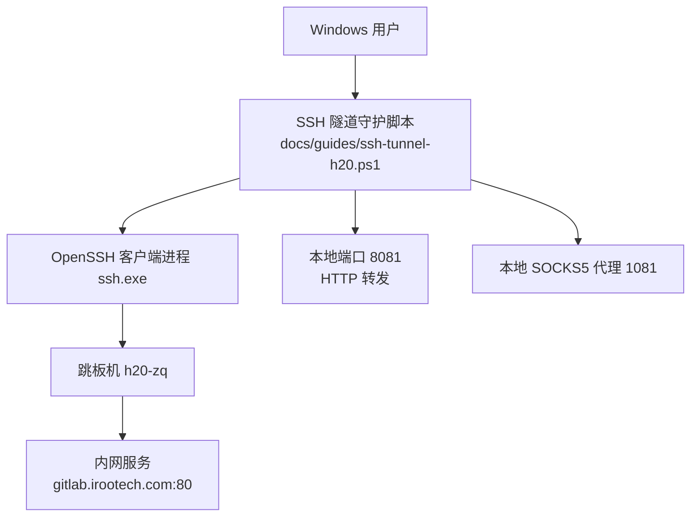
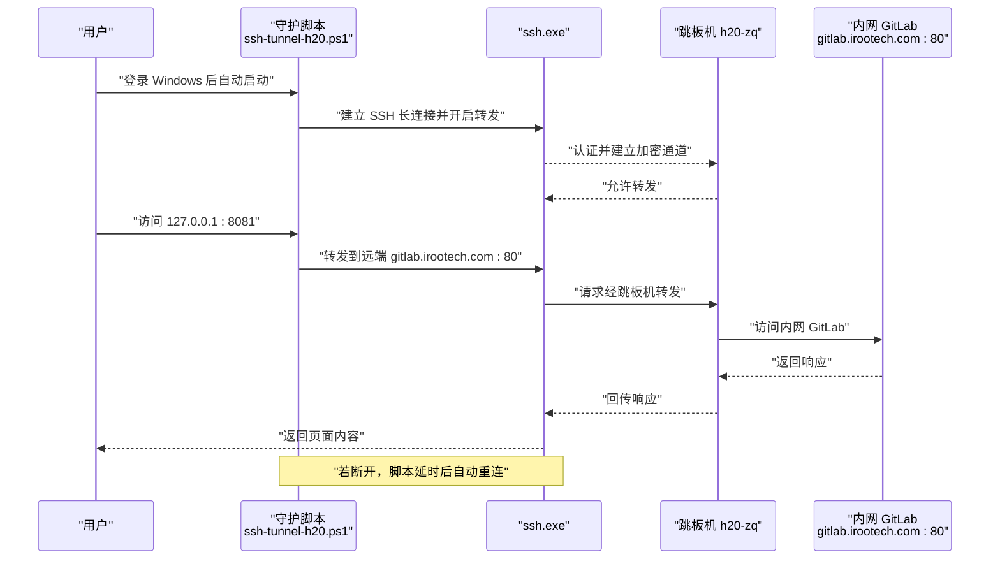
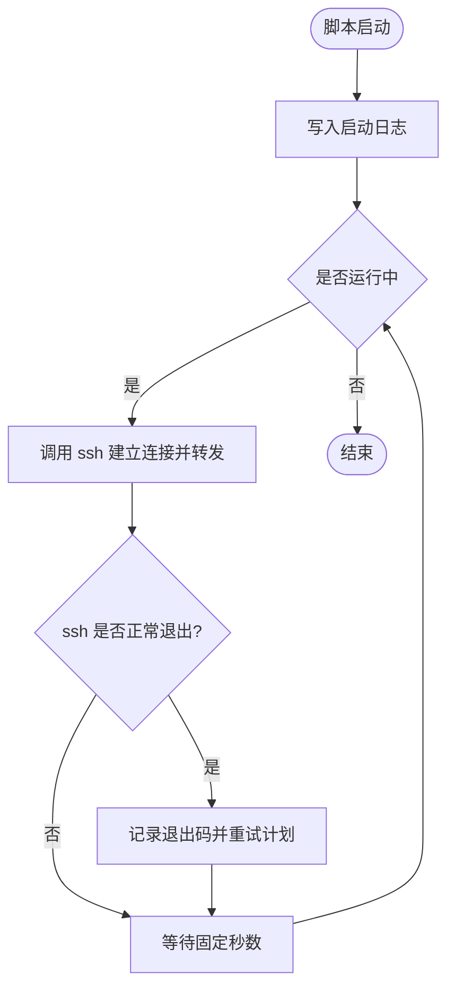

# SSH隧道自动化工具

<cite>
**本文引用的文件**
- [main.py](file://main.py)
- [pyproject.toml](file://pyproject.toml)
- [README.md](file://README.md)
- [docs/guides/ssh-tunnel-h20.ps1](file://docs/guides/ssh-tunnel-h20.ps1)
- [docs/guides/gitlab内网代理接入指南.md](file://docs/guides/gitlab内网代理接入指南.md)
</cite>

## 目录
1. [简介](#简介)
2. [项目结构](#项目结构)
3. [核心组件](#核心组件)
4. [架构总览](#架构总览)
5. [详细组件分析](#详细组件分析)
6. [依赖关系分析](#依赖关系分析)
7. [性能与可靠性](#性能与可靠性)
8. [故障排查指南](#故障排查指南)
9. [结论](#结论)
10. [附录](#附录)

## 简介
本仓库包含一个面向 Windows 环境的 SSH 隧道自动化方案，用于通过跳板机访问公司内网服务（如 GitLab）。该方案以 PowerShell 脚本为核心，结合 Windows 启动项实现“开机自启、断线自愈”的守护能力，并通过本地端口转发和 SOCKS5 代理为多种客户端提供统一的内网访问入口。

## 项目结构
与 SSH 隧道自动化直接相关的代码与文档位于 docs/guides 目录下，包括：
- 示例守护脚本：docs/guides/ssh-tunnel-h20.ps1
- 用户操作指南：docs/guides/gitlab内网代理接入指南.md

根目录 main.py 与 pyproject.toml 属于框架主工程，与 SSH 隧道自动化无直接耦合，但提供了整体工程背景。

图表来源
- [docs/guides/ssh-tunnel-h20.ps1:1-14](file://docs/guides/ssh-tunnel-h20.ps1#L1-L14)

章节来源
- [docs/guides/ssh-tunnel-h20.ps1:1-14](file://docs/guides/ssh-tunnel-h20.ps1#L1-L14)
- [docs/guides/gitlab内网代理接入指南.md:1-259](file://docs/guides/gitlab内网代理接入指南.md#L1-L259)

## 核心组件
- 守护脚本（PowerShell）
  - 负责循环拉起 SSH 连接，建立本地端口转发与 SOCKS5 代理，并在异常退出后延时重试。
  - 输出带时间戳的运行日志到用户目录下的 .ssh 文件夹。
- OpenSSH 客户端
  - 执行实际的加密隧道建立与数据转发。
- Windows 启动项（VBS 入口）
  - 在用户登录时隐藏窗口启动守护脚本，实现“开机即连”。
- 本地监听端口
  - 8081：将本地 HTTP 请求转发至内网 GitLab 的 80 端口。
  - 1081：SOCKS5 代理，供浏览器、Git、curl 等通用工具走内网。

章节来源
- [docs/guides/ssh-tunnel-h20.ps1:1-14](file://docs/guides/ssh-tunnel-h20.ps1#L1-L14)
- [docs/guides/gitlab内网代理接入指南.md:118-170](file://docs/guides/gitlab内网代理接入指南.md#L118-L170)

## 架构总览
下图展示了从用户侧到内网服务的端到端数据流，以及守护脚本在其中扮演的角色。

图表来源
- [docs/guides/ssh-tunnel-h20.ps1:1-14](file://docs/guides/ssh-tunnel-h20.ps1#L1-L14)
- [docs/guides/gitlab内网代理接入指南.md:118-170](file://docs/guides/gitlab内网代理接入指南.md#L118-L170)

## 详细组件分析

### 守护脚本（PowerShell）
- 功能要点
  - 无限循环拉起 SSH 连接，同时启用本地端口转发与 SOCKS5 代理。
  - 使用批处理模式、严格主机密钥检查策略、失败即退、存活探测与超时控制等参数提升稳定性。
  - 记录每次启动、退出与重试信息，便于排障。
- 关键行为
  - 本地 8081 → 远端 gitlab.irootech.com:80 的 HTTP 转发。
  - 本地 1081 作为 SOCKS5 代理，支持任意协议走内网。
  - 退出后等待固定间隔再重试，避免频繁重连。

图表来源
- [docs/guides/ssh-tunnel-h20.ps1:1-14](file://docs/guides/ssh-tunnel-h20.ps1#L1-L14)

章节来源
- [docs/guides/ssh-tunnel-h20.ps1:1-14](file://docs/guides/ssh-tunnel-h20.ps1#L1-L14)

### 开机自启入口（VBS）
- 作用
  - 在用户登录后，以隐藏窗口方式启动守护脚本，无需管理员权限。
- 关键点
  - 通过 WScript.Shell 调用 PowerShell，指定无界面与绕过执行策略。
  - 路径指向用户 .ssh 目录下的守护脚本。

章节来源
- [docs/guides/gitlab内网代理接入指南.md:154-170](file://docs/guides/gitlab内网代理接入指南.md#L154-L170)

### 本地端口与服务映射
- 8081（HTTP 专线）
  - 适合浏览器或需要直连 HTTP 的场景访问内网 GitLab。
- 1081（SOCKS5 代理）
  - 适用于浏览器、Git、curl 等通用客户端，灵活访问任意内网地址。

章节来源
- [docs/guides/ssh-tunnel-h20.ps1:1-14](file://docs/guides/ssh-tunnel-h20.ps1#L1-L14)
- [docs/guides/gitlab内网代理接入指南.md:19-25](file://docs/guides/gitlab内网代理接入指南.md#L19-L25)

## 依赖关系分析
- 外部依赖
  - Windows 系统（自带 OpenSSH 客户端）。
  - 跳板机 h20-zq 的网络可达性与账号免密登录配置。
- 内部依赖
  - 守护脚本依赖 OpenSSH 可执行文件。
  - VBS 启动项依赖 PowerShell 环境。

图表来源
- [docs/guides/gitlab内网代理接入指南.md:154-170](file://docs/guides/gitlab内网代理接入指南.md#L154-L170)
- [docs/guides/ssh-tunnel-h20.ps1:1-14](file://docs/guides/ssh-tunnel-h20.ps1#L1-L14)

章节来源
- [docs/guides/gitlab内网代理接入指南.md:154-170](file://docs/guides/gitlab内网代理接入指南.md#L154-L170)
- [docs/guides/ssh-tunnel-h20.ps1:1-14](file://docs/guides/ssh-tunnel-h20.ps1#L1-L14)

## 性能与可靠性
- 连接保活
  - 通过服务器存活探测与 TCP KeepAlive 降低假死概率。
- 快速失败
  - 设置连接超时与失败即退，避免长时间挂起。
- 自愈机制
  - 守护脚本在退出后延时重试，保证长期可用性。
- 资源占用
  - 单条 SSH 连接复用多个转发，减少认证开销与进程数量。

章节来源
- [docs/guides/ssh-tunnel-h20.ps1:1-14](file://docs/guides/ssh-tunnel-h20.ps1#L1-L14)
- [docs/guides/gitlab内网代理接入指南.md:246-248](file://docs/guides/gitlab内网代理接入指南.md#L246-L248)

## 故障排查指南
- 常见问题定位
  - 端口未监听：检查是否有其他程序占用 8081/1081。
  - 频繁重连：确认跳板机免密登录是否可用。
  - 浏览器访问异常：优先使用域名访问或通过 SOCKS5 代理。
- 常用命令参考
  - 查看监听端口与进程。
  - 手动启动/停止隧道。
  - 查看最近日志行。
  - 取消开机自启。

章节来源
- [docs/guides/gitlab内网代理接入指南.md:220-248](file://docs/guides/gitlab内网代理接入指南.md#L220-L248)

## 结论
该方案以极简的方式实现了“开机自启 + 断线自愈”的 SSH 隧道自动化，兼顾了专用端口转发与通用 SOCKS5 代理，满足日常内网访问需求。其优势在于零额外依赖、低维护成本与高可用性；建议在生产环境中配合网络监控与告警进一步提升可观测性。

## 附录
- 相关工程背景
  - 主工程 README 描述了 JanusAgent 的整体愿景与架构，SSH 隧道自动化作为运维辅助能力独立存在，不耦合于主框架。
  - 主入口 main.py 仅聚合子模块打印问候信息，与隧道自动化无关。

章节来源
- [README.md:1-129](file://README.md#L1-L129)
- [main.py:1-13](file://main.py#L1-L13)
- [pyproject.toml:1-30](file://pyproject.toml#L1-L30)