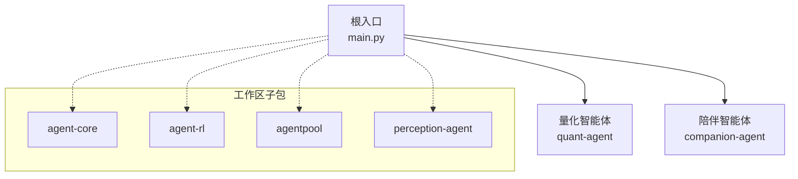
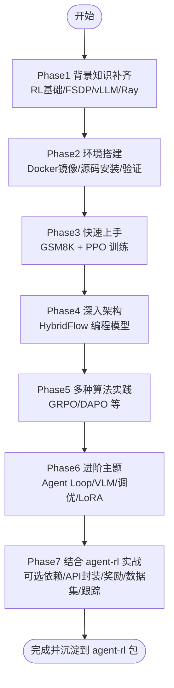
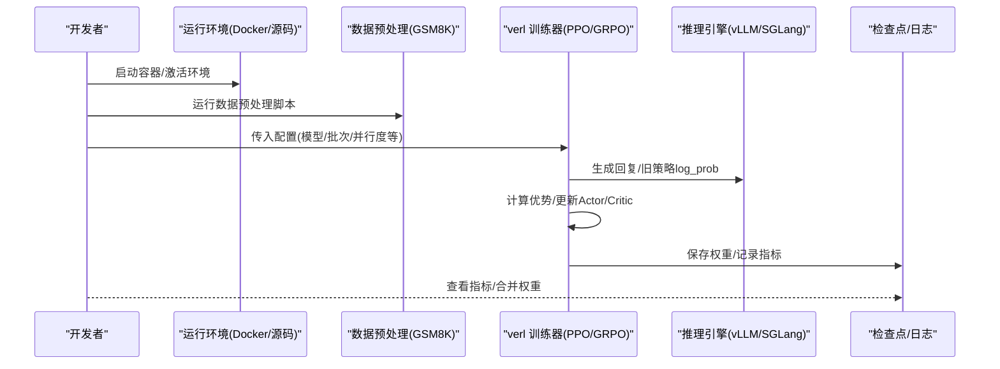
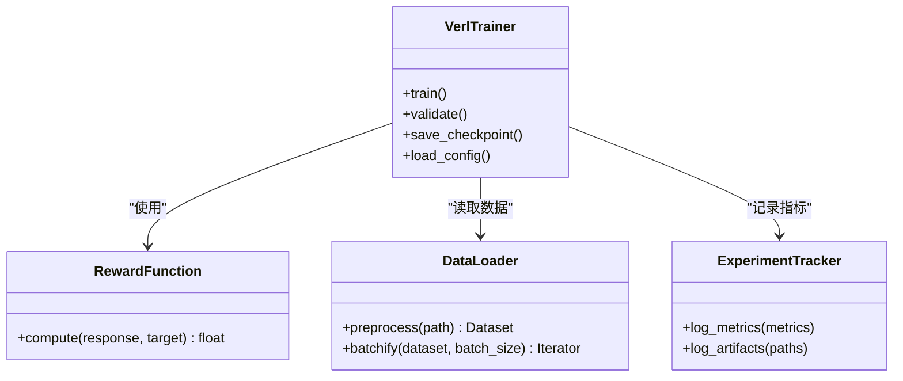
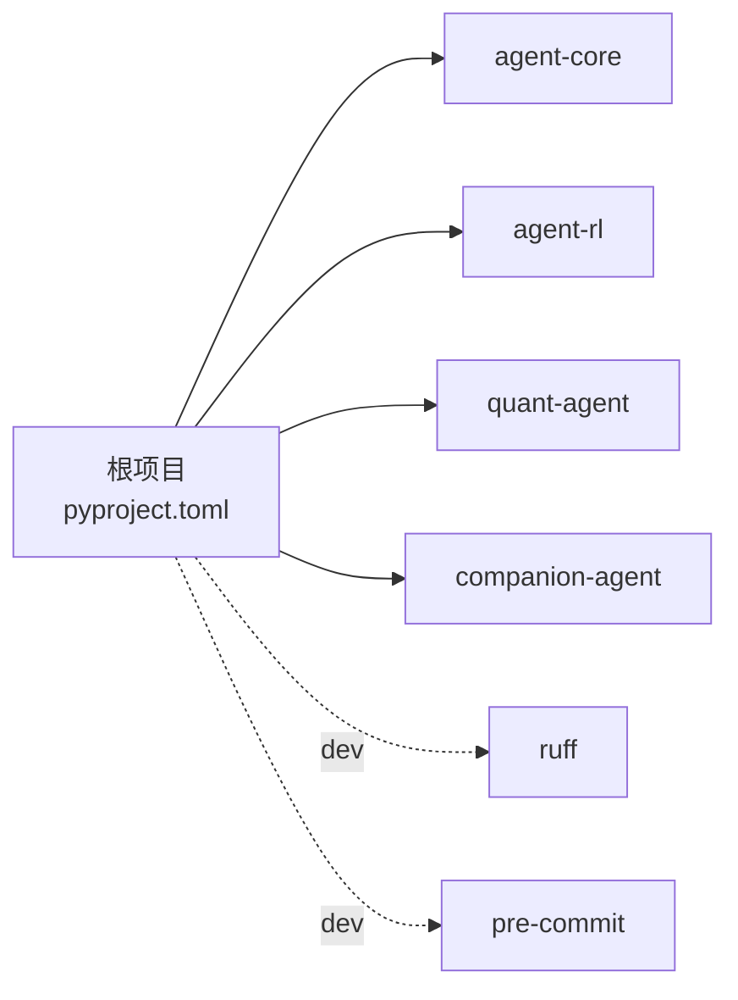

# MinerU2.5学习计划

<cite>
**本文引用的文件**   
- [main.py](file://main.py)
- [pyproject.toml](file://pyproject.toml)
- [verl-learning-plan.md](file://docs/plans/verl-learning-plan.md)
- [roadmap.html](file://docs/plans/roadmap.html)
- [todolist.html](file://docs/plans/todolist.html)
- [AGENT.md](file://.agent/AGENT.md)
- [project.md](file://.agent/context/project.md)
- [quant-agent README.md](file://packages/quant-agent/README.md)
- [companion-agent __init__.py](file://packages/companion-agent/src/companion_agent/__init__.py)
- [agent-core pyproject.toml](file://packages/agent-core/pyproject.toml)
- [agent-rl pyproject.toml](file://packages/agent-rl/pyproject.toml)
- [quant-agent pyproject.toml](file://packages/quant-agent/pyproject.toml)
- [companion-agent pyproject.toml](file://packages/companion-agent/pyproject.toml)
</cite>

## 目录
1. [引言](#引言)
2. [项目结构](#项目结构)
3. [核心组件](#核心组件)
4. [架构总览](#架构总览)
5. [详细组件分析](#详细组件分析)
6. [依赖关系分析](#依赖关系分析)
7. [性能与资源考量](#性能与资源考量)
8. [故障排查指南](#故障排查指南)
9. [结论](#结论)
10. [附录](#附录)

## 引言
本文件为“MinerU2.5学习计划”的落地执行方案，聚焦于将强化学习（RL）能力引入 JanusAgent 的 agent-rl 面，并以 verl（HybridFlow）为核心训练框架。计划目标：
- 补齐 RL 与 LLM 分布式训练背景知识
- 搭建可复现实验环境（Docker/源码）
- 快速跑通 PPO/GRPO 等算法在 GSM8K 上的训练流程
- 深入理解 HybridFlow 编程模型与数据流
- 结合 agent-rl 包进行工程化整合（可选依赖、API 封装、奖励函数、数据集接入、实验跟踪）

该计划与 JanusAgent 产品路线图中的“降本辅助（agent-rl）”定位一致，强调以上下文工程为主、RL 微调为辅的技术主线。

章节来源
- [verl-learning-plan.md:1-20](file://docs/plans/verl-learning-plan.md#L1-L20)
- [roadmap.html:267-268](file://docs/plans/roadmap.html#L267-L268)

## 项目结构
仓库采用 uv workspace 多包组织，根入口 main.py 聚合两个 Agent 面的 hello 输出；agent-rl 作为未来承载 RL 能力的独立包，当前为空骨架。

图表来源
- [main.py:1-13](file://main.py#L1-L13)
- [pyproject.toml:14-17](file://pyproject.toml#L14-L17)

章节来源
- [main.py:1-13](file://main.py#L1-L13)
- [pyproject.toml:1-17](file://pyproject.toml#L1-L17)
- [AGENT.md:117-118](file://.agent/AGENT.md#L117-L118)

## 核心组件
- 根入口 main.py：统一打印两个 Agent 面的问候信息，便于快速验证环境连通性。
- agent-rl：定位为“JanusAgent RL Face”，用于集成 verl 及 RL 训练相关能力，当前为骨架包。
- quant-agent / companion-agent：分别承担“理性之面”和“感性之面”的职责，后续可与 RL 训练形成闭环（如策略优化、个性化偏好建模）。

章节来源
- [main.py:5-12](file://main.py#L5-L12)
- [agent-rl pyproject.toml:1-17](file://packages/agent-rl/pyproject.toml#L1-L17)
- [quant-agent README.md:1-6](file://packages/quant-agent/README.md#L1-L6)
- [companion-agent __init__.py:1-14](file://packages/companion-agent/src/companion_agent/__init__.py#L1-L14)

## 架构总览
从“学习路径到工程落地”的整体视图如下：

图表来源
- [verl-learning-plan.md:9-20](file://docs/plans/verl-learning-plan.md#L9-L20)

## 详细组件分析

### 组件A：verl 学习计划（端到端路径）
- 目标：为 agent-rl 引入 RL 训练能力，打通从环境到算法再到集成的全链路。
- 关键阶段：
  - Phase1：RL 基础（PPO/GRPO）、LLM 分布式（FSDP/Megatron/vLLM/Ray）
  - Phase2：Docker 或源码安装，验证关键依赖
  - Phase3：GSM8K 上 PPO 训练，观察指标、合并权重
  - Phase4：HybridFlow 控制流与计算流解耦、DataProto 跨进程数据
  - Phase5：GRPO/DAPO 等算法实践
  - Phase6：Agent Loop、VLM、性能调优、LoRA+RL
  - Phase7：与 agent-rl 整合（可选依赖、命令行封装、自定义奖励、数据集接入、实验跟踪）

图表来源
- [verl-learning-plan.md:145-212](file://docs/plans/verl-learning-plan.md#L145-L212)
- [verl-learning-plan.md:215-318](file://docs/plans/verl-learning-plan.md#L215-L318)
- [verl-learning-plan.md:320-369](file://docs/plans/verl-learning-plan.md#L320-L369)

章节来源
- [verl-learning-plan.md:1-20](file://docs/plans/verl-learning-plan.md#L1-L20)
- [verl-learning-plan.md:145-212](file://docs/plans/verl-learning-plan.md#L145-L212)
- [verl-learning-plan.md:215-318](file://docs/plans/verl-learning-plan.md#L215-L318)
- [verl-learning-plan.md:320-369](file://docs/plans/verl-learning-plan.md#L320-L369)

### 组件B：agent-rl 包（骨架与整合方向）
- 现状：空骨架，仅定义包名、描述与入口脚本占位。
- 整合方向（优先级从高到低）：
  - P0：将 verl 及其依赖作为可选依赖引入
  - P1：封装 verl 命令行训练为 Python API，对齐 YAML 配置体系
  - P1：实现自定义规则奖励（参考 verl/utils/reward_score）
  - P1：实现数据预处理 pipeline，支持 HuggingFace datasets
  - P2：Agent Loop 集成（与 JanusAgent 的多轮交互结合）
  - P2：实验跟踪（wandb/mlflow）
  - P2：Model Zoo 接入（Qwen/LLaMA/DeepSeek 一键训练）

图表来源
- [verl-learning-plan.md:411-499](file://docs/plans/verl-learning-plan.md#L411-L499)

章节来源
- [agent-rl pyproject.toml:1-17](file://packages/agent-rl/pyproject.toml#L1-L17)
- [verl-learning-plan.md:411-499](file://docs/plans/verl-learning-plan.md#L411-L499)

### 组件C：量化智能体（quant-agent）与 RL 的结合点
- 角色：提供市场数据、策略定义与回测框架，面向数据驱动的投资决策。
- 与 RL 的结合点：
  - 用 RL 优化策略参数或动作选择（例如仓位、入场时机）
  - 基于历史回测结果构建奖励信号（收益、回撤、夏普比率等）
  - 通过 Agent Loop 将“查行情→分析→回测→建议”串联为可学习的闭环

章节来源
- [quant-agent README.md:1-6](file://packages/quant-agent/README.md#L1-L6)
- [verl-learning-plan.md:373-378](file://docs/plans/verl-learning-plan.md#L373-L378)

### 组件D：陪伴智能体（companion-agent）与 RL 的结合点
- 角色：对话管理、记忆存储、多轮交互，面向自然共情的对话体验。
- 与 RL 的结合点：
  - 用户偏好建模与个性化回复策略优化
  - 基于用户反馈（点赞/纠正/停留时长）构建奖励信号
  - 长期记忆与一致性约束下的策略演化

章节来源
- [companion-agent __init__.py:1-14](file://packages/companion-agent/src/companion_agent/__init__.py#L1-L14)
- [verl-learning-plan.md:373-378](file://docs/plans/verl-learning-plan.md#L373-L378)

## 依赖关系分析
- 工作区成员：packages/*（agent-core、agent-rl、quant-agent、companion-agent 等）
- 根依赖：agent-core、agent-rl、quant-agent、companion-agent
- 开发依赖：pre-commit、ruff

图表来源
- [pyproject.toml:1-17](file://pyproject.toml#L1-L17)
- [pyproject.toml:19-23](file://pyproject.toml#L19-L23)

章节来源
- [pyproject.toml:1-17](file://pyproject.toml#L1-L17)
- [pyproject.toml:19-23](file://pyproject.toml#L19-L23)

## 性能与资源考量
- GPU 显存与并行度：单卡可跑小模型（0.5B-1.5B），推荐多卡体验完整分布式训练；合理设置 ppo_micro_batch_size_per_gpu 与 gpu_memory_utilization。
- 推理引擎选择：vLLM 生态完善适合生产；SGLang 在多轮 RL 与 VLM RL 上有独特优化。
- 训练稳定性：学习率不宜过高（建议 ≤ 1e-5），KL 系数需合适；出现 NaN loss 时优先检查上述两项。
- 监控与可视化：开启 wandb 或 TensorBoard 记录关键指标（val/test_score、actor/pg_loss、critic/vf_loss、entropy_loss、response_length 等）。

章节来源
- [verl-learning-plan.md:71-76](file://docs/plans/verl-learning-plan.md#L71-L76)
- [verl-learning-plan.md:191-202](file://docs/plans/verl-learning-plan.md#L191-L202)
- [verl-learning-plan.md:507-516](file://docs/plans/verl-learning-plan.md#L507-L516)
- [verl-learning-plan.md:517-527](file://docs/plans/verl-learning-plan.md#L517-L527)

## 故障排查指南
- 单卡显存不足：降低 ppo_micro_batch_size_per_gpu 与 gpu_memory_utilization，或使用 LoRA RL。
- 训练 NaN loss：检查学习率是否过高；调整 KL 系数；确认数据清洗与奖励函数无异常。
- vLLM vs SGLang：根据场景选择，vLLM 更成熟，SGLang 在多轮 RL/VLM RL 有优势。
- 环境变量与共享内存：Docker 启动时需设置 --shm-size，避免 PyTorch DataLoader 多进程传数据失败。

章节来源
- [verl-learning-plan.md:507-516](file://docs/plans/verl-learning-plan.md#L507-L516)
- [verl-learning-plan.md:93-107](file://docs/plans/verl-learning-plan.md#L93-L107)

## 结论
本计划以 verl 为核心，围绕“背景—环境—快速上手—深入架构—算法实践—进阶主题—工程整合”的路径推进，最终将 RL 能力沉淀到 agent-rl 包中，服务于 JanusAgent 的“降本辅助”定位。建议在 Week 1-2 完成环境与首个 PPO 训练，Week 3-4 深入 HybridFlow 源码，Week 5-6 实践 GRPO/DAPO，Week 7-8 探索 Agent Loop/VLM/调优，Week 9-12 完成与 agent-rl 的整合与验收。

[本节不直接分析具体文件，无需列出章节来源]

## 附录
- 配套文档与清单：
  - 产品路线图：roadmap.html
  - 任务清单：todolist.html
  - 项目上下文与规范：.agent/AGENT.md、.agent/context/project.md

章节来源
- [roadmap.html:446-462](file://docs/plans/roadmap.html#L446-L462)
- [todolist.html:166-280](file://docs/plans/todolist.html#L166-L280)
- [AGENT.md:117-127](file://.agent/AGENT.md#L117-L127)
- [project.md:52-93](file://.agent/context/project.md#L52-L93)