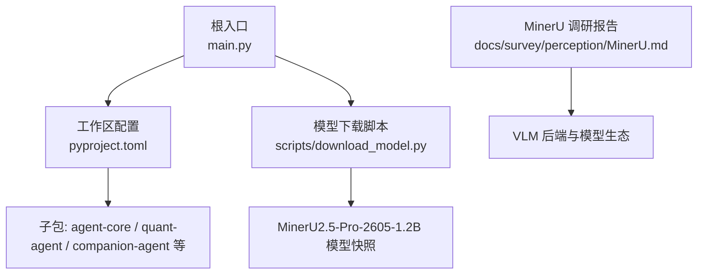
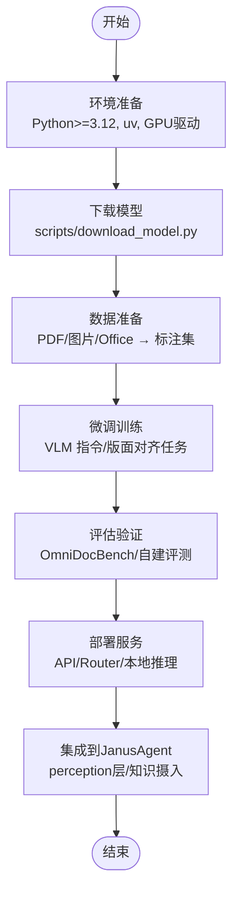
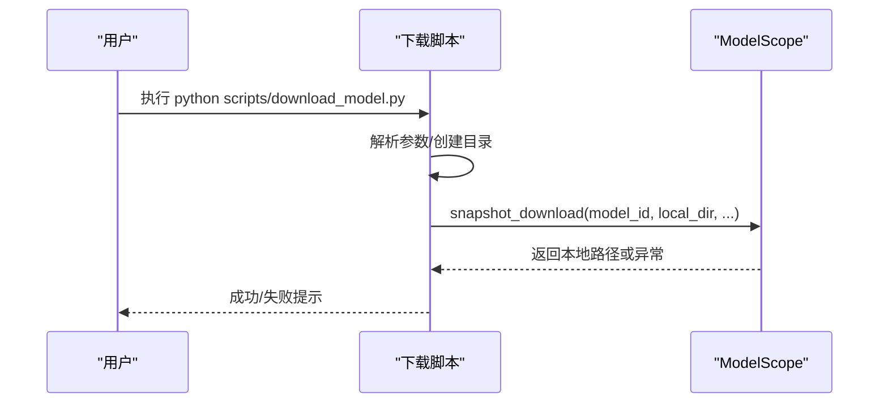
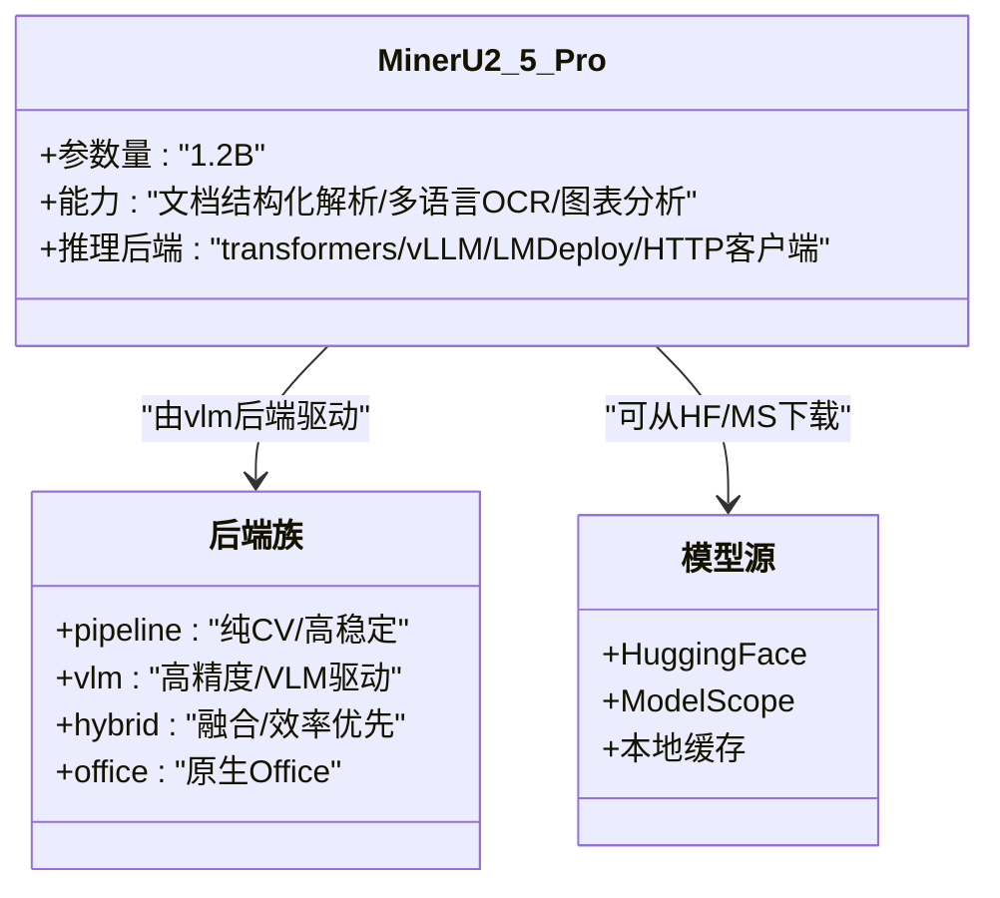
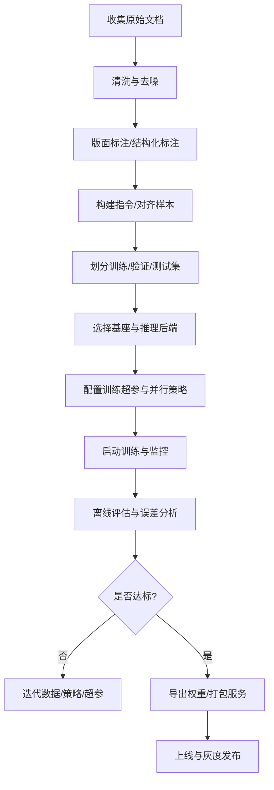
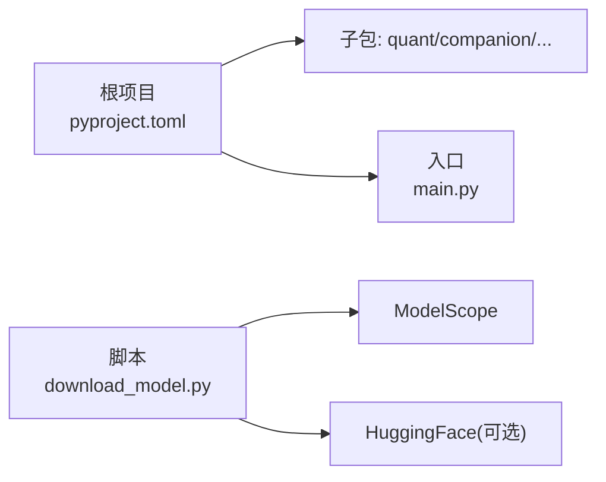

# MinerU2.5微调指南

<cite>
**本文引用的文件**
- [README.md](file://README.md)
- [pyproject.toml](file://pyproject.toml)
- [main.py](file://main.py)
- [download_model.py](file://scripts/download_model.py)
- [MinerU.md](file://docs/survey/perception/MinerU.md)
</cite>

## 目录
1. [简介](#简介)
2. [项目结构](#项目结构)
3. [核心组件](#核心组件)
4. [架构总览](#架构总览)
5. [详细组件分析](#详细组件分析)
6. [依赖分析](#依赖分析)
7. [性能考量](#性能考量)
8. [故障排查指南](#故障排查指南)
9. [结论](#结论)
10. [附录](#附录)

## 简介
本指南面向希望在 JanusAgent 工作流中引入并微调 MinerU2.5（文档解析视觉语言模型）的工程师与研究者。内容涵盖：
- 环境准备与模型下载
- 数据准备与标注规范
- 微调策略与训练流程建议
- 评估与部署要点
- 在 JanusAgent 中的集成思路

说明：
- 本项目仓库未包含 MinerU2.5 源码或训练脚本，本指南基于仓库内调研文档与模型下载脚本进行工程化落地建议，不直接引用具体实现代码。
- 微调属于高级用法，建议在具备 GPU 资源与基础 VLM 训练经验后开展。

## 项目结构
仓库采用多包工作区组织，根入口为 main.py，依赖通过 pyproject.toml 声明；与 MinerU2.5 相关的信息主要位于 docs/survey/perception/MinerU.md 与 scripts/download_model.py。

图示来源
- [main.py:1-13](file://main.py#L1-L13)
- [pyproject.toml:1-30](file://pyproject.toml#L1-L30)
- [download_model.py:1-139](file://scripts/download_model.py#L1-L139)
- [MinerU.md:1-389](file://docs/survey/perception/MinerU.md#L1-L389)

章节来源
- [README.md:1-129](file://README.md#L1-L129)
- [pyproject.toml:1-30](file://pyproject.toml#L1-L30)
- [main.py:1-13](file://main.py#L1-L13)

## 核心组件
- 模型下载工具：提供从 ModelScope 拉取 MinerU2.5 系列模型的便捷方式，支持忽略/允许模式、版本选择与私有令牌访问。
- MinerU 技术栈概览：四大解析后端（pipeline/vlm/hybrid/office），其中 vlm 后端以 MinerU2.5-Pro-2605-1.2B 为主模型，适合高精度文档结构化理解。
- 集成定位：作为感知层的数据摄入管道，将 PDF/Office 等文档转为结构化 Markdown/JSON，便于后续 RAG/Agent 使用。

章节来源
- [download_model.py:1-139](file://scripts/download_model.py#L1-L139)
- [MinerU.md:105-130](file://docs/survey/perception/MinerU.md#L105-L130)
- [MinerU.md:171-216](file://docs/survey/perception/MinerU.md#L171-L216)
- [MinerU.md:314-340](file://docs/survey/perception/MinerU.md#L314-L340)

## 架构总览
下图展示“下载—准备—微调—评估—部署”的整体流程，以及 MinerU2.5 在 JanusAgent 中的潜在接入点。

[此图为概念流程图，无需图示来源]

## 详细组件分析

### 组件A：模型下载与缓存
- 功能要点
  - 默认目标模型：OpenDataLab/MinerU2.5-Pro-2605-1.2B
  - 支持指定本地保存路径、版本号、忽略/允许模式、私有令牌
  - 自动安装缺失依赖（modelscope），失败时给出明确提示
- 关键参数
  - --model：模型 ID
  - --local-dir：本地保存目录
  - --revision：分支/版本
  - --ignore-patterns/--allow-patterns：过滤规则
  - --token：ModelScope 访问令牌
  - --quiet：静默输出
- 错误处理
  - 网络不可达、模型不存在、版本错误、私有令牌无效等场景均有提示

图示来源
- [download_model.py:17-72](file://scripts/download_model.py#L17-L72)
- [download_model.py:75-139](file://scripts/download_model.py#L75-L139)

章节来源
- [download_model.py:1-139](file://scripts/download_model.py#L1-L139)

### 组件B：MinerU2.5 技术栈与模型生态
- 四大后端
  - pipeline：纯 CV，CPU 友好，精度约 86
  - vlm：基于 Qwen2-VL 微调的专用文档解析 VLM，精度约 95
  - hybrid：融合 pipeline 与 vlm，兼顾速度与精度
  - office：原生 Office 格式解析，速度优势明显
- 模型家族
  - MinerU2.5-Pro-2605-1.2B 为当前推荐主模型，支持多语言 OCR、图表分析等
- 模型源与缓存
  - 支持 HuggingFace/ModelScope 自动选择，可切换 MINERU_MODEL_SOURCE
  - 提供模板配置文件 mineru.template.json 管理模型路径与来源

图示来源
- [MinerU.md:105-130](file://docs/survey/perception/MinerU.md#L105-L130)
- [MinerU.md:171-216](file://docs/survey/perception/MinerU.md#L171-L216)

章节来源
- [MinerU.md:72-169](file://docs/survey/perception/MinerU.md#L72-L169)
- [MinerU.md:171-216](file://docs/survey/perception/MinerU.md#L171-L216)

### 组件C：微调方案设计与训练流程建议
说明：本节为方法论与工程实践建议，结合仓库内 MinerU 调研文档与通用 VLM 微调范式，不包含仓库内具体训练代码。

- 任务定义
  - 版面对齐：输入页面图像+布局边界框，输出结构化 JSON/Markdown
  - 公式识别：LaTeX 序列生成
  - 表格重建：HTML/LaTeX 结构恢复
  - 跨页合并：检测并拼接跨页表格/段落
- 数据准备
  - 数据来源：自有 PDF/扫描文档、行业报表、论文、合同等
  - 标注规范：页面级区域标签（文本/表格/图片/公式）、阅读顺序、跨页关系
  - 数据增强：旋转、缩放、噪声、多栏布局扰动、低分辨率模拟
- 训练策略
  - 基座模型：MinerU2.5-Pro-2605-1.2B（Qwen2-VL 系）
  - 推理后端：vLLM/LMDeploy 提升吞吐；transformers 用于小规模实验
  - 优化器与调度：AdamW + Cosine/Linear 衰减；梯度累积缓解显存压力
  - 混合精度：BF16/FP16；激活检查点降低峰值内存
  - 多卡并行：DDP/FSDP 视显存与集群规模选择
- 评估指标
  - OmniDocBench v1.6（E2E 端到端）
  - 自建指标：表格还原准确率、公式 LaTeX 相似度、跨页合并召回率
- 部署与服务
  - API 服务：FastAPI 同步/异步接口
  - Router：多 GPU 负载均衡
  - 资源规划：Hybrid medium 单卡 8GB 起；纯 CPU 可用 pipeline 后端

[此图为概念流程图，无需图示来源]

章节来源
- [MinerU.md:105-130](file://docs/survey/perception/MinerU.md#L105-L130)
- [MinerU.md:171-216](file://docs/survey/perception/MinerU.md#L171-L216)
- [MinerU.md:219-282](file://docs/survey/perception/MinerU.md#L219-L282)

### 组件D：在 JanusAgent 中的集成思路
- 定位：作为 perception-agent 的文档解析 Provider，统一封装 MinerU 的 CLI/API/SDK 调用
- 接入点
  - 知识摄入：将 MinerU 输出的结构化 Markdown/JSON 写入记忆底座
  - 分块策略：按语义段落/表格/公式切分，配合 embedding 入库
  - 弹性路由：简单文档走 pipeline，复杂文档走 hybrid/vlm
- 注意事项
  - 许可证合规：MinerU Open Source License（Apache 2.0 衍生）
  - 资源门槛：GPU 推理需 8GB+ 显存；纯 CPU 需较大内存

章节来源
- [MinerU.md:314-340](file://docs/survey/perception/MinerU.md#L314-L340)

## 依赖分析
- 运行环境
  - Python >= 3.12（见 pyproject.toml）
  - uv 工作区模式，统一管理子包依赖
- 模型依赖
  - 通过 download_model.py 拉取 MinerU2.5 系列模型快照
  - 可选依赖 modelscope（脚本自动安装）
- 框架依赖
  - 根入口 main.py 仅演示加载子包，实际训练/推理由 MinerU 生态完成

图示来源
- [pyproject.toml:1-30](file://pyproject.toml#L1-L30)
- [main.py:1-13](file://main.py#L1-L13)
- [download_model.py:1-139](file://scripts/download_model.py#L1-L139)

章节来源
- [pyproject.toml:1-30](file://pyproject.toml#L1-L30)
- [main.py:1-13](file://main.py#L1-L13)

## 性能考量
- 后端选择
  - 追求极致精度：vlm/hybrid high
  - 平衡速度与精度：hybrid medium
  - 低成本/纯 CPU：pipeline
- 资源规划
  - 单卡 8GB 显存可跑 Hybrid medium；纯 CPU 需 16GB+ 内存
  - 批量推理建议使用 Router 做多 GPU 负载均衡
- 长文档处理
  - 滑动窗口与流式落盘控制峰值内存
  - 多线程并发需注意线程安全与资源隔离

章节来源
- [MinerU.md:219-282](file://docs/survey/perception/MinerU.md#L219-L282)
- [MinerU.md:285-312](file://docs/survey/perception/MinerU.md#L285-L312)

## 故障排查指南
- 下载失败
  - 现象：无法访问 modelscope.cn、模型 ID 不存在、版本错误、私有令牌无效
  - 排查：检查网络代理、确认模型 ID/revision、校验 token 权限
- 依赖缺失
  - 现象：缺少 modelscope
  - 处理：脚本会自动尝试安装；若失败请手动 pip install modelscope
- 显存不足
  - 现象：OOM 或进程被杀
  - 处理：减小 batch、启用梯度累积/激活检查点、切换更低精度或更小后端
- 服务不可用
  - 现象：API/Router 端口占用或无响应
  - 处理：检查端口冲突、日志、worker 健康状态与负载均衡配置

章节来源
- [download_model.py:123-139](file://scripts/download_model.py#L123-L139)

## 结论
- MinerU2.5 提供了业界领先的文档解析能力，其 VLM 后端在精度上显著领先，适合对质量要求高的场景。
- 在 JanusAgent 中，可将 MinerU 作为感知层的核心 Provider，打通“文档摄入—结构化—检索—Agent 决策”的全链路。
- 微调应围绕“版面对齐/公式/表格/跨页合并”等任务展开，结合自有数据与严格评估闭环持续迭代。

## 附录
- 快速参考
  - 下载默认模型：python scripts/download_model.py
  - 指定模型与路径：python scripts/download_model.py --model <ID> --local-dir <路径>
  - 指定版本/令牌：--revision <版本> --token <令牌>
- 相关文档
  - MinerU 调研报告：docs/survey/perception/MinerU.md
  - 项目结构与开发栈：README.md

章节来源
- [download_model.py:17-72](file://scripts/download_model.py#L17-L72)
- [MinerU.md:1-389](file://docs/survey/perception/MinerU.md#L1-L389)
- [README.md:1-129](file://README.md#L1-L129)