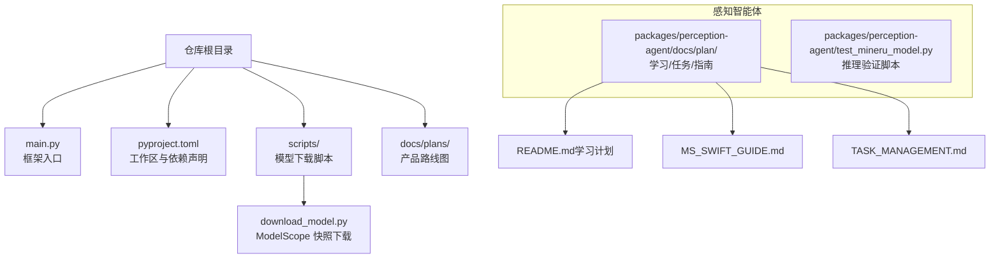
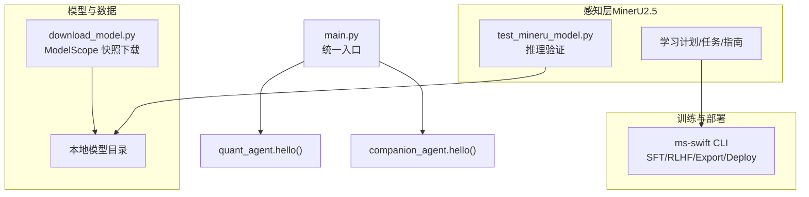
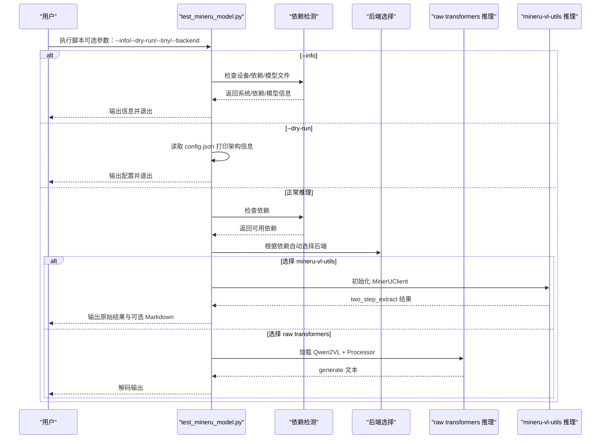
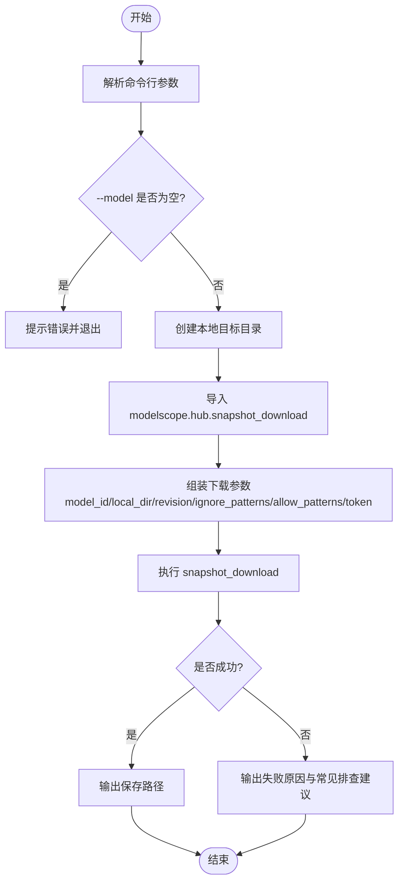
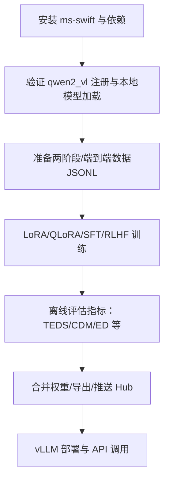
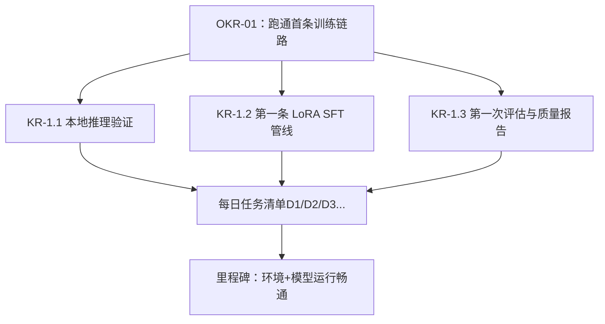
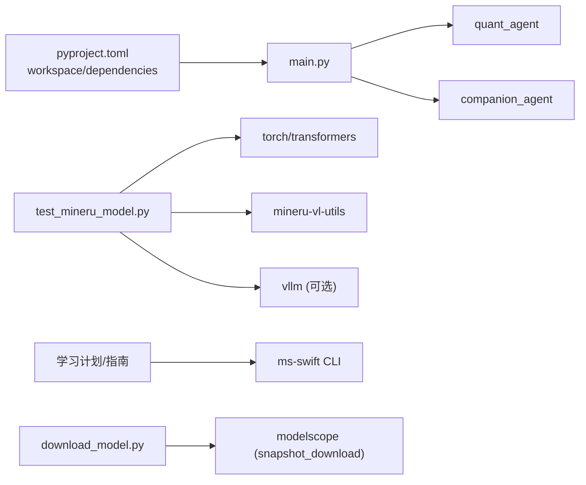

# MinerU2.5研究综述

<cite>
**本文引用的文件**   
- [README.md](file://README.md)
- [main.py](file://main.py)
- [pyproject.toml](file://pyproject.toml)
- [test_mineru_model.py](file://packages/perception-agent/test_mineru_model.py)
- [download_model.py](file://scripts/download_model.py)
- [README.md（学习计划）](file://packages/perception-agent/docs/plan/README.md)
- [MS_SWIFT_GUIDE.md](file://packages/perception-agent/docs/plan/MS_SWIFT_GUIDE.md)
- [TASK_MANAGEMENT.md](file://packages/perception-agent/docs/plan/TASK_MANAGEMENT.md)
- [roadmap.html](file://docs/plans/roadmap.html)
</cite>

## 目录
1. [引言](#引言)
2. [项目结构](#项目结构)
3. [核心组件](#核心组件)
4. [架构总览](#架构总览)
5. [详细组件分析](#详细组件分析)
6. [依赖关系分析](#依赖关系分析)
7. [性能与资源考量](#性能与资源考量)
8. [故障排查指南](#故障排查指南)
9. [结论](#结论)
10. [附录](#附录)

## 引言
本综述聚焦于仓库中与“MinerU2.5”相关的工程化实践，包括模型理解、环境搭建、推理验证、微调训练、评估与部署等全链路内容。文档基于仓库内计划文档、测试脚本与下载脚本进行梳理，旨在为读者提供从入门到落地的系统性参考。

## 项目结构
仓库采用多包工作区组织，根目录包含入口脚本与配置；perception-agent 子包下存放了针对 MinerU2.5 的学习计划、任务管理与测试脚本；scripts 提供模型下载工具。整体结构清晰，便于按功能域拆分与维护。

图示来源
- [main.py:1-12](file://main.py#L1-L12)
- [pyproject.toml:1-30](file://pyproject.toml#L1-L30)
- [download_model.py:1-139](file://scripts/download_model.py#L1-L139)
- [README.md（学习计划）:1-517](file://packages/perception-agent/docs/plan/README.md#L1-L517)
- [MS_SWIFT_GUIDE.md:43-509](file://packages/perception-agent/docs/plan/MS_SWIFT_GUIDE.md#L43-L509)
- [TASK_MANAGEMENT.md:1-35](file://packages/perception-agent/docs/plan/TASK_MANAGEMENT.md#L1-L35)

章节来源
- [README.md:1-129](file://README.md#L1-L129)
- [pyproject.toml:1-30](file://pyproject.toml#L1-L30)

## 核心组件
- 入口编排：根入口脚本负责加载并调用各子模块的 hello 能力，体现“双面对齐”的统一入口风格。
- 感知层（MinerU2.5）：通过测试脚本与学习计划，完成模型加载、推理验证、两阶段解析流程体验与后续微调准备。
- 训练与部署：基于 ms-swift 提供的 SFT/RLHF/导出/部署能力，形成可复用的训练-评估-上线流水线。
- 数据与模型管理：提供 ModelScope 快照下载脚本，统一模型获取路径与环境初始化。

章节来源
- [main.py:1-12](file://main.py#L1-L12)
- [README.md（学习计划）:1-517](file://packages/perception-agent/docs/plan/README.md#L1-L517)
- [MS_SWIFT_GUIDE.md:43-509](file://packages/perception-agent/docs/plan/MS_SWIFT_GUIDE.md#L43-L509)
- [download_model.py:1-139](file://scripts/download_model.py#L1-L139)

## 架构总览
下图展示了 MinerU2.5 在仓库中的定位与交互：入口脚本作为统一门面，感知层通过测试脚本对接模型与工具库，训练与部署由 ms-swift 驱动，模型由下载脚本统一管理。

图示来源
- [main.py:1-12](file://main.py#L1-L12)
- [test_mineru_model.py:1-379](file://packages/perception-agent/test_mineru_model.py#L1-L379)
- [README.md（学习计划）:1-517](file://packages/perception-agent/docs/plan/README.md#L1-L517)
- [MS_SWIFT_GUIDE.md:43-509](file://packages/perception-agent/docs/plan/MS_SWIFT_GUIDE.md#L43-L509)
- [download_model.py:1-139](file://scripts/download_model.py#L1-L139)

## 详细组件分析

### 组件A：MinerU2.5 推理验证（test_mineru_model.py）
该脚本提供设备检测、依赖检查、模型信息展示、两种后端推理（原生 transformers 与 mineru-vl-utils），以及自动选择后端的逻辑，适合快速验证环境与模型可用性。

图示来源
- [test_mineru_model.py:1-379](file://packages/perception-agent/test_mineru_model.py#L1-L379)

章节来源
- [test_mineru_model.py:1-379](file://packages/perception-agent/test_mineru_model.py#L1-L379)

### 组件B：模型下载与管理（download_model.py）
该脚本封装 ModelScope 快照下载，支持指定模型 ID、保存路径、版本、忽略/允许模式、私有令牌与静默模式，便于团队统一模型获取与缓存策略。

图示来源
- [download_model.py:1-139](file://scripts/download_model.py#L1-L139)

章节来源
- [download_model.py:1-139](file://scripts/download_model.py#L1-L139)

### 组件C：微调与部署（基于 ms-swift）
学习计划与指南文档给出了从环境搭建、数据集格式、LoRA/QLoRA/全参微调、分布式训练、实验跟踪、离线评估到导出与 vLLM 部署的完整流程，并强调 MinerU2.5 在 ms-swift 中复用 qwen2_vl 模板与加载器。

图示来源
- [README.md（学习计划）:1-517](file://packages/perception-agent/docs/plan/README.md#L1-L517)
- [MS_SWIFT_GUIDE.md:43-509](file://packages/perception-agent/docs/plan/MS_SWIFT_GUIDE.md#L43-L509)

章节来源
- [README.md（学习计划）:1-517](file://packages/perception-agent/docs/plan/README.md#L1-L517)
- [MS_SWIFT_GUIDE.md:43-509](file://packages/perception-agent/docs/plan/MS_SWIFT_GUIDE.md#L43-L509)

### 组件D：任务与里程碑（OKR/周计划）
任务看板将总体目标拆解为 OKR→需求→任务，明确验收条件与每日交付物，有助于推进首条 LoRA 训练-评估闭环落地。

图示来源
- [TASK_MANAGEMENT.md:1-35](file://packages/perception-agent/docs/plan/TASK_MANAGEMENT.md#L1-L35)

章节来源
- [TASK_MANAGEMENT.md:1-35](file://packages/perception-agent/docs/plan/TASK_MANAGEMENT.md#L1-L35)

## 依赖关系分析
- 工作区与依赖：根 pyproject.toml 声明 uv workspace 成员与依赖组，便于统一安装与开发工具链。
- 入口与子模块：main.py 仅做轻量编排，实际能力由各子包提供。
- 感知层与外部库：test_mineru_model.py 依赖 torch/transformers/mineru-vl-utils/vllm/Pillow 等，用于设备检测、模型加载与推理。
- 训练与部署：ms-swift 提供模型注册、训练器、模板系统与导出/部署能力。

图示来源
- [pyproject.toml:1-30](file://pyproject.toml#L1-L30)
- [main.py:1-12](file://main.py#L1-L12)
- [test_mineru_model.py:1-379](file://packages/perception-agent/test_mineru_model.py#L1-L379)
- [README.md（学习计划）:1-517](file://packages/perception-agent/docs/plan/README.md#L1-L517)
- [MS_SWIFT_GUIDE.md:43-509](file://packages/perception-agent/docs/plan/MS_SWIFT_GUIDE.md#L43-L509)
- [download_model.py:1-139](file://scripts/download_model.py#L1-L139)

章节来源
- [pyproject.toml:1-30](file://pyproject.toml#L1-L30)
- [main.py:1-12](file://main.py#L1-L12)

## 性能与资源考量
- 显存与批大小：LoRA 训练时可通过降低 per_device_train_batch_size、增大梯度累积步数、减小 max_length 与冻结 ViT/Aligner 来缓解 OOM。
- 分布式与加速：单机多卡使用 DDP，4 卡可使用 DeepSpeed ZeRO2/ZeRO3，多机场景考虑 FSDP。
- 输入分辨率控制：通过 MAX_PIXELS 限制图片像素上限，避免显存峰值过高。
- 推理后端：优先使用 vLLM 提升吞吐与延迟表现。

章节来源
- [README.md（学习计划）:215-301](file://packages/perception-agent/docs/plan/README.md#L215-L301)
- [README.md（学习计划）:458-489](file://packages/perception-agent/docs/plan/README.md#L458-L489)

## 故障排查指南
- 依赖缺失：确保 torch/transformers/mineru-vl-utils/vllm/Pillow 已安装；脚本内置依赖检测与提示。
- 模型路径错误：确认本地模型目录存在且包含必要配置文件；dry-run 模式可快速校验配置。
- 模板不匹配：在 ms-swift 中显式指定 model_type/template_type 为 qwen2_vl，避免自动识别失败。
- 训练 loss 不下降：调大学习率或检查数据标注质量；灾难性遗忘可通过减少学习率与经验回放缓解。
- 图片无法加载：设置 MAX_PIXELS 环境变量以适配输入分辨率限制。

章节来源
- [test_mineru_model.py:1-379](file://packages/perception-agent/test_mineru_model.py#L1-L379)
- [MS_SWIFT_GUIDE.md:317-355](file://packages/perception-agent/docs/plan/MS_SWIFT_GUIDE.md#L317-L355)
- [README.md（学习计划）:458-489](file://packages/perception-agent/docs/plan/README.md#L458-L489)

## 结论
本仓库围绕 MinerU2.5 构建了从环境验证、推理测试到微调训练与部署的完整工程链路。借助 ms-swift 的成熟生态与清晰的计划文档，可在较短时间内打通首条 LoRA 训练-评估闭环，并为后续领域特化与个性化定制打下基础。

## 附录
- 产品路线图与北极星指标：详见 roadmap.html，明确了“始于陪伴，终于进化”的定位与三阶段里程碑。
- 学习计划与任务看板：提供了从 Day1 到 Week4 的详细步骤与验收标准，便于团队协作与进度追踪。

章节来源
- [roadmap.html:1-471](file://docs/plans/roadmap.html#L1-L471)
- [README.md（学习计划）:1-517](file://packages/perception-agent/docs/plan/README.md#L1-L517)
- [TASK_MANAGEMENT.md:1-35](file://packages/perception-agent/docs/plan/TASK_MANAGEMENT.md#L1-L35)