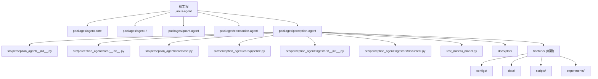
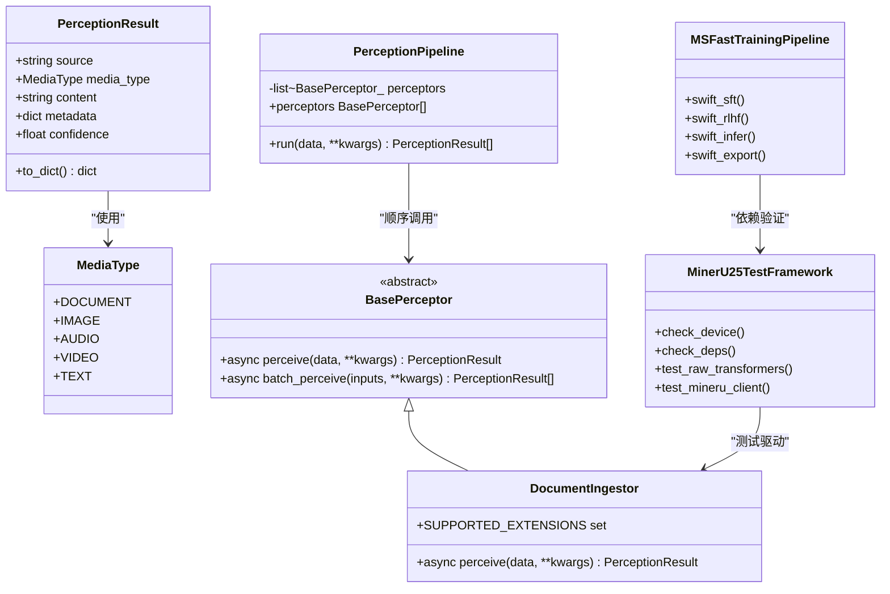
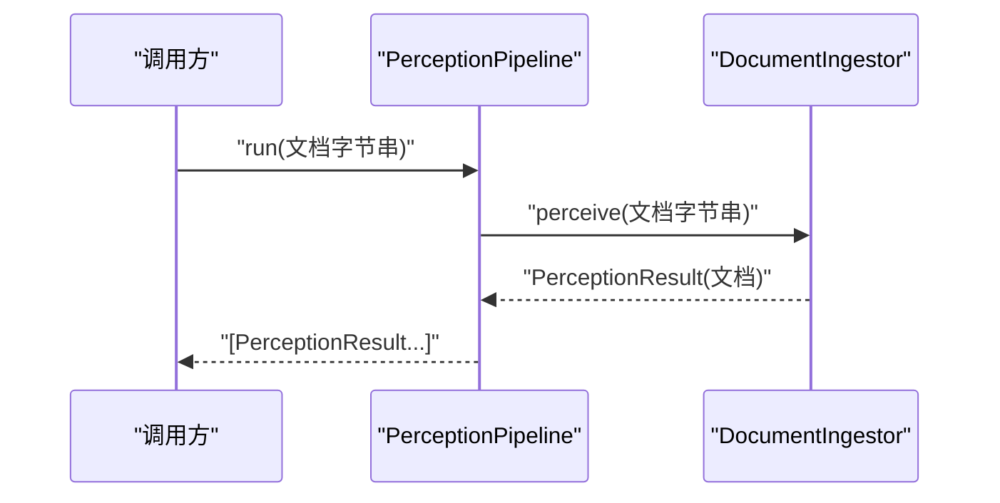
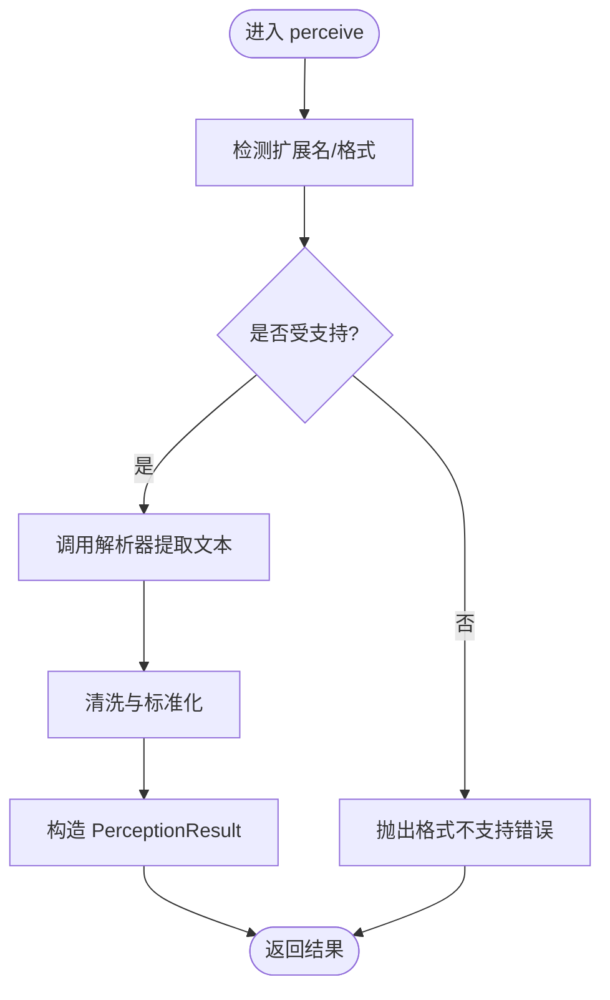
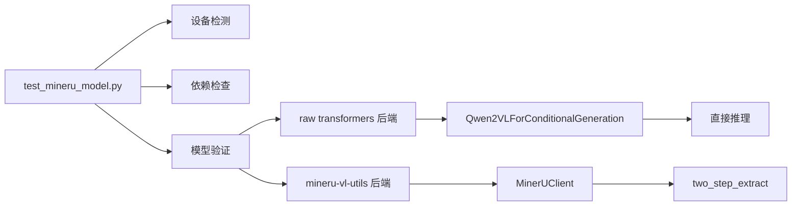
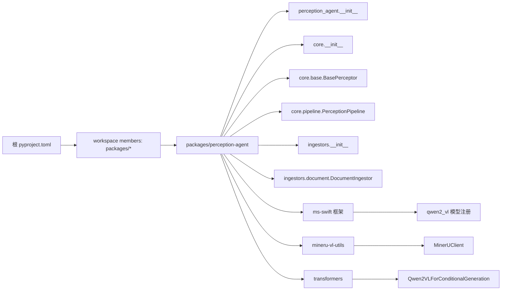

# 感知智能体开发计划

<cite>
**本文引用的文件**   
- [main.py](file://main.py)
- [pyproject.toml](file://pyproject.toml)
- [.agent/AGENT.md](file://.agent/AGENT.md)
- [packages/perception-agent/README.md](file://packages/perception-agent/README.md)
- [packages/perception-agent/pyproject.toml](file://packages/perception-agent/pyproject.toml)
- [packages/perception-agent/src/perception_agent/__init__.py](file://packages/perception-agent/src/perception_agent/__init__.py)
- [packages/perception-agent/src/perception_agent/core/__init__.py](file://packages/perception-agent/src/perception_agent/core/__init__.py)
- [packages/perception-agent/src/perception_agent/core/base.py](file://packages/perception-agent/src/perception_agent/core/base.py)
- [packages/perception-agent/src/perception_agent/core/pipeline.py](file://packages/perception-agent/src/perception_agent/core/pipeline.py)
- [packages/perception-agent/src/perception_agent/ingestors/__init__.py](file://packages/perception-agent/src/perception_agent/ingestors/__init__.py)
- [packages/perception-agent/src/perception_agent/ingestors/document.py](file://packages/perception-agent/src/perception_agent/ingestors/document.py)
- [packages/perception-agent/test_mineru_model.py](file://packages/perception-agent/test_mineru_model.py)
- [packages/perception-agent/docs/plan/MS_SWIFT_GUIDE.md](file://packages/perception-agent/docs/plan/MS_SWIFT_GUIDE.md)
- [packages/perception-agent/docs/plan/README.md](file://packages/perception-agent/docs/plan/README.md)
- [packages/perception-agent/docs/plan/TASK_MANAGEMENT.md](file://packages/perception-agent/docs/plan/TASK_MANAGEMENT.md)
</cite>

## 更新摘要
**变更内容**   
- 新增 MinerU2.5 微调能力集成章节，包括测试框架、训练管道和学术研究支撑
- 扩展项目结构图以反映新的微调目录结构
- 更新核心组件分析，增加微调相关组件说明
- 新增架构总览中的微调流水线设计
- 完善依赖关系分析，包含 ms-swift 框架集成
- 更新故障排查指南，涵盖微调相关问题

## 目录
1. [引言](#引言)
2. [项目结构](#项目结构)
3. [核心组件](#核心组件)
4. [架构总览](#架构总览)
5. [详细组件分析](#详细组件分析)
6. [MinerU2.5 微调能力集成](#mineru25-微调能力集成)
7. [依赖关系分析](#依赖关系分析)
8. [性能与可扩展性](#性能与可扩展性)
9. [故障排查指南](#故障排查指南)
10. [结论](#结论)
11. [附录](#附录)

## 引言
本文件面向"感知智能体"（perception-agent）的开发计划，聚焦于多模态知识摄入（Knowledge Ingestion）的统一抽象与可插拔实现。目标是将文档、图片、音频、视频等多模态输入转化为结构化知识，供 JanusAgent 内核消费。整体采用 Provider 模式：Core 定义感知契约，各 Provider 独立实现，支持按媒体类型扩展与替换。

**更新** 现已集成 MinerU2.5 微调能力，包括完整的测试框架、训练管道和学术研究支撑，形成从数据准备到模型部署的全流程解决方案。

## 项目结构
仓库为 uv workspace，根工程聚合多个子包；感知智能体位于 packages/perception-agent。顶层入口 main.py 演示了框架内其他两个 Agent 的集成方式，感知层作为独立包提供 CLI 与 API。

**图表来源**
- [pyproject.toml:1-30](file://pyproject.toml#L1-L30)
- [packages/perception-agent/pyproject.toml:1-17](file://packages/perception-agent/pyproject.toml#L1-L17)
- [packages/perception-agent/src/perception_agent/__init__.py:1-15](file://packages/perception-agent/src/perception_agent/__init__.py#L1-L15)
- [packages/perception-agent/src/perception_agent/core/__init__.py:1-10](file://packages/perception-agent/src/perception_agent/core/__init__.py#L1-L10)
- [packages/perception-agent/src/perception_agent/core/base.py:1-69](file://packages/perception-agent/src/perception_agent/core/base.py#L1-L69)
- [packages/perception-agent/src/perception_agent/core/pipeline.py:1-45](file://packages/perception-agent/src/perception_agent/core/pipeline.py#L1-L45)
- [packages/perception-agent/src/perception_agent/ingestors/__init__.py:1-13](file://packages/perception-agent/src/perception_agent/ingestors/__init__.py#L1-L13)
- [packages/perception-agent/src/perception_agent/ingestors/document.py:1-27](file://packages/perception-agent/src/perception_agent/ingestors/document.py#L1-L27)
- [packages/perception-agent/test_mineru_model.py:1-379](file://packages/perception-agent/test_mineru_model.py#L1-379)
- [packages/perception-agent/docs/plan/README.md:1-317](file://packages/perception-agent/docs/plan/README.md#L1-317)

章节来源
- [pyproject.toml:1-30](file://pyproject.toml#L1-L30)
- [.agent/AGENT.md:1-142](file://.agent/AGENT.md#L1-L142)
- [main.py:1-13](file://main.py#L1-L13)

## 核心组件
- 统一抽象层
  - BasePerceptor：定义异步 perceive 接口与批量 batch_perceive 默认实现。
  - PerceptionResult：统一输出数据结构，包含来源、媒体类型、内容、元数据与置信度。
  - MediaType：枚举文档、图像、音频、视频、文本等媒体类型。
- 编排层
  - PerceptionPipeline：将多个 Perceptor 串联执行，对同一份输入依次调用，返回每个阶段的结构化结果。
- 具体提供者（Ingestors）
  - DocumentIngestor：文档解析入口，预留 PDF/HTML/Markdown/TXT 等处理逻辑。
  - 其他媒体类型（Image/Audio/Video）在 ingestors 包中已声明导出，待实现。
- **新增** 微调支持组件
  - MinerU2.5 测试框架：提供模型验证、推理测试和环境检查功能。
  - ms-swift 训练管道：基于阿里巴巴开源框架的微调基础设施。
  - 学术研究支撑：包含论文调研、实验设计和评估体系。

章节来源
- [packages/perception-agent/src/perception_agent/core/base.py:1-69](file://packages/perception-agent/src/perception_agent/core/base.py#L1-L69)
- [packages/perception-agent/src/perception_agent/core/pipeline.py:1-45](file://packages/perception-agent/src/perception_agent/core/pipeline.py#L1-L45)
- [packages/perception-agent/src/perception_agent/ingestors/document.py:1-27](file://packages/perception-agent/src/perception_agent/ingestors/document.py#L1-L27)
- [packages/perception-agent/src/perception_agent/ingestors/__init__.py:1-13](file://packages/perception-agent/src/perception_agent/ingestors/__init__.py#L1-L13)
- [packages/perception-agent/test_mineru_model.py:1-379](file://packages/perception-agent/test_mineru_model.py#L1-379)
- [packages/perception-agent/docs/plan/MS_SWIFT_GUIDE.md:1-842](file://packages/perception-agent/docs/plan/MS_SWIFT_GUIDE.md#L1-842)

## 架构总览
感知层遵循"Core 抽象 → Ingestion Providers → 分块 → 嵌入 → 存储"的设计路径。当前阶段重点完成 Core 抽象与文档 Provider 骨架，后续逐步补齐图像、音频、视频 Provider，并接入分块、嵌入与存储后端。

**更新** 现已集成完整的 MinerU2.5 微调流水线，支持从数据准备到模型部署的全流程操作。

**图表来源**
- [packages/perception-agent/src/perception_agent/core/base.py:1-69](file://packages/perception-agent/src/perception_agent/core/base.py#L1-L69)
- [packages/perception-agent/src/perception_agent/core/pipeline.py:1-45](file://packages/perception-agent/src/perception_agent/core/pipeline.py#L1-L45)
- [packages/perception-agent/src/perception_agent/ingestors/document.py:1-27](file://packages/perception-agent/src/perception_agent/ingestors/document.py#L1-L27)
- [packages/perception-agent/test_mineru_model.py:1-379](file://packages/perception-agent/test_mineru_model.py#L1-379)
- [packages/perception-agent/docs/plan/MS_SWIFT_GUIDE.md:1-842](file://packages/perception-agent/docs/plan/MS_SWIFT_GUIDE.md#L1-842)

## 详细组件分析

### 抽象与数据模型（BasePerceptor / PerceptionResult / MediaType）
- 设计要点
  - 通过抽象基类约束所有感知器的输入输出形态，确保上层编排与下游消费的一致性。
  - 统一结果对象携带来源、媒体类型、内容与置信度，便于跨 Provider 的结果融合与质量评估。
  - 批量接口提供默认实现，子类可按需优化并发或批处理策略。
- 复杂度与扩展点
  - 单条感知时间复杂度取决于具体实现；批量接口默认 O(n)。
  - 新增媒体类型仅需扩展 MediaType 并实现对应 Provider。

章节来源
- [packages/perception-agent/src/perception_agent/core/base.py:1-69](file://packages/perception-agent/src/perception_agent/core/base.py#L1-L69)

### 编排器（PerceptionPipeline）
- 设计要点
  - 以链式组合的方式组织多个 Perceptor，对同一份输入顺序执行，产出多阶段结果。
  - 暴露只读视图，防止外部篡改内部编排顺序。
- 典型用法
  - 构建 OCR → 版面分析 → 摘要生成 的流水线，最终得到一系列结构化片段。

章节来源
- [packages/perception-agent/src/perception_agent/core/pipeline.py:1-45](file://packages/perception-agent/src/perception_agent/core/pipeline.py#L1-L45)

### 文档提供者（DocumentIngestor）
- 设计要点
  - 支持常见文档后缀识别，预留解析逻辑占位，便于快速接入第三方库。
  - 返回最小可用结果，包含来源截断、媒体类型与扩展提示元数据。
- 下一步
  - 实现 PDF/HTML/Markdown/TXT 的具体解析与清洗流程，填充 content 字段。

章节来源
- [packages/perception-agent/src/perception_agent/ingestors/document.py:1-27](file://packages/perception-agent/src/perception_agent/ingestors/document.py#L1-L27)

### 流水线执行时序（示例）

**图表来源**
- [packages/perception-agent/src/perception_agent/core/pipeline.py:1-45](file://packages/perception-agent/src/perception_agent/core/pipeline.py#L1-L45)
- [packages/perception-agent/src/perception_agent/ingestors/document.py:1-27](file://packages/perception-agent/src/perception_agent/ingestors/document.py#L1-L27)

### 关键流程图（文档解析占位到落地）

**图表来源**
- [packages/perception-agent/src/perception_agent/ingestors/document.py:1-27](file://packages/perception-agent/src/perception_agent/ingestors/document.py#L1-L27)

## MinerU2.5 微调能力集成

### 测试框架组件
MinerU2.5 测试框架提供了完整的模型验证和推理测试功能：

- **设备与环境检测**：自动检测 GPU/CPU/MPS 设备和依赖安装状态
- **双后端支持**：原生 transformers 和 mineru-vl-utils 两种推理后端
- **交互式测试**：支持命令行参数配置和自动生成测试图片
- **性能监控**：记录加载时间、推理速度和 token 生成速率

**图表来源**
- [packages/perception-agent/test_mineru_model.py:1-379](file://packages/perception-agent/test_mineru_model.py#L1-379)

### 训练管道架构
基于 ms-swift 框架的微调管道支持完整的训练生命周期管理：

- **监督微调（SFT）**：LoRA、QLoRA、全参数等多种微调策略
- **强化学习（RLHF）**：GRPO、DPO、PPO 等高级对齐算法
- **分布式训练**：DDP、DeepSpeed ZeRO、FSDP 等并行策略
- **实验跟踪**：TensorBoard、W&B 等可视化监控工具

**章节来源**
- [packages/perception-agent/docs/plan/MS_SWIFT_GUIDE.md:1-842](file://packages/perception-agent/docs/plan/MS_SWIFT_GUIDE.md#L1-842)
- [packages/perception-agent/docs/plan/README.md:1-317](file://packages/perception-agent/docs/plan/README.md#L1-317)
- [packages/perception-agent/docs/plan/TASK_MANAGEMENT.md:1-35](file://packages/perception-agent/docs/plan/TASK_MANAGEMENT.md#L1-35)

### 学术研究支撑
项目建立了完善的学术研究支撑体系：

- **论文研读**：深入分析 MinerU2.5 和 MinerU2.5-Pro 的核心创新点
- **数据工程**：两阶段训练数据设计和特殊 token 体系理解
- **实验设计**：OKR 驱动的阶段性目标和量化评估指标
- **技术路线**：从基础认知到生产部署的完整学习路径

**章节来源**
- [packages/perception-agent/docs/plan/README.md:1-317](file://packages/perception-agent/docs/plan/README.md#L1-317)
- [packages/perception-agent/docs/plan/TASK_MANAGEMENT.md:1-35](file://packages/perception-agent/docs/plan/TASK_MANAGEMENT.md#L1-35)

## 依赖关系分析
- 工作区与包管理
  - 根 pyproject.toml 声明 uv workspace，成员为 packages/*；感知层作为独立包被聚合。
  - 感知层自身 pyproject.toml 定义了脚本入口 perception-agent。
- 模块导入关系
  - perception_agent.__init__ 与 core.__init__ 对外暴露 BasePerceptor、PerceptionResult、PerceptionPipeline。
  - ingestors.__init__ 汇总导出各媒体类型的 Ingestor（当前仅文档实现）。
- **新增** 微调框架依赖
  - ms-swift：阿里巴巴开源的大模型训练与部署框架
  - mineru-vl-utils：MinerU 官方提供的视觉语言工具集
  - transformers：HuggingFace 生态的核心推理框架

**图表来源**
- [pyproject.toml:14-17](file://pyproject.toml#L14-L17)
- [packages/perception-agent/pyproject.toml:12-13](file://packages/perception-agent/pyproject.toml#L12-13)
- [packages/perception-agent/src/perception_agent/__init__.py:1-15](file://packages/perception-agent/src/perception_agent/__init__.py#L1-L15)
- [packages/perception-agent/src/perception_agent/core/__init__.py:1-10](file://packages/perception-agent/src/perception_agent/core/__init__.py#L1-L10)
- [packages/perception-agent/src/perception_agent/ingestors/__init__.py:1-13](file://packages/perception-agent/src/perception_agent/ingestors/__init__.py#L1-L13)
- [packages/perception-agent/test_mineru_model.py:1-379](file://packages/perception-agent/test_mineru_model.py#L1-379)
- [packages/perception-agent/docs/plan/MS_SWIFT_GUIDE.md:1-842](file://packages/perception-agent/docs/plan/MS_SWIFT_GUIDE.md#L1-842)

章节来源
- [pyproject.toml:1-30](file://pyproject.toml#L1-L30)
- [packages/perception-agent/pyproject.toml:1-17](file://packages/perception-agent/pyproject.toml#L1-L17)
- [packages/perception-agent/src/perception_agent/__init__.py:1-15](file://packages/perception-agent/src/perception_agent/__init__.py#L1-L15)
- [packages/perception-agent/src/perception_agent/core/__init__.py:1-10](file://packages/perception-agent/src/perception_agent/core/__init__.py#L1-L10)
- [packages/perception-agent/src/perception_agent/ingestors/__init__.py:1-13](file://packages/perception-agent/src/perception_agent/ingestors/__init__.py#L1-L13)

## 性能与可扩展性
- 批处理与并发
  - BasePerceptor.batch_perceive 默认串行；针对高吞吐场景可在子类中重写为并发或流式处理。
- 流水线并行化
  - 当前 Pipeline 顺序执行；若各阶段相互独立，可考虑引入 Fan-out/Fan-in 或任务图编排以提升吞吐。
- 内存与分块
  - 大文档建议先分块再送入解析器，降低峰值内存占用，提升缓存命中率。
- 可插拔与热切换
  - 通过 Provider 注册表动态选择不同实现（如多种 PDF 解析器），结合配置中心进行灰度切换。
- **新增** 微调性能优化
  - LoRA 微调显著降低显存需求（9-12GB vs 24GB+）
  - 梯度累积和混合精度训练提升训练效率
  - 分布式训练支持多卡并行加速

[本节为通用指导，不直接分析具体文件]

## 故障排查指南
- 常见问题定位
  - 未实现的 Provider：若调用 Image/Audio/Video 相关接口，可能因尚未实现而报错。请检查 ingestors 包导出与实际实现是否一致。
  - 文档格式不支持：DocumentIngestor 目前仅做占位，遇到非预期格式会返回空内容或提示扩展名。建议在感知前增加格式校验与友好错误信息。
  - 结果序列化异常：PerceptionResult.to_dict 依赖 content 为字符串，若子类返回非字符串类型会导致序列化失败。
- 调试建议
  - 打印 PerceptionResult.metadata 中的扩展提示与来源截断，辅助定位输入问题。
  - 在 Pipeline.run 前后记录耗时，识别瓶颈阶段。
- **新增** 微调相关故障排查
  - 模型加载失败：检查 model_type 是否正确设置为 qwen2_vl
  - 显存不足：调整 MAX_PIXELS、max_length 或使用 LoRA 微调
  - 数据格式错误：验证 JSONL 文件格式和消息结构
  - 训练不稳定：调整学习率、梯度累积步数和权重衰减

章节来源
- [packages/perception-agent/src/perception_agent/ingestors/__init__.py:1-13](file://packages/perception-agent/src/perception_agent/ingestors/__init__.py#L1-L13)
- [packages/perception-agent/src/perception_agent/ingestors/document.py:1-27](file://packages/perception-agent/src/perception_agent/ingestors/document.py#L1-L27)
- [packages/perception-agent/src/perception_agent/core/base.py:21-39](file://packages/perception-agent/src/perception_agent/core/base.py#L21-L39)
- [packages/perception-agent/src/perception_agent/core/pipeline.py:26-39](file://packages/perception-agent/src/perception_agent/core/pipeline.py#L26-L39)
- [packages/perception-agent/test_mineru_model.py:1-379](file://packages/perception-agent/test_mineru_model.py#L1-379)
- [packages/perception-agent/docs/plan/MS_SWIFT_GUIDE.md:764-842](file://packages/perception-agent/docs/plan/MS_SWIFT_GUIDE.md#L764-L842)

## 结论
感知智能体已完成 Core 抽象与文档 Provider 骨架，具备统一的输入输出契约与基础编排能力。**现已成功集成 MinerU2.5 微调能力**，包括完整的测试框架、训练管道和学术研究支撑，形成了从多模态知识摄入到模型定制化的完整解决方案。

下一步应优先补齐图像、音频、视频 Provider，完善文档解析细节，并引入分块、嵌入与存储后端，形成端到端的多模态知识摄入链路。同时继续深化 MinerU2.5 微调能力的实际应用，探索更多垂直领域的定制化场景。

## 附录
- 运行与安装
  - 使用 uv sync 安装依赖，uv run perception-agent 启动 CLI。
- 参考说明
  - 包 README 提供了高层设计与开发指引。
- **新增** 微调环境搭建
  - 安装 ms-swift 框架：`pip install ms-swift -U`
  - 验证 MinerU2.5 模型：`python test_mineru_model.py --info`
  - 首次训练脚本：参考 `docs/plan/MS_SWIFT_GUIDE.md` 中的完整教程

章节来源
- [packages/perception-agent/README.md:1-25](file://packages/perception-agent/README.md#L1-L25)
- [packages/perception-agent/pyproject.toml:12-13](file://packages/perception-agent/pyproject.toml#L12-L13)
- [packages/perception-agent/docs/plan/MS_SWIFT_GUIDE.md:1-842](file://packages/perception-agent/docs/plan/MS_SWIFT_GUIDE.md#L1-842)
- [packages/perception-agent/test_mineru_model.py:1-379](file://packages/perception-agent/test_mineru_model.py#L1-379)