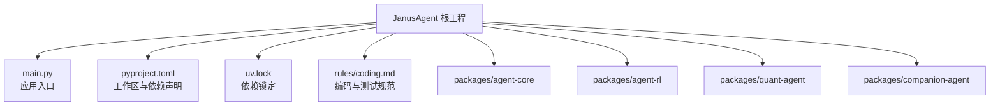
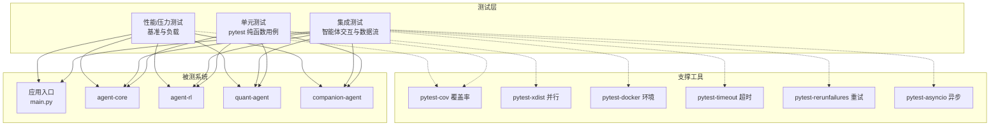
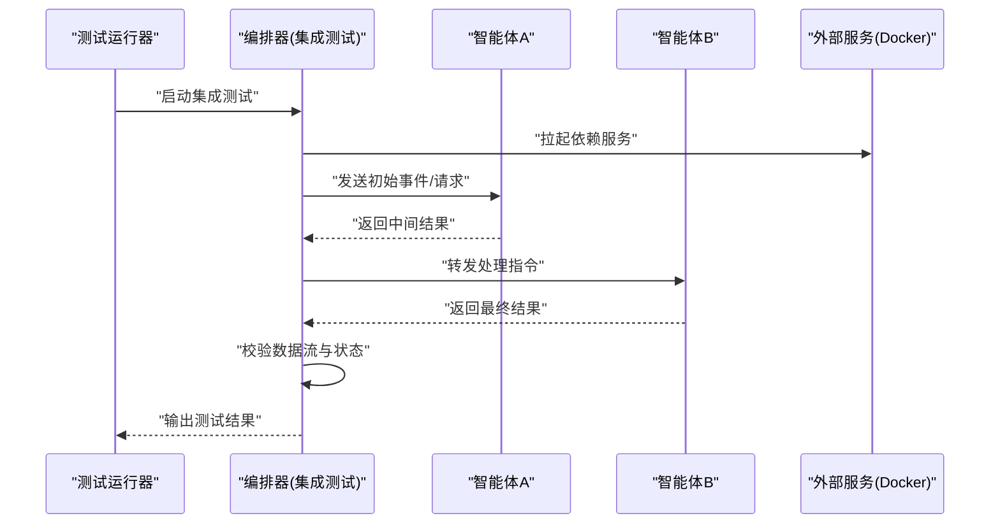
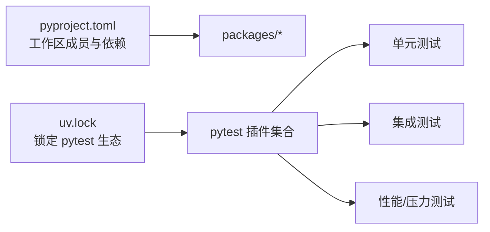

# 测试策略与实践

<cite>
**本文引用的文件**
- [main.py](file://main.py)
- [pyproject.toml](file://pyproject.toml)
- [uv.lock](file://uv.lock)
- [.agent/rules/coding.md](file://.agent/rules/coding.md)
</cite>

## 目录
1. [简介](#简介)
2. [项目结构](#项目结构)
3. [核心组件](#核心组件)
4. [架构总览](#架构总览)
5. [详细组件分析](#详细组件分析)
6. [依赖分析](#依赖分析)
7. [性能考虑](#性能考虑)
8. [故障排查指南](#故障排查指南)
9. [结论](#结论)
10. [附录](#附录)

## 简介
本文件为 JanusAgent 项目的完整测试策略与实施指南，覆盖单元测试、集成测试、性能/压力测试、测试数据与模拟服务管理、以及持续集成中的自动化与报告生成。目标是在多包工作区（packages/*）环境下，建立统一、可维护、可扩展的测试体系，确保智能体之间的交互正确性与系统稳定性。

## 项目结构
当前仓库采用 uv 工作区组织多个子包：
- 根入口 main.py 聚合并调用各子包的对外能力
- pyproject.toml 声明工作区成员与开发依赖
- uv.lock 锁定第三方依赖版本，包含 pytest 生态插件

图表来源
- [main.py:1-13](file://main.py#L1-L13)
- [pyproject.toml:1-30](file://pyproject.toml#L1-L30)
- [uv.lock:4269-4343](file://uv.lock#L4269-L4343)
- [.agent/rules/coding.md:67-85](file://.agent/rules/coding.md#L67-L85)

章节来源
- [main.py:1-13](file://main.py#L1-L13)
- [pyproject.toml:1-30](file://pyproject.toml#L1-L30)
- [uv.lock:4269-4343](file://uv.lock#L4269-L4343)
- [.agent/rules/coding.md:67-85](file://.agent/rules/coding.md#L67-L85)

## 核心组件
本节聚焦测试相关的关键要素与约定：
- 测试框架与插件
  - 使用 pytest 作为统一测试框架
  - 常用插件：pytest-asyncio、pytest-cov、pytest-docker、pytest-rerunfailures、pytest-timeout、pytest-xdist
- 用例组织与命名
  - 使用纯函数而非类组织用例
  - 命名模式：test_<函数名>_<场景>
- 覆盖率与并行
  - 通过 pytest-cov 生成覆盖率报告
  - 通过 pytest-xdist 实现并行执行加速
- 异步与外部依赖
  - 使用 pytest-asyncio 支持异步测试
  - 使用 pytest-docker 在隔离环境中启动依赖服务（如数据库、消息队列等）

章节来源
- [.agent/rules/coding.md:67-85](file://.agent/rules/coding.md#L67-L85)
- [uv.lock:4269-4343](file://uv.lock#L4269-L4343)

## 架构总览
从测试视角看，JanusAgent 的测试分层如下：
- 单元测试：针对每个包的公共 API、边界条件与错误路径
- 集成测试：验证智能体间交互、消息路由与数据流一致性
- 性能/压力测试：基准测试与负载压测，结合监控指标评估稳定性
- 工具链：pytest + 插件 + 覆盖率 + Docker 环境编排 + CI 流水线

图表来源
- [main.py:1-13](file://main.py#L1-L13)
- [pyproject.toml:1-30](file://pyproject.toml#L1-L30)
- [uv.lock:4269-4343](file://uv.lock#L4269-L4343)

## 详细组件分析

### 单元测试设计与实施
- 目标范围
  - 各包的公共 API、关键算法与数据处理逻辑
  - 边界条件与异常路径
- 组织结构
  - 建议按包维度创建 tests 目录，例如 packages/<包>/tests/
  - 用例文件以 test_*.py 命名，模块内使用纯函数定义用例
- 命名约定
  - 遵循 test_<函数名>_<场景> 的模式，便于定位与过滤
- 断言与可读性
  - 使用清晰的断言描述失败原因，避免模糊断言
- 示例参考路径
  - 规则与约定参见：[.agent/rules/coding.md:67-85](file://.agent/rules/coding.md#L67-L85)

章节来源
- [.agent/rules/coding.md:67-85](file://.agent/rules/coding.md#L67-L85)

### 集成测试设计模式（智能体交互与数据流）
- 设计要点
  - 端到端流程：构造最小可用场景，驱动多个智能体协作完成一个任务
  - 数据流验证：校验输入到输出的转换、中间状态与副作用
  - 外部依赖隔离：使用 pytest-docker 启动必要服务，保证可重复性
- 典型流程（序列图）

- 数据流验证清单
  - 输入参数合法性与类型约束
  - 中间消息结构与字段完整性
  - 最终输出与业务期望一致
  - 异常分支下的回滚或补偿行为
- 注意事项
  - 使用 pytest-timeout 防止挂起
  - 使用 pytest-rerunfailures 缓解偶发不稳定
  - 使用 pytest-asyncio 支持异步交互

章节来源
- [uv.lock:4269-4343](file://uv.lock#L4269-L4343)

### 性能测试与压力测试
- 基准测试
  - 针对热点路径与关键算法建立基准用例，关注耗时与资源占用
  - 建议在独立环境运行，避免与其他测试互相干扰
- 压力测试
  - 模拟高并发或多智能体协作场景，观察吞吐、延迟与错误率
  - 结合容器化编排，快速扩缩容被测实例
- 监控与指标
  - 采集 CPU、内存、I/O、网络等指标
  - 记录关键业务指标（如任务完成时间、成功率）
- 回归基线
  - 将性能结果纳入回归检查，阈值告警与趋势分析

[本节为通用指导，不直接分析具体文件]

### 测试数据管理与模拟服务
- 测试数据
  - 使用固定数据集与随机种子保证可重复性
  - 对敏感数据进行脱敏或替换
- 模拟服务
  - 使用 pytest-docker 启动数据库、缓存、消息队列等
  - 提供轻量 Mock/Stub 替代真实外部 API
- 配置与环境
  - 通过环境变量区分测试环境
  - 使用配置文件集中管理连接信息与开关

章节来源
- [uv.lock:4269-4343](file://uv.lock#L4269-L4343)

### 持续集成中的测试自动化与报告
- 推荐步骤
  - 安装依赖：基于 pyproject.toml 与 uv.lock 安装
  - 运行单测：pytest 执行，启用并行与超时
  - 生成覆盖率：pytest-cov 输出 HTML/XML 报告
  - 集成测试：按需启用 docker 环境
  - 上传报告：将覆盖率与测试结果归档
- 关键命令参考
  - 运行测试：pytest
  - 并行执行：pytest -n auto
  - 覆盖率：pytest --cov=<包名> --cov-report=html --cov-report=xml
  - 超时控制：pytest --timeout=秒数
  - 重试机制：pytest --reruns=次数
- 参考依据
  - 工作区与依赖声明：[pyproject.toml:1-30](file://pyproject.toml#L1-L30)
  - 插件版本与可用性：[uv.lock:4269-4343](file://uv.lock#L4269-L4343)

章节来源
- [pyproject.toml:1-30](file://pyproject.toml#L1-L30)
- [uv.lock:4269-4343](file://uv.lock#L4269-L4343)

## 依赖分析
测试相关依赖与工作区关系如下：
- 工作区成员由 pyproject.toml 声明，所有子包共享统一的测试工具链
- uv.lock 锁定了 pytest 及其插件的版本，确保本地与 CI 行为一致

图表来源
- [pyproject.toml:14-17](file://pyproject.toml#L14-L17)
- [uv.lock:4269-4343](file://uv.lock#L4269-L4343)

章节来源
- [pyproject.toml:1-30](file://pyproject.toml#L1-L30)
- [uv.lock:4269-4343](file://uv.lock#L4269-L4343)

## 性能考虑
- 用例粒度与隔离
  - 将耗时较长的集成与性能用例与单测分离，避免拖慢整体反馈速度
- 并行与资源限制
  - 合理设置并行度，避免资源争用导致不稳定
- 指标采集与采样
  - 在关键路径埋点，减少采样开销
- 回归与基线
  - 建立性能基线与阈值，定期回归对比

[本节为通用指导，不直接分析具体文件]

## 故障排查指南
- 常见问题
  - 异步测试未标记或未正确配置：确认使用 pytest-asyncio 并正确装饰/配置
  - 外部服务不可达：检查 pytest-docker 是否成功拉起，端口映射是否正确
  - 测试不稳定：启用 pytest-rerunfailures 定位偶发问题，增加等待与重试策略
  - 超时：使用 pytest-timeout 保护长耗时用例
- 定位方法
  - 缩小范围：按模块或关键字过滤执行
  - 查看日志：开启详细日志输出，定位失败上下文
  - 复现环境：在本地使用相同 Docker 镜像与服务配置复现

章节来源
- [uv.lock:4269-4343](file://uv.lock#L4269-L4343)

## 结论
通过在多包工作区内统一采用 pytest 生态，配合覆盖率、并行、异步、Docker 与重试/超时等插件，可以构建覆盖全面、稳定高效的测试体系。结合明确的用例组织与命名约定、完善的集成测试设计模式、严谨的性能与压力测试方案，以及自动化的 CI 流水线，能够显著提升 JanusAgent 的质量与交付效率。

## 附录
- 入口程序参考
  - 应用入口 main.py 聚合了各子包的对外能力，可作为集成测试的触发点
- 规则与约定参考
  - 测试框架、结构与命名约定详见：[.agent/rules/coding.md:67-85](file://.agent/rules/coding.md#L67-L85)

章节来源
- [main.py:1-13](file://main.py#L1-L13)
- [.agent/rules/coding.md:67-85](file://.agent/rules/coding.md#L67-L85)