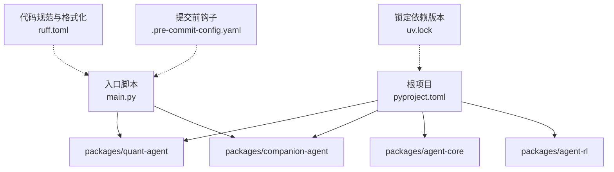
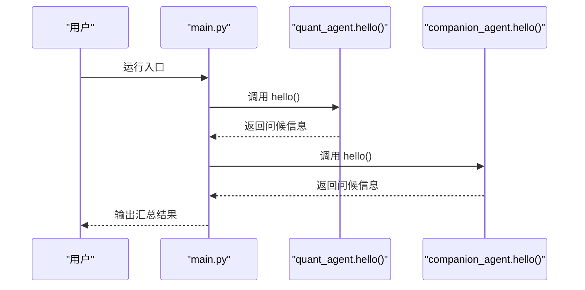
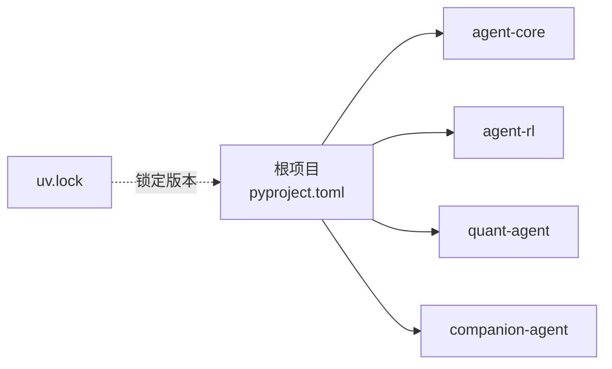

# 调试与故障排除

<cite>
**本文引用的文件**   
- [main.py](file://main.py)
- [pyproject.toml](file://pyproject.toml)
- [ruff.toml](file://ruff.toml)
- [.pre-commit-config.yaml](file://.pre-commit-config.yaml)
- [uv.lock](file://uv.lock)
- [systematic-debugging/SKILL.md](file://.agent/skills/systematic-debugging/SKILL.md)
</cite>

## 目录
1. [简介](#简介)
2. [项目结构](#项目结构)
3. [核心组件](#核心组件)
4. [架构总览](#架构总览)
5. [详细组件分析](#详细组件分析)
6. [依赖关系分析](#依赖关系分析)
7. [性能考虑](#性能考虑)
8. [故障排除指南](#故障排除指南)
9. [结论](#结论)
10. [附录](#附录)

## 简介
本指南面向 JanusAgent 项目的开发者与维护者，提供系统化的调试技巧与故障排除方法。内容覆盖日志收集与分析、性能分析（CPU/内存/瓶颈定位）、常见错误模式与解决方案、调试工具链配置（IDE 与远程调试），以及系统监控与健康检查建议。文档同时结合仓库中的工程化配置（Ruff、pre-commit、uv）与技能文档中的系统化调试流程，帮助快速定位并解决问题。

## 项目结构
JanusAgent 采用 uv workspace 管理多包：根项目通过 pyproject.toml 声明依赖，指向 packages/* 下的子包；入口 main.py 负责初始化并调用各子包的 hello 能力。开发质量由 ruff 与 pre-commit 保障。

图表来源
- [pyproject.toml:1-30](file://pyproject.toml#L1-L30)
- [main.py:1-13](file://main.py#L1-L13)
- [ruff.toml:1-70](file://ruff.toml#L1-L70)
- [.pre-commit-config.yaml:1-18](file://.pre-commit-config.yaml#L1-L18)
- [uv.lock:4366-4384](file://uv.lock#L4366-L4384)

章节来源
- [pyproject.toml:1-30](file://pyproject.toml#L1-L30)
- [main.py:1-13](file://main.py#L1-L13)
- [ruff.toml:1-70](file://ruff.toml#L1-L70)
- [.pre-commit-config.yaml:1-18](file://.pre-commit-config.yaml#L1-L18)
- [uv.lock:4366-4384](file://uv.lock#L4366-L4384)

## 核心组件
- 应用入口 main.py：打印启动信息并调用子模块的 hello 函数，用于快速验证环境是否就绪。
- 工作区与依赖：pyproject.toml 定义项目元数据、Python 版本要求与工作区成员；uv.lock 锁定第三方包版本。
- 代码质量与格式化：ruff.toml 统一风格与规则集；.pre-commit-config.yaml 在提交前自动执行 uv-lock、ruff-check、ruff-format。

章节来源
- [main.py:1-13](file://main.py#L1-L13)
- [pyproject.toml:1-30](file://pyproject.toml#L1-L30)
- [ruff.toml:1-70](file://ruff.toml#L1-L70)
- [.pre-commit-config.yaml:1-18](file://.pre-commit-config.yaml#L1-L18)
- [uv.lock:4366-4384](file://uv.lock#L4366-L4384)

## 架构总览
从运行期视角看，程序启动后加载工作区依赖，依次调用 quant-agent 与 companion-agent 的 hello 能力。该路径适合做最小化的健康检查与可观测性埋点。

图表来源
- [main.py:1-13](file://main.py#L1-L13)

## 详细组件分析

### 入口与启动流程
- 职责：初始化并触发子模块能力，便于快速验证依赖与环境。
- 可观测性建议：在调用前后记录时间戳与异常，便于判断哪个子模块失败。
- 常见问题：子模块未安装或版本不兼容导致导入失败；环境变量缺失导致运行时异常。

章节来源
- [main.py:1-13](file://main.py#L1-L13)

### 代码质量与格式化（Ruff + Pre-commit）
- Ruff 规则集包含 LOG、TRY、PERF、S 等，有助于提前发现日志格式、异常处理、性能与安全相关问题。
- Pre-commit 钩子在提交前执行 uv-lock、ruff-check、ruff-format，保证一致性。
- 建议：将关键诊断信息以结构化方式记录，避免使用 f-string 拼接日志消息（受 G004 约束）。

章节来源
- [ruff.toml:1-70](file://ruff.toml#L1-L70)
- [.pre-commit-config.yaml:1-18](file://.pre-commit-config.yaml#L1-L18)

### 依赖管理与锁定（uv）
- pyproject.toml 声明工作区成员与依赖；uv.lock 锁定具体版本，确保可重现构建。
- 依赖 python-dotenv 与 python-json-logger，可用于加载 .env 与输出 JSON 结构化日志。

章节来源
- [pyproject.toml:1-30](file://pyproject.toml#L1-L30)
- [uv.lock:4366-4384](file://uv.lock#L4366-L4384)

### 系统化调试方法论
- 根因调查四步法：仔细阅读错误信息、稳定复现、检查最近变更、在多组件边界采集证据。
- 分层取证：在每个组件边界记录输入/输出、环境与配置传播、状态快照，先定位“哪里断”，再深入“为什么”。
- 数据流回溯：从错误值向上追溯源头，在源头修复而非症状处打补丁。

章节来源
- [systematic-debugging/SKILL.md:50-120](file://.agent/skills/systematic-debugging/SKILL.md#L50-L120)

## 依赖关系分析
- 直接依赖：根项目依赖 agent-core、agent-rl、quant-agent、companion-agent。
- 间接依赖：python-dotenv、python-json-logger 等工具库被 uv.lock 锁定。
- 风险点：版本冲突、导入顺序、平台差异（如 Windows/macOS/Linux）。

图表来源
- [pyproject.toml:1-30](file://pyproject.toml#L1-L30)
- [uv.lock:4366-4384](file://uv.lock#L4366-L4384)

章节来源
- [pyproject.toml:1-30](file://pyproject.toml#L1-L30)
- [uv.lock:4366-4384](file://uv.lock#L4366-L4384)

## 性能考虑
- CPU 分析：优先在热点路径（如量化计算、RL 训练循环）插入轻量计时点，结合 cProfile/py-spy 进行采样。
- 内存泄漏检测：关注长生命周期对象、缓存、事件监听器；使用 tracemalloc/memory_profiler 对比峰值与增长趋势。
- 瓶颈识别：I/O 密集（网络/磁盘）与计算密集分离；对慢查询与外部调用增加超时与重试策略，避免阻塞主流程。
- 日志开销：生产环境降低日志级别，避免频繁写入大对象；使用异步队列缓冲日志。

[本节为通用指导，无需源码引用]

## 故障排除指南

### 日志收集与分析
- 日志级别与场景
  - DEBUG：仅本地开发启用，记录参数、中间态与上下文。
  - INFO：关键路径与业务里程碑，便于追踪正常流程。
  - WARNING：可恢复异常与降级行为。
  - ERROR：不可恢复错误，附带堆栈与请求标识。
  - CRITICAL：进程级致命错误，需立即告警。
- 日志格式标准化
  - 结构化输出：使用 json 格式（借助 python-json-logger），字段包括时间戳、级别、模块、消息、trace_id、span_id、耗时等。
  - 敏感信息脱敏：避免输出密钥、令牌、个人信息。
  - 统一时区与精度：UTC 时间，毫秒级精度。
- 采集与聚合
  - 本地：stdout/stderr 重定向到文件；配合 tail/watch 实时查看。
  - 集中式：推送至日志系统（如 ELK/Loki），按服务/模块/trace_id 索引。
- 关联分析
  - 使用 trace_id 串联跨模块调用；在入口与边界处注入并透传。
  - 结合指标（QPS、延迟、错误率）与日志联合排查。

章节来源
- [uv.lock:4366-4384](file://uv.lock#L4366-L4384)

### 性能分析与瓶颈定位
- CPU 分析
  - 使用 cProfile 生成统计报告，定位热点函数。
  - 使用 py-spy 对运行中进程进行采样，减少侵入式改动。
- 内存分析
  - 使用 tracemalloc 捕获分配轨迹，定位持续增长的对象。
  - 使用 memory_profiler 逐行分析函数内存占用。
- 瓶颈识别
  - 区分 CPU/IO 瓶颈：观察等待时间与锁竞争。
  - 外部依赖：对 API/DB 调用增加超时、重试与熔断，避免雪崩。
- 优化建议
  - 批量操作替代逐条处理；惰性加载与分页；缓存热点数据；异步化非关键路径。

[本节为通用指导，无需源码引用]

### 常见错误模式与解决方案
- 依赖冲突
  - 现象：导入失败、版本不兼容、API 变更。
  - 解决：核对 uv.lock 与实际环境；必要时升级/降级依赖；隔离虚拟环境。
- 配置错误
  - 现象：环境变量缺失、路径错误、权限不足。
  - 解决：启动前校验必需变量；提供默认值与清晰错误提示；在 CI 中模拟生产环境。
- 运行时异常
  - 现象：空指针、类型错误、资源未释放。
  - 解决：完善异常处理与上下文日志；使用 try/except 捕获并记录；及时关闭资源。
- 多组件边界问题
  - 现象：上游成功下游失败、配置未传递。
  - 解决：在边界处记录入参/出参与环境状态，逐步缩小范围。

章节来源
- [systematic-debugging/SKILL.md:50-120](file://.agent/skills/systematic-debugging/SKILL.md#L50-L120)

### 调试工具链配置与使用
- IDE 调试器
  - VS Code：创建 launch.json，设置 Python 解释器、工作目录、环境变量与断点；支持热重载与条件断点。
  - PyCharm：配置 Run/Debug Configuration，指定模块与参数；使用 Remote Debug 连接远端。
- 远程调试
  - 使用 debugpy 在目标进程附加调试器；注意端口开放与安全访问控制。
  - 在生产环境谨慎开启，限制来源 IP 与鉴权。
- 预提交与规范
  - 利用 pre-commit 钩子自动执行 uv-lock、ruff-check、ruff-format，减少低级问题进入主干。

章节来源
- [.pre-commit-config.yaml:1-18](file://.pre-commit-config.yaml#L1-L18)
- [ruff.toml:1-70](file://ruff.toml#L1-L70)

### 系统监控与健康检查
- 健康检查端点
  - /health：返回服务存活与基础依赖连通性（数据库、外部 API）。
  - /ready：业务就绪度（模型加载、缓存预热完成）。
- 指标上报
  - 暴露 Prometheus 指标：请求数、延迟分位、错误率、GC 次数、内存使用。
- 告警策略
  - 基于阈值与趋势：错误率突增、P99 延迟升高、内存持续增长。
- 可观测性三支柱
  - 日志：结构化、可检索、带 trace_id。
  - 指标：关键业务与系统指标。
  - 链路：分布式追踪，端到端耗时可视化。

[本节为通用指导，无需源码引用]

## 结论
通过标准化的日志体系、完善的性能分析手段、严格的代码质量门禁与系统化的调试方法论，可以显著提升 JanusAgent 的可维护性与稳定性。建议在入口与组件边界强化可观测性埋点，结合 uv 的依赖锁定与 pre-commit 的质量保障，形成从开发到运行的闭环。

[本节为总结性内容，无需源码引用]

## 附录

### 快速排障清单
- 确认依赖与环境：uv.lock 与虚拟环境一致；必要环境变量存在且有效。
- 复现与收敛：稳定复现步骤；在组件边界记录入参/出参与状态。
- 日志与指标：打开合适日志级别；收集 trace_id 与关键指标。
- 性能剖析：cProfile/py-spy 定位 CPU 热点；tracemalloc/memory_profiler 定位内存问题。
- 回归与验证：修复后补充测试用例；在类生产环境验证。

[本节为通用指导，无需源码引用]