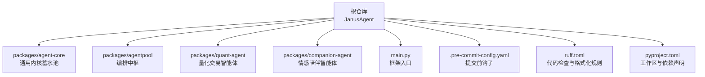
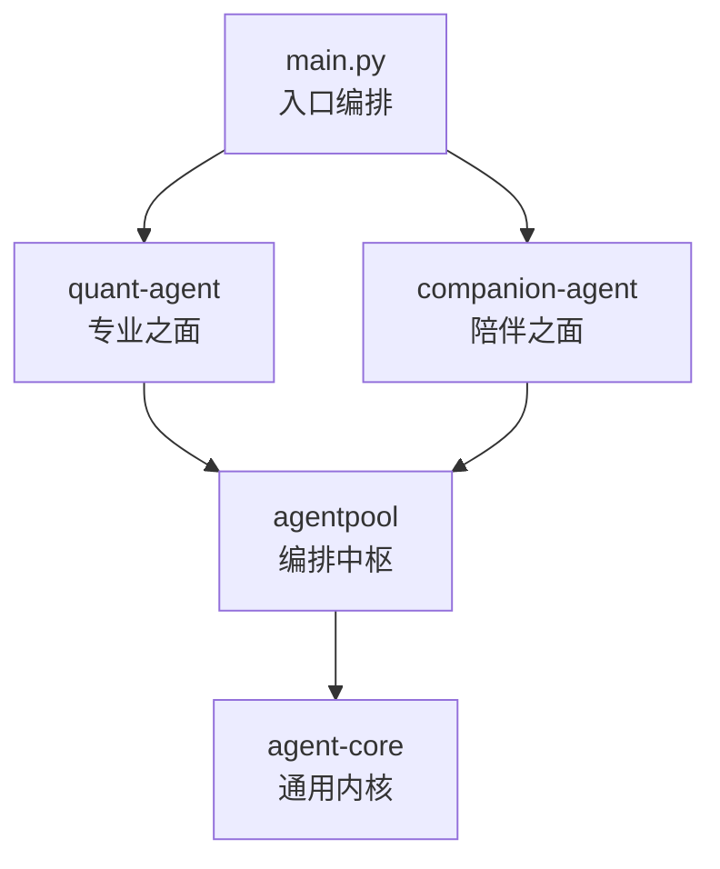
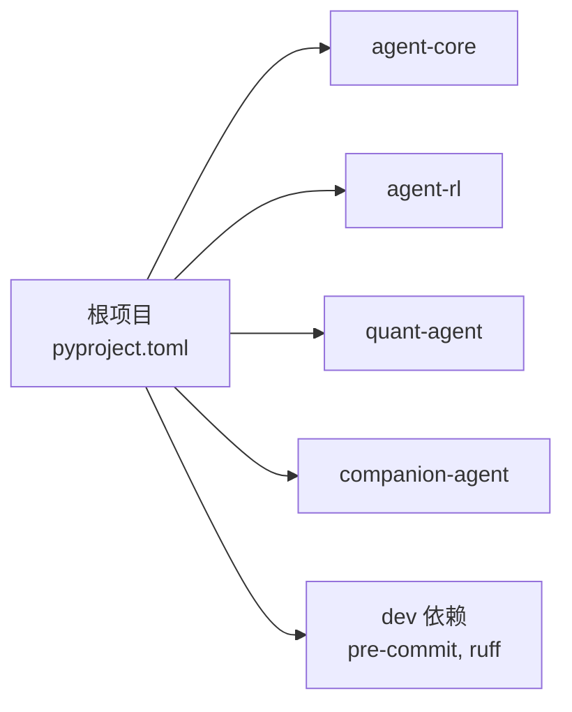
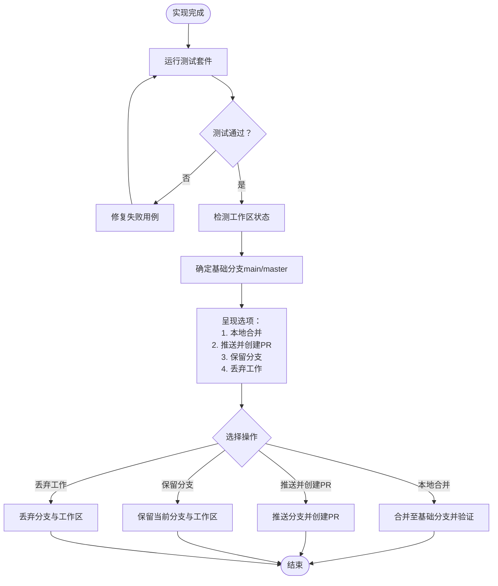
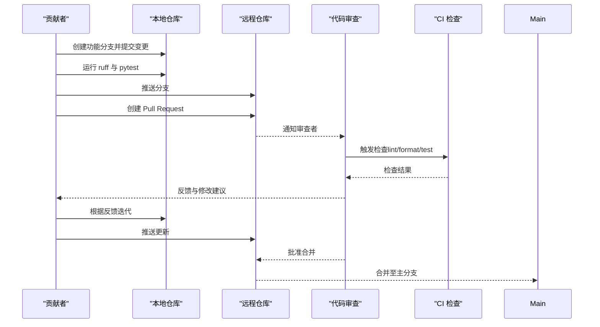
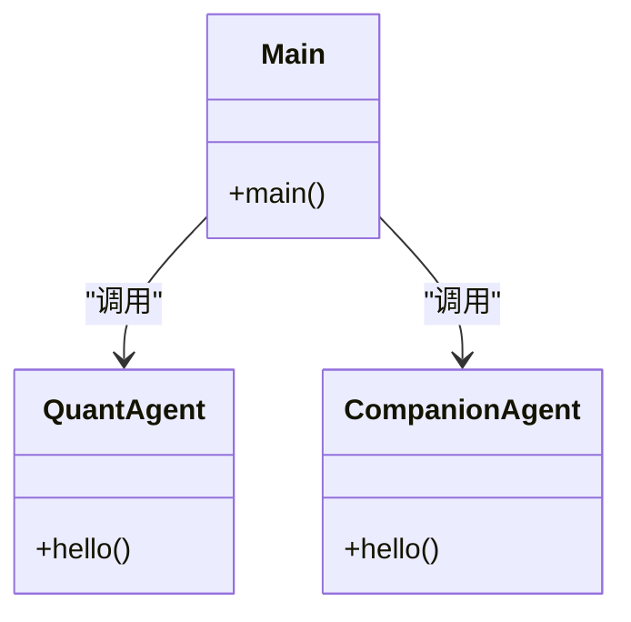

# 贡献者工作流程

<cite>
**本文引用的文件**
- [README.md](file://README.md)
- [pyproject.toml](file://pyproject.toml)
- [.pre-commit-config.yaml](file://.pre-commit-config.yaml)
- [ruff.toml](file://ruff.toml)
- [main.py](file://main.py)
- [docs/plans/roadmap.md](file://docs/plans/roadmap.md)
- [docs/plans/todolist.md](file://docs/plans/todolist.md)
- [.agent\rules\git.md](file://.agent\rules\git.md)
- [.agent\skills\executing-plans\SKILL.md](file://.agent\skills\executing-plans\SKILL.md)
- [.agent\skills\finishing-a-development-branch\SKILL.md](file://.agent\skills\finishing-a-development-branch\SKILL.md)
- [.gitignore](file://.gitignore)
</cite>

## 目录
1. [简介](#简介)
2. [项目结构](#项目结构)
3. [核心组件](#核心组件)
4. [架构总览](#架构总览)
5. [详细组件分析](#详细组件分析)
6. [依赖分析](#依赖分析)
7. [性能考虑](#性能考虑)
8. [故障排查指南](#故障排查指南)
9. [结论](#结论)
10. [附录](#附录)

## 简介
本文件面向所有贡献者，定义清晰的工作流程与规范，涵盖 Git 分支管理、Pull Request 创建与审查、Issue 处理、发布流程、路线图与未来规划，以及新贡献者入门与社区参与方式。目标是让每位贡献者都能高效、安全地协作，并理解项目的长期发展方向。

## 项目结构
仓库采用多包工作区组织，根配置使用 uv workspace，子包位于 packages 目录下；工程化方面通过 pre-commit 与 ruff 统一代码质量；入口脚本 main.py 负责编排各子包能力。

图表来源
- [README.md:39-84](file://README.md#L39-L84)
- [pyproject.toml:14-17](file://pyproject.toml#L14-L17)
- [.pre-commit-config.yaml:1-18](file://.pre-commit-config.yaml#L1-L18)
- [ruff.toml:1-70](file://ruff.toml#L1-L70)
- [main.py:1-13](file://main.py#L1-L13)

章节来源
- [README.md:39-84](file://README.md#L39-L84)
- [pyproject.toml:1-30](file://pyproject.toml#L1-L30)
- [.pre-commit-config.yaml:1-18](file://.pre-commit-config.yaml#L1-L18)
- [ruff.toml:1-70](file://ruff.toml#L1-L70)
- [main.py:1-13](file://main.py#L1-L13)

## 核心组件
- 工作区与依赖：uv workspace 管理多包依赖，开发依赖包含 pre-commit 与 ruff。
- 代码质量：ruff 提供 lint 与 format，pre-commit 在提交时自动执行。
- 运行入口：main.py 作为框架编排器，调用子包能力。

章节来源
- [pyproject.toml:19-23](file://pyproject.toml#L19-L23)
- [.pre-commit-config.yaml:1-18](file://.pre-commit-config.yaml#L1-L18)
- [ruff.toml:1-70](file://ruff.toml#L1-L70)
- [main.py:1-13](file://main.py#L1-L13)

## 架构总览
下图展示从入口到子包的调用关系，体现“编排中枢 + 双面孔”的架构思想。

图表来源
- [main.py:1-13](file://main.py#L1-L13)
- [README.md:61-84](file://README.md#L61-L84)

## 详细组件分析

### Git 分支管理与命名约定
- 主分支策略
  - main：稳定可发布的版本分支，受保护，禁止直接推送。
- 功能分支
  - feat/<简短描述>：新增功能。
  - fix/<简短描述>：修复缺陷。
  - 其他类型参考常规提交类型（见下文）。
- 分支生命周期
  - 短小聚焦，尽快合并，避免长驻分支。
- 提交信息规范
  - 遵循 Conventional Commits 格式，类型包括 feat、fix、refactor、test、docs、chore、style 等。
  - 首行不超过 72 字符，使用祈使语气，正文解释动机而非重复 diff。
- 提交前检查
  - 必须通过 ruff check、ruff format、pytest，且仅暂存预期变更。
- 禁止行为
  - 禁止无明确授权修改 main/master；禁止强制推送；禁止提交密钥或 .env 文件；不要跳过 hooks。

章节来源
- [.agent\rules\git.md:7-56](file://.agent\rules\git.md#L7-L56)

### Pull Request 创建与审查流程
- 何时创建 PR
  - 本地实现完成、测试通过后，选择“推送并创建 PR”。
- 基础分支识别
  - 默认以 main 为基线；若基于 master，需显式确认。
- 审查清单（建议项）
  - 是否通过全部测试与代码检查。
  - 是否符合分支与提交规范。
  - 变更范围是否聚焦，是否影响无关模块。
  - 是否更新相关文档与示例。
  - 是否存在安全风险（如密钥泄露）。
- 合并标准
  - 至少一名维护者批准。
  - CI 全绿（lint/format/test）。
  - 无未决评论或已解决。
  - 符合里程碑目标与北极星指标要求。

章节来源
- [.agent\skills\finishing-a-development-branch\SKILL.md:66-128](file://.agent\skills\finishing-a-development-branch\SKILL.md#L66-L128)
- [.agent\rules\git.md:39-56](file://.agent\rules\git.md#L39-L56)

### Issue 报告与功能请求处理流程
- 问题分类
  - Bug 报告：复现步骤、环境信息、期望与实际结果。
  - 功能请求：背景、价值、验收标准、优先级。
- 处理流程
  - 新建 Issue → 标注优先级（P0/P1/P2）→ 指派负责人 → 关联分支与 PR → 评审与合并 → 回归验证。
- 与任务清单联动
  - 将高优需求拆解入 todolist，按周/天粒度推进，定期复盘。

章节来源
- [docs/plans/todolist.md:1-10](file://docs/plans/todolist.md#L1-L10)
- [docs/plans/todolist.md:93-98](file://docs/plans/todolist.md#L93-L98)

### 发布流程（Milestone 驱动）
- 里程碑导向
  - 以 roadmap 中的里程碑（M0~M4）为目标，每个里程碑有退出标准与指标验证。
- 发布节奏
  - 每 2~4 周对照北极星指标做一次 check；达到退出标准后打标签并发布。
- 风险控制
  - 严格模拟盘与风险红线；不接实盘；密钥不进仓库。

章节来源
- [docs/plans/roadmap.md:91-134](file://docs/plans/roadmap.md#L91-L134)
- [docs/plans/roadmap.md:180-191](file://docs/plans/roadmap.md#L180-L191)
- [docs/plans/todolist.md:93-98](file://docs/plans/todolist.md#L93-L98)

### 新贡献者入门指导
- 环境准备
  - Python 3.12+，安装 uv，同步依赖。
- 快速开始
  - 启动框架、运行代码检查与格式化、执行测试。
- 开发习惯
  - 使用 feature/fix 分支；遵循提交规范；提交前自检。
- 学习路径
  - 先通读 agentpool 与 YAML 配置，再扩展 quant-agent 或 companion-agent。

章节来源
- [README.md:95-124](file://README.md#L95-L124)
- [docs/plans/todolist.md:11-16](file://docs/plans/todolist.md#L11-L16)

### 社区参与方式
- 讨论与反馈
  - 通过 Issue 提出想法与问题，参与讨论与评审。
- 贡献代码
  - Fork → 分支开发 → PR → 评审 → 合并。
- 文档与知识沉淀
  - 完善 README、docs 与计划文档，保持与路线图一致。

章节来源
- [README.md:1-26](file://README.md#L1-L26)
- [docs/plans/roadmap.md:1-21](file://docs/plans/roadmap.md#L1-L21)

## 依赖分析
- 工作区成员
  - packages/* 下的子包由 uv workspace 统一管理。
- 开发依赖
  - pre-commit、ruff 用于提交前检查与格式化。
- 运行时依赖
  - 根项目依赖 agent-core、agent-rl、quant-agent、companion-agent。

图表来源
- [pyproject.toml:1-30](file://pyproject.toml#L1-L30)

章节来源
- [pyproject.toml:1-30](file://pyproject.toml#L1-L30)

## 性能考虑
- 代码质量先行
  - 使用 ruff 进行静态检查与格式化，减少潜在性能陷阱与风格不一致带来的维护成本。
- 依赖锁定
  - uv.lock 确保可重现构建，避免依赖漂移导致的性能波动。
- 模块化与解耦
  - 通过 agent-core 抽象与 agentpool 编排，降低耦合度，便于局部优化与替换。

[本节为通用指导，无需特定文件引用]

## 故障排查指南
- 提交失败
  - 检查 pre-commit 钩子是否启用；确认 ruff 与 pytest 通过。
- 环境问题
  - 确认 Python 版本与环境隔离；清理缓存目录（如 .ruff_cache、__pycache__）。
- 密钥泄露
  - 严禁提交 .env 或密钥；必要时立即轮换密钥并清理历史。

章节来源
- [.pre-commit-config.yaml:1-18](file://.pre-commit-config.yaml#L1-L18)
- [ruff.toml:1-70](file://ruff.toml#L1-L70)
- [.gitignore:150-158](file://.gitignore#L150-L158)

## 结论
通过统一的分支策略、严格的提交前检查、清晰的 PR 审查与里程碑驱动的发布流程，本项目能够在保证质量的同时持续演进。贡献者应围绕北极星指标与路线图开展工作，逐步沉淀通用内核与领域能力，最终走向具身智能方向。

[本节为总结性内容，无需特定文件引用]

## 附录

### 流程图：完成开发分支后的集成决策

图表来源
- [.agent\skills\finishing-a-development-branch\SKILL.md:18-134](file://.agent\skills\finishing-a-development-branch\SKILL.md#L18-L134)

### 序列图：一次典型 PR 流程

图表来源
- [.agent\skills\finishing-a-development-branch\SKILL.md:66-128](file://.agent\skills\finishing-a-development-branch\SKILL.md#L66-L128)
- [.agent\rules\git.md:39-56](file://.agent\rules\git.md#L39-L56)

### 类图：入口与子包关系

图表来源
- [main.py:1-13](file://main.py#L1-L13)