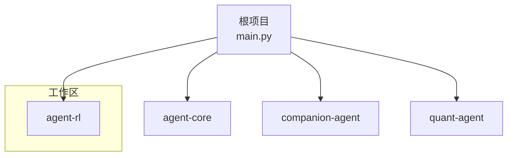
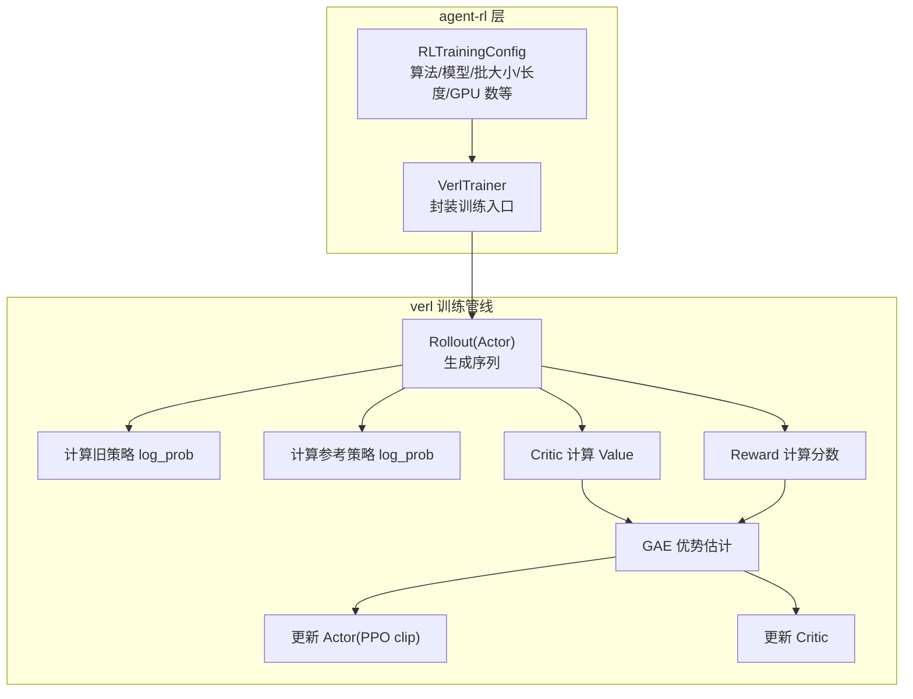
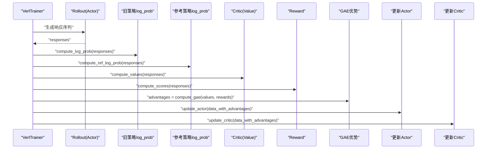
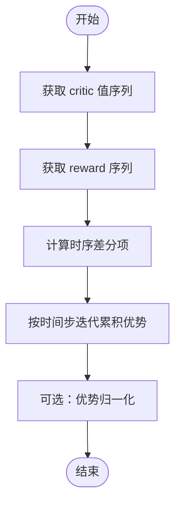
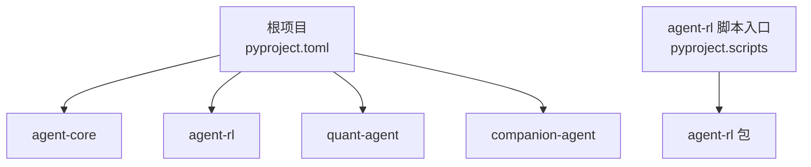

# RL 算法实现

<cite>
**本文引用的文件**   
- [main.py](file://main.py)
- [pyproject.toml](file://pyproject.toml)
- [uv.lock](file://uv.lock)
- [README.md](file://README.md)
- [agent-rl 包入口 __init__.py](file://packages/agent-rl/src/agent_rl/__init__.py)
- [agent-rl 包配置 pyproject.toml](file://packages/agent-rl/pyproject.toml)
- [verl 学习路线与 PPO 训练流程文档](file://docs/plans/verl-learning-plan.md)
</cite>

## 目录
1. [引言](#引言)
2. [项目结构](#项目结构)
3. [核心组件](#核心组件)
4. [架构总览](#架构总览)
5. [详细组件分析](#详细组件分析)
6. [依赖分析](#依赖分析)
7. [性能考虑](#性能考虑)
8. [故障排查指南](#故障排查指南)
9. [结论](#结论)
10. [附录](#附录)

## 引言
本技术文档面向强化学习（RL）算法在智能体框架中的落地，重点覆盖 Q-Learning、Policy Gradient（策略梯度）、Actor-Critic（演员-评论家）及其变体（如 PPO、GRPO）的原理、收敛条件、适用场景与工程化实践。结合仓库中“agent-rl”子包与 verl 学习路线文档，给出从环境交互、策略优化、奖励建模到模型部署的端到端说明，并提供参数调优指导与性能对比建议。

## 项目结构
仓库采用 uv workspace 多包组织，根项目通过 main.py 编排各子能力；agent-rl 作为“自主学习之面”，负责与环境交互、策略优化、奖励建模与模型部署等 RL 相关能力。当前 agent-rl 包处于早期阶段，提供包入口与脚本注册，后续将基于 verl 的训练管线集成 PPO/GRPO 等算法。

图表来源
- [main.py:1-13](file://main.py#L1-L13)
- [pyproject.toml:1-30](file://pyproject.toml#L1-L30)

章节来源
- [README.md:39-94](file://README.md#L39-L94)
- [pyproject.toml:1-30](file://pyproject.toml#L1-L30)
- [main.py:1-13](file://main.py#L1-L13)

## 核心组件
- agent-rl 包入口：提供版本信息与命令行入口，用于后续扩展 RL 训练与推理逻辑。
- verl 学习路线文档：定义 PPO 训练循环的关键步骤（Rollout、计算旧策略 log_prob、参考策略 log_prob、Critic 值估计、Reward 计算、GAE 优势估计、Actor/Critic 更新），并给出 GRPO/DAPO 的学习路径与常见问题。

章节来源
- [agent-rl 包入口 __init__.py:1-14](file://packages/agent-rl/src/agent_rl/__init__.py#L1-L14)
- [verl 学习路线与 PPO 训练流程文档:283-311](file://docs/plans/verl-learning-plan.md#L283-L311)
- [verl 学习路线与 PPO 训练流程文档:452-489](file://docs/plans/verl-learning-plan.md#L452-L489)

## 架构总览
下图展示 agent-rl 与 verl 训练管线的概念性集成关系：上层封装训练配置与数据流，底层调用 Actor/Rollout/Reference/Critic/Reward 等工作组完成一次 PPO 迭代。

图表来源
- [verl 学习路线与 PPO 训练流程文档:283-311](file://docs/plans/verl-learning-plan.md#L283-L311)
- [verl 学习路线与 PPO 训练流程文档:452-489](file://docs/plans/verl-learning-plan.md#L452-L489)

## 详细组件分析

### Q-Learning
- 数学基础
  - 目标函数为最大化累积回报，使用贝尔曼最优方程更新 Q(s,a)。
  - 常用 ε-greedy 探索，折扣因子 γ∈[0,1]。
- 收敛条件
  - 状态-动作空间有限或可离散化；满足标准随机逼近条件（学习率衰减、充分探索）。
- 适用场景
  - 离散动作空间、中小规模状态空间；离线/在线均可。
- 工程要点
  - 经验回放与优先采样可提升稳定性；目标网络可加速收敛。
- 代码示例路径
  - 可在 agent-rl 中新增 q_learning.py，实现环境交互、Q 表/函数近似、ε-greedy 选择与 TD 更新。

章节来源
- [agent-rl 包入口 __init__.py:1-14](file://packages/agent-rl/src/agent_rl/__init__.py#L1-L14)

### Policy Gradient（策略梯度）
- 数学基础
  - 直接对策略参数求梯度，使期望回报最大；常见 REINFORCE 算法。
- 收敛条件
  - 策略参数化需足够表达力；方差控制是关键（基线、GAE）。
- 适用场景
  - 连续/高维动作空间；需要稳定探索的策略优化。
- 工程要点
  - 引入基线降低方差；使用归一化优势与裁剪提高稳定性。
- 代码示例路径
  - 可在 agent-rl 中新增 policy_gradient.py，实现策略网络前向、采样轨迹、计算回报与梯度更新。

章节来源
- [agent-rl 包入口 __init__.py:1-14](file://packages/agent-rl/src/agent_rl/__init__.py#L1-L14)

### Actor-Critic（含 PPO/GRPO）
- 数学基础
  - Actor 输出策略，Critic 估计价值；优势函数 A(s,a)=R+γV(s')−V(s)。
  - PPO 通过裁剪目标限制步长，避免策略剧烈变化。
  - GRPO/DAPO 为更现代的变体，强调分组/分布式优化与稳定性。
- 收敛条件
  - 合理的学习率、KL 约束、GAE 超参；保证探索与利用平衡。
- 适用场景
  - 大模型对齐、文本生成、复杂决策任务；需要稳定且高效的在线/离线混合训练。
- 工程要点
  - Rollout 与推理并行；微批次与张量并行优化显存；记录日志与验证集评估。
- 代码示例路径
  - 参考 verl 学习路线文档中的 PPO 训练循环与 VerlTrainer 封装思路，在 agent-rl 中实现 trainer.py 与 rewards/ 模块。

章节来源
- [verl 学习路线与 PPO 训练流程文档:283-311](file://docs/plans/verl-learning-plan.md#L283-L311)
- [verl 学习路线与 PPO 训练流程文档:452-489](file://docs/plans/verl-learning-plan.md#L452-L489)

#### PPO 训练流程（序列图）

图表来源
- [verl 学习路线与 PPO 训练流程文档:283-311](file://docs/plans/verl-learning-plan.md#L283-L311)

#### 优势估计流程（流程图）

图表来源
- [verl 学习路线与 PPO 训练流程文档:283-311](file://docs/plans/verl-learning-plan.md#L283-L311)

### 算法间转换与组合
- 从 Q-Learning 到 Actor-Critic
  - 当动作空间变大或连续时，用神经网络近似 Q 或策略；引入 Critic 降低方差。
- 从 Policy Gradient 到 PPO
  - 引入裁剪目标与 KL 约束，限制策略更新幅度，提升稳定性。
- 组合方式
  - 离线预训练 + 在线微调：先用行为克隆或离线 RL 初始化策略，再用 PPO/GRPO 在线优化。
  - 多目标奖励：规则奖励与学习到的奖励模型融合，提升泛化。

章节来源
- [verl 学习路线与 PPO 训练流程文档:283-311](file://docs/plans/verl-learning-plan.md#L283-L311)
- [verl 学习路线与 PPO 训练流程文档:452-489](file://docs/plans/verl-learning-plan.md#L452-L489)

## 依赖分析
- 根项目依赖 agent-rl 与其他子包，agent-rl 提供命令行入口脚本。
- uv.lock 显示 agent-rl 为本地可编辑依赖，便于开发与调试。

图表来源
- [pyproject.toml:1-30](file://pyproject.toml#L1-L30)
- [agent-rl 包配置 pyproject.toml:1-17](file://packages/agent-rl/pyproject.toml#L1-L17)
- [uv.lock:2158-2195](file://uv.lock#L2158-L2195)

章节来源
- [pyproject.toml:1-30](file://pyproject.toml#L1-L30)
- [uv.lock:2158-2195](file://uv.lock#L2158-L2195)
- [agent-rl 包配置 pyproject.toml:1-17](file://packages/agent-rl/pyproject.toml#L1-L17)

## 性能考虑
- 显存与吞吐
  - 使用小模型（如 0.5B）与较低 gpu_memory_utilization 缓解单卡压力；配合 LoRA RL 进一步降本。
- 批大小与微批次
  - 调整 ppo_micro_batch_size_per_gpu 与 ppo_mini_batch_size 以平衡稳定性与速度。
- 学习率与 KL 系数
  - 学习率过高易导致 NaN loss；建议 lr ≤ 1e-5，并根据 KL 系数动态调整。
- 日志与监控
  - 开启 console/wandb 日志，跟踪训练曲线与验证指标，及时定位问题。

章节来源
- [verl 学习路线与 PPO 训练流程文档:151-189](file://docs/plans/verl-learning-plan.md#L151-L189)
- [verl 学习路线与 PPO 训练流程文档:507-512](file://docs/plans/verl-learning-plan.md#L507-L512)

## 故障排查指南
- 单卡 GPU 内存不足
  - 降低 micro batch size 与 gpu_memory_utilization，或使用 LoRA RL。
- 训练出现 NaN loss
  - 检查学习率是否过高；检查 KL 系数是否合适；必要时减小 rollout 长度或批量。
- 训练不稳定
  - 调整 GAE 超参（gamma、lam）；增加 KL 惩罚；缩短策略更新步长。

章节来源
- [verl 学习路线与 PPO 训练流程文档:507-512](file://docs/plans/verl-learning-plan.md#L507-L512)

## 结论
本项目已具备 agent-rl 的基础骨架与 verl 训练路线文档，可作为 PPO/GRPO 等现代 RLHF 算法的工程化起点。建议在 agent-rl 中逐步实现 trainer.py 与 rewards/ 模块，结合 verl 的 PPO 训练循环进行集成与调优。同时，针对 Q-Learning 与 Policy Gradient 的经典实现可作为教学与基准对照，帮助理解从表格方法到深度策略优化的演进路径。

## 附录
- 快速开始
  - 安装依赖与运行框架请参考 README 中的命令。
- 开发栈
  - Python 3.12+、uv workspace、ruff、pytest 等。

章节来源
- [README.md:95-124](file://README.md#L95-L124)