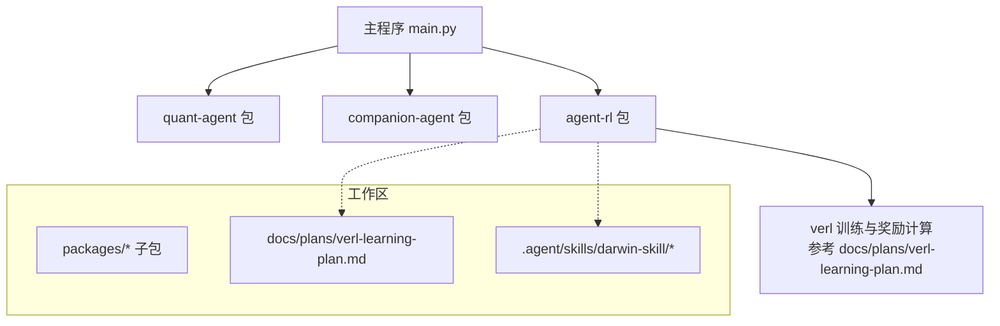
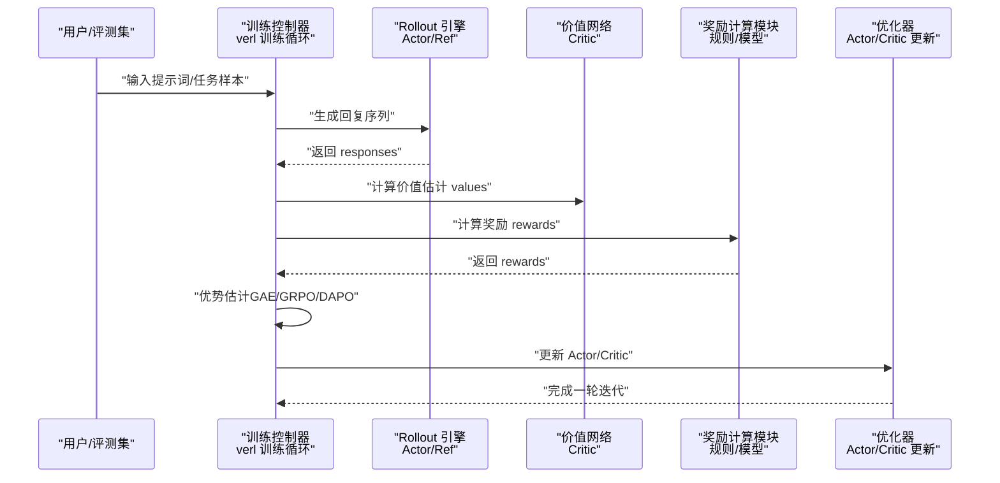
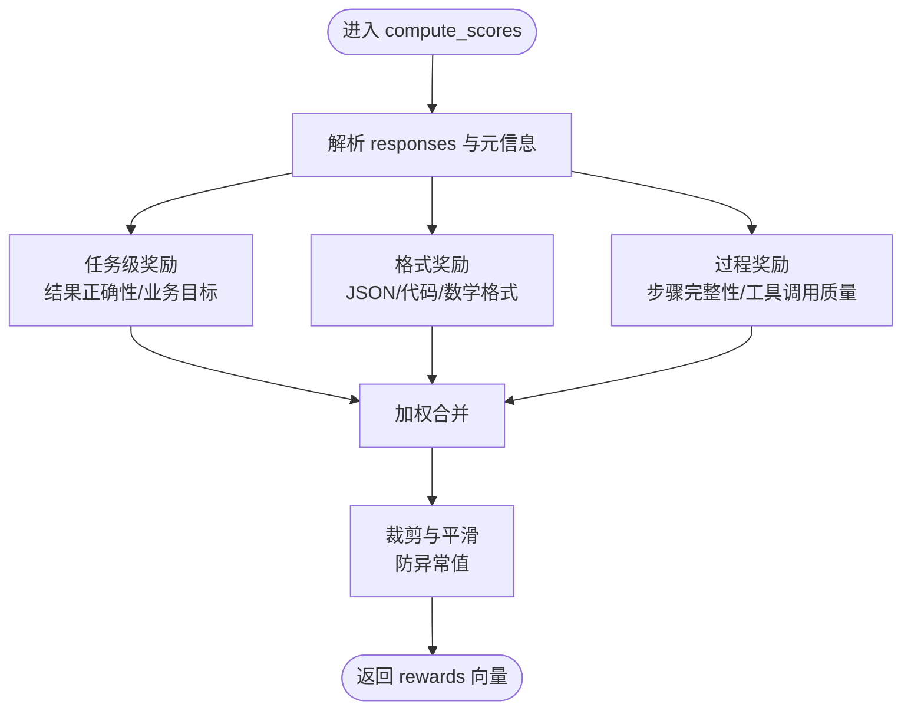
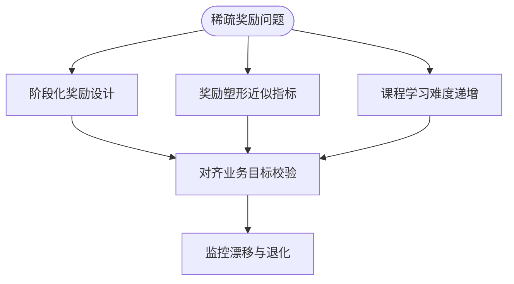
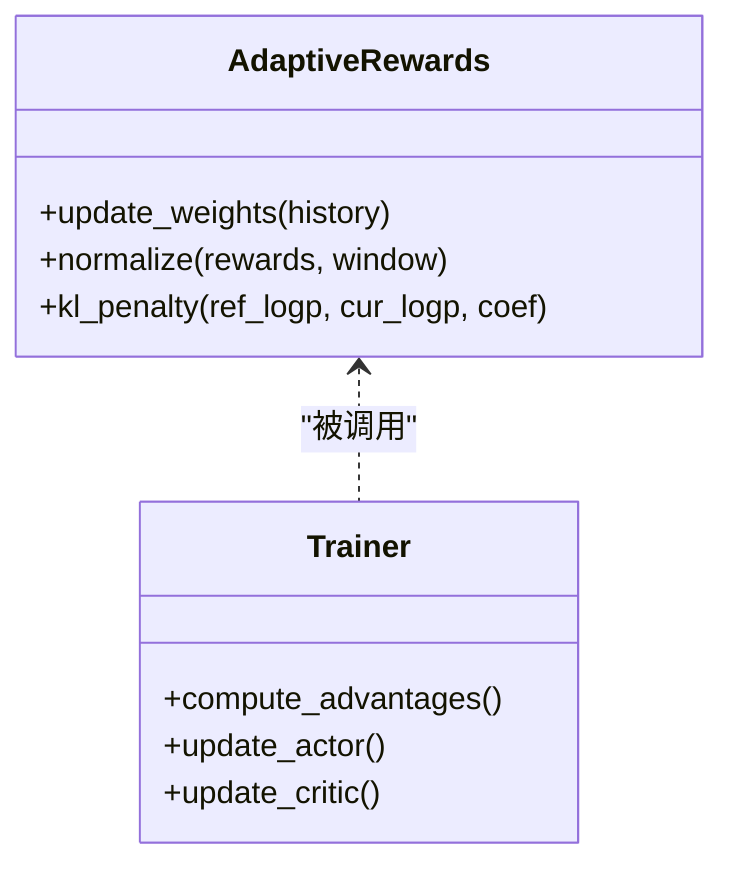
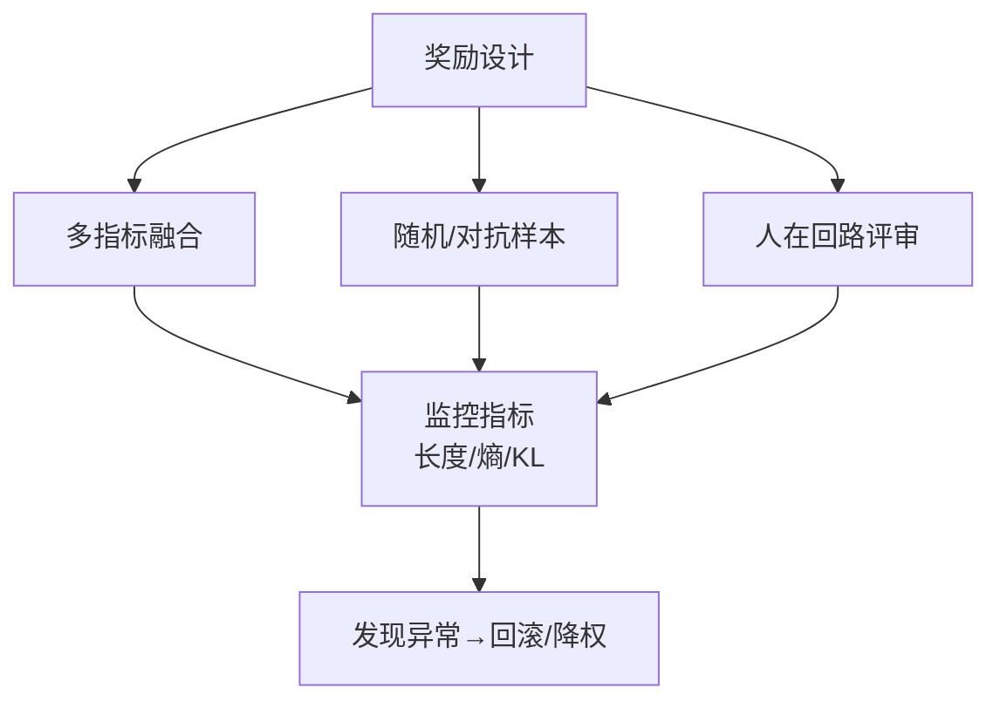
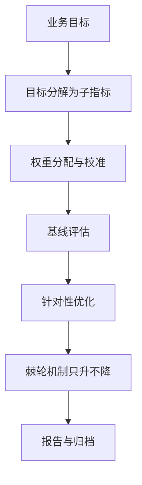
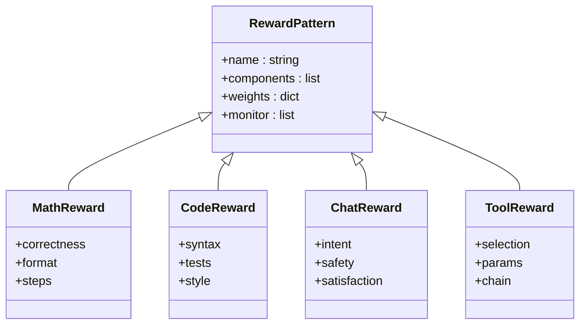
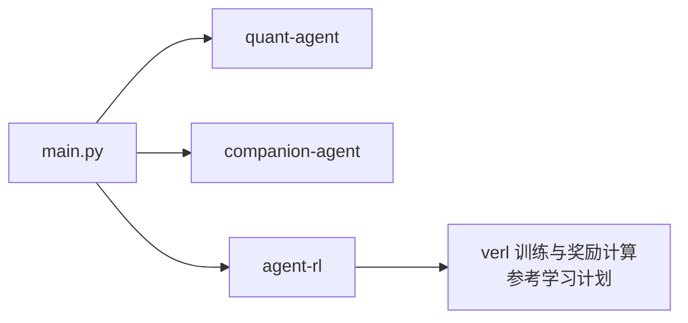

# 奖励函数设计

<cite>
**本文引用的文件**   
- [main.py](file://main.py)
- [pyproject.toml](file://pyproject.toml)
- [agent-rl 包入口](file://packages/agent-rl/src/agent_rl/__init__.py)
- [verl 学习计划](file://docs/plans/verl-learning-plan.md)
- [darwin-skill 技能文档](file://.agent/skills/darwin-skill/SKILL.md)
- [darwin-skill 流程说明（HTML）](file://.agent/skills/darwin-skill/docs/index.html)
</cite>

## 目录
1. [引言](#引言)
2. [项目结构](#项目结构)
3. [核心组件](#核心组件)
4. [架构总览](#架构总览)
5. [详细组件分析](#详细组件分析)
6. [依赖分析](#依赖分析)
7. [性能考虑](#性能考虑)
8. [故障排查指南](#故障排查指南)
9. [结论](#结论)
10. [附录](#附录)

## 引言
本指导文档面向在 JanusAgent 项目中设计与优化“奖励函数”的工程师与研究者，聚焦以下目标：
- 明确奖励函数的设计原则与方法论
- 处理稀疏奖励、奖励塑形与自适应调整策略
- 避免奖励黑客攻击，确保奖励信号有效性与稳定性
- 结合业务目标进行奖励建模，提供多任务案例模式
- 给出评估与优化技巧，并映射到项目的 RL 训练工作流

## 项目结构
JanusAgent 采用多包工作区组织，主入口聚合各子包能力；agent-rl 作为强化学习能力的承载面，计划集成 verl 框架以支持 PPO/GRPO/DAPO 等算法与规则奖励实现。

图示来源
- [main.py:1-13](file://main.py#L1-L13)
- [pyproject.toml:1-30](file://pyproject.toml#L1-L30)
- [verl 学习计划:252-311](file://docs/plans/verl-learning-plan.md#L252-L311)

章节来源
- [main.py:1-13](file://main.py#L1-L13)
- [pyproject.toml:1-30](file://pyproject.toml#L1-30)
- [agent-rl 包入口:1-15](file://packages/agent-rl/src/agent_rl/__init__.py#L1-L15)

## 核心组件
- 主程序入口：负责加载与调用各子包能力，便于后续扩展 RL 训练入口。
- agent-rl 包：定位为“自主学习之面”，承担环境交互、策略优化、奖励建模与模型部署。
- verl 学习计划：定义了 PPO/GRPO/DAPO 的训练循环、关键指标与奖励计算位置，是本项目引入 RL 的核心参考。
- darwin-skill 技能体系：提供了“基线评估—优化—棘轮机制”的工作流与多维评分，可作为奖励建模与评估的参考范式。

章节来源
- [agent-rl 包入口:1-15](file://packages/agent-rl/src/agent_rl/__init__.py#L1-L15)
- [verl 学习计划:283-311](file://docs/plans/verl-learning-plan.md#L283-L311)
- [darwin-skill 技能文档:386-432](file://.agent/skills/darwin-skill/SKILL.md#L386-L432)
- [darwin-skill 流程说明（HTML）:829-919](file://.agent/skills/darwin-skill/docs/index.html#L829-L919)

## 架构总览
下图展示了从提示词生成到奖励计算的端到端数据流，以及奖励函数在项目中的接入点。

图示来源
- [verl 学习计划:283-311](file://docs/plans/verl-learning-plan.md#L283-L311)

## 详细组件分析

### 组件一：奖励函数接口与接入点
- 接入位置：在训练循环中，由 reward_wg.compute_scores(responses) 统一计算奖励，便于替换为不同奖励实现（规则/模型）。
- 设计要点：
  - 将“任务正确性”“格式合规”“过程质量”解耦为可组合的子奖励项
  - 对稀疏任务使用中间阶段奖励或过程奖励模型（PRM）
  - 保持奖励尺度稳定，避免数值爆炸/崩溃

图示来源
- [verl 学习计划:283-311](file://docs/plans/verl-learning-plan.md#L283-L311)

章节来源
- [verl 学习计划:283-311](file://docs/plans/verl-learning-plan.md#L283-L311)

### 组件二：稀疏奖励处理与奖励塑形
- 稀疏奖励场景：仅在最终结果正确时给正奖励，导致早期探索困难。
- 处理方法：
  - 阶段化奖励：按推理步骤或工具调用节点给予阶段性反馈
  - 形状化奖励：基于编辑距离、语法树匹配、类型检查等近似指标
  - 课程学习：从易到难逐步增加任务复杂度
- 风险与约束：
  - 防止过度塑形导致偏离真实目标
  - 定期回退到原始稀疏奖励验证泛化性

[本节为方法论说明，不直接分析具体源文件]

### 组件三：自适应奖励调整策略
- 动态权重：根据历史表现与方差自动调节子奖励权重
- KL 正则：通过 KL 惩罚控制策略偏离参考策略的程度，避免过拟合奖励
- 在线校准：对奖励分布做滑动窗口标准化，降低训练不稳定

图示来源
- [verl 学习计划:191-201](file://docs/plans/verl-learning-plan.md#L191-L201)

章节来源
- [verl 学习计划:191-201](file://docs/plans/verl-learning-plan.md#L191-L201)

### 组件四：避免奖励黑客攻击与有效性保障
- 常见黑客行为：
  - 刷长度：通过冗长输出骗取“长度相关”奖励
  - 模板化：固定套路绕过内容判断
  - 对抗测试：构造边缘用例钻空子
- 防御策略：
  - 多指标融合：结果正确性+格式+过程质量+人类偏好
  - 随机化与对抗样本：加入噪声与反例黑名单
  - 人在回路：关键维度引入人工评审或强判别器
  - 指标监控：跟踪响应长度、熵、KL 惩罚等健康指标

[本节为方法论说明，不直接分析具体源文件]

### 组件五：与业务目标对齐的奖励建模方法
- 目标分解：将业务 KPI 拆解为可观测、可度量的子目标
- 权重设计：依据业务优先级设定初始权重，随阶段演进动态调整
- 评估闭环：建立基线—优化—棘轮的持续改进流程，只保留有提升的变更

图示来源
- [darwin-skill 技能文档:386-432](file://.agent/skills/darwin-skill/SKILL.md#L386-L432)
- [darwin-skill 流程说明（HTML）:829-919](file://.agent/skills/darwin-skill/docs/index.html#L829-L919)

章节来源
- [darwin-skill 技能文档:386-432](file://.agent/skills/darwin-skill/SKILL.md#L386-L432)
- [darwin-skill 流程说明（HTML）:829-919](file://.agent/skills/darwin-skill/docs/index.html#L829-L919)

### 组件六：实际案例与模式
- 数学题（如 GSM8K）：结果正确性为主，辅以格式与步骤完整性
- 代码生成：语法正确性、单元测试通过率、风格规范
- 对话助手：意图达成率、安全合规、用户满意度（可用人机混合评估）
- 工具调用 Agent：工具选择正确性、参数合法性、调用链完整性

[本节为方法论说明，不直接分析具体源文件]

## 依赖分析
- 主程序 main.py 聚合 quant-agent 与 companion-agent，便于未来扩展 agent-rl 的 RL 训练入口
- pyproject.toml 声明工作区成员与依赖关系，agent-rl 作为独立子包存在
- agent-rl 包入口定义版本与基础能力描述，预留训练与奖励建模扩展空间

图示来源
- [main.py:1-13](file://main.py#L1-L13)
- [pyproject.toml:1-30](file://pyproject.toml#L1-30)
- [agent-rl 包入口:1-15](file://packages/agent-rl/src/agent_rl/__init__.py#L1-L15)
- [verl 学习计划:252-311](file://docs/plans/verl-learning-plan.md#L252-L311)

章节来源
- [main.py:1-13](file://main.py#L1-L13)
- [pyproject.toml:1-30](file://pyproject.toml#L1-30)
- [agent-rl 包入口:1-15](file://packages/agent-rl/src/agent_rl/__init__.py#L1-L15)

## 性能考虑
- 奖励计算开销：尽量向量化与批处理，减少 I/O 与外部调用
- 数值稳定性：对奖励进行裁剪与标准化，避免梯度爆炸
- 监控指标：关注 val/test_score、actor/pg_loss、critic/vf_loss、actor/entropy_loss、actor/reward_kl_penalty、response_length/mean、critic/rewards/mean 等关键指标
- 资源利用：合理设置微批次大小与 GPU 内存利用率，必要时采用 LoRA 降低显存压力

章节来源
- [verl 学习计划:191-201](file://docs/plans/verl-learning-plan.md#L191-L201)
- [verl 学习计划:507-512](file://docs/plans/verl-learning-plan.md#L507-L512)

## 故障排查指南
- NaN loss：检查学习率是否过高、KL 系数是否合适
- vLLM 与 SGLang 选择：生产生态选 vLLM，多轮/VLM RL 可考虑 SGLang
- 单卡显存不足：使用小模型、降低微批次与内存利用率，或采用 LoRA RL
- 奖励异常：核对奖励尺度、裁剪阈值与 KL 惩罚项，观察 response_length/mean 与 critic/rewards/mean

章节来源
- [verl 学习计划:507-512](file://docs/plans/verl-learning-plan.md#L507-L512)

## 结论
在本项目中，奖励函数应围绕“业务目标—可度量指标—稳健训练”的主线展开。通过阶段化与塑形技术缓解稀疏奖励，借助 KL 正则与自适应权重保证稳定性，并以“基线—优化—棘轮”的闭环持续对齐业务目标。同时，严格监控关键指标，防范奖励黑客攻击，确保奖励信号的有效性与鲁棒性。

## 附录
- 训练入口与奖励计算位置参考：见训练循环源码精读与奖励计算步骤
- 自定义奖励函数开发建议：参考规则奖励实现范式，将任务正确性、格式与过程质量模块化

章节来源
- [verl 学习计划:283-311](file://docs/plans/verl-learning-plan.md#L283-L311)
- [verl 学习计划:484-489](file://docs/plans/verl-learning-plan.md#L484-L489)