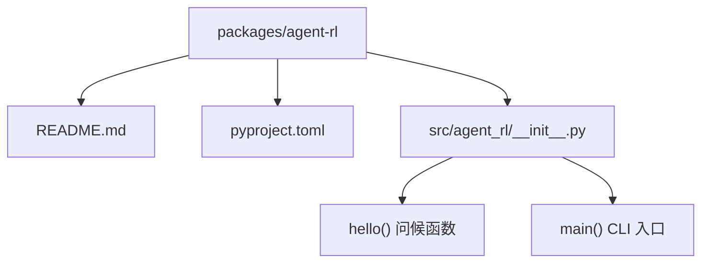
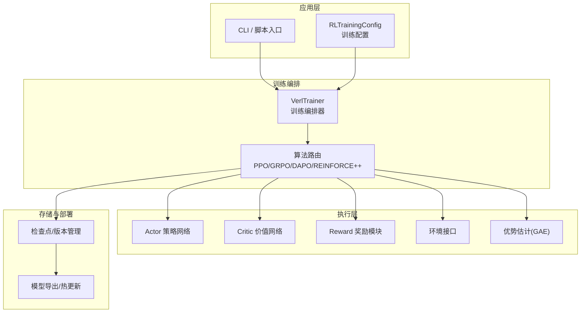
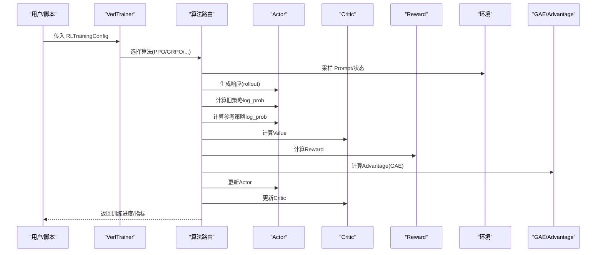
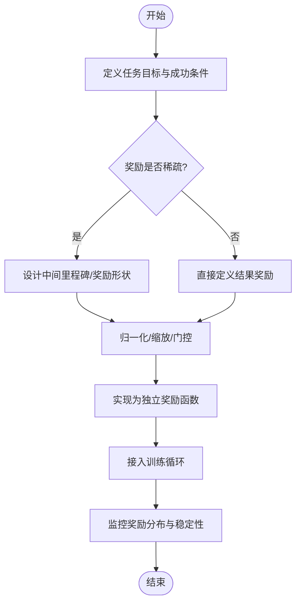
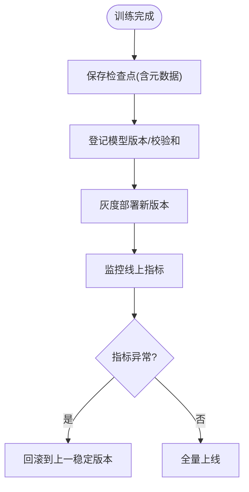

# 强化学习模块

<cite>
**本文引用的文件**   
- [README.md](file://packages/agent-rl/README.md)
- [pyproject.toml](file://packages/agent-rl/pyproject.toml)
- [__init__.py](file://packages/agent-rl/src/agent_rl/__init__.py)
- [verl-learning-plan.md](file://docs/plans/verl-learning-plan.md)
</cite>

## 目录
1. [简介](#简介)
2. [项目结构](#项目结构)
3. [核心组件](#核心组件)
4. [架构总览](#架构总览)
5. [详细组件分析](#详细组件分析)
6. [依赖关系分析](#依赖关系分析)
7. [性能与稳定性](#性能与稳定性)
8. [故障排查指南](#故障排查指南)
9. [结论](#结论)
10. [附录](#附录)

## 简介
本技术文档面向 agent-rl 强化学习模块，目标是系统化梳理并文档化以下能力：
- 多种 RL 算法实现（Q-Learning、Policy Gradient、Actor-Critic 等）的设计与集成思路
- 奖励函数设计原理与方法（稀疏奖励处理、奖励 shaping、自适应奖励调整）
- 训练流程管理系统（环境交互、经验回放、模型更新、收敛检测）
- 在线学习与模型部署方案（增量学习、版本管理、热更新）
- 具体训练示例与超参数调优、训练稳定性优化建议

当前仓库中 agent-rl 包处于早期阶段，提供入口与说明性内容，并在计划文档中给出了基于 verl 的训练框架参考。本文在严格依据现有代码与文档的前提下，给出可落地的架构设计与实施建议，帮助读者快速搭建可扩展的 RL 子系统。

章节来源
- [README.md:1-15](file://packages/agent-rl/README.md#L1-L15)
- [pyproject.toml:1-17](file://packages/agent-rl/pyproject.toml#L1-L17)
- [__init__.py:1-14](file://packages/agent-rl/src/agent_rl/__init__.py#L1-L14)

## 项目结构
agent-rl 采用 Python 包组织方式，通过 pyproject 暴露命令行入口，便于统一调度与集成。

图示来源
- [README.md:1-15](file://packages/agent-rl/README.md#L1-L15)
- [pyproject.toml:1-17](file://packages/agent-rl/pyproject.toml#L1-L17)
- [__init__.py:1-14](file://packages/agent-rl/src/agent_rl/__init__.py#L1-L14)

章节来源
- [README.md:1-15](file://packages/agent-rl/README.md#L1-L15)
- [pyproject.toml:1-17](file://packages/agent-rl/pyproject.toml#L1-L17)
- [__init__.py:1-14](file://packages/agent-rl/src/agent_rl/__init__.py#L1-L14)

## 核心组件
- 包入口与版本信息
  - 提供 __version__ 与 hello()/main() 作为最小可用入口，便于后续扩展为 CLI 或 API 服务。
- 训练配置与封装（规划层面）
  - 计划文档提出 RLTrainingConfig 数据类与 VerlTrainer 封装，用于将高层配置转换为底层训练命令或直接调用 verl 模块。
- 奖励函数扩展点
  - 计划文档指出 rewards 子目录与自定义奖励函数的编写位置，便于对接不同任务场景。

章节来源
- [__init__.py:1-14](file://packages/agent-rl/src/agent_rl/__init__.py#L1-L14)
- [verl-learning-plan.md:452-489](file://docs/plans/verl-learning-plan.md#L452-L489)

## 架构总览
下图展示 agent-rl 在“计划态”下的整体架构：上层以配置驱动的训练器为核心，协调策略与环境交互、奖励计算、优势估计与模型更新；同时支持多算法切换与在线部署。

图示来源
- [verl-learning-plan.md:283-311](file://docs/plans/verl-learning-plan.md#L283-L311)
- [verl-learning-plan.md:452-489](file://docs/plans/verl-learning-plan.md#L452-L489)

## 详细组件分析

### 训练编排与算法路由
- 训练循环（以 PPO 为例）
  - 生成序列（Rollout）→ 计算旧策略 log_prob → 计算参考策略 log_prob → 计算 Value → 计算 Reward → 计算 Advantage（GAE）→ 更新 Actor → 更新 Critic。
- 算法支持
  - 计划文档列举了 PPO、GRPO、RLOO、ReMax、REINFORCE++、DAPO 等多种算法，可通过配置选择。
- 训练器封装
  - 通过 RLTrainingConfig 集中管理算法、模型、数据、批大小、并行度、输出目录等关键参数；VerlTrainer 负责组装参数并启动训练。

图示来源
- [verl-learning-plan.md:283-311](file://docs/plans/verl-learning-plan.md#L283-L311)
- [verl-learning-plan.md:452-489](file://docs/plans/verl-learning-plan.md#L452-L489)

章节来源
- [verl-learning-plan.md:283-311](file://docs/plans/verl-learning-plan.md#L283-L311)
- [verl-learning-plan.md:452-489](file://docs/plans/verl-learning-plan.md#L452-L489)

### 奖励函数设计与实现要点
- 设计原则
  - 明确目标与信号粒度：最终结果奖励 vs 过程奖励
  - 稀疏奖励处理：引入中间里程碑、形状化奖励（reward shaping）、课程学习
  - 自适应奖励调整：根据训练动态对奖励进行归一化、缩放或门控
- 实现位置
  - 建议在 src/agent_rl/rewards 下按任务组织奖励函数，例如 gsm8k_reward.py 等，保持与算法解耦。
- 评估与可视化
  - 记录每步奖励、累计奖励、奖励方差，辅助诊断稀疏性与不稳定性。

章节来源
- [verl-learning-plan.md:484-489](file://docs/plans/verl-learning-plan.md#L484-L489)

### 在线学习与模型部署
- 增量学习
  - 使用检查点恢复训练，结合新数据流持续微调策略与价值网络。
- 版本管理
  - 以时间戳/版本号命名检查点，保留最佳验证集表现模型。
- 热更新机制
  - 在推理侧加载最新稳定版本模型，灰度发布并回滚至上一版本。

[本节为概念性说明，未直接分析具体源码文件]

## 依赖关系分析
- 包清单与脚本入口
  - pyproject.toml 定义了包名、版本、Python 要求、脚本入口 agent-rl = "agent_rl:main"。
- 顶层依赖
  - uv.lock 显示 janus-agent 依赖 agent-rl，表明 agent-rl 作为子包被主工程引用。

图示来源
- [pyproject.toml:12-13](file://packages/agent-rl/pyproject.toml#L12-L13)
- [uv.lock:2158-2165](file://uv.lock#L2158-L2165)

章节来源
- [pyproject.toml:1-17](file://packages/agent-rl/pyproject.toml#L1-L17)
- [uv.lock:2158-2165](file://uv.lock#L2158-L2165)

## 性能与稳定性
- 内存与吞吐
  - 单卡显存不足时，优先降低 micro batch size 与 GPU 利用率，或使用小模型/LoRA 训练。
- 数值稳定性
  - 控制学习率上限（如 ≤ 1e-5），合理设置 KL 系数，避免 loss 出现 NaN。
- 优势估计与裁剪
  - 使用 GAE 平衡偏差与方差；PPO clip 防止策略更新过大导致崩溃。
- 数据与并行
  - 合理设置 rollout 与训练 micro batch，配合 tensor model parallel 提升吞吐。

章节来源
- [verl-learning-plan.md:507-512](file://docs/plans/verl-learning-plan.md#L507-L512)
- [verl-learning-plan.md:283-311](file://docs/plans/verl-learning-plan.md#L283-L311)

## 故障排查指南
- 常见错误与定位
  - 训练 NaN：检查学习率与 KL 系数；确认 reward 范围与梯度裁剪。
  - 显存溢出：减小 ppo_micro_batch_size_per_gpu 与 gpu_memory_utilization，或切换 LoRA RL。
  - 收敛缓慢：调整 advantage 估计参数、增加采样多样性、引入 curriculum。
- 日志与观测
  - 记录 actor/critic loss、advantage 统计、reward 分布、KL 散度，辅助定位问题。

章节来源
- [verl-learning-plan.md:507-512](file://docs/plans/verl-learning-plan.md#L507-L512)

## 结论
agent-rl 当前提供了清晰的包结构与可扩展的训练编排蓝图。通过 RLTrainingConfig 与 VerlTrainer 的抽象，可以便捷地接入 PPO、GRPO、DAPO 等多种算法，并以模块化奖励函数适配不同任务。结合稳健的超参与稳定性策略，可在有限资源下实现高效稳定的强化学习训练与部署。

[本节为总结性内容，未直接分析具体源码文件]

## 附录
- 快速上手
  - 安装与运行：参考 README 中的 uv sync 与 uv run agent-rl 指令。
- 参考算法与示例
  - 计划文档提供了 GRPO、DAPO 等算法的配置与运行示例路径，可作为后续实现的起点。

章节来源
- [README.md:1-15](file://packages/agent-rl/README.md#L1-L15)
- [verl-learning-plan.md:320-366](file://docs/plans/verl-learning-plan.md#L320-L366)