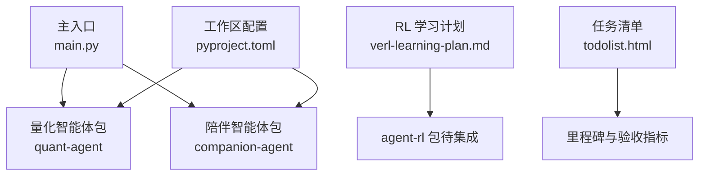
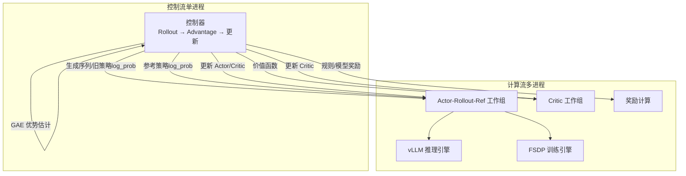
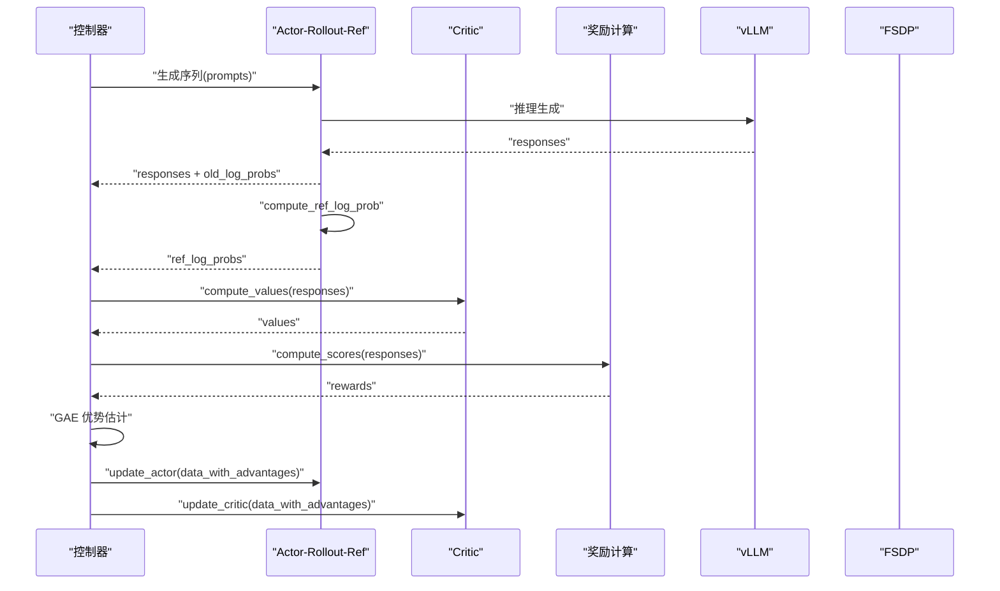
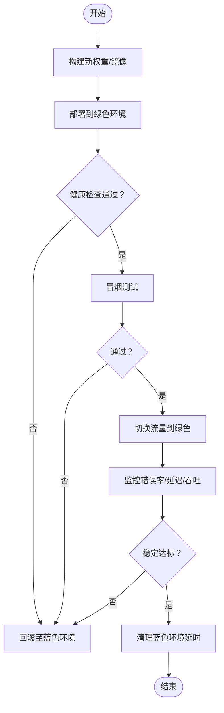
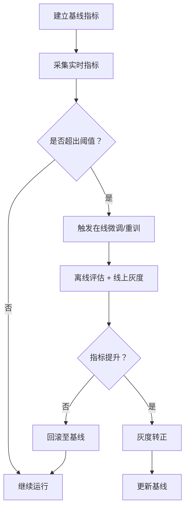
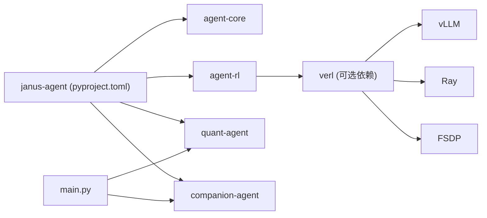

# 模型部署与在线学习

<cite>
**本文引用的文件**   
- [main.py](file://main.py)
- [pyproject.toml](file://pyproject.toml)
- [verl-learning-plan.md](file://docs/plans/verl-learning-plan.md)
- [todolist.html](file://docs/plans/todolist.html)
</cite>

## 目录
1. [引言](#引言)
2. [项目结构](#项目结构)
3. [核心组件](#核心组件)
4. [架构总览](#架构总览)
5. [详细组件分析](#详细组件分析)
6. [依赖关系分析](#依赖关系分析)
7. [性能考量](#性能考量)
8. [故障排查指南](#故障排查指南)
9. [结论](#结论)
10. [附录](#附录)

## 引言
本技术文档面向“模型部署与在线学习”主题，结合仓库现状与强化学习（RL）训练计划，系统性阐述增量学习与在线适应机制、模型版本管理与热更新/回滚策略、序列化与存储加载最佳实践、监控与自动更新方案，以及边缘设备部署与资源优化建议。同时给出模型漂移检测与自适应调整机制的设计思路，帮助读者在现有工程基础上构建可演进、可观测、可回滚的模型服务闭环。

## 项目结构
当前仓库采用多包工作区组织，顶层入口 main.py 聚合多个子包的简单能力；依赖通过 pyproject.toml 声明；强化学习相关规划与落地路径集中在 docs/plans/verl-learning-plan.md；任务清单 todolist.html 提供阶段性目标与验收标准。

图示来源
- [main.py:1-13](file://main.py#L1-L13)
- [pyproject.toml:1-30](file://pyproject.toml#L1-L30)
- [verl-learning-plan.md:1-536](file://docs/plans/verl-learning-plan.md#L1-L536)
- [todolist.html:1-428](file://docs/plans/todolist.html#L1-L428)

章节来源
- [main.py:1-13](file://main.py#L1-L13)
- [pyproject.toml:1-30](file://pyproject.toml#L1-L30)

## 核心组件
- 主入口与装配：main.py 作为应用启动点，负责导入并调用各子包的基础能力，便于后续扩展为模型服务编排器或训练调度器。
- 依赖与工作区：pyproject.toml 定义 uv workspace 成员与依赖，为 agent-core、agent-rl、quant-agent、companion-agent 等包提供统一依赖管理。
- RL 训练与数据流：verl-learning-plan.md 描述了 HybridFlow 的两级数据流（控制流与计算流）、PPO/GRPO 训练循环、vLLM/FSDP 集成、权重合并与保存流程，为在线学习与增量更新提供基础。
- 里程碑与验收：todolist.html 明确阶段目标与验收指标，支撑模型上线后的持续改进与回归保障。

章节来源
- [main.py:1-13](file://main.py#L1-L13)
- [pyproject.toml:1-30](file://pyproject.toml#L1-L30)
- [verl-learning-plan.md:215-319](file://docs/plans/verl-learning-plan.md#L215-L319)
- [verl-learning-plan.md:203-212](file://docs/plans/verl-learning-plan.md#L203-L212)
- [todolist.html:242-268](file://docs/plans/todolist.html#L242-L268)

## 架构总览
基于 verl 的 HybridFlow 编程模型，系统抽象出“控制流（单进程）+ 计算流（多进程）”两级数据流，并通过 DataProto 跨进程传递数据。Actor/Rollout/Reference/Critic 等组件在多进程中并行执行，控制器协调 Rollout、优势估计与参数更新。

图示来源
- [verl-learning-plan.md:215-238](file://docs/plans/verl-learning-plan.md#L215-L238)
- [verl-learning-plan.md:283-311](file://docs/plans/verl-learning-plan.md#L283-L311)

## 详细组件分析

### 增量学习与在线适应机制
- 两级数据流：控制流负责采样、优势估计与更新调度；计算流承载 vLLM 生成、FSDP 训练与 Critic 价值估计，解耦清晰、可扩展性强。
- PPO/GRPO 训练循环：包含生成响应、计算旧策略与参考策略 log_prob、计算价值与奖励、GAE 优势估计、更新 Actor/Critic 等步骤，形成稳定的在线学习闭环。
- 奖励设计：支持规则奖励与模型奖励，便于将业务指标（如格式正确性、答案质量）转化为可优化的信号。
- 数据协议：DataProto 作为跨进程数据载体，屏蔽分布式细节，简化算法实现。

图示来源
- [verl-learning-plan.md:283-311](file://docs/plans/verl-learning-plan.md#L283-L311)

章节来源
- [verl-learning-plan.md:215-319](file://docs/plans/verl-learning-plan.md#L215-L319)

### 模型版本管理、热更新与回滚策略
- 版本化检查点：训练过程中按全局步数保存 Actor/Critic 权重，便于回溯与对比评估。
- 权重合并：将 FSDP 分片权重合并为 HuggingFace 格式，统一导出接口，便于部署与服务化。
- 蓝绿发布与灰度：先部署到绿色环境，健康检查通过后切换流量，观察错误率与关键指标，满足阈值后保留新版本，否则立即回滚。
- 回滚流程：快速切回上一稳定版本，验证旧版本服务正常，必要时执行数据库迁移回滚，通知团队并复盘。

章节来源
- [verl-learning-plan.md:203-212](file://docs/plans/verl-learning-plan.md#L203-L212)

### 模型序列化、存储与加载最佳实践
- 训练输出：使用全局步数命名检查点目录，保持时间线与实验可追溯。
- 权重合并：将分布式训练产物合并为标准格式，减少部署复杂度。
- 元数据记录：为每个检查点附加超参、数据集版本、评估结果与变更记录，便于线上选择与回滚。
- 加载策略：服务侧根据路由策略（如蓝绿、A/B）动态加载对应版本的权重，保证无中断切换。

章节来源
- [verl-learning-plan.md:203-212](file://docs/plans/verl-learning-plan.md#L203-L212)

### 模型性能监控与自动更新
- 训练期监控：开启控制台与可视化后端（如 wandb/TensorBoard），跟踪验证分数、损失、熵、KL 惩罚、回复长度等关键指标。
- 服务期监控：关注错误率、延迟分布、吞吐、显存占用与 GPU 利用率，设置告警阈值。
- 自动更新触发：当离线评估分数提升且线上指标稳定时，触发蓝绿切换；若错误率超过阈值则自动回滚。

章节来源
- [verl-learning-plan.md:517-527](file://docs/plans/verl-learning-plan.md#L517-L527)

### 边缘设备部署与资源优化
- 硬件与环境：优先使用具备足够显存的 GPU；容器运行时需启用 GPU 访问、共享内存与必要内核能力。
- 推理加速：使用 vLLM/SGLang 进行高效推理，合理设置张量并行与 GPU 内存利用率。
- 训练优化：降低微批次大小、调整 ppo_micro_batch_size_per_gpu 与 gpu_memory_utilization，或使用 LoRA 降低显存需求。
- 资源隔离：通过 Ray 集群与容器隔离，确保多进程/多节点通信稳定。

章节来源
- [verl-learning-plan.md:71-141](file://docs/plans/verl-learning-plan.md#L71-L141)
- [verl-learning-plan.md:384-396](file://docs/plans/verl-learning-plan.md#L384-L396)

### 模型漂移检测与自适应调整机制
- 漂移检测：基于输入分布统计（特征均值/方差/分位数）、输出质量指标（置信度、多样性、一致性）与业务指标（转化率、错误率）建立基线，定期比对。
- 自适应调整：当检测到显著漂移时，触发小批量在线微调（如 GRPO/PPO 短轮次），以最新数据校准策略；同时限制 KL 惩罚，避免偏离过大。
- 安全护栏：引入人在回路与棘轮机制，仅接受带来整体指标提升的变更，失败则回滚，防止退化累积。

[本节为概念性说明，不直接分析具体源文件]

## 依赖关系分析
- 工作区成员：packages/* 下的 agent-core、agent-rl、quant-agent、companion-agent 由 uv workspace 统一管理。
- 顶层依赖：janus-agent 依赖上述四个包，main.py 作为入口聚合能力。
- RL 集成方向：agent-rl 包目前为空，未来将引入 verl 及其依赖（vLLM、Ray、FSDP），封装训练 API 并与 YAML 配置体系对齐。

图示来源
- [pyproject.toml:1-30](file://pyproject.toml#L1-L30)
- [main.py:1-13](file://main.py#L1-L13)
- [verl-learning-plan.md:415-482](file://docs/plans/verl-learning-plan.md#L415-L482)

章节来源
- [pyproject.toml:1-30](file://pyproject.toml#L1-L30)
- [main.py:1-13](file://main.py#L1-L13)
- [verl-learning-plan.md:415-482](file://docs/plans/verl-learning-plan.md#L415-L482)

## 性能考量
- 训练稳定性：控制学习率与 KL 系数，避免 NaN 与策略崩溃；使用 GAE 优势估计提升样本效率。
- 资源利用：合理设置 vLLM 的 GPU 内存利用率与张量并行规模；在单卡场景下降低微批次与并行度。
- 监控与诊断：开启日志与可视化后端，定位瓶颈（生成、训练、通信）。
- 渐进式优化：从 LoRA 与小模型起步，逐步扩展到更大模型与更多 GPU。

[本节提供通用指导，不直接分析具体源文件]

## 故障排查指南
- 训练异常：出现 NaN loss 时检查学习率与 KL 系数；确认数据预处理与奖励函数返回值合法。
- 推理问题：vLLM 与 SGLang 选型依据生态与多轮/VLM 支持情况；检查显存与并行配置。
- 部署失败：蓝绿切换后错误率超标应立即回滚；核查健康检查端点、冒烟测试覆盖范围与 DNS 传播。
- 回滚操作：快速切回上一稳定版本，验证服务正常，必要时执行数据库迁移回滚并通知团队。

章节来源
- [verl-learning-plan.md:505-516](file://docs/plans/verl-learning-plan.md#L505-L516)

## 结论
本项目已具备清晰的入口与工作区结构，并在 RL 训练方面提供了详尽的 verl 学习计划与落地路径。围绕增量学习与在线适应，建议以 HybridFlow 的两级数据流为基础，完善版本化检查点与权重合并流程，结合蓝绿发布与自动回滚策略，构建稳健的模型服务闭环。同时，建立漂移检测与自适应调整机制，配合完善的监控与告警，确保模型在真实环境中持续进化与稳定运行。

## 附录
- 里程碑与验收：todolist.html 明确了近期聚焦项与自进化最小闭环目标，可作为模型上线后持续改进的抓手。
- 学习路线：verl-learning-plan.md 提供了从背景知识到实战整合的系统化路径，建议按阶段推进，逐步完成 agent-rl 的能力沉淀。

章节来源
- [todolist.html:242-268](file://docs/plans/todolist.html#L242-L268)
- [verl-learning-plan.md:491-500](file://docs/plans/verl-learning-plan.md#L491-L500)