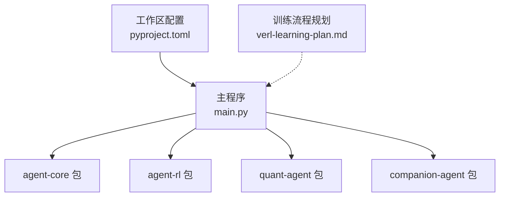
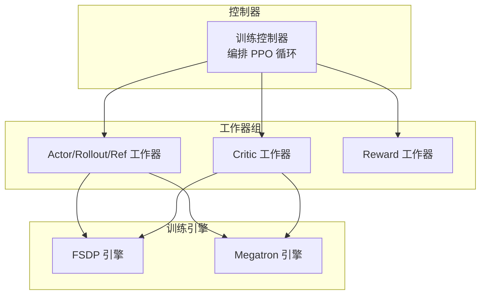
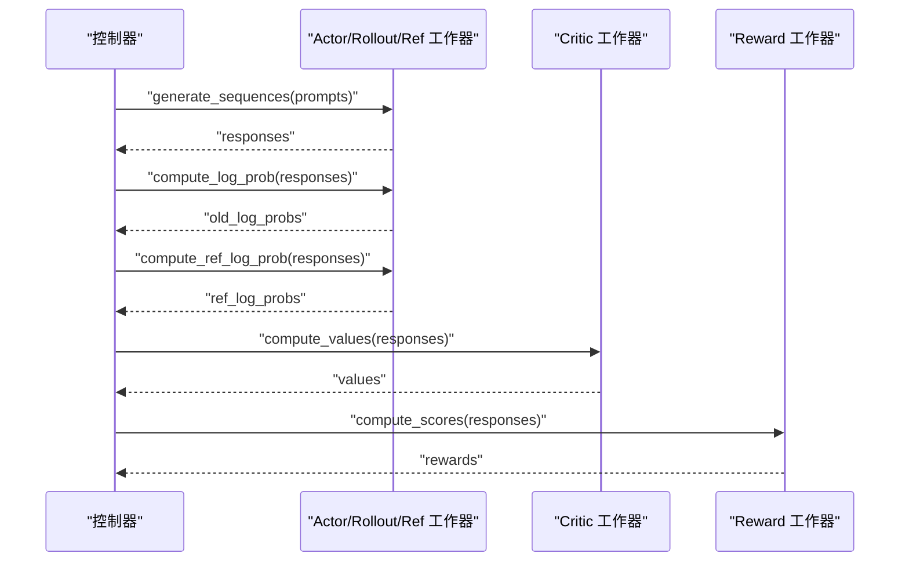
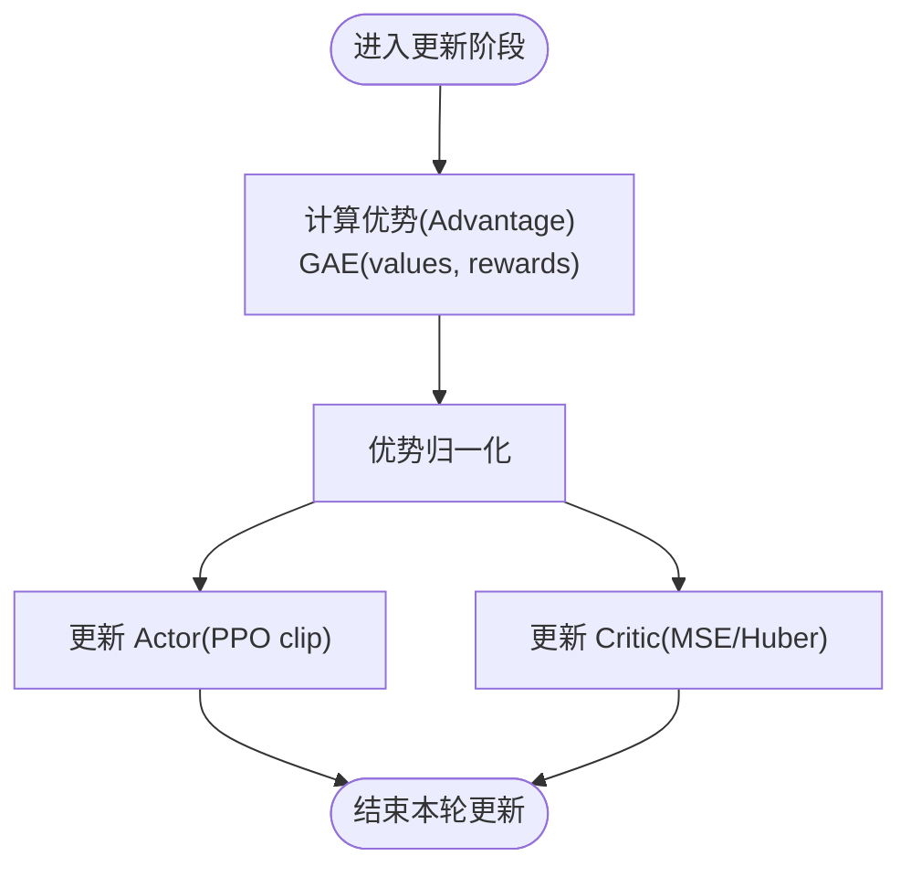
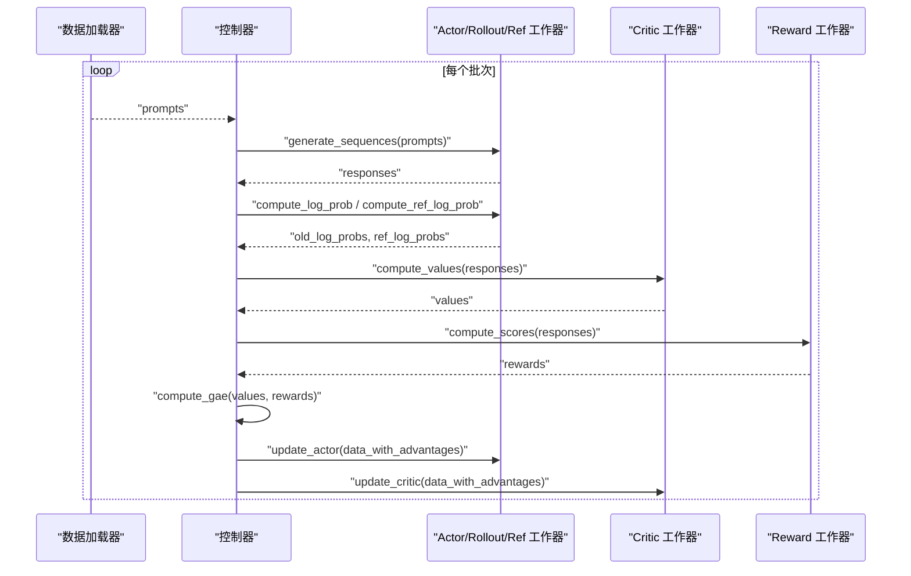
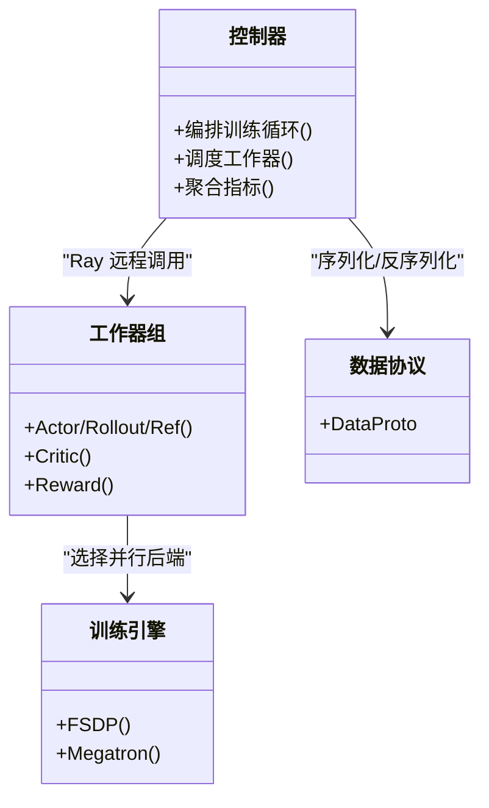
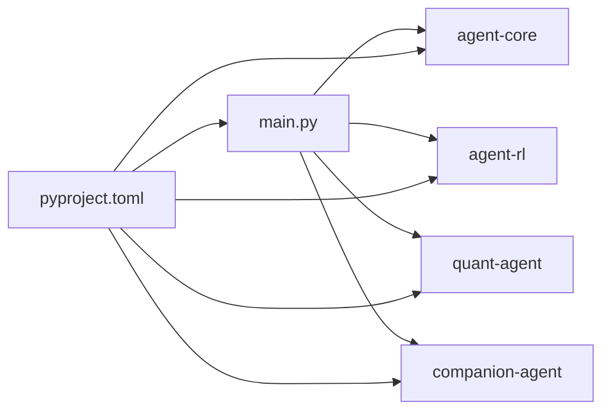

# 训练流程管理

<cite>
**本文引用的文件**   
- [main.py](file://main.py)
- [pyproject.toml](file://pyproject.toml)
- [__init__.py](file://packages/agent-rl/src/agent_rl/__init__.py)
- [verl-learning-plan.md](file://docs/plans/verl-learning-plan.md)
</cite>

## 目录
1. [简介](#简介)
2. [项目结构](#项目结构)
3. [核心组件](#核心组件)
4. [架构总览](#架构总览)
5. [详细组件分析](#详细组件分析)
6. [依赖关系分析](#依赖关系分析)
7. [性能考量](#性能考量)
8. [故障排查指南](#故障排查指南)
9. [结论](#结论)
10. [附录](#附录)

## 简介
本技术文档围绕“训练流程管理系统”展开，聚焦以下目标：
- 环境交互机制：如何与外部环境（如推理引擎、奖励函数）协作以收集状态与反馈。
- 经验回放缓冲区管理：在强化学习场景下对轨迹数据的组织、采样与复用策略。
- 模型更新策略：Actor-Critic 范式下的参数优化与稳定性控制。
- 训练循环实现：状态收集、优势估计、梯度计算与参数更新的端到端流程。
- 收敛检测与监控指标：训练过程中的关键指标与早停/收敛判定思路。
- 配置管理与超参调优：训练配置的组织方式与可调节的关键超参。
- 分布式与并行处理：基于 Ray 的控制器-工作器模式、FSDP/Megatron 等并行方案。

说明：当前仓库为多包工作区，主入口仅做模块聚合；详细的训练流程设计参考了计划文档中对 PPO 训练循环与分布式架构的描述。

## 项目结构
仓库采用 uv 工作区组织多个子包，主程序 main.py 负责加载并调用各子包的 hello 接口，体现“双面孔智能体”的模块化组合。训练相关的设计与流程规划集中在 docs/plans/verl-learning-plan.md 中，涵盖 PPO 训练循环、Ray 分布式、FSDP/Megatron 等主题。

图示来源
- [main.py:1-13](file://main.py#L1-L13)
- [pyproject.toml:1-30](file://pyproject.toml#L1-L30)

章节来源
- [main.py:1-13](file://main.py#L1-L13)
- [pyproject.toml:1-30](file://pyproject.toml#L1-L30)

## 核心组件
- 主入口与模块聚合
  - 主程序通过导入并调用 agent-rl 与 companion-agent 的 hello 方法，完成基础能力展示与模块装配。
- 工作区与依赖声明
  - pyproject.toml 定义了项目名称、Python 版本约束、依赖成员与工作区成员，确保 agent-core、agent-rl、quant-agent、companion-agent 作为本地工作区包被解析与使用。
- 训练流程规划
  - verl-learning-plan.md 提供了 PPO 训练循环的高层步骤与环境交互要点，包括 rollout、旧策略 log_prob、参考策略 log_prob、价值估计、奖励计算、优势估计（GAE）、Actor/Critic 更新等。

章节来源
- [main.py:1-13](file://main.py#L1-L13)
- [pyproject.toml:1-30](file://pyproject.toml#L1-L30)
- [__init__.py:1-14](file://packages/agent-rl/src/agent_rl/__init__.py#L1-L14)
- [verl-learning-plan.md:283-319](file://docs/plans/verl-learning-plan.md#L283-L319)

## 架构总览
从训练视角看，系统遵循“控制器-工作器”的分布式模式：
- 控制器（单进程 Python）负责编排训练循环、调度数据与指令。
- 工作器组（WorkerGroup）承载 Actor/Rollout/Reference/Critic/Reward 等角色，执行生成、评估与更新。
- 底层训练引擎可选择 FSDP 或 Megatron，实现张量/流水线/数据并行。

图示来源
- [verl-learning-plan.md:240-281](file://docs/plans/verl-learning-plan.md#L240-L281)

## 详细组件分析

### 环境交互机制
- 交互主体
  - Actor/Rollout/Reference 工作器负责根据提示词生成响应序列。
  - Critic 工作器对响应进行价值估计。
  - Reward 工作器对响应进行评分（规则或模型）。
- 交互流程
  - 控制器将批次提示词下发至 Actor/Rollout/Reference 工作器，得到响应序列。
  - 随后依次计算旧策略 log_prob、参考策略 log_prob、价值与奖励，最终汇总到控制器用于优势估计与更新。

图示来源
- [verl-learning-plan.md:283-319](file://docs/plans/verl-learning-plan.md#L283-L319)

章节来源
- [verl-learning-plan.md:283-319](file://docs/plans/verl-learning-plan.md#L283-L319)

### 经验回放缓冲区管理
- 设计要点
  - 在 PPO 训练中，通常以“批次”为单位组织轨迹数据，包含 prompts、responses、old_log_probs、ref_log_probs、values、rewards 等字段。
  - 优势估计（GAE）需要 values 与 rewards 序列，因此缓冲区需支持按序列维度访问与对齐。
- 建议实践
  - 统一的数据协议对象（DataProto）便于在不同工作器间传递。
  - 长度平衡与截断策略可减少显存波动与通信开销。
  - 采样时保持时间步顺序，避免破坏时序信息。

章节来源
- [verl-learning-plan.md:240-281](file://docs/plans/verl-learning-plan.md#L240-L281)
- [verl-learning-plan.md:283-319](file://docs/plans/verl-learning-plan.md#L283-L319)

### 模型更新策略
- 更新目标
  - Actor：使用 PPO clip 损失，结合 advantages 与 ratio(old/new log prob)。
  - Critic：最小化价值预测误差（MSE 或 Huber）。
- 关键步骤
  - 计算优势（GAE），归一化以提升稳定性。
  - 多轮 mini-batch 更新，配合学习率调度与裁剪。
  - 参考策略 log_prob 用于 KL 正则，防止策略漂移。

图示来源
- [verl-learning-plan.md:283-319](file://docs/plans/verl-learning-plan.md#L283-L319)

章节来源
- [verl-learning-plan.md:283-319](file://docs/plans/verl-learning-plan.md#L283-L319)

### 训练循环实现
- 循环步骤
  - Rollout：用 Actor 生成回复。
  - 计算旧策略与参考策略 log_prob。
  - 计算价值与奖励。
  - 计算优势（GAE）。
  - 更新 Actor 与 Critic。
- 控制流
  - 控制器驱动 dataloader 迭代，逐批执行上述步骤。
  - 工作器组通过装饰器自动处理数据分片/分发/收集。

图示来源
- [verl-learning-plan.md:283-319](file://docs/plans/verl-learning-plan.md#L283-L319)

章节来源
- [verl-learning-plan.md:283-319](file://docs/plans/verl-learning-plan.md#L283-L319)

### 收敛检测与训练监控指标
- 监控指标建议
  - 策略侧：平均回报、奖励方差、KL 散度（与参考策略）、log_prob 分布。
  - 价值侧：价值误差（MSE/Huber）、残差分布。
  - 训练稳定：损失曲线、梯度范数、学习率变化。
- 收敛判定思路
  - 基于滑动窗口的平均回报提升阈值。
  - KL 散度低于阈值且回报稳定。
  - 验证集上的任务得分不再显著提升。

章节来源
- [verl-learning-plan.md:283-319](file://docs/plans/verl-learning-plan.md#L283-L319)

### 训练配置管理与超参数调优
- 配置组织
  - 使用 YAML 模板集中管理训练超参（例如 PPO 训练器配置）。
  - 关键超参包括：rollout 长度、mini-batch 大小、GAE 系数、clip 范围、学习率与调度、KL 惩罚系数等。
- 调优建议
  - 先固定 rollout 与 critic 学习率，逐步调整 actor 学习率与 clip 范围。
  - 观察 KL 散度与价值误差，避免策略过快偏离或价值估计不稳定。
  - 使用网格/随机搜索在小规模集群上快速定位合理区间。

章节来源
- [verl-learning-plan.md:240-281](file://docs/plans/verl-learning-plan.md#L240-L281)

### 分布式训练与并行处理
- 控制器-工作器模式
  - 控制器为单进程 Python，通过 Ray 与 WorkerGroup 交互。
  - 新增 RL 算法只需修改控制流，计算流可在 FSDP/Megatron 间切换。
- 并行策略
  - FSDP：全分片数据并行，适合大模型参数分片。
  - Megatron-LM：张量并行 + 流水线并行，适用于更大规模模型。
- 数据协议
  - DataProto 提供统一的数据接口，简化跨进程数据传递。

图示来源
- [verl-learning-plan.md:240-281](file://docs/plans/verl-learning-plan.md#L240-L281)

章节来源
- [verl-learning-plan.md:240-281](file://docs/plans/verl-learning-plan.md#L240-L281)

## 依赖关系分析
- 主程序 main.py 依赖 agent-core、agent-rl、quant-agent、companion-agent 四个工作区包。
- pyproject.toml 声明了这些包为本地工作区成员，并通过 [tool.uv.sources] 映射到 workspace。
- agent-rl 包提供 hello 接口，用于演示与集成。

图示来源
- [main.py:1-13](file://main.py#L1-L13)
- [pyproject.toml:1-30](file://pyproject.toml#L1-L30)
- [__init__.py:1-14](file://packages/agent-rl/src/agent_rl/__init__.py#L1-L14)

章节来源
- [main.py:1-13](file://main.py#L1-L13)
- [pyproject.toml:1-30](file://pyproject.toml#L1-L30)
- [__init__.py:1-14](file://packages/agent-rl/src/agent_rl/__init__.py#L1-L14)

## 性能考量
- 显存与吞吐
  - 合理设置 rollout 长度与 mini-batch 大小，避免峰值显存过高。
  - 使用 vLLM/SGLang 作为 rollout 生成引擎，提升吞吐。
- 通信与同步
  - 利用 @register(dispatch_mode=...) 装饰器自动处理数据分片/分发/收集，减少手动同步成本。
- 数值稳定性
  - 优势归一化、KL 正则、梯度裁剪有助于稳定训练。
- 并行效率
  - 在大规模模型上优先选择 Megatron 的张量/流水线并行；中等规模可用 FSDP 简化部署。

章节来源
- [verl-learning-plan.md:240-281](file://docs/plans/verl-learning-plan.md#L240-L281)
- [verl-learning-plan.md:283-319](file://docs/plans/verl-learning-plan.md#L283-L319)

## 故障排查指南
- 常见问题
  - 生成阶段 OOM：缩短 rollout 长度、降低 batch size、启用分页注意力（vLLM）。
  - 训练不稳定：检查 KL 惩罚系数、clip 范围、学习率调度；观察价值误差是否异常增大。
  - 分布式通信失败：确认 Ray 集群健康、节点网络连通性与资源分配。
- 诊断手段
  - 记录关键指标（回报、KL、价值误差、梯度范数）并绘制曲线。
  - 在控制器侧打印每步耗时，定位瓶颈（生成/评估/更新）。
  - 使用小数据集快速复现问题，逐步放大规模。

章节来源
- [verl-learning-plan.md:240-281](file://docs/plans/verl-learning-plan.md#L240-L281)
- [verl-learning-plan.md:283-319](file://docs/plans/verl-learning-plan.md#L283-L319)

## 结论
本项目采用模块化工作区组织，主入口负责模块聚合；训练流程的核心设计与实现细节由计划文档给出，涵盖 PPO 训练循环、环境交互、优势估计、模型更新与分布式架构。建议在现有基础上完善具体实现代码，并建立完善的监控与配置体系，以确保训练的稳定性和可扩展性。

## 附录
- 术语表
  - Rollout：策略与环境交互生成轨迹的过程。
  - Advantage：优势函数，衡量动作相对于平均水平的改进程度。
  - GAE：广义优势估计，结合多步回报的优势估计方法。
  - FSDP：全分片数据并行，PyTorch 提供的参数分片并行方案。
  - Megatron：面向大模型的张量/流水线并行框架。