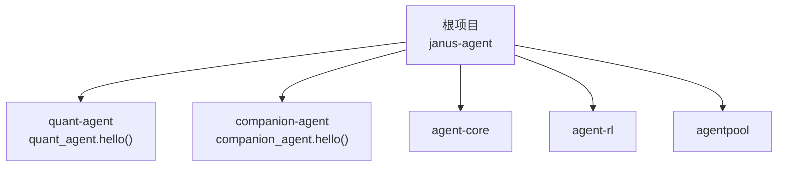
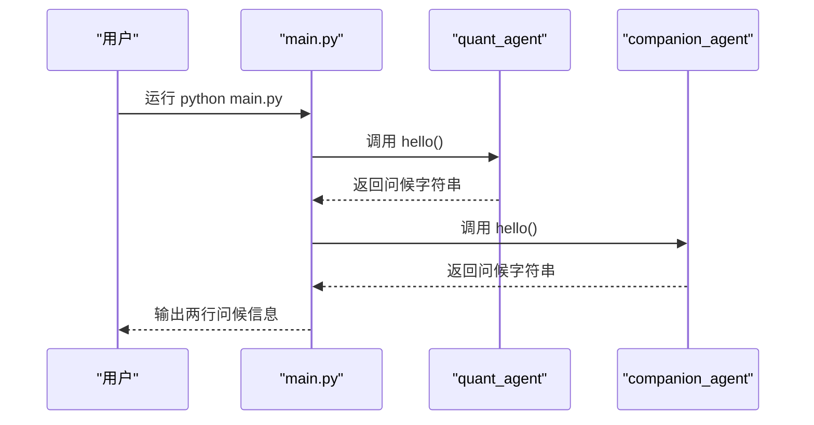
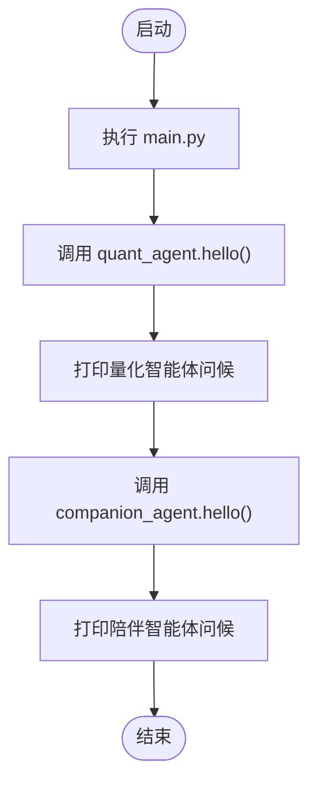
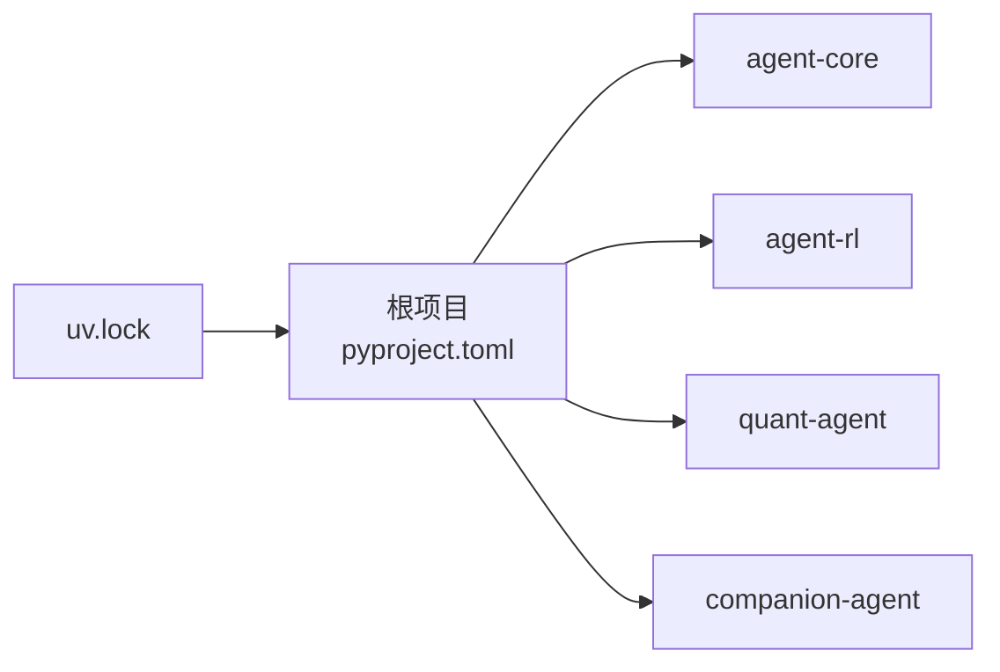

# 快速开始

<cite>
**本文引用的文件**   
- [main.py](file://main.py)
- [pyproject.toml](file://pyproject.toml)
- [uv.lock](file://uv.lock)
- [quant-agent/pyproject.toml](file://packages/quant-agent/pyproject.toml)
- [companion-agent/pyproject.toml](file://packages/companion-agent/pyproject.toml)
- [quant_agent/__init__.py](file://packages/quant-agent/src/quant_agent/__init__.py)
- [companion_agent/__init__.py](file://packages/companion-agent/src/companion_agent/__init__.py)
</cite>

## 目录
1. [简介](#简介)
2. [项目结构](#项目结构)
3. [核心组件](#核心组件)
4. [架构总览](#架构总览)
5. [详细组件分析](#详细组件分析)
6. [依赖分析](#依赖分析)
7. [性能考虑](#性能考虑)
8. [故障排除指南](#故障排除指南)
9. [结论](#结论)
10. [附录](#附录) 

## 简介
本指南面向首次接触 JanusAgent 的用户，目标是在 5 分钟内完成环境准备、依赖安装与运行第一个双生智能体应用。JanusAgent 是一个“双面”个人智能体框架：量化交易智能体（理性之面）与情感陪伴智能体（感性之面），通过统一入口 main.py 启动并调用两个子模块的 hello() 函数进行演示。

## 项目结构
仓库采用 uv workspace 管理多包结构，根项目 janus-agent 聚合多个子包，并通过 pyproject.toml 声明 Python 版本要求与依赖关系。关键目录与文件如下：
- 根目录
  - main.py：程序入口，导入并调用 quant_agent 与 companion_agent 的 hello()
  - pyproject.toml：定义项目元信息、Python 版本要求、依赖与 uv workspace 成员
  - uv.lock：锁定解析后的依赖树与平台标记
- packages 子包
  - quant-agent：量化交易智能体，提供 quant_agent.hello()
  - companion-agent：情感陪伴智能体，提供 companion_agent.hello()
  - agent-core、agent-rl、agentpool：其他能力包（由根项目依赖）

图表来源
- [pyproject.toml:1-30](file://pyproject.toml#L1-L30)
- [uv.lock:12-20](file://uv.lock#L12-L20)

章节来源
- [pyproject.toml:1-30](file://pyproject.toml#L1-L30)
- [uv.lock:12-20](file://uv.lock#L12-L20)

## 核心组件
- 主程序入口 main.py
  - 负责打印欢迎信息，并依次调用 quant_agent.hello() 与 companion_agent.hello()
- 量化智能体 quant-agent
  - 提供 quant_agent.hello() 返回问候语，以及命令行脚本入口
- 陪伴智能体 companion-agent
  - 提供 companion_agent.hello() 返回问候语，以及命令行脚本入口

章节来源
- [main.py:1-13](file://main.py#L1-L13)
- [quant_agent/__init__.py:1-15](file://packages/quant-agent/src/quant_agent/__init__.py#L1-L15)
- [companion_agent/__init__.py:1-15](file://packages/companion-agent/src/companion_agent/__init__.py#L1-L15)
- [quant-agent/pyproject.toml:1-18](file://packages/quant-agent/pyproject.toml#L1-L18)
- [companion-agent/pyproject.toml:1-18](file://packages/companion-agent/pyproject.toml#L1-L18)

## 架构总览
下图展示了从命令行到各包的调用链与数据流向。

图表来源
- [main.py:5-12](file://main.py#L5-L12)
- [quant_agent/__init__.py:9-10](file://packages/quant-agent/src/quant_agent/__init__.py#L9-L10)
- [companion_agent/__init__.py:9-10](file://packages/companion-agent/src/companion_agent/__init__.py#L9-L10)

## 详细组件分析

### 安装与环境准备
- 系统要求
  - Python 版本：>=3.12（根项目与子包均声明）
- 推荐工具
  - uv：用于工作区依赖解析与安装
- 安装步骤
  1) 安装 uv（若未安装）
     - 参考官方文档按操作系统选择安装方式
  2) 进入项目根目录
     - cd 
  3) 使用 uv 同步依赖
     - uv sync
     - 说明：根项目的 pyproject.toml 将 quant-agent、companion-agent、agent-core、agent-rl 等作为工作区成员与依赖；uv.lock 记录了已解析的依赖树与平台标记
  4) 验证环境
     - 运行 python -m quant_agent 或 python -m companion_agent 确认各自可独立运行（可选）

章节来源
- [pyproject.toml:6-17](file://pyproject.toml#L6-L17)
- [uv.lock:1-20](file://uv.lock#L1-L20)

### 运行主程序
- 直接运行
  - python main.py
- 预期行为
  - 控制台输出欢迎标题与两条问候信息，分别来自 quant_agent.hello() 与 companion_agent.hello()

图表来源
- [main.py:5-12](file://main.py#L5-L12)
- [quant_agent/__init__.py:9-10](file://packages/quant-agent/src/quant_agent/__init__.py#L9-L10)
- [companion_agent/__init__.py:9-10](file://packages/companion-agent/src/companion_agent/__init__.py#L9-L10)

章节来源
- [main.py:1-13](file://main.py#L1-L13)

### 基本使用示例
- 在 Python 中调用
  - from quant_agent import hello as q_hello
  - from companion_agent import hello as c_hello
  - print(q_hello())
  - print(c_hello())
- 说明
  - 上述调用会分别返回两个智能体的问候字符串，便于快速验证环境是否就绪

章节来源
- [quant_agent/__init__.py:9-10](file://packages/quant-agent/src/quant_agent/__init__.py#L9-L10)
- [companion_agent/__init__.py:9-10](file://packages/companion-agent/src/companion_agent/__init__.py#L9-L10)

## 依赖分析
- 根项目依赖
  - agent-core、agent-rl、quant-agent、companion-agent
- 工作区成员
  - packages/* 下的所有包均为工作区成员，由 uv 统一管理
- 锁定信息
  - uv.lock 包含已解析的依赖树、平台标记与源镜像配置

图表来源
- [pyproject.toml:7-17](file://pyproject.toml#L7-L17)
- [uv.lock:12-20](file://uv.lock#L12-L20)

章节来源
- [pyproject.toml:1-30](file://pyproject.toml#L1-L30)
- [uv.lock:1-20](file://uv.lock#L1-L20)

## 性能考虑
- 当前为轻量演示，无外部服务与重型计算，性能瓶颈主要在于 Python 解释器与 I/O 输出
- 建议
  - 使用 uv 的虚拟环境隔离依赖，避免全局污染
  - 如需扩展，优先复用 agent-core 与 agent-rl 的能力，减少重复实现

## 故障排除指南
- 问题：Python 版本不兼容
  - 现象：安装或运行时报版本错误
  - 解决：确保 Python >=3.12；可在项目根目录查看 requires-python 声明
- 问题：uv 未安装或不可用
  - 现象：执行 uv sync 报错
  - 解决：先安装 uv，再回到项目根目录执行 uv sync
- 问题：依赖冲突或解析失败
  - 现象：uv sync 报冲突或无法解析
  - 解决：删除 uv.lock 后重新 uv sync；检查网络与镜像源配置
- 问题：找不到模块（如 quant_agent、companion_agent）
  - 现象：运行 main.py 报 ModuleNotFoundError
  - 解决：确认已在项目根目录执行 uv sync；必要时使用 python -m quant_agent 验证子包可独立运行
- 问题：Windows 平台差异
  - 现象：某些依赖在 Windows 下解析异常
  - 解决：参考 uv.lock 中的 resolution-markers，确保平台标记一致；必要时清理缓存后重试

章节来源
- [pyproject.toml:6-17](file://pyproject.toml#L6-L17)
- [uv.lock:1-20](file://uv.lock#L1-L20)

## 结论
通过以上步骤，你可以在 5 分钟内完成 JanusAgent 的环境搭建与首次运行。后续可基于 quant_agent 与 companion_agent 的能力继续扩展你的双生智能体应用。

## 附录
- 常用命令
  - uv sync：同步依赖
  - python main.py：运行主程序
  - python -m quant_agent：运行量化智能体脚本
  - python -m companion_agent：运行陪伴智能体脚本