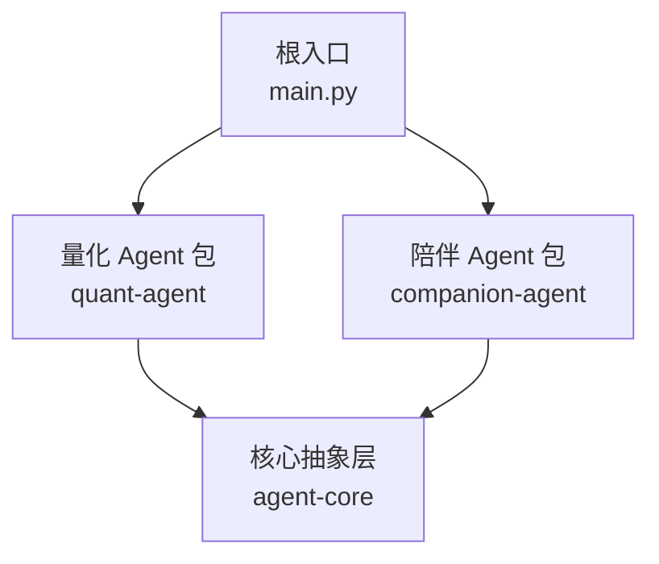
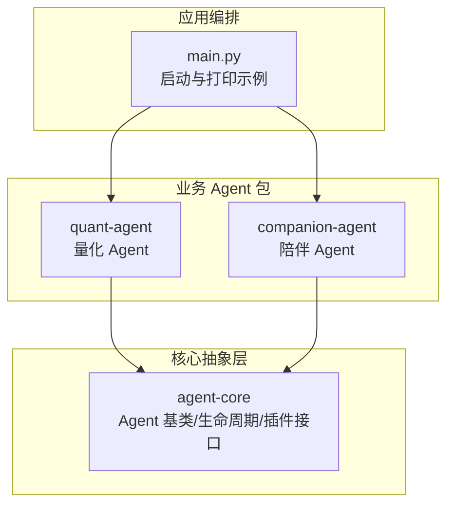
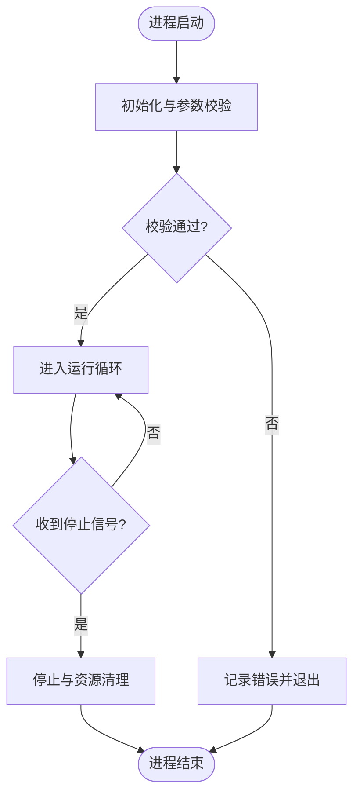
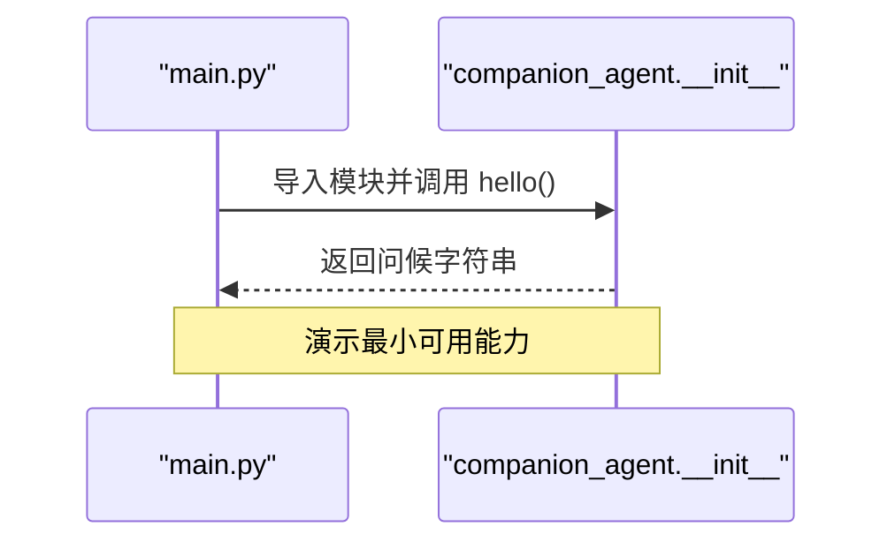
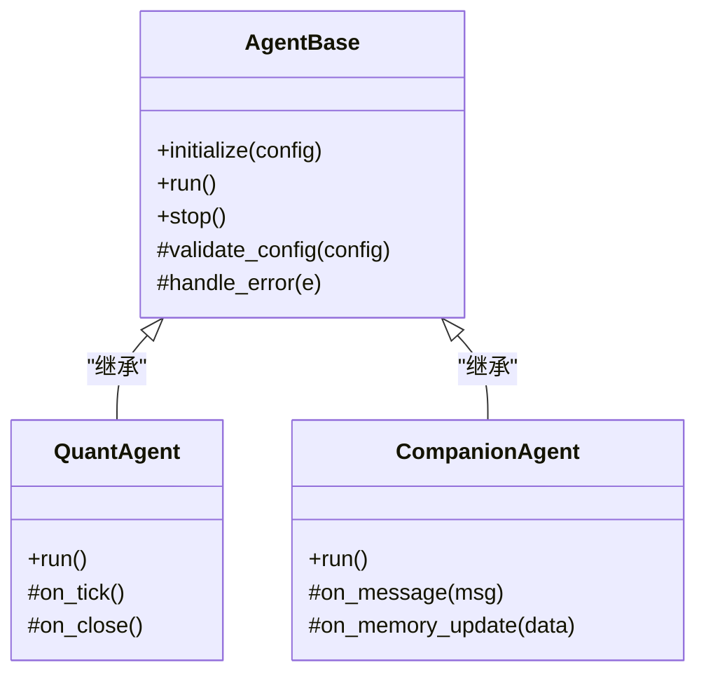
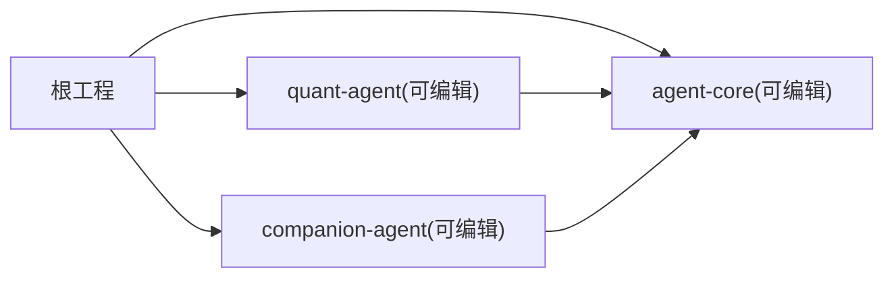

# Agent 基类设计

<cite>
**本文引用的文件**   
- [main.py](file://main.py)
- [pyproject.toml](file://packages/agent-core/pyproject.toml)
- [README.md](file://packages/agent-core/README.md)
- [__init__.py](file://packages/agent-core/src/agent_core/__init__.py)
- [__init__.py](file://packages/companion-agent/src/companion_agent/__init__.py)
- [uv.lock](file://uv.lock)
</cite>

## 目录
1. [简介](#简介)
2. [项目结构](#项目结构)
3. [核心组件](#核心组件)
4. [架构总览](#架构总览)
5. [详细组件分析](#详细组件分析)
6. [依赖分析](#依赖分析)
7. [性能考虑](#性能考虑)
8. [故障排查指南](#故障排查指南)
9. [结论](#结论)
10. [附录](#附录)

## 简介
本文件聚焦于 Agent 基类的设计与使用，目标是帮助开发者理解并正确继承 Agent 基类，实现必要的抽象方法，掌握生命周期钩子、参数校验与错误处理机制。文档同时提供最佳实践与常见陷阱建议，确保在 JanusAgent 多包工程下稳定扩展新的 Agent 类型（如量化 Agent、陪伴 Agent）。

## 项目结构
JanusAgent 采用多包组织方式，核心抽象层位于 agent-core，具体业务 Agent 以独立包形式存在（quant-agent、companion-agent），顶层 main.py 作为编排入口。

图表来源
- [main.py:1-12](file://main.py#L1-L12)
- [pyproject.toml:1-17](file://packages/agent-core/pyproject.toml#L1-L17)

章节来源
- [main.py:1-12](file://main.py#L1-L12)
- [pyproject.toml:1-17](file://packages/agent-core/pyproject.toml#L1-L17)
- [README.md:1-16](file://packages/agent-core/README.md#L1-L16)

## 核心组件
- 核心抽象层（agent-core）：定义 Agent 内核基类、生命周期管理与插件化接口。该包为其他 Agent 包提供统一扩展点。
- 量化 Agent（quant-agent）：面向量化场景的 Agent 实现。
- 陪伴 Agent（companion-agent）：面向对话与情感陪伴的 Agent 实现。
- 顶层编排（main.py）：加载并调用各 Agent 包的对外能力。

章节来源
- [README.md:1-16](file://packages/agent-core/README.md#L1-L16)
- [pyproject.toml:1-17](file://packages/agent-core/pyproject.toml#L1-L17)

## 架构总览
下图展示了从顶层入口到各 Agent 包以及核心抽象层的整体关系。

图表来源
- [main.py:1-12](file://main.py#L1-L12)
- [pyproject.toml:1-17](file://packages/agent-core/pyproject.toml#L1-L17)

## 详细组件分析

### Agent 基类与抽象接口
- 职责定位
  - 提供统一的 Agent 抽象：包括初始化流程、运行循环、停止清理等生命周期钩子。
  - 定义插件化接口：允许外部能力（记忆、规则、技能、上下文等）通过标准接口接入。
- 关键约定
  - 初始化阶段：完成配置解析、依赖注入、资源准备与参数校验。
  - 运行阶段：暴露 run 或类似主循环方法，供子类覆盖以实现业务逻辑。
  - 停止阶段：释放资源、持久化状态、上报指标。
- 继承关系
  - 所有具体 Agent 均继承自 agent-core 提供的基类，复用通用生命周期与错误处理。

章节来源
- [README.md:1-16](file://packages/agent-core/README.md#L1-L16)
- [pyproject.toml:1-17](file://packages/agent-core/pyproject.toml#L1-L17)

### 生命周期钩子与扩展点
- 启动（start）
  - 负责读取配置、建立连接、预热缓存、注册插件。
  - 若失败应抛出明确异常，由上层捕获并终止启动。
- 运行（run）
  - 子类在此实现核心工作流；基类可封装重试、超时、心跳、监控埋点。
- 停止（stop）
  - 执行优雅退出：关闭连接、保存状态、清理临时文件、输出统计信息。

图表来源
- [README.md:1-16](file://packages/agent-core/README.md#L1-L16)

### 参数验证与错误处理
- 参数验证
  - 建议在初始化阶段集中校验必填项、取值范围与格式，尽早失败。
- 错误处理
  - 区分可恢复与不可恢复错误；对可恢复错误进行限流与退避，对不可恢复错误快速失败并上报。
  - 统一错误码与日志规范，便于追踪与告警。

章节来源
- [README.md:1-16](file://packages/agent-core/README.md#L1-L16)

### 继承与实现要点（以 companion-agent 为例）
- 目标
  - 展示如何基于 agent-core 的抽象，构建一个具备对外能力的 Agent 包。
- 步骤
  - 在包内定义对外函数（例如 hello），用于演示能力。
  - 在 __main__ 或脚本入口中调用对外函数，完成最小可用闭环。
  - 将具体 Agent 类继承自 agent-core 的基类，并在 run 中实现对话/记忆等业务逻辑。

图表来源
- [main.py:1-12](file://main.py#L1-L12)
- [__init__.py:1-15](file://packages/companion-agent/src/companion_agent/__init__.py#L1-L15)

章节来源
- [__init__.py:1-15](file://packages/companion-agent/src/companion_agent/__init__.py#L1-L15)
- [main.py:1-12](file://main.py#L1-L12)

### 代码级类图（概念映射）
以下类图为概念性映射，用于说明“基类—子类”的继承关系与职责划分。实际类名与成员以 agent-core 的实现为准。

图表来源
- [README.md:1-16](file://packages/agent-core/README.md#L1-L16)

## 依赖分析
- 顶层 main.py 依赖 quant-agent 与 companion-agent 两个包，并通过其对外 API 进行交互。
- agent-core 作为核心抽象层被多个业务 Agent 包依赖，形成稳定的分层结构。
- uv.lock 显示 agent-core、agent-rl、companion-agent、quant-agent 均为本地可编辑依赖，便于开发与联调。

图表来源
- [uv.lock:2158-2195](file://uv.lock#L2158-L2195)

章节来源
- [uv.lock:2158-2195](file://uv.lock#L2158-L2195)
- [main.py:1-12](file://main.py#L1-L12)

## 性能考虑
- 初始化成本
  - 将昂贵资源（模型、连接池、索引）延迟加载或按需创建，避免冷启动过长。
- 运行期开销
  - 在 run 循环中避免阻塞 I/O；必要时引入异步或线程池。
  - 合理设置批大小与并发度，平衡吞吐与延迟。
- 停止与清理
  - 优雅退出时批量落盘与压缩，减少磁盘抖动。
- 监控与可观测性
  - 在关键路径埋点耗时、错误率与队列长度，便于容量规划与问题定位。

[本节为通用指导，不直接分析具体文件]

## 故障排查指南
- 启动失败
  - 检查配置文件是否齐全、必填字段是否缺失、权限与网络可达性。
  - 查看初始化阶段的日志与异常堆栈，确认是否为参数校验失败或依赖不可用。
- 运行期异常
  - 关注重试与退避策略是否生效；区分瞬时错误与数据不一致导致的错误。
  - 核对输入数据的合法性与边界条件，必要时增加断言与单元测试。
- 停止异常
  - 确认资源释放顺序，避免死锁与悬挂句柄；检查是否有未完成的写入任务。

章节来源
- [README.md:1-16](file://packages/agent-core/README.md#L1-L16)

## 结论
通过 agent-core 提供的统一基类与生命周期管理，JanusAgent 实现了跨领域 Agent 的可插拔与可扩展。遵循本文的继承规范、参数校验与错误处理约定，可以高效地构建稳定可靠的 Agent 实现。配合完善的监控与测试，可在复杂生产环境中保持高可用与易维护性。

[本节为总结性内容，不直接分析具体文件]

## 附录

### 快速上手清单
- 新建 Agent 包
  - 在 packages 下新增包目录，编写 pyproject.toml 声明依赖 agent-core。
  - 在 src/<package>/__init__.py 中定义对外 API（如 hello/main）。
- 继承 Agent 基类
  - 在业务包中引入 agent-core 的基类，实现 initialize/run/stop。
  - 在 run 中实现核心工作流，注意异常与日志。
- 集成到顶层
  - 在 main.py 中导入新包并调用其对外 API，验证端到端流程。

章节来源
- [pyproject.toml:1-17](file://packages/agent-core/pyproject.toml#L1-L17)
- [README.md:1-16](file://packages/agent-core/README.md#L1-L16)
- [main.py:1-12](file://main.py#L1-L12)