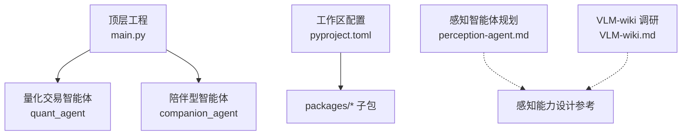
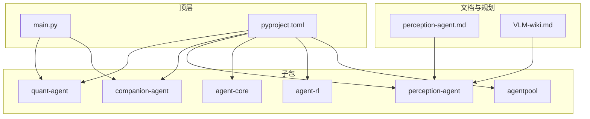
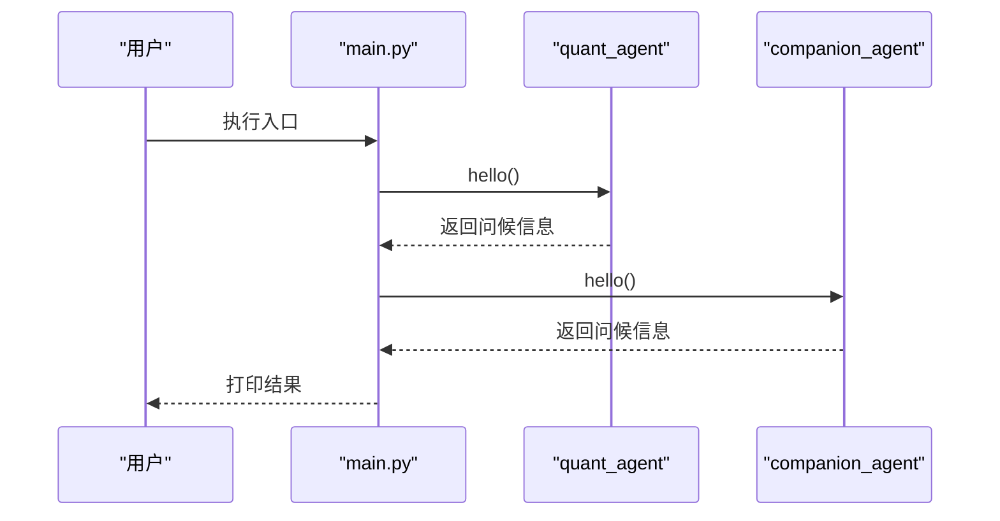
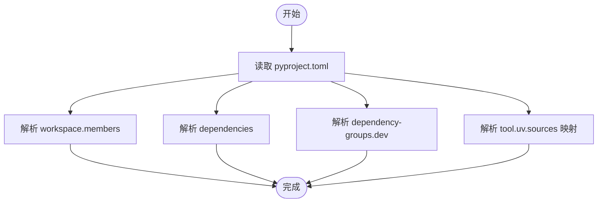
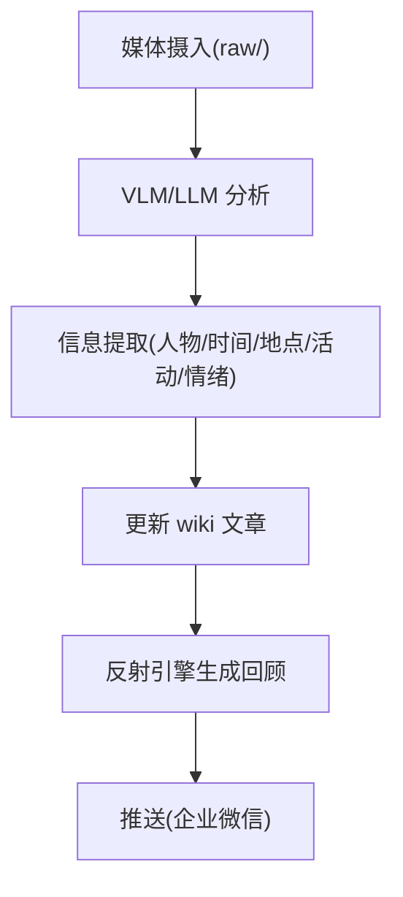
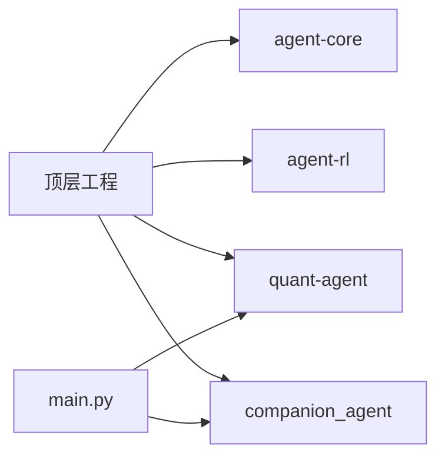

# 感知智能体框架

<cite>
**本文引用的文件**   
- [main.py](file://main.py)
- [pyproject.toml](file://pyproject.toml)
- [perception-agent.md](file://docs/plans/perception-agent.md)
- [VLM-wiki.md](file://docs/survey/perception/VLM-wiki.md)
</cite>

## 目录
1. [简介](#简介)
2. [项目结构](#项目结构)
3. [核心组件](#核心组件)
4. [架构总览](#架构总览)
5. [详细组件分析](#详细组件分析)
6. [依赖关系分析](#依赖关系分析)
7. [性能与可扩展性](#性能与可扩展性)
8. [故障排查指南](#故障排查指南)
9. [结论](#结论)
10. [附录](#附录)

## 简介
本仓库为“JanusAgent”双面个人智能体框架的顶层工程，聚合多个子包（agent-core、agent-rl、quant-agent、companion-agent 等），并提供统一入口。当前仓库中已包含感知智能体的规划文档与多模态知识库（VLM-wiki）调研总结，用于指导后续感知能力的落地与集成。

## 项目结构
- 顶层工程负责：
  - 定义工作区成员与依赖（通过 pyproject.toml 声明 workspace 与依赖）。
  - 提供统一启动入口 main.py，打印各子包的问候信息以验证环境。
- 文档与计划：
  - docs/plans/perception-agent.md：感知智能体现状背景与初步规划。
  - docs/survey/perception/VLM-wiki.md：对 VLM-wiki 的全模态知识管理方案进行系统性评估，提炼可借鉴点。
- packages/*：子包目录（agent-core、agent-rl、quant-agent、companion-agent、perception-agent、agentpool），具体实现位于各自包内。

图示来源
- [main.py:1-13](file://main.py#L1-L13)
- [pyproject.toml:1-30](file://pyproject.toml#L1-L30)

章节来源
- [main.py:1-13](file://main.py#L1-L13)
- [pyproject.toml:1-30](file://pyproject.toml#L1-L30)

## 核心组件
- 顶层入口 main.py
  - 作用：初始化并调用 quant_agent 与 companion_agent 的 hello 函数，输出欢迎信息，用于快速验证运行环境与依赖是否就绪。
- 工作区与依赖 pyproject.toml
  - 作用：声明项目名称、版本、Python 版本要求；通过 uv workspace 将 packages/* 纳入工作区；在 dependency-groups 中声明开发依赖；在 tool.uv.sources 中将 agent-core、agent-rl、quant-agent、companion-agent 映射到工作区成员。
- 感知智能体规划 perception-agent.md
  - 作用：记录感知智能体现状背景（如销售场景需要大量多模态知识：文档、音视频），作为后续设计与落地的输入。
- VLM-wiki 调研 VLM-wiki.md
  - 作用：系统梳理全模态个人知识库的三层架构（raw/wiki/.vlmwiki）、数据流、关键脚本与实现状态，提炼出可直接复用的导入去重机制、反射回顾模式与推送通道，为感知智能体的媒体摄入与知识沉淀提供参考。

章节来源
- [main.py:1-13](file://main.py#L1-L13)
- [pyproject.toml:1-30](file://pyproject.toml#L1-L30)
- [perception-agent.md:1-4](file://docs/plans/perception-agent.md#L1-L4)
- [VLM-wiki.md:1-297](file://docs/survey/perception/VLM-wiki.md#L1-L297)

## 架构总览
从顶层工程视角看，系统由“入口层 + 子包层 + 文档/规划层”构成：
- 入口层：main.py 负责编排与校验。
- 子包层：各业务智能体（量化、陪伴、感知等）按功能域拆分，便于独立演进。
- 文档/规划层：感知智能体规划与 VLM-wiki 调研为感知能力提供蓝图与参考实现思路。

图示来源
- [main.py:1-13](file://main.py#L1-L13)
- [pyproject.toml:1-30](file://pyproject.toml#L1-L30)
- [perception-agent.md:1-4](file://docs/plans/perception-agent.md#L1-L4)
- [VLM-wiki.md:1-297](file://docs/survey/perception/VLM-wiki.md#L1-L297)

## 详细组件分析

### 顶层入口与运行流程
- 运行流程
  - 程序启动后打印标题，依次调用 quant_agent.hello() 与 companion_agent.hello()，用于确认依赖可用。
- 关键点
  - 若任一子包未正确安装或不可导入，将抛出异常，便于早期发现环境问题。
  - 该入口适合扩展为统一的 CLI 或任务调度器，以便后续接入感知智能体。

图示来源
- [main.py:1-13](file://main.py#L1-L13)

章节来源
- [main.py:1-13](file://main.py#L1-L13)

### 工作区与依赖管理
- 工作区成员
  - 通过 [tool.uv.workspace] members = ["packages/*"] 将所有子包纳入工作区，便于统一构建与依赖解析。
- 依赖声明
  - 顶层依赖包括 agent-core、agent-rl、quant-agent、companion-agent。
  - 开发依赖包含 pre-commit、ruff。
- 源码映射
  - 使用 [tool.uv.sources] 将依赖名映射到工作区成员，确保本地开发时直接引用源码而非远程包。

图示来源
- [pyproject.toml:1-30](file://pyproject.toml#L1-L30)

章节来源
- [pyproject.toml:1-30](file://pyproject.toml#L1-L30)

### 感知智能体规划与 VLM-wiki 调研要点
- 感知智能体现状
  - 销售场景需要大量多模态知识（文档、音视频），为感知智能体提供了明确的需求背景。
- VLM-wiki 可借鉴点
  - 三层架构（raw/wiki/.vlmwiki）：原始材料只读、知识沉淀、配置分层。
  - 导入去重机制：基于 manifest 的文件指纹避免重复导入。
  - 反射回顾模式：Snapshot + What History Says + Recommended Next Actions 三段式输出。
  - 推送通道：企业微信 webhook/自建应用消息两种模式。
  - 模型配置：支持多种 VLM/LLM 提供商，可通过 config.local.json 覆写敏感配置。

图示来源
- [VLM-wiki.md:66-74](file://docs/survey/perception/VLM-wiki.md#L66-L74)
- [VLM-wiki.md:139-146](file://docs/survey/perception/VLM-wiki.md#L139-L146)
- [VLM-wiki.md:104-125](file://docs/survey/perception/VLM-wiki.md#L104-L125)

章节来源
- [perception-agent.md:1-4](file://docs/plans/perception-agent.md#L1-L4)
- [VLM-wiki.md:1-297](file://docs/survey/perception/VLM-wiki.md#L1-L297)

## 依赖关系分析
- 顶层工程依赖
  - 运行时依赖：agent-core、agent-rl、quant-agent、companion-agent。
  - 开发依赖：pre-commit、ruff。
- 工作区映射
  - 所有依赖均通过 uv sources 指向工作区成员，保证本地开发一致性。
- 入口依赖
  - main.py 仅依赖 quant_agent 与 companion_agent 两个模块，耦合度低，便于扩展更多子包。

图示来源
- [pyproject.toml:1-30](file://pyproject.toml#L1-L30)
- [main.py:1-13](file://main.py#L1-L13)

章节来源
- [pyproject.toml:1-30](file://pyproject.toml#L1-L30)
- [main.py:1-13](file://main.py#L1-L13)

## 性能与可扩展性
- 性能
  - 当前入口仅做简单调用与打印，不涉及 I/O 密集或计算密集型逻辑，性能瓶颈不在顶层。
- 可扩展性
  - 通过 uv workspace 与模块化依赖，新增感知智能体（perception-agent）与其他子包互不影响。
  - 建议未来在 main.py 中引入统一 CLI/任务编排，按需加载子包能力，避免不必要的导入开销。

[本节为通用指导，不直接分析具体文件]

## 故障排查指南
- 常见问题
  - 子包未安装或路径错误：检查 pyproject.toml 的 dependencies 与 tool.uv.sources 映射是否正确。
  - Python 版本不匹配：requires-python 要求 >=3.12，请确保环境满足。
  - 模块导入失败：确认 quant_agent 与 companion_agent 已在 packages 下存在并可被 uv 解析。
- 定位步骤
  - 先单独运行 main.py，观察报错来自哪个子包。
  - 检查 uv.lock 与工作区成员是否一致。
  - 清理缓存后重新解析依赖（uv sync / uv lock）。

章节来源
- [pyproject.toml:1-30](file://pyproject.toml#L1-L30)
- [main.py:1-13](file://main.py#L1-L13)

## 结论
- 顶层工程已完成基础编排与依赖声明，具备快速验证与扩展能力。
- 感知智能体方向已有明确的背景与参考方案（VLM-wiki），可在后续迭代中优先打通“媒体摄入 → 分析 → 知识沉淀 → 回顾推送”的关键链路。
- 建议在 main.py 中逐步引入统一 CLI/任务编排，并将感知智能体作为可选能力按需加载。

[本节为总结性内容，不直接分析具体文件]

## 附录
- 术语说明
  - VLM：视觉语言模型，用于理解图像/视频等多模态内容。
  - LLM：大语言模型，用于文本理解与生成。
  - raw/wiki/.vlmwiki：VLM-wiki 的三层目录结构，分别对应源材料、知识沉淀与配置。

[本节为概念性内容，不直接分析具体文件]