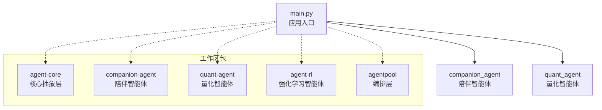
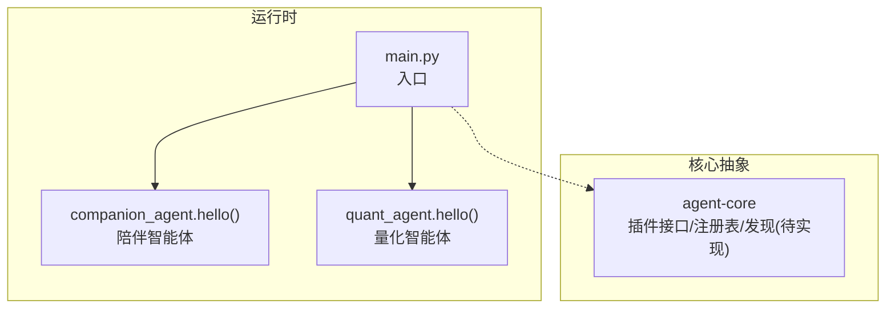
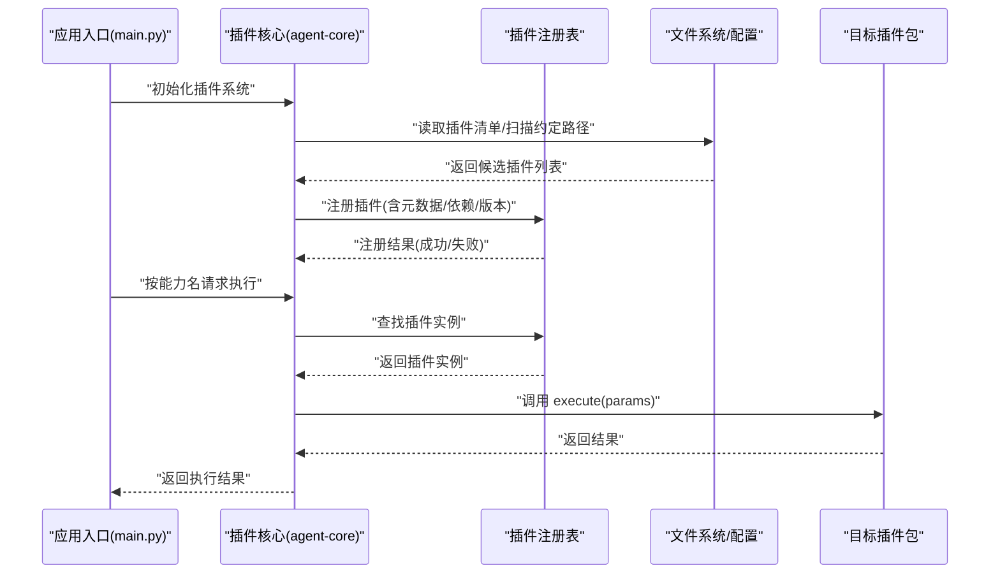
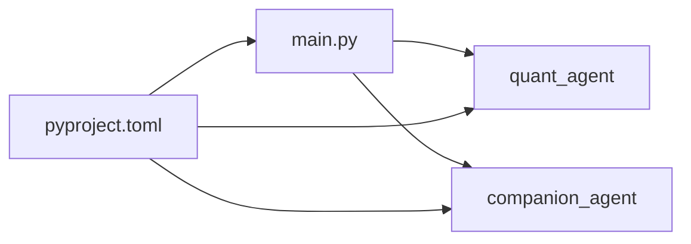

# 插件化系统

<cite>
**本文引用的文件**   
- [main.py](file://main.py)
- [pyproject.toml](file://pyproject.toml)
- [agent-core README.md](file://packages/agent-core/README.md)
- [agent-core pyproject.toml](file://packages/agent-core/pyproject.toml)
- [agent-core __init__.py](file://packages/agent-core/src/agent_core/__init__.py)
- [companion-agent __init__.py](file://packages/companion-agent/src/companion_agent/__init__.py)
- [companion-agent chat.py](file://packages/companion-agent/src/companion_agent/chat.py)
- [companion-agent memory.py](file://packages/companion-agent/src/companion_agent/memory.py)
</cite>

## 目录
1. [简介](#简介)
2. [项目结构](#项目结构)
3. [核心组件](#核心组件)
4. [架构总览](#架构总览)
5. [详细组件分析](#详细组件分析)
6. [依赖关系分析](#依赖关系分析)
7. [性能考虑](#性能考虑)
8. [故障排查指南](#故障排查指南)
9. [结论](#结论)
10. [附录](#附录)

## 简介
本技术文档围绕 JanusAgent 的插件化系统进行系统化说明，重点覆盖以下方面：
- 插件接口定义与发现机制
- 动态加载流程与注册表管理（元数据解析、依赖检查、版本兼容）
- 执行引擎（调用协议、参数传递、返回值处理）
- 自定义插件与第三方插件集成示例
- 安全沙箱与性能监控方案

当前仓库处于早期阶段，已具备多包工作区结构与最小可运行入口。插件化能力在 agent-core 中声明为“提供插件化接口定义”，但具体实现尚未展开。本文将基于现有代码与配置进行现状分析与扩展建议，帮助读者快速理解并在此基础上完善插件体系。

## 项目结构
仓库采用 uv workspace 组织多个子包，顶层 main.py 作为应用入口，通过导入各子包模块完成功能组合。关键结构如下：
- packages/agent-core：核心抽象层，声明提供“插件化接口定义”
- packages/companion-agent：陪伴智能体，包含对话与记忆的数据模型
- packages/quant-agent：量化智能体（存在包结构，当前未在本仓库中直接引用）
- packages/agent-rl：强化学习智能体（存在包结构，当前未在本仓库中直接引用）
- packages/agentpool：编排层（存在包结构，当前未在本仓库中直接引用）

图表来源
- [main.py:1-13](file://main.py#L1-L13)
- [pyproject.toml:1-30](file://pyproject.toml#L1-L30)

章节来源
- [main.py:1-13](file://main.py#L1-L13)
- [pyproject.toml:1-30](file://pyproject.toml#L1-L30)

## 核心组件
- 应用入口 main.py：打印欢迎信息并调用各子包的 hello() 方法，体现“按包聚合”的插件式组合方式。
- companion-agent：提供 __version__、hello()、聊天消息 Message、记忆 Memory 等基础数据结构与对外接口。
- agent-core：README 明确其职责为“提供 Agent 内核基类、生命周期管理、插件化接口定义”，是未来插件体系的契约层。

章节来源
- [main.py:1-13](file://main.py#L1-L13)
- [companion-agent __init__.py:1-15](file://packages/companion-agent/src/companion_agent/__init__.py#L1-L15)
- [companion-agent chat.py:1-12](file://packages/companion-agent/src/companion_agent/chat.py#L1-L12)
- [companion-agent memory.py:1-12](file://packages/companion-agent/src/companion_agent/memory.py#L1-L12)
- [agent-core README.md:1-16](file://packages/agent-core/README.md#L1-L16)

## 架构总览
从现有代码看，JanusAgent 以“包即插件”的方式组织能力，通过工作区统一管理与依赖注入。当前并未实现自动发现与动态加载，而是显式 import 子包并调用其 API。后续可在 agent-core 中引入插件接口、注册表与发现机制，将显式导入替换为基于约定或配置的动态加载。

图表来源
- [main.py:1-13](file://main.py#L1-L13)
- [companion-agent __init__.py:1-15](file://packages/companion-agent/src/companion_agent/__init__.py#L1-L15)

## 详细组件分析

### 插件接口与发现机制（现状与建议）
- 现状
  - agent-core 的 README 声明了“插件化接口定义”，但当前源码仅包含一个占位 main()，未见具体接口定义与发现逻辑。
  - 当前加载方式为显式 import，非自动发现。
- 建议设计
  - 插件接口：定义统一的 Plugin 抽象（如 initialize、execute、shutdown），以及元数据描述（名称、版本、依赖、能力清单）。
  - 发现机制：基于约定路径扫描（如 packages/*/src/* 下符合命名约定的模块）、或基于配置文件（如 .agent/skills/ 下的索引）生成插件清单。
  - 注册表：维护插件实例与元数据的映射，支持按能力查询与版本约束匹配。

章节来源
- [agent-core README.md:1-16](file://packages/agent-core/README.md#L1-L16)
- [agent-core __init__.py:1-3](file://packages/agent-core/src/agent_core/__init__.py#L1-L3)

### 动态加载流程（建议）
以下为推荐的动态加载序列图，展示从发现到调用的端到端流程：

[此图为概念性流程图，不直接映射具体源文件]

### 插件注册表管理（建议）
- 元数据解析：从插件包 __init__.py 或独立 manifest.json 中解析 name、version、requires、capabilities 等字段。
- 依赖检查：构建依赖有向图，检测循环依赖与缺失依赖；对不满足的版本范围进行拒绝加载。
- 版本兼容：使用语义化版本比较，确保主版本兼容策略（如 ^x.y.z）。

章节来源
- [agent-core README.md:1-16](file://packages/agent-core/README.md#L1-L16)

### 执行引擎（建议）
- 调用协议：定义统一的 execute(plugin_id, params) -> result 接口，params/result 使用结构化类型（如 Pydantic 模型）。
- 参数传递：支持位置参数、关键字参数、流式回调（可选）。
- 返回值处理：统一包装为 Result 对象，包含 data、error、metadata（耗时、trace_id 等）。

章节来源
- [agent-core README.md:1-16](file://packages/agent-core/README.md#L1-L16)

### 自定义插件开发示例（基于现有结构的落地步骤）
- 新建包：在 packages 下新增 my-plugin，遵循 src/my_plugin/__init__.py 暴露 hello() 或 execute()。
- 声明元数据：在包内 __init__.py 或 manifest.json 中声明 name、version、requires、capabilities。
- 注册与发现：在 agent-core 中增加发现规则，使新包被自动识别并注册。
- 调用：在 main.py 中通过插件核心按能力名调用，替代硬编码 import。

章节来源
- [pyproject.toml:1-30](file://pyproject.toml#L1-L30)
- [agent-core README.md:1-16](file://packages/agent-core/README.md#L1-L16)

### 第三方插件集成示例
- 外部包安装：通过 uv 或 pip 安装第三方插件包。
- 清单配置：在 .agent/skills/ 或插件清单文件中登记该包的能力与版本约束。
- 启动加载：应用启动时由 agent-core 发现并加载，随后即可通过统一接口调用。

章节来源
- [pyproject.toml:1-30](file://pyproject.toml#L1-30)

### 安全沙箱机制（建议）
- 进程隔离：对不受信插件使用子进程执行，限制资源（CPU、内存、I/O）。
- 权限控制：白名单导入、网络访问限制、文件系统访问受限。
- 超时与熔断：设置最大执行时间与重试上限，避免阻塞主流程。
- 审计日志：记录插件调用链路与异常堆栈，便于追踪问题。

[本节为通用安全建议，不直接分析具体文件]

### 性能监控方案（建议）
- 指标采集：收集插件调用次数、延迟分布、错误率、资源占用。
- 链路追踪：为每次调用生成 trace_id，串联跨插件调用链。
- 告警与降级：对慢调用与高错误率触发告警，必要时启用降级策略。
- 可视化：对接 Prometheus/Grafana 或本地日志看板。

[本节为通用性能建议，不直接分析具体文件]

## 依赖关系分析
当前顶层应用 main.py 显式导入 quant_agent 与 companion_agent，并通过 pyproject.toml 声明工作区成员与依赖。

图表来源
- [main.py:1-13](file://main.py#L1-L13)
- [pyproject.toml:1-30](file://pyproject.toml#L1-30)

章节来源
- [main.py:1-13](file://main.py#L1-L13)
- [pyproject.toml:1-30](file://pyproject.toml#L1-30)

## 性能考虑
- 按需加载：仅在需要时导入插件模块，减少冷启动开销。
- 连接复用：若插件涉及 I/O（数据库、网络），应复用连接池。
- 批处理与缓存：对高频小任务进行批处理与结果缓存。
- 异步化：对长耗时操作使用异步或线程池，避免阻塞主线程。

[本节为通用性能建议，不直接分析具体文件]

## 故障排查指南
- 启动失败
  - 检查 main.py 是否正确导入所需插件包。
  - 确认 pyproject.toml 中依赖与工作区成员配置正确。
- 插件未生效
  - 确认插件包是否位于工作区或已被安装。
  - 若采用清单发现，检查清单格式与路径是否正确。
- 运行时异常
  - 查看插件内部日志与异常堆栈。
  - 核对插件版本与依赖约束是否满足。

章节来源
- [main.py:1-13](file://main.py#L1-L13)
- [pyproject.toml:1-30](file://pyproject.toml#L1-30)

## 结论
当前仓库已具备清晰的多包结构与最小可运行入口，并在 agent-core 中明确了“插件化接口定义”的职责定位。下一步建议在 agent-core 中补齐插件接口、注册表与发现机制，将显式导入升级为基于约定或配置的动态加载，同时完善元数据解析、依赖检查与版本兼容性验证，从而形成完整的插件化体系。

## 附录
- 开发命令参考：见项目上下文中的“Development Commands”。
- 技能与配置目录：.agent/ 目录用于 AI Agent 指令与技能配置，可作为插件清单与能力的承载位置之一。

章节来源
- [agent-core README.md:1-16](file://packages/agent-core/README.md#L1-L16)