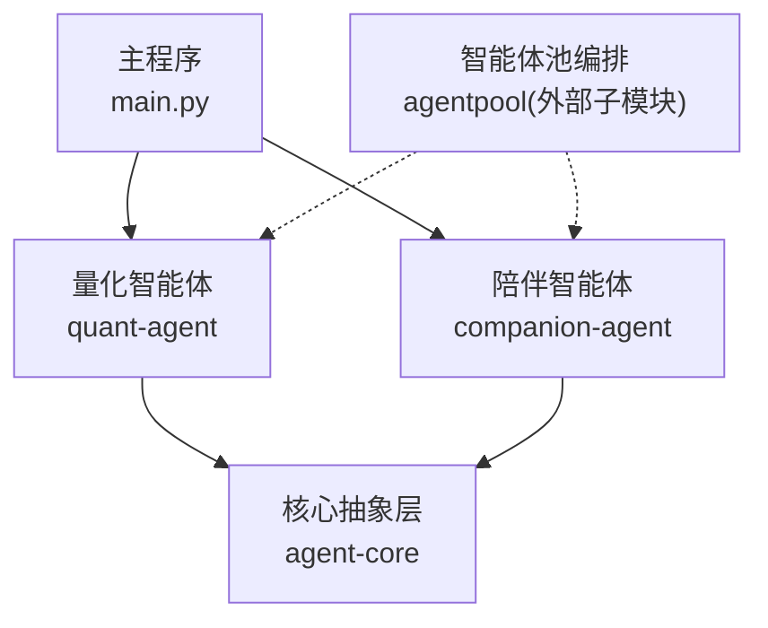
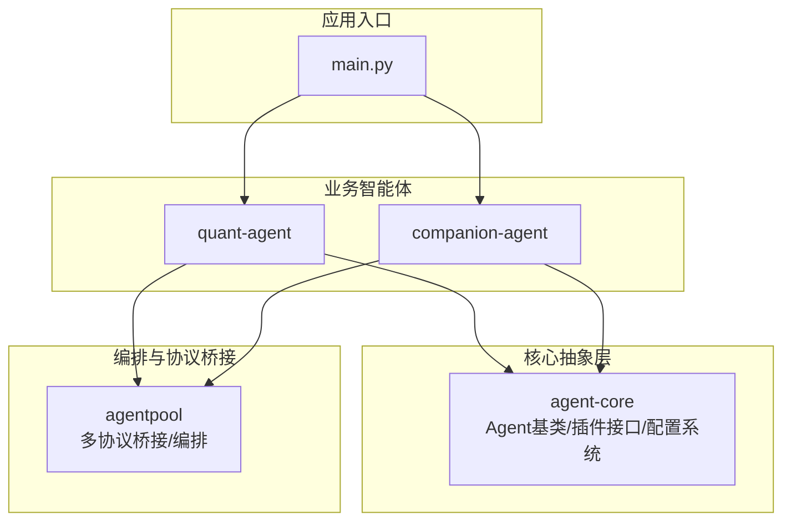
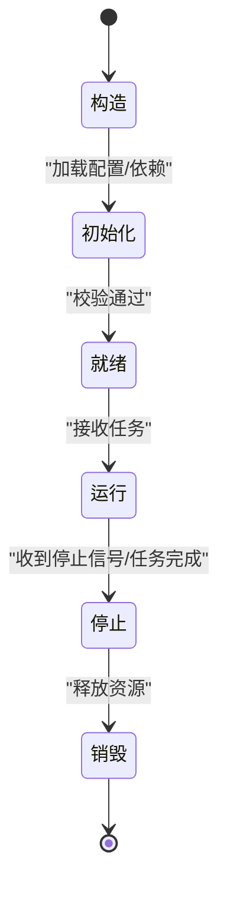
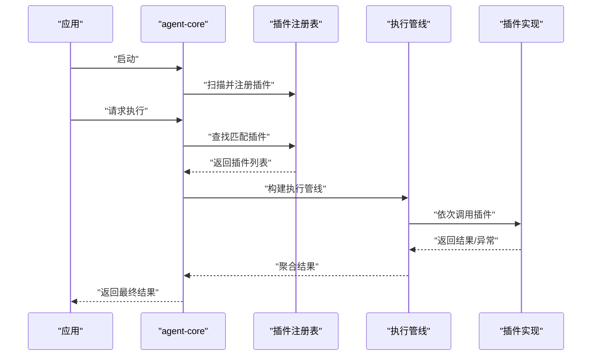
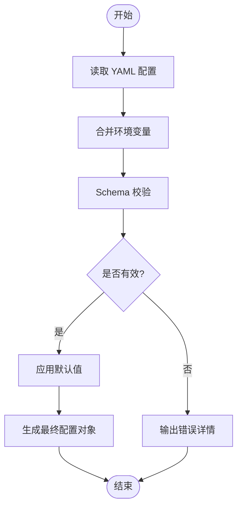
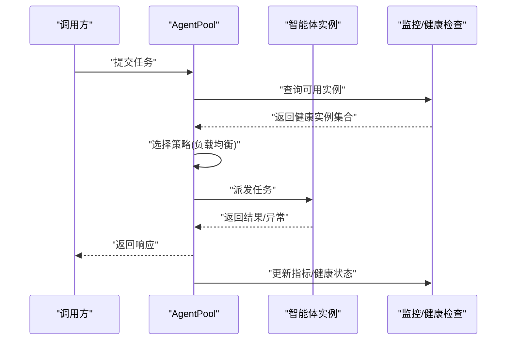
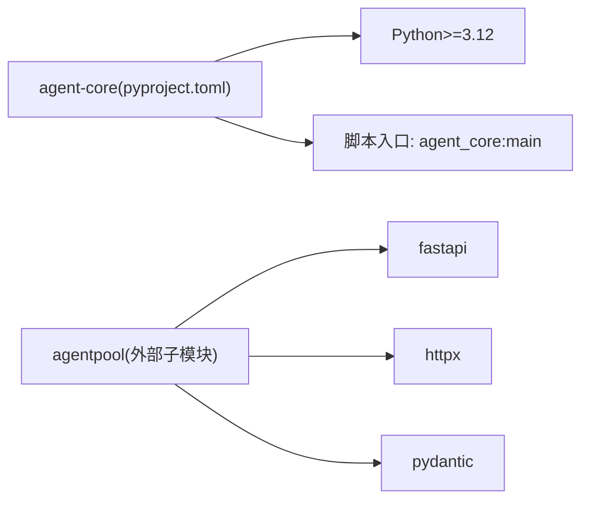

# 核心框架

<cite>
**本文引用的文件**   
- [main.py](file://main.py)
- [README.md](file://packages/agent-core/README.md)
- [pyproject.toml](file://packages/agent-core/pyproject.toml)
- [uv.lock](file://uv.lock)
- [项目上下文.md](file://.agent/context/project.md)
</cite>

## 目录
1. [简介](#简介)
2. [项目结构](#项目结构)
3. [核心组件](#核心组件)
4. [架构总览](#架构总览)
5. [详细组件分析](#详细组件分析)
6. [依赖分析](#依赖分析)
7. [性能考虑](#性能考虑)
8. [故障排查指南](#故障排查指南)
9. [结论](#结论)
10. [附录](#附录)

## 简介
本技术文档聚焦 agent-core 核心抽象层，围绕以下目标展开：
- Agent 基类的设计与实现要点（生命周期、状态转换、事件处理）
- 插件化接口模式（注册、发现、执行流程）
- 配置管理系统（YAML 解析、环境变量集成、配置验证）
- AgentPool 智能体池管理（创建、销毁、负载均衡、监控）
- 自定义智能体的继承示例与最佳实践
- 性能优化建议

说明：当前仓库中 agent-core 包以“核心抽象层”定位对外提供能力，具体源码未在本工作区直接暴露。本文基于仓库元数据、脚本入口与上下文文档进行系统化梳理，确保读者能够理解整体设计与使用方式。

章节来源
- [README.md:1-16](file://packages/agent-core/README.md#L1-L16)

## 项目结构
仓库采用 uv workspace 多包组织，agent-core 作为核心抽象层被上层业务 Agent 复用。顶层入口 main.py 负责组合并启动各子包能力。

图表来源
- [main.py:1-13](file://main.py#L1-L13)
- [项目上下文.md:77-137](file://.agent/context/project.md#L77-L137)

章节来源
- [main.py:1-13](file://main.py#L1-L13)
- [项目上下文.md:77-137](file://.agent/context/project.md#L77-L137)

## 核心组件
- Agent 内核基类
  - 职责：定义智能体的统一生命周期钩子、状态机、事件总线与扩展点。
  - 关键能力：初始化、运行、停止；状态迁移校验；事件订阅/发布；资源清理。
- 插件化接口
  - 职责：定义插件契约、注册表、发现策略与执行管线。
  - 关键能力：声明式注册、按条件发现、可插拔执行器、错误隔离。
- 配置系统
  - 职责：加载 YAML 配置、合并环境变量、执行 Schema 校验并提供默认值。
  - 关键能力：分层覆盖（文件→环境变量→默认）、类型校验、错误提示。
- AgentPool 智能体池
  - 职责：集中管理智能体实例的创建、回收、路由与观测指标。
  - 关键能力：并发控制、负载均衡、健康检查、指标上报。

章节来源
- [README.md:1-16](file://packages/agent-core/README.md#L1-L16)
- [项目上下文.md:77-137](file://.agent/context/project.md#L77-L137)

## 架构总览
下图展示从主程序到核心抽象层与外部编排层的交互关系。

图表来源
- [main.py:1-13](file://main.py#L1-L13)
- [项目上下文.md:77-137](file://.agent/context/project.md#L77-L137)

## 详细组件分析

### Agent 基类与生命周期
- 设计要点
  - 生命周期阶段：构造 → 初始化 → 就绪 → 运行 → 停止 → 销毁。
  - 状态机：每个阶段对应明确的状态，迁移需通过校验与钩子。
  - 事件系统：内部事件总线支持订阅/发布，用于解耦横切关注点（日志、遥测、审计）。
- 典型流程
  - 启动时完成依赖注入与配置加载，进入就绪态。
  - 接收任务后进入运行态，根据策略调度执行。
  - 优雅停止时触发资源释放与持久化保存。

[本节为概念性说明，不直接分析具体源文件，故无章节来源]

### 插件化接口模式
- 设计要点
  - 插件契约：统一的接口定义，包含初始化、执行、销毁等钩子。
  - 注册中心：维护插件名称到实现的映射，支持动态发现。
  - 执行管线：按顺序或并行调用插件，具备错误隔离与重试策略。
- 流程概览
  - 启动阶段扫描并注册插件。
  - 运行时根据上下文选择匹配插件。
  - 执行失败时回退或上报，不影响主流程。

[本节为概念性说明，不直接分析具体源文件，故无章节来源]

### 配置管理系统
- 设计要点
  - 分层加载：YAML 配置文件 → 环境变量 → 默认值。
  - 类型校验：基于 Schema 对字段进行强类型校验与约束检查。
  - 错误反馈：结构化错误信息，便于快速定位问题。
- 流程图

[本节为概念性说明，不直接分析具体源文件，故无章节来源]

### AgentPool 智能体池
- 设计要点
  - 生命周期管理：集中创建/销毁智能体实例，避免重复初始化开销。
  - 负载均衡：按策略（轮询、最少连接、权重）分发任务。
  - 监控与健康检查：采集指标、探测存活、自动剔除异常节点。
- 序列图

章节来源
- [项目上下文.md:77-137](file://.agent/context/project.md#L77-L137)

### 自定义智能体示例（步骤指引）
- 步骤
  - 继承 Agent 基类，实现必要钩子方法。
  - 在初始化阶段加载配置与依赖。
  - 在运行阶段处理业务逻辑，必要时发布事件。
  - 在停止阶段释放资源并持久化状态。
- 参考路径
  - 基类与生命周期钩子：参见 agent-core 包内 Agent 基类定义位置（由包入口与 README 可知该包提供基类与生命周期管理）。
  - 插件接口与注册：参见 agent-core 包内插件接口定义位置。
  - 配置加载与校验：参见 agent-core 包内配置系统实现位置。

章节来源
- [README.md:1-16](file://packages/agent-core/README.md#L1-L16)

## 依赖分析
- 包清单与版本
  - agent-core 包定义于 pyproject.toml，Python 要求 >=3.12，脚本入口为 agent_core:main。
- 外部编排依赖
  - agentpool 作为外部子模块引入，提供多协议桥接与编排能力。
- 锁文件中的相关依赖
  - uv.lock 中包含 agentpool 及其生态依赖（如 fastapi、httpx、pydantic 等），表明编排层具备 HTTP/MCP 等能力。

图表来源
- [pyproject.toml:1-17](file://packages/agent-core/pyproject.toml#L1-L17)
- [uv.lock:45-87](file://uv.lock#L45-L87)

章节来源
- [pyproject.toml:1-17](file://packages/agent-core/pyproject.toml#L1-L17)
- [uv.lock:45-87](file://uv.lock#L45-L87)

## 性能考虑
- 连接与并发
  - 合理设置线程/协程池大小，避免过度竞争导致抖动。
  - 对 I/O 密集场景优先使用异步模型，减少阻塞。
- 内存与对象复用
  - 复用重型对象（如客户端、模型句柄），避免频繁创建销毁。
  - 及时释放临时大对象，降低 GC 压力。
- 配置与序列化
  - 缓存已解析的配置对象，避免重复 IO 与反序列化。
  - 使用高效序列化格式（如 JSON/MessagePack）并限制消息体积。
- 监控与可观测性
  - 埋点关键路径耗时与错误率，结合告警阈值进行容量规划。
  - 定期采样指标，识别热点与瓶颈。

[本节为通用指导，不直接分析具体源文件，故无章节来源]

## 故障排查指南
- 常见问题定位
  - 启动失败：检查 Python 版本与依赖安装；确认脚本入口是否正确。
  - 配置错误：查看 YAML 语法与字段类型；核对环境变量覆盖是否符合预期。
  - 插件未生效：确认插件注册表是否扫描到实现；检查命名冲突与优先级。
  - 智能体池异常：观察健康检查与指标，定位异常实例并剔除。
- 建议操作
  - 开启详细日志与追踪 ID，串联跨组件调用链。
  - 使用最小复现配置逐步缩小问题范围。
  - 对关键路径增加断言与边界测试用例。

章节来源
- [项目上下文.md:77-137](file://.agent/context/project.md#L77-L137)

## 结论
agent-core 作为 JanusAgent 的核心抽象层，提供了统一的 Agent 基类、插件化接口与配置系统，配合 agentpool 的多协议编排能力，形成可扩展、可观测的智能体基础设施。遵循本文的最佳实践与性能建议，可在保证稳定性的同时获得良好的扩展性与运维体验。

[本节为总结性内容，不直接分析具体源文件，故无章节来源]

## 附录
- 开发命令
  - 安装依赖：uv sync
  - 运行核心：uv run agent-core
- 顶层入口
  - main.py 会组合 quant-agent 与 companion-agent 的能力并打印问候信息。

章节来源
- [README.md:1-16](file://packages/agent-core/README.md#L1-L16)
- [main.py:1-13](file://main.py#L1-L13)