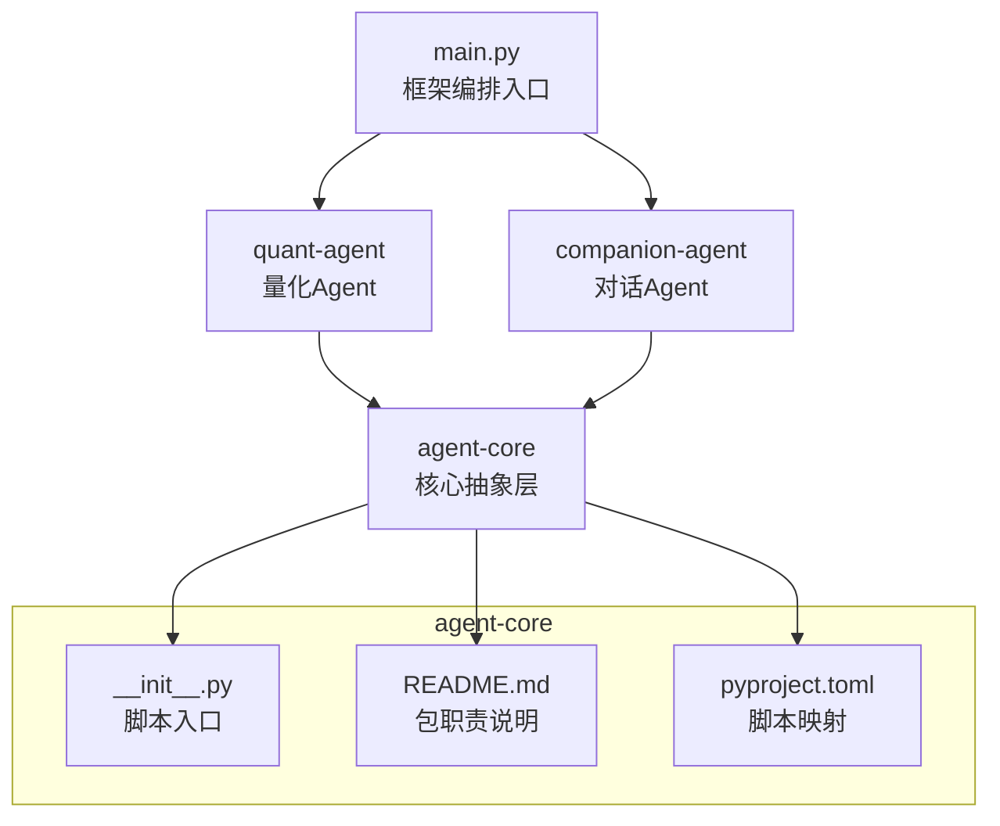
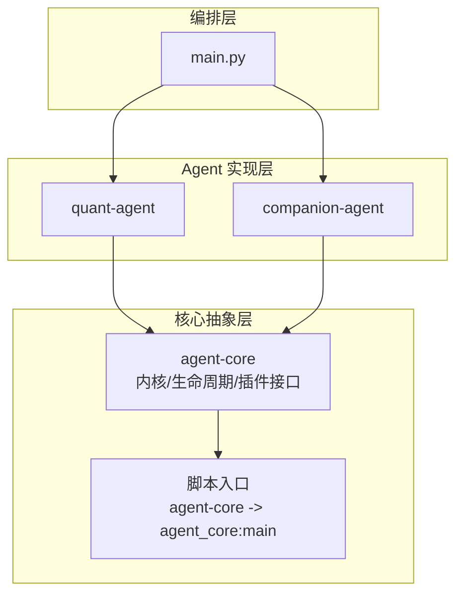
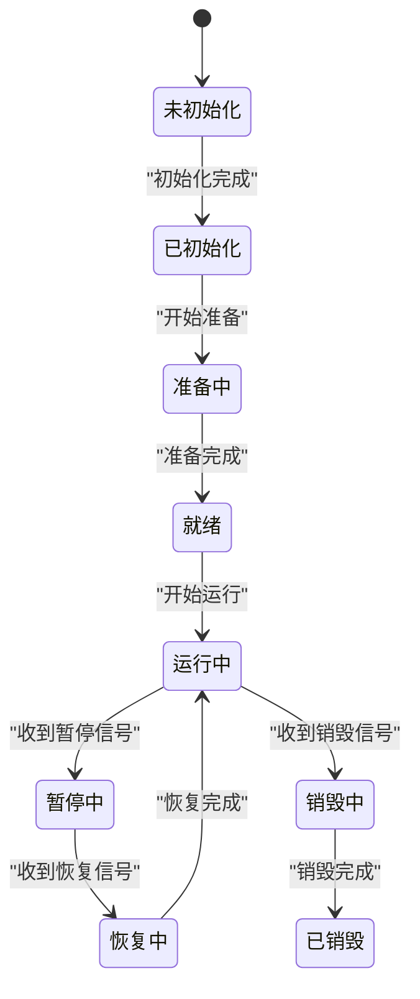
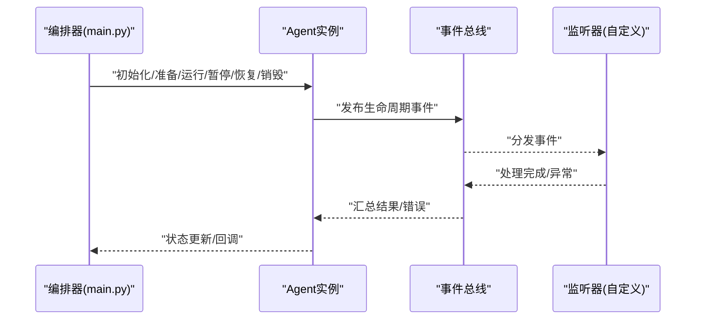
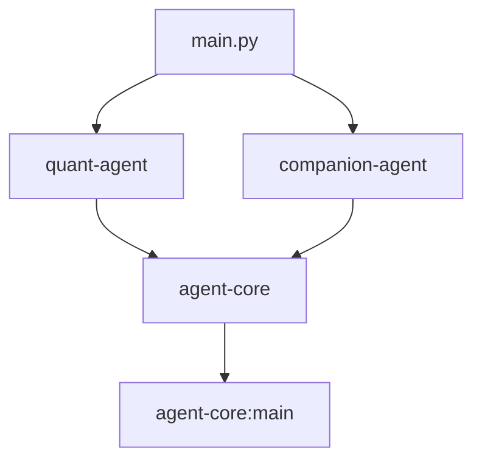

# 生命周期管理

<cite>
**本文引用的文件**   
- [main.py](file://main.py)
- [agent-core README.md](file://packages/agent-core/README.md)
- [agent-core pyproject.toml](file://packages/agent-core/pyproject.toml)
- [agent-core __init__.py](file://packages/agent-core/src/agent_core/__init__.py)
- [项目架构上下文](file://.agent/context/project.md)
- [并行调度技能说明](file://.agent/skills/dispatching-parallel-agents/SKILL.md)
- [uv.lock](file://uv.lock)
</cite>

## 目录
1. [简介](#简介)
2. [项目结构](#项目结构)
3. [核心组件](#核心组件)
4. [架构总览](#架构总览)
5. [详细组件分析](#详细组件分析)
6. [依赖分析](#依赖分析)
7. [性能考虑](#性能考虑)
8. [故障排查指南](#故障排查指南)
9. [结论](#结论)
10. [附录](#附录)

## 简介
本技术文档围绕 Agent 生命周期管理系统，系统化阐述智能体的完整生命周期（初始化、准备、运行、暂停、恢复、销毁）与状态管理机制，并基于仓库现有信息给出事件驱动执行模型的设计建议。同时提供并发安全与性能优化建议，帮助开发者在 agent-core 抽象层之上构建可维护、可扩展的 Agent 实现。

## 项目结构
仓库采用多包组织方式，顶层 main.py 作为框架编排入口，聚合多个子包能力；agent-core 提供核心抽象层（内核基类、生命周期、插件接口），quant-agent 与 companion-agent 均基于此包构建。

图示来源
- [main.py:1-13](file://main.py#L1-L13)
- [agent-core README.md:1-16](file://packages/agent-core/README.md#L1-L16)
- [agent-core pyproject.toml:12-14](file://packages/agent-core/pyproject.toml#L12-L14)
- [agent-core __init__.py:1-2](file://packages/agent-core/src/agent_core/__init__.py#L1-L2)

章节来源
- [main.py:1-13](file://main.py#L1-L13)
- [agent-core README.md:1-16](file://packages/agent-core/README.md#L1-L16)
- [agent-core pyproject.toml:1-18](file://packages/agent-core/pyproject.toml#L1-L18)
- [agent-core __init__.py:1-2](file://packages/agent-core/src/agent_core/__init__.py#L1-L2)

## 核心组件
- 框架编排器：顶层 main.py 负责启动与聚合各子包能力，是系统对外暴露的统一入口。
- 核心抽象层（agent-core）：定义 Agent 内核基类、生命周期管理与插件化接口，为上层 Agent 实现提供统一契约。
- 具体 Agent 实现：quant-agent 与 companion-agent 分别面向量化与对话场景，复用 core 的生命周期与插件机制。

章节来源
- [main.py:1-13](file://main.py#L1-L13)
- [agent-core README.md:1-16](file://packages/agent-core/README.md#L1-L16)

## 架构总览
从高层视角看，系统由“编排入口 + 多 Agent 实现 + 核心抽象层”构成。agent-core 通过脚本映射暴露命令行入口，便于独立测试与调试。

图示来源
- [main.py:1-13](file://main.py#L1-L13)
- [agent-core pyproject.toml:12-14](file://packages/agent-core/pyproject.toml#L12-L14)
- [agent-core README.md:1-16](file://packages/agent-core/README.md#L1-L16)

## 详细组件分析

### 生命周期阶段与状态转换
本节给出 Agent 生命周期的标准阶段与推荐的状态机设计，便于在 agent-core 中落地。

- 阶段定义
  - 初始化：加载配置、创建资源、注册钩子与监听器。
  - 准备：完成依赖注入、预热缓存、建立外部连接。
  - 运行：执行业务循环或事件处理。
  - 暂停：保存上下文、释放独占资源、进入空闲等待。
  - 恢复：恢复上下文、重建必要资源、继续运行。
  - 销毁：清理资源、持久化最终状态、退出进程。

- 状态枚举（建议）
  - 未初始化
  - 已初始化
  - 准备中
  - 就绪
  - 运行中
  - 暂停中
  - 恢复中
  - 销毁中
  - 已销毁

- 状态验证规则（建议）
  - 仅允许相邻合法转换，禁止非法跳转（如从“未初始化”直接到“运行中”）。
  - 每个转换需满足前置条件（例如“准备中”必须成功完成依赖检查才能进入“就绪”）。
  - 幂等性：重复触发同一转换应返回相同结果且不产生副作用。
  - 原子性：状态变更与副作用操作需保证一致性（失败回滚）。

- 状态持久化策略（建议）
  - 关键状态变更落盘（如“就绪”、“暂停”、“销毁”），以便崩溃恢复。
  - 使用事务或写前日志确保持久化与内存状态一致。
  - 版本兼容：状态迁移时支持向前兼容。

- 状态转换图（概念示意）

[本图为概念示意，不直接映射具体源码文件]

章节来源
- [agent-core README.md:1-16](file://packages/agent-core/README.md#L1-L16)

### 事件驱动的执行模型
结合仓库中的“并行调度”实践，建议在 agent-core 中引入轻量事件总线，支撑异步事件处理与并行任务分发。

- 事件类型（建议）
  - 生命周期事件：on_init、on_prepare、on_ready、on_run、on_pause、on_resume、on_destroy
  - 业务事件：task_dispatched、task_completed、tool_called、error_occurred
  - 监控事件：metrics_collected、health_check_passed

- 监听器注册（建议）
  - 提供统一的注册 API，支持按事件名绑定回调。
  - 支持同步与异步回调，避免阻塞主循环。
  - 支持优先级与去重，防止重复处理。

- 异步事件处理（建议）
  - 使用事件队列与消费者池，解耦生产者与消费者。
  - 背压与限流：当队列积压时进行降级或丢弃策略。
  - 错误隔离：单个事件处理失败不影响其他事件。

- 事件处理序列（概念示意）

[本图为概念示意，不直接映射具体源码文件]

章节来源
- [并行调度技能说明:1-34](file://.agent/skills/dispatching-parallel-agents/SKILL.md#L1-L34)

### 并发安全与性能优化
- 并发安全
  - 使用线程安全的队列与锁保护共享状态。
  - 事件处理器尽量无状态或局部状态，减少竞争。
  - 对 I/O 密集操作使用协程或线程池，避免阻塞。

- 性能优化
  - 批量处理：合并小事件为批处理，降低调度开销。
  - 缓存热点数据：减少重复计算与远程调用。
  - 资源复用：连接池、对象池，避免频繁创建销毁。
  - 监控与度量：采集延迟、吞吐、错误率，指导调优。

[本节为通用建议，不直接分析具体文件]

## 依赖分析
顶层 main.py 聚合 quant-agent 与 companion-agent；agent-core 通过脚本映射暴露命令行入口；uv.lock 声明了各包的依赖关系。

图示来源
- [main.py:1-13](file://main.py#L1-L13)
- [agent-core pyproject.toml:12-14](file://packages/agent-core/pyproject.toml#L12-L14)

章节来源
- [main.py:1-13](file://main.py#L1-L13)
- [agent-core pyproject.toml:12-14](file://packages/agent-core/pyproject.toml#L12-L14)
- [uv.lock:2158-2195](file://uv.lock#L2158-L2195)

## 性能考虑
- 事件总线容量规划：根据峰值吞吐设置队列大小与消费者数量。
- 背压策略：当消费者滞后时，生产者侧进行限流或丢弃低优先级事件。
- 资源隔离：不同 Agent 或任务域使用独立上下文与资源池，避免相互影响。
- 观测性：埋点关键路径，记录耗时与错误，辅助定位瓶颈。

[本节为通用建议，不直接分析具体文件]

## 故障排查指南
- 常见问题
  - 状态不一致：检查状态转换是否幂等与原子，确认持久化是否成功。
  - 事件丢失：检查事件队列是否溢出，消费者是否异常退出。
  - 资源泄漏：确认销毁流程是否释放所有句柄与连接。
- 定位方法
  - 启用详细日志，记录状态变更与事件流转。
  - 使用健康检查端点或指标收集，快速发现异常。
  - 回放最近一次持久化状态，复现问题。

[本节为通用建议，不直接分析具体文件]

## 结论
通过在 agent-core 中统一生命周期与事件模型，可在 quant-agent 与 companion-agent 之间复用一致的运行时语义，提升可维护性与扩展性。配合并发安全与性能优化策略，能够支撑高吞吐与高可用的 Agent 编排场景。

[本节为总结性内容，不直接分析具体文件]

## 附录

### 代码示例路径（自定义生命周期钩子与事件处理器）
- 自定义生命周期钩子
  - 参考路径：[agent-core 核心抽象层:1-16](file://packages/agent-core/README.md#L1-L16)
  - 说明：在 agent-core 中扩展生命周期钩子，覆盖 on_prepare、on_pause、on_resume 等阶段，实现资源预热、快照保存与恢复逻辑。

- 自定义事件处理器
  - 参考路径：[并行调度技能说明:1-34](file://.agent/skills/dispatching-parallel-agents/SKILL.md#L1-L34)
  - 说明：基于事件总线注册 task_dispatched 与 task_completed 监听器，实现并行任务的派发与结果聚合。

章节来源
- [agent-core README.md:1-16](file://packages/agent-core/README.md#L1-L16)
- [并行调度技能说明:1-34](file://.agent/skills/dispatching-parallel-agents/SKILL.md#L1-L34)

### 项目架构上下文
- 参考路径：[项目架构上下文:52-75](file://.agent/context/project.md#L52-L75)
- 说明：顶层架构图展示了 main.py 作为编排器，协调 quant-agent 与 companion-agent，并通过 AgentPool 进行统一调度。

章节来源
- [项目架构上下文:52-75](file://.agent/context/project.md#L52-L75)