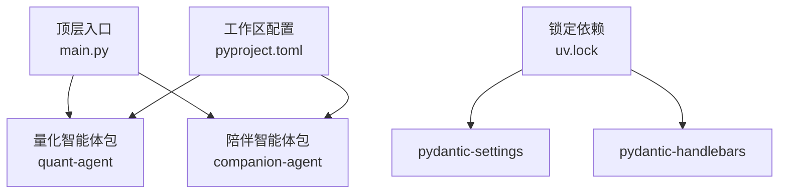
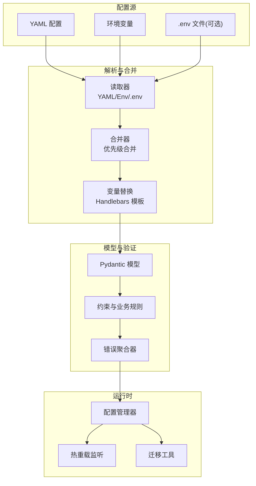
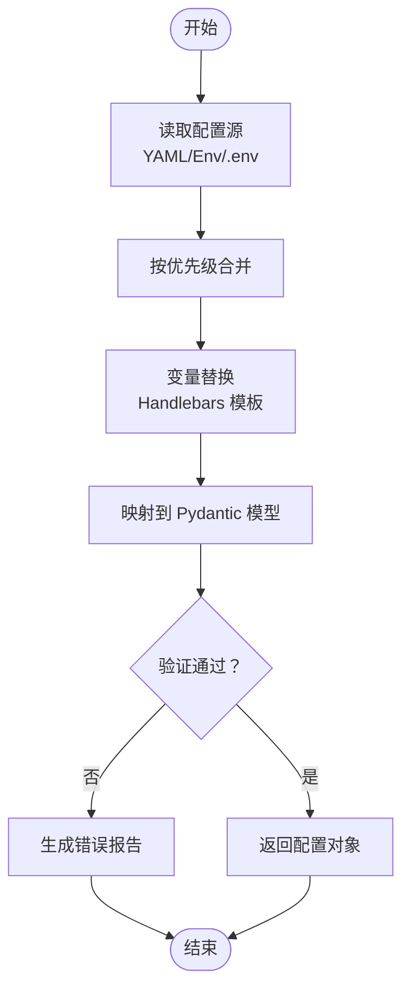
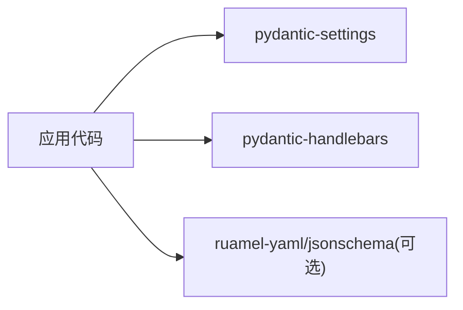

# 配置管理系统

<cite>
**本文引用的文件**   
- [main.py](file://main.py)
- [pyproject.toml](file://pyproject.toml)
- [uv.lock](file://uv.lock)
- [validate_workflow.js](file://packages/companion-agent/src/companion_agent/chat.py)
</cite>

## 目录
1. [简介](#简介)
2. [项目结构](#项目结构)
3. [核心组件](#核心组件)
4. [架构总览](#架构总览)
5. [详细组件分析](#详细组件分析)
6. [依赖分析](#依赖分析)
7. [性能考虑](#性能考虑)
8. [故障排查指南](#故障排查指南)
9. [结论](#结论)
10. [附录](#附录)

## 简介
本技术文档围绕“配置管理系统”展开，聚焦于以下目标：
- YAML 配置文件的解析与处理流程（结构定义、数据类型映射、嵌套对象支持）
- 环境变量集成机制（变量替换规则、默认值处理、配置优先级）
- 配置验证框架（字段约束检查、业务规则验证、错误报告）
- 配置模型定义与使用示例（以代码片段路径替代具体代码内容）
- 配置热重载与迁移策略

需要特别说明的是：当前仓库中并未发现显式的配置管理模块或 YAML/环境变量加载实现。因此，本文在“现状说明”的基础上，给出基于现有依赖与工程结构的“推荐实现方案”，并明确标注哪些内容为“概念性建议”，以便后续落地实施。

## 项目结构
仓库采用多包工作区组织，顶层通过 pyproject.toml 声明成员包与依赖关系；主入口 main.py 仅做简单初始化调用。配置相关能力尚未在源码中体现，但 uv.lock 显示已引入 pydantic-settings 等与配置相关的第三方库，为后续配置系统提供了基础支撑。

图表来源
- [main.py:1-13](file://main.py#L1-L13)
- [pyproject.toml:1-30](file://pyproject.toml#L1-L30)
- [uv.lock:4071-4095](file://uv.lock#L4071-L4095)

章节来源
- [main.py:1-13](file://main.py#L1-L13)
- [pyproject.toml:1-30](file://pyproject.toml#L1-L30)

## 核心组件
本节概述配置管理系统的核心职责与边界，便于后续设计与扩展。

- 配置源层
  - YAML 配置文件（支持嵌套对象、数组、标量类型）
  - 环境变量（支持前缀命名空间、类型转换、必需性校验）
  - 可选：.env 文件（用于本地开发）
- 解析与合并层
  - 读取各源并按优先级合并（例如：默认值 < YAML < 环境变量）
  - 变量替换（如 Handlebars 风格占位符）
- 模型与验证层
  - Pydantic 数据模型定义（字段类型、约束、嵌套模型）
  - 业务规则校验（自定义验证器）
  - 结构化错误报告（字段路径 + 错误消息）
- 运行时服务层
  - 配置管理器（单例/上下文注入）
  - 热重载（监听文件变更，触发增量更新）
  - 迁移工具（版本化迁移脚本）

章节来源
- [uv.lock:4071-4095](file://uv.lock#L4071-L4095)

## 架构总览
下图展示了推荐的配置系统整体架构与数据流。该图为概念性设计，用于指导后续实现。

[此图为概念性架构图，未直接映射到具体源码文件，故不附“图表来源”]

## 详细组件分析

### YAML 配置解析与处理
- 结构定义
  - 使用分层键名表达嵌套对象，如 database.host、database.port
  - 支持列表与字典组合，便于表达复杂配置
- 数据类型映射
  - 字符串、整数、浮点数、布尔、空值、列表、字典
  - 结合 Pydantic 模型进行强类型校验与自动转换
- 嵌套对象支持
  - 子模型对应 YAML 子节点，避免扁平化带来的歧义
- 参考实现位置（待落地）
  - 建议在 packages 下新增 config 子包，提供 yaml_loader.py、model.py、validator.py 等模块

章节来源
- [uv.lock:4071-4095](file://uv.lock#L4071-L4095)

### 环境变量集成机制
- 变量替换规则
  - 支持 ${VAR} 或 {{ VAR }} 风格的占位符，由模板引擎（如 pydantic-handlebars）完成替换
- 默认值处理
  - 在 Pydantic 模型中设置 default/default_factory，作为最低优先级兜底
- 配置优先级
  - 建议顺序：默认值 < YAML < .env < 环境变量
  - 高优先级覆盖低优先级同名键
- 参考实现位置（待落地）
  - env_loader.py：读取 os.environ 并转换为配置片段
  - merger.py：按优先级合并多个配置片段
  - template.py：执行变量替换

章节来源
- [uv.lock:4071-4095](file://uv.lock#L4071-L4095)

### 配置验证框架
- 字段约束检查
  - 使用 Pydantic Field 的 min/max、regex、enum、unique_items 等约束
- 业务规则验证
  - 使用 @field_validator / @model_validator 实现跨字段逻辑校验
- 错误报告机制
  - 统一收集 ValidationError，输出包含字段路径与错误消息的结构化结果
- 参考实现位置（待落地）
  - validator.py：封装验证流程与错误聚合
  - rules.py：业务规则函数集合

章节来源
- [uv.lock:4071-4095](file://uv.lock#L4071-L4095)

### 配置模型定义与使用示例
- 模型定义
  - 将 YAML 结构与 Pydantic 模型一一对应，确保类型安全
- 使用方式
  - 通过配置管理器加载并返回强类型配置对象
  - 在业务模块中以依赖注入方式使用
- 参考实现位置（待落地）
  - models.py：定义所有配置模型
  - manager.py：暴露 load()、reload()、get() 等方法

章节来源
- [uv.lock:4071-4095](file://uv.lock#L4071-L4095)

### 配置热重载
- 监听策略
  - 文件系统事件（如 watchdog）或定时轮询
- 更新策略
  - 增量重算受影响配置项，保持进程内状态一致
- 回滚与幂等
  - 新配置失败时回滚至上一版本
- 参考实现位置（待落地）
  - watcher.py：文件监听与事件分发
  - hot_reload.py：热重载编排

章节来源
- [uv.lock:4071-4095](file://uv.lock#L4071-L4095)

### 配置迁移策略
- 版本化
  - 为每个配置版本维护迁移脚本，保证向后兼容
- 迁移时机
  - 启动时检测版本并执行必要迁移
- 可逆性
  - 尽量提供反向迁移或快照恢复能力
- 参考实现位置（待落地）
  - migrations/：存放迁移脚本
  - migrator.py：迁移编排与日志记录

章节来源
- [uv.lock:4071-4095](file://uv.lock#L4071-L4095)

### 关键流程图：配置加载与验证
以下为概念性流程图，展示从读取到验证的端到端过程。

[此图为概念性流程图，未直接映射到具体源码文件，故不附“图表来源”]

## 依赖分析
当前仓库未包含显式配置管理代码，但锁定文件中引入了与配置管理密切相关的依赖：
- pydantic-settings：用于从环境变量与 .env 加载配置，并提供类型校验
- pydantic-handlebars：用于模板变量替换
- jsonschema/ruamel-yaml：可用于 JSON/YAML 校验与读写（在 check-jsonschema 依赖中出现）

图表来源
- [uv.lock:4071-4095](file://uv.lock#L4071-L4095)
- [uv.lock:964-987](file://uv.lock#L964-L987)

章节来源
- [uv.lock:4071-4095](file://uv.lock#L4071-L4095)
- [uv.lock:964-987](file://uv.lock#L964-L987)

## 性能考虑
- 懒加载与缓存
  - 对大配置或昂贵资源按需加载，并在内存中缓存
- 增量合并
  - 热重载时仅重新计算受影响的配置片段
- 并发安全
  - 使用读写锁保护配置对象的并发访问
- I/O 优化
  - 批量读取与一次性解析，减少磁盘与网络开销

[本节为通用性能建议，不直接分析具体文件]

## 故障排查指南
- 常见问题定位
  - 缺失必填环境变量：检查模型中的 required 字段与环境变量是否匹配
  - 类型不匹配：确认 YAML/Env 的值类型与模型定义一致
  - 变量替换失败：检查占位符语法与可用变量集
- 错误报告
  - 统一收集并输出结构化错误信息，包含字段路径与原因
- 参考实现位置（待落地）
  - error_reporter.py：错误聚合与格式化
  - logger.py：结构化日志输出

章节来源
- [uv.lock:4071-4095](file://uv.lock#L4071-L4095)

## 结论
当前仓库尚未实现配置管理系统，但已具备必要的第三方依赖基础。建议尽快落地“配置源—解析合并—模型验证—运行时服务”的分层架构，并结合热重载与迁移策略提升可运维性与可演进性。

[本节为总结性内容，不直接分析具体文件]

## 附录
- 代码片段路径（待落地）
  - YAML 读取器：packages/config/yaml_loader.py
  - 环境变量加载器：packages/config/env_loader.py
  - 合并器：packages/config/merger.py
  - 模板替换：packages/config/template.py
  - 模型定义：packages/config/models.py
  - 验证器：packages/config/validator.py
  - 配置管理器：packages/config/manager.py
  - 热重载：packages/config/watcher.py、packages/config/hot_reload.py
  - 迁移工具：packages/config/migrations/*、packages/config/migrator.py

[本节为规划性内容，不直接分析具体文件]